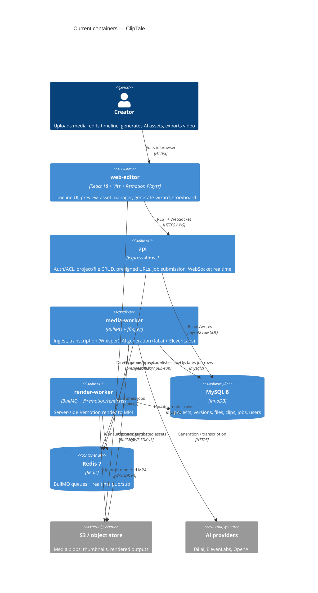

# Architecture map — ClipTale (cliptale.com-v2)

> The **current** architecture (what exists today), produced by `survey` and read by
> specify / design / data-model / implement. Refresh with `survey` when the repo drifts past
> `reflects_commit`. This is generated; the authored `docs/architecture-rules.md`, `docs-claude/roadmap.md`
> and `docs/general_idea.md` are inputs, reconciled in the last section — not replaced.

ClipTale is an AI-assisted web video editor: users upload media, arrange clips on a Remotion
timeline, generate AI assets (images/video/voice/music), preview live in-browser, and export
rendered MP4s. Heavy work (ingest, transcription, AI generation, final render) runs async in
BullMQ workers.

## Stack

- **Language / runtime:** TypeScript 5.4+ (strict, ESM), Node ≥20 (`package.json:25-27`). Monorepo via Turborepo + npm workspaces (`apps/*`, `packages/*` — `package.json:3-6`, `turbo.json`).
- **API:** Express 4 + Helmet + CORS + express-rate-limit + Zod validation; `ws` for WebSocket realtime (`apps/api/package.json`, `apps/api/src/index.ts:37-94`).
- **Frontend:** React 18 + Vite 5 + React-Router v7 + TanStack Query 5 + Immer (`apps/web-editor/package.json`). State via a **custom external store + `useSyncExternalStore`** (no Zustand/Redux — see Frontend §).
- **Playback / render:** Remotion pinned **4.0.443** (`package.json:21-23` override). In-browser `<Player>` (web-editor) and server `@remotion/renderer` (render-worker), same `packages/remotion-comps` bundle.
- **Workers:** BullMQ 5 on Redis 7. `media-worker` (ffmpeg/`fluent-ffmpeg`, fal.ai, ElevenLabs, OpenAI Whisper); `render-worker` (Remotion SSR + Chromium).
- **DB:** MySQL 8 / InnoDB via `mysql2` raw SQL (no ORM). In-process migration runner.
- **Object store:** S3 (AWS SDK v3) with presigned upload/download URLs (Minio/R2-compatible via custom endpoint).
- **Build / test / lint:**
  - Build: `turbo run build` · Typecheck: `turbo run typecheck`
  - Unit/integration: `turbo run test` (**Vitest**, co-located `*.test.ts`)
  - E2E: `npm run e2e` (**Playwright**, `e2e/*.spec.ts` + `apps/web-editor/e2e/`)
  - Lint: `turbo run lint` (ESLint 9 + Prettier)
  - Full stack: `docker compose up` (db, redis, api, web-editor, media-worker, render-worker)

## C4 — system as it is

## Module inventory

| Module | Path | Layers | Wired at | Responsibility |
|---|---|---|---|---|
| api | `apps/api/` | routes → controllers → services → repositories; middleware, db, queues, lib | `apps/api/src/index.ts:37-94` | REST API + WebSocket realtime; auth/ACL, CRUD, presigned URLs, job producers |
| web-editor | `apps/web-editor/` | `features/` (single-consumer) + `shared/` (cross-feature) + `store/` + `lib/` | `apps/web-editor/src/main.tsx:49-113` | React SPA: timeline, preview, asset manager, generate-wizard, storyboard, export |
| media-worker | `apps/media-worker/` | `jobs/` + `lib/` (provider clients, db, s3) | `apps/media-worker/src/index.ts:37-127` | BullMQ consumer: ingest, transcribe, AI image/video/audio/music generation |
| render-worker | `apps/render-worker/` | `jobs/` + `lib/` (remotion-renderer, db, s3) | `apps/render-worker/src/index.ts:14-18` | BullMQ consumer: Remotion SSR render → MP4 → S3 |
| project-schema | `packages/project-schema/` | `schemas/` (Zod) + `types/` | n/a (lib) | Canonical ProjectDoc/Track/Clip + job-payload types; **source of truth** for timeline shape |
| api-contracts | `packages/api-contracts/` | hand-maintained OpenAPI + model catalogs | n/a (lib) | OpenAPI 3.1 spec, `FAL_MODELS`, `ELEVENLABS_MODELS` |
| editor-core | `packages/editor-core/` | pure functions (no React/IO) | n/a (lib) | Timeline helpers, e.g. `computeProjectDuration` |
| remotion-comps | `packages/remotion-comps/` | `compositions/` + `layers/` + `hooks/` + `stories/` | `packages/remotion-comps/src/remotion-entry.tsx` | Remotion compositions; one bundle shared by Player + renderer |
| ui | `packages/ui/` | single `index.ts` re-export | n/a (lib) | Reserved shared primitives; **currently thin** — most UI lives in web-editor `shared/components/` |

> Naming note: apps are scoped `@cliptale/*` (e.g. `@cliptale/api`) while some packages are still scoped `@ai-video-editor/*` (e.g. `@ai-video-editor/project-schema`). Mixed scopes are intentional legacy — match the importing site.

## Conventions (cited — the rules a new feature must match)

- **Module wiring / registration:** API routers registered in `apps/api/src/index.ts` after the middleware stack; each domain = `routes/<d>.routes.ts` → `controllers/<d>.controller.ts` → `services/<d>.service.ts` → `repositories/<d>.repository.ts`. Singletons (`pool`, `redis`, `s3`, `config`) are imported directly — **no DI container**. Example chain: `apps/api/src/routes/projects.routes.ts` → `apps/api/src/services/project.service.ts:17-32`.
- **Error handling:** typed error classes in `apps/api/src/lib/errors.ts` (`ValidationError` 400, `NotFoundError` 404, `UnauthorizedError` 401, `ForbiddenError` 403, `ConflictError`/`OptimisticLockError` 409, `UnprocessableEntityError` 422, `GoneError` 410). Central Express handler maps `err.statusCode` → JSON at `apps/api/src/index.ts:63-79`. Services throw typed errors; repositories throw only on DB failure.
- **IDs:** **UUID v4** via `randomUUID()` from `node:crypto`, stored as `CHAR(36)`; validated with `z.string().uuid()` — e.g. `apps/api/src/services/project.service.ts:1,21`. (NB: `general_idea.md` describes "ULID CHAR(26)" — that is aspirational and does **not** match the code; use UUID.)
- **Persistence / DB access:** singleton `mysql2` pool (`apps/api/src/db/connection.ts:6-15`), parameterized `pool.execute(sql, [params])` in repositories. Soft-deletes scoped via `WHERE deleted_at IS NULL`; restore throws `GoneError` past the 30-day TTL.
- **Migrations:** numbered SQL files `NNN_description.sql` in `apps/api/src/db/migrations/` (currently `000`–`045`, 46 files). **In-process runner** `apps/api/src/db/migrate.ts` (`runPendingMigrations`, imported at `apps/api/src/index.ts:9`) runs before `app.listen()`; tracks applied files + SHA-256 checksums in `schema_migrations` (`000_schema_migrations.sql`), gated by `APP_MIGRATE_ON_BOOT`. New migration = next number; guard DDL with `IF NOT EXISTS`.
- **Tests:** Vitest, co-located `*.test.ts`; API integration tests hit a **real MySQL** (never mock the DB) with `singleFork: true` for serial access (`apps/api/vitest.config.ts`). E2E via Playwright in `e2e/` and `apps/web-editor/e2e/`.
- **Inter-module communication:** REST (documented in `packages/api-contracts/src/openapi.ts`, hand-maintained — no codegen, keep in sync in the same commit); WebSocket realtime (`apps/api/src/lib/realtime.ts`) with Redis pub/sub so workers can push progress; BullMQ for api→worker job dispatch (`apps/api/src/queues/bullmq.ts`).
- **Config / env:** `apps/*/src/config.ts` is the **only** place allowed to read `process.env`; all vars prefixed `APP_*`, Zod-validated.
- **UI / styling:** plain React `CSSProperties` objects in co-located `*.styles.ts` files (no Tailwind / CSS-modules / styled-components) — e.g. `apps/web-editor/src/App.styles.ts`. Detail in §Frontend / UI foundation.

## Datastores

| Store | Engine | Accessed via | Notes |
|---|---|---|---|
| MySQL | MySQL 8 / InnoDB | `mysql2` singleton pool, raw parameterized SQL (`apps/api/src/db/connection.ts:6-15`) | 46 migrations; snapshot-per-update versioning (`project_versions`) + materialized `*_current` tables; soft-deletes (`deleted_at`) |
| Redis | Redis 7 | `ioredis` singleton (`apps/api/src/lib/redis.ts:9-14`) | BullMQ queues (`media-ingest`, `render`, `transcription`, `ai-generate`, `ai-enhance`, `storyboard-plan`, `storyboard-openai-image`) + realtime pub/sub channel |
| S3 / object store | S3 (AWS SDK v3) | `s3Client` singleton + presigner (`apps/api/src/lib/s3.ts:6-13`) | Presigned upload (direct-to-bucket) + presigned read; never public buckets. Media `/<video>` use `?token=` since they can't send headers |

## Frontend / UI foundation

- **Component library / design system:** in-repo only. `packages/ui` is a placeholder; the real shared components live in `apps/web-editor/src/shared/components/`. No third-party component kit.
- **Design tokens:** hardcoded constants in `*.styles.ts` (no central token file). Palette includes surfaces `#0D0D14` / `#16161F`, border `#252535`, text `#F0F0FA`, error `#EF4444`; font Inter; responsive breakpoint 768px. Authored reference: `docs/design-guide.md`.
- **Styling approach:** **plain inline `CSSProperties`** via co-located `*.styles.ts` modules — `apps/web-editor/src/App.styles.ts`. (Not Tailwind / CSS-modules / styled-components.)
- **Shared primitives:** `apps/web-editor/src/shared/` — `asset-detail/`, `undo/`, `ai-generation/` (each used by 2+ features). **Rule: a module gaining a 2nd consumer migrates to `shared/` in the same PR** (prevents circular imports).
- **State / data-fetching:**
  - Project document → custom external store + Immer `produceWithPatches` for undo/redo (`apps/web-editor/src/store/project-store.ts`), read via `useSyncExternalStore`.
  - Ephemeral UI (selection/drag/hover) → `apps/web-editor/src/store/ephemeral-store.ts`. Undo/redo stack → `store/history-store.ts`.
  - Server state → TanStack Query (`QueryClientProvider` in `main.tsx`); `apiClient` fetch wrapper in `lib/`.
- **Routing / shell:** React-Router v7 (`main.tsx:49-103`): `/login`, `/register`, `/`, `/editor`, `/generate`, `/storyboard/:draftId`, `/trash`, … wrapped in `<ProtectedRoute>`. Responsive shell in `App.tsx` (desktop two-column / mobile vertical stack via `useWindowWidth()`).
- **Closest UI precedent:** a new multi-step flow looks like the **generate-wizard** (`apps/web-editor/src/features/generate-wizard/`); a graph/canvas screen looks like the **storyboard** editor (`@xyflow/react`).

## Where things live / closest precedents

- A new **REST endpoint** → `packages/api-contracts/src/openapi.ts` (if public) → `routes/` → `controllers/` (Zod-validate) → `services/` (no `req/res`) → `repositories/` (raw SQL) → register in `apps/api/src/index.ts`; co-located `*.test.ts`. Modelled on the projects domain (`apps/api/src/services/project.service.ts`).
- A new **background job** → payload type in `packages/project-schema/src/types/job-payloads.ts` → producer `apps/api/src/queues/jobs/enqueue-<name>.ts` + register queue in `queues/bullmq.ts` → consumer `apps/media-worker/src/jobs/<name>.job.ts` (or render-worker). Modelled on the AI-generate flow (`apps/media-worker/src/jobs/ai-generate.job.ts`).
- A new **clip / track / project-shape change** → update Zod schema in `packages/project-schema/src/schemas/` **first** (api, web-editor, both workers all consume it).
- A new **AI model/capability** → extend `packages/api-contracts/src/fal-models.ts` or `elevenlabs-models.ts` → update the validator/catalog service in api → add a handler branch in `media-worker/jobs/ai-generate*.ts`.
- A new **web-editor feature** → `apps/web-editor/src/features/<name>/` with `components/`, `hooks/`, `api.ts`, `types.ts`; hook into `store/project-store.ts` or `store/ephemeral-store.ts`; call backend via `lib/api-client.ts`. Modelled on generate-wizard.
- A new **screen / UI component** → composed from `apps/web-editor/src/shared/components/` with inline `*.styles.ts`, modelled on the generate-wizard pages.
- A **Remotion playback change** → `packages/remotion-comps/src/compositions/VideoComposition.tsx` (same bundle for browser `<Player>` AND server `renderMedia()` — no DOM-only APIs in layers).

## Constraints & known tech-debt

- **Remotion version pin:** `remotion` + `@remotion/*` locked to **4.0.443** via root `overrides` (`package.json:21-23`). Keep all Remotion packages aligned; don't bump piecemeal.
- **OpenAPI has no codegen** — `packages/api-contracts/src/openapi.ts` is hand-maintained; spec and implementation can drift. Update both in the same commit.
- **No DI / direct singletons** — `pool`/`redis`/`s3`/`config` are module singletons. New cross-cutting services follow the same import pattern; mind test isolation.
- **Realtime auth via `?token=` query param** — required because media tags can't send headers; factor this into any asset-proxy work.
- **Integration tests require a live MySQL** and run serially (`singleFork: true`); they are slow and must not mock the DB.
- **`packages/editor-core` is intentionally pure** (no React, no I/O) — keep timeline math there, side effects out.
- **Mixed package scopes** (`@cliptale/*` apps vs `@ai-video-editor/*` packages) — match the existing import at each site rather than "fixing" opportunistically.

## Reconciliation with the authored architecture doc

Inputs reconciled: `docs/architecture-rules.md` (52KB authored rules), `docs-claude/roadmap.md` (repo-navigator output), `docs/general_idea.md` (product/architecture vision). This map agrees with `architecture-rules.md` on layering, typed errors, config isolation, and the schema-first rule. **Drift corrected against live code:**

1. **IDs:** `general_idea.md` says ULID `CHAR(26)`. Code uses **UUID v4 / `CHAR(36)`** (`project.service.ts:21`). The map records reality (UUID).
2. **Migrations:** `docs-claude/roadmap.md` says migrations auto-run via `docker-entrypoint-initdb.d`. Code uses the **in-process runner** `apps/api/src/db/migrate.ts` (`runPendingMigrations`, `index.ts:9`) gated by `APP_MIGRATE_ON_BOOT`, matching `general_idea.md`'s Evolution note. The `docker-entrypoint` description is stale.
3. **Frontend state:** `docs-claude/roadmap.md` lists "Zustand". No Zustand dependency exists; state is a **custom external store + `useSyncExternalStore` + Immer** (`store/project-store.ts`). Map records the custom store.
4. **Scale / size:** the repo has grown well beyond the roadmap's snapshot (46 migrations vs ~018; storyboard + music-generation features added). The authored docs are not overwritten; this map is the current reference and notes the deltas above.
