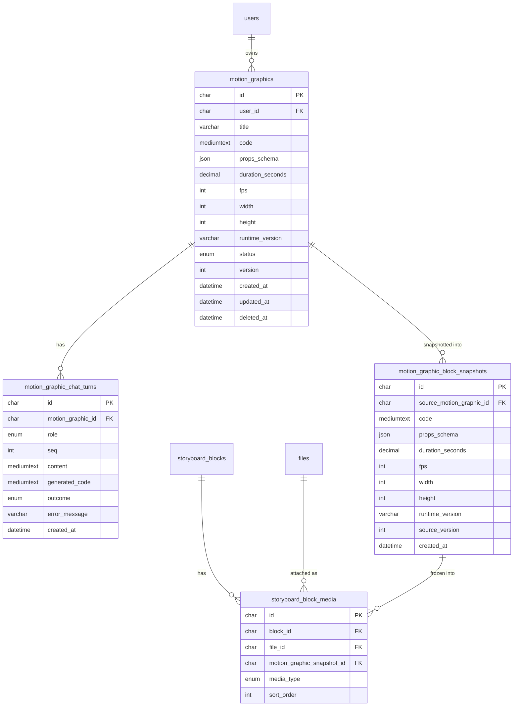

# Data model — ai-motion-graphic

> Derived from `spec.md` §5 (AC) + `sad.md` §6 (sequences) + §6.4 ER + Accepted ADRs 0008/0009/0010.
> Conventions detected from `apps/api/src/db/migrations/` (UUID v4 `CHAR(36)`, `DATETIME(3)` audit
> columns, `ENUM` status, `JSON` for app-owned shapes, soft-delete `deleted_at`, FK `ON DELETE CASCADE`,
> InnoDB / utf8mb4). Migrations are **staged** under `./migrations/` — not yet in the live
> `apps/api/src/db/migrations/` tree; `implement` promotes them (next live number ≈ **058**).

## ER diagram

> `users`, `files`, `storyboard_blocks`, and `storyboard_block_media` are **existing** tables
> (migrations 033 + earlier). Only `storyboard_block_media` is modified by this feature (migration 04).

## Entities

### `motion_graphics`  *(aggregate root)*

The per-Creator, code-backed Motion Graphic. Code lives in a `MEDIUMTEXT` column (ADR-0008), not S3.

| Column | Type | Constraints | Notes |
|---|---|---|---|
| `id` | CHAR(36) | PK, app-generated (UUID v4) | `randomUUID()` |
| `user_id` | CHAR(36) | NOT NULL, FK → `users(user_id)` ON DELETE CASCADE | owning Creator; every read/write filtered by it (AC-07, AC-13) |
| `title` | VARCHAR(255) | NOT NULL DEFAULT `'Untitled motion graphic'` | auto-generated, renamable (AC-01) |
| `code` | MEDIUMTEXT | NULL | current ready code (ADR-0008); NULL until first success, stays last-working on failed refine (AC-06/AC-14) |
| `props_schema` | JSON | NULL | typed props schema — **shape only** in MVP1; forward-compat MVP2 (spec §2 goal 3) |
| `duration_seconds` | DECIMAL(6,2) | NOT NULL | fixed animation length the Creator sets (AC-01); fractional seconds allowed |
| `fps` | INT UNSIGNED | NOT NULL DEFAULT 30 | runtime geometry the graphic authors against |
| `width` | INT UNSIGNED | NOT NULL DEFAULT 1920 | " |
| `height` | INT UNSIGNED | NOT NULL DEFAULT 1080 | " |
| `runtime_version` | VARCHAR(32) | NOT NULL DEFAULT `'4.0.443'` | pinned Remotion version authored against (ADR-0010) |
| `status` | ENUM(`generating`,`ready`,`failed`) | NOT NULL DEFAULT `'generating'` | ready-state machine; only `ready` is attachable (AC-06/AC-08/AC-09) |
| `version` | INT UNSIGNED | NOT NULL DEFAULT 1 | version-capable hook (ADR-0008); ++ on each successful code update (MVP3 pinning) |
| `created_at` | DATETIME(3) | NOT NULL DEFAULT CURRENT_TIMESTAMP(3) | repo audit convention |
| `updated_at` | DATETIME(3) | NOT NULL DEFAULT CURRENT_TIMESTAMP(3) ON UPDATE | " |
| `deleted_at` | DATETIME(3) | NULL | soft-delete (repo norm; list filters `IS NULL`) |

**Aggregate root:** root — owns `motion_graphic_chat_turns`.
**Access patterns:** PK read on open/preview/refine/duplicate (flows 2/3/4/6); list-mine (flow 5 / AC-13) → index `idx_motion_graphics_user_active`.
**Constraints:** FK → `users(user_id)`; no UNIQUE (titles may repeat).

### `motion_graphic_chat_turns`

Persistent, append-only chat history (SAD §8). Each turn is a re-runnable exchange (AC-12), not a frozen transcript.

| Column | Type | Constraints | Notes |
|---|---|---|---|
| `id` | CHAR(36) | PK, app-generated (UUID v4) | |
| `motion_graphic_id` | CHAR(36) | NOT NULL, FK → `motion_graphics(id)` ON DELETE CASCADE | owning graphic |
| `role` | ENUM(`user`,`assistant`) | NOT NULL | turn author |
| `seq` | INT UNSIGNED | NOT NULL | app-assigned monotonic order; stable copy order for duplicate (AC-12) |
| `content` | MEDIUMTEXT | NOT NULL | instruction / reply text |
| `generated_code` | MEDIUMTEXT | NULL | code an assistant turn produced — makes the turn re-runnable (AC-12); NULL for user/failed turns |
| `outcome` | ENUM(`ready`,`failed`) | NULL | assistant-turn result; records the failed attempt (AC-14) |
| `error_message` | VARCHAR(512) | NULL | plain-language failure text (AC-14) |
| `created_at` | DATETIME(3) | NOT NULL DEFAULT CURRENT_TIMESTAMP(3) | no `updated_at` — append-only |

**Aggregate root:** `motion_graphics`.
**Access patterns:** ordered read of a graphic's chat (flows 3/4/6) + duplicate copy-read → index `idx_mg_chat_turns_graphic_seq`.
**Constraints:** FK → `motion_graphics(id)`.

### `motion_graphic_block_snapshots`

Immutable frozen copy of code + duration at attach time (ADR-0009). Independent of the source (AC-10).

| Column | Type | Constraints | Notes |
|---|---|---|---|
| `id` | CHAR(36) | PK, app-generated (UUID v4) | |
| `source_motion_graphic_id` | CHAR(36) | NULL, FK → `motion_graphics(id)` ON DELETE **SET NULL** | the source; frozen instance survives source deletion (AC-10) |
| `code` | MEDIUMTEXT | NOT NULL | frozen code (only a ready graphic attaches, AC-08) |
| `props_schema` | JSON | NULL | frozen props-schema snapshot; forward-compat MVP2 |
| `duration_seconds` | DECIMAL(6,2) | NOT NULL | frozen duration (AC-04) |
| `fps` | INT UNSIGNED | NOT NULL | frozen geometry → export matches preview |
| `width` | INT UNSIGNED | NOT NULL | " |
| `height` | INT UNSIGNED | NOT NULL | " |
| `runtime_version` | VARCHAR(32) | NOT NULL | pinned runtime at snapshot (ADR-0010); no re-validation |
| `source_version` | INT UNSIGNED | NULL | which `motion_graphics.version` was frozen (MVP3 pin hook) |
| `created_at` | DATETIME(3) | NOT NULL DEFAULT CURRENT_TIMESTAMP(3) | immutable — no `updated_at` |

**Aggregate root:** its own immutable instance (referenced by `storyboard_block_media`, ADR-0009).
**Access patterns:** read via the pivot join when rendering a block's media; FK-index lookup on source delete + MVP3 "instances of a source" → index `idx_mg_block_snapshots_source`.
**Constraints:** FK → `motion_graphics(id)` ON DELETE SET NULL (deliberately not CASCADE — frozen survives).

### `storyboard_block_media`  *(existing — modified by migration 04)*

The existing block-media pivot (033), extended so a Motion Graphic attaches as a snapshot (ADR-0009).

| Column | Type | Change | Notes |
|---|---|---|---|
| `media_type` | ENUM(`image`,`video`,`audio`,**`motion_graphic`**) | **+ `motion_graphic`** | new kind (additive) |
| `file_id` | CHAR(36) → **NULL** | NOT NULL → **NULLABLE** | a motion_graphic row has no file (ADR-0009 consequence) |
| `motion_graphic_snapshot_id` | CHAR(36) | **new column**, NULL, FK → `motion_graphic_block_snapshots(id)` ON DELETE CASCADE | the frozen snapshot for a `motion_graphic` row |

> Expand-only change — see migration 04 header for why no backfill/contract is needed.
> Application-level invariant (enforced in the service layer, not the DB): exactly one of
> `file_id` / `motion_graphic_snapshot_id` is non-null, keyed by `media_type`. A DB `CHECK`
> is **not** added — the repo uses no `CHECK` constraints (convention adherence, see audit report).

## Indexes

| Index | Columns | Query it serves |
|---|---|---|
| `idx_motion_graphics_user_active` | `(user_id, deleted_at, updated_at DESC)` | List my graphics newest-first (flow 5 / AC-13): `WHERE user_id=? AND deleted_at IS NULL ORDER BY updated_at DESC`. Leading `user_id` = FK index for `fk_motion_graphics_user`. |
| `idx_mg_chat_turns_graphic_seq` | `(motion_graphic_id, seq)` | Read a graphic's chat in order (flows 3/4/6 + duplicate AC-12): `WHERE motion_graphic_id=? ORDER BY seq`. Leading col = FK index. |
| `idx_mg_block_snapshots_source` | `(source_motion_graphic_id)` | FK index for `fk_mg_block_snapshots_source` (ON DELETE SET NULL lookup) + MVP3 "find instances of this source". |
| `idx_storyboard_block_media_mg_snapshot` | `(motion_graphic_snapshot_id)` | FK index for the new snapshot FK + resolve a block's motion-graphic media (the join in ADR-0009). |

> PK lookups (read one graphic by `id` — flows 2/3/4/6) need no extra index.
> Existing `idx_storyboard_block_media_block_id` (033) still serves the per-block media read.

## Test fixtures

Generated in the repo's form (Vitest integration tests hit a **real MySQL** — never mocked; `singleFork: true`). PII guard: `example.test` only.

- `makeMotionGraphic(overrides)` — inserts a `motion_graphics` row (default `status='ready'`, `code` = a minimal deterministic `useCurrentFrame()` component, `user_id` from a seeded `user-<uuid>@example.test`).
- `makeChatTurn(graphicId, overrides)` — appends a `motion_graphic_chat_turns` row with the next `seq`.
- `makeBlockSnapshot(graphicId, overrides)` — inserts a `motion_graphic_block_snapshots` row + a `storyboard_block_media` row with `media_type='motion_graphic'` and `file_id=NULL`.
- A `status='generating'` / `status='failed'` graphic factory variant for the AC-08 "cannot attach non-ready" + AC-06/AC-14 paths.
