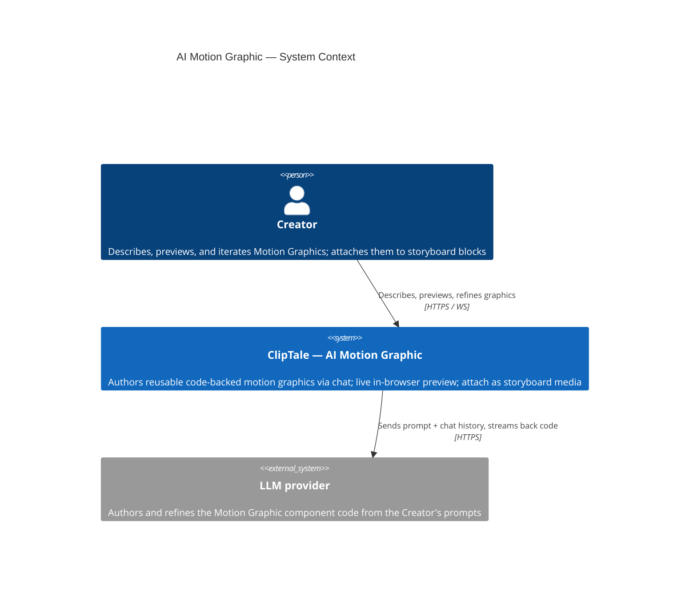
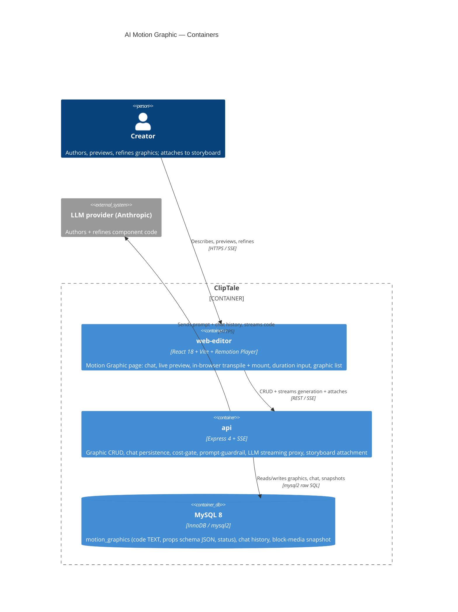
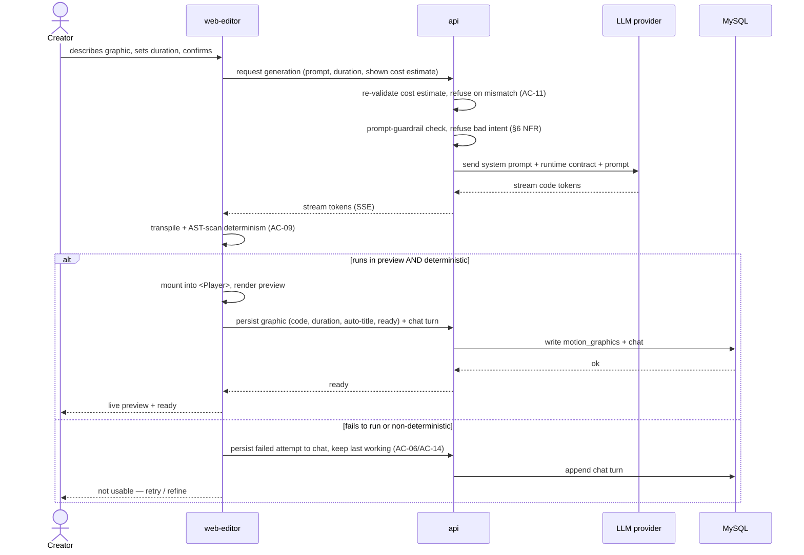
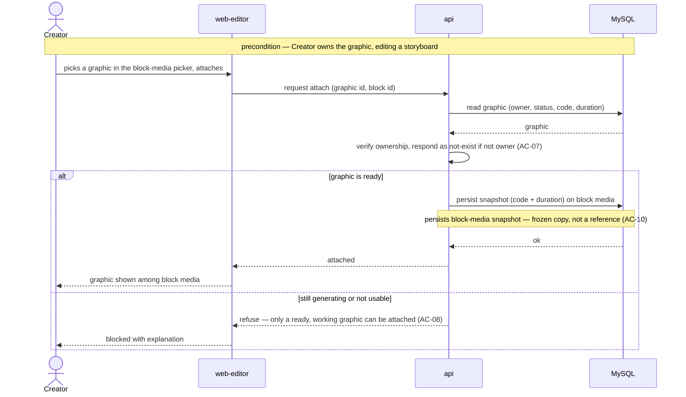
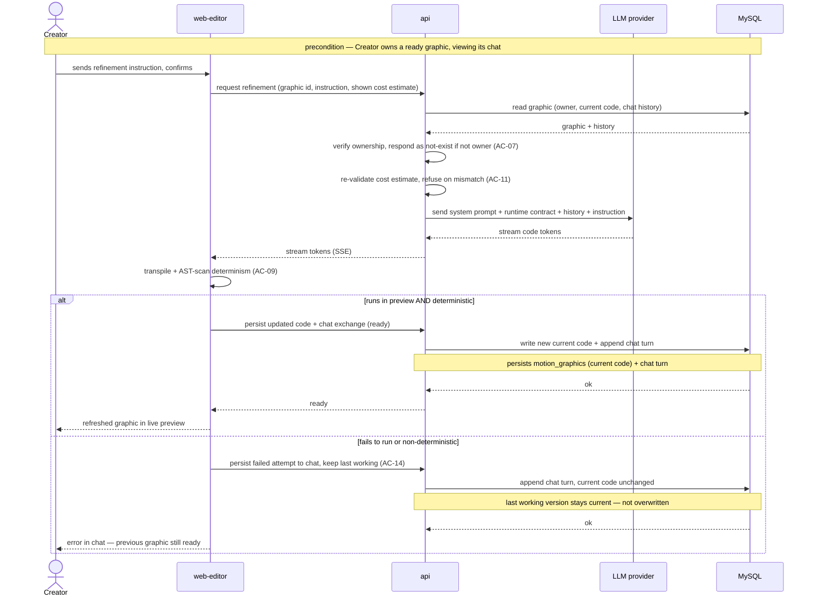
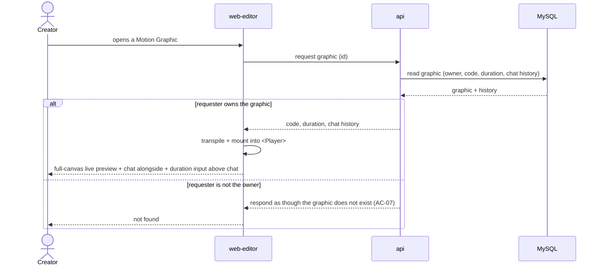
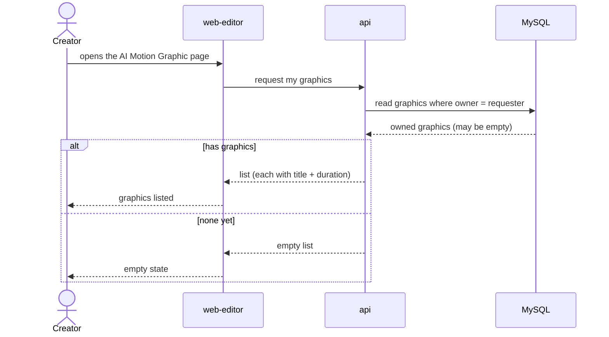
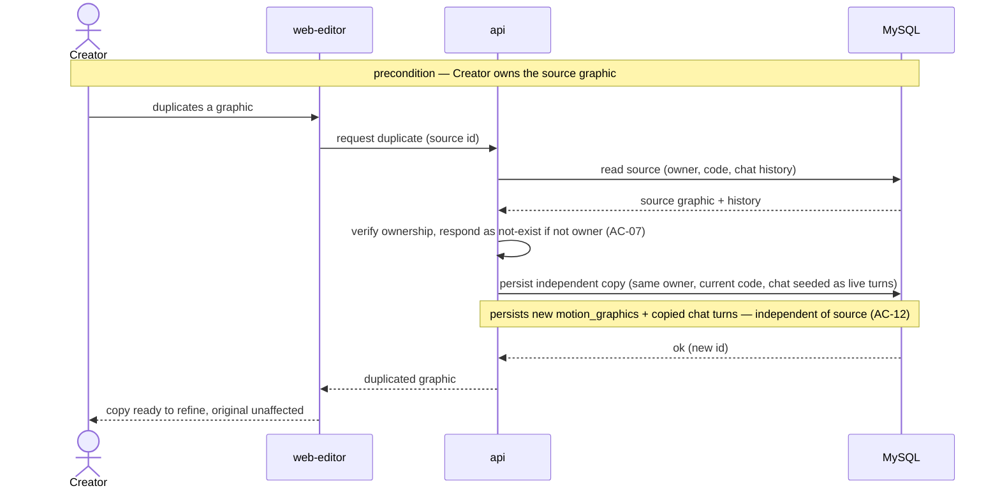

# Software Architecture Document — <slug>

<!-- 12 Arc42 sections. Empty section → <!-- N/A: <one-line reason> -->. -->
<!-- C4 Context (L1) lives inline in §3. C4 Container (L2) lives inline in §5. -->
<!-- Numbers in §10 come VERBATIM from spec.md §6 NFR — no inventing, no rounding. -->

## 1. Introduction and goals

**Intent.** ClipTale Creators cannot produce crisp, readable on-screen text/UI motion (title cards, lower-thirds, infographic/dashboard screens) — exactly the frames diffusion video models render worst (letters warp, drift episode-to-episode). This feature adds an **AI Motion Graphic** page where a Creator describes a graphic in natural language, an AI authors a reusable **code-backed** Motion Graphic, watches it in live preview, and iterates through a persistent chat that remains the graphic's editable source. The result is a **media asset** attachable to storyboard blocks as a frozen snapshot of code + duration. MVP1 executes the authored code **only in the browser live preview**; server-side render/export is deferred (spec §3, §8 OQ-1).

**Top-3 quality goals (1-liners; full scenarios in §10):**

1. **Render-determinism / preview↔export parity** — every ready graphic obeys the deterministic-render rule (AC-09) so the browser preview is guaranteed to match the future server export frame-for-frame.
2. **Tenant isolation under a new trust boundary** — executing untrusted, AI-authored code is bounded to a self-only blast radius (per-Creator, no sharing), backed by a prompt-guardrail (≥95% red-team refusal, spec §6).
3. **Interactive authoring responsiveness** — live preview ready ≤1500 ms after a code change; first streamed generation token ≤3 s p95.

**Stakeholders.**

| Role | Interest | Sign-off owner? |
|---|---|---|
| Creator | Authors / previews / iterates / attaches Motion Graphics | No |
| Tech Lead | SAD approval | Yes |
| Security Lead | New trust boundary (browser execution of AI-authored code) | Yes |

<!-- Decision overrides (¶4) — populated by the critic resolution loop, empty otherwise. -->

## 2. Constraints

**Technical.**
- TypeScript 5.4+ (strict, ESM), Node ≥20; Turborepo + npm workspaces monorepo (`apps/*`, `packages/*`).
- **api:** Express 4 + Helmet + CORS + express-rate-limit + Zod + `ws`. **web-editor:** React 18 + Vite 5 + React-Router v7 + TanStack Query 5 + Immer; state via a custom external store + `useSyncExternalStore` (no Redux/Zustand).
- MySQL 8 / InnoDB via `mysql2` raw SQL (no ORM); Redis 7 (BullMQ); S3 (AWS SDK v3, presigned URLs).
- **Remotion pinned 4.0.443** via root `overrides` — all `@remotion/*` kept aligned, never bumped piecemeal. One shared `packages/remotion-comps` bundle serves the browser `<Player>` and the server `@remotion/renderer`.
- Existing LLM provider: **OpenAI SDK** (`chat.completions`, `gpt-4o-mini`) inside media-worker BullMQ jobs — **no streaming and no multi-turn chat precedent**; no Anthropic SDK present.
- api layering: routes → controllers → services → repositories; no DI container, module singletons (`pool` / `redis` / `s3` / `config`).

**Organisational.**
- Effort / deadline: **no hard deadline fixed**; scope is bounded to MVP1 per spec §3 (server-side execution/export deferred).
- Team: full-stack (api + web-editor); Security Lead is a mandatory reviewer (new trust boundary).

**Conventions.**
- `docs/architecture-map.md` + `docs/architecture-rules.md` (authored rules) are canonical.
- IDs — UUID v4 `CHAR(36)` (`randomUUID()`); typed error classes (`apps/api/src/lib/errors.ts`, `err.statusCode` → JSON); numbered SQL migrations under `apps/api/src/db/migrations/` (next = **058**, in-process runner, `IF NOT EXISTS` guards); env only in `config.ts` (`APP_*`, Zod-validated); inline `CSSProperties` in co-located `*.styles.ts`; hand-maintained OpenAPI (`packages/api-contracts`) kept in sync in the same commit.

**Regulatory / external.**
- **Security review REQUIRED** (spec §6.1) — the feature introduces a new trust boundary: executing untrusted, AI-authored code in the browser with no execution sandbox in MVP1, relying on a prompt-guardrail + a self-only blast radius.
- Data classification: confidential (the graphic is the Creator's content **and** executable code; chat may carry proprietary creative direction). No new PII fields; ownership is per-account.

## 3. Context and scope

The feature lives inside the ClipTale platform (the existing media → storyboard → render pipeline). A Creator describes a graphic, the system has an external LLM provider author a code component, executes that component in a live in-browser preview, and persists it as a per-Creator media asset. The only external dependency in MVP1 is the LLM provider (code authoring); server-side render/export is deferred (spec §3, §8 OQ-1).

**Trust boundary.** AI-authored code is treated as **untrusted input** along its whole path — LLM → storage → browser execution. MVP1 ships no execution sandbox; the blast-radius boundary is the Creator's own browser session (self-only, no sharing), backed by a pre-generation prompt-guardrail.

<!-- brownfield: monorepo (Express 4 api + React 18 web-editor + BullMQ workers + Remotion 4.0.443 shared bundle), MySQL 8 raw SQL, OpenAI SDK present, no streaming-chat / runtime-code-eval precedent — per docs/architecture-map.md + targeted scan 2026-06-17. -->

**External systems (in / out):**

| Actor or system | Type | Interaction |
|---|---|---|
| Creator | Person | Describes, previews, refines graphics; attaches them to storyboard blocks |
| LLM provider | System (external) | Authors + refines the Motion Graphic component code from the Creator's prompt + chat history |
| Sandboxing / code-isolation service | — | **None (deliberate)** — MVP1 does not sandbox browser execution; it relies on the prompt-guardrail + the self-only blast radius |

**C4 Context (L1):**



## 4. Solution strategy

**Top strategic choices (the seeds for ADRs):**

1. **Target surfaces — a fullstack `[backend-service, web-frontend]`, no new worker in MVP1** (ADR-0001) — api endpoints (graphic CRUD, chat persistence, cost-gate, the LLM streaming proxy, storyboard attachment) + a new React SPA page in web-editor. MVP1 has no server-side render, so no `worker` surface; the LLM call streams from the api, not a fire-and-forget BullMQ job — the existing async-job pattern can't meet the TTFT ≤3 s / streaming UX of an authoring chat.

2. **UI architecture — a React SPA page inside the existing web-editor SPA** (inline, not ADR — the repo is already a Vite + React-Router SPA; SSR is ruled out by the existing stack, so there is no legitimate alternative). The page reuses the existing UI foundation (shared components, the external store, inline `*.styles.ts`), modelled on the generate-wizard feature; the storyboard attach UI reuses the existing block-media picker.

3. **LLM provider for code authoring — Anthropic Claude** (ADR-0002) — a new `@anthropic-ai/sdk` integration (streaming + prompt-caching) over the repo's existing OpenAI usage. Claude is stronger at code generation, and prompt-caching amortizes the system prompt + the Remotion runtime-API contract + prior chat turns across the persistent authoring loop. Default authoring model `claude-opus-4-8`.

4. **Streaming transport — Server-Sent Events from the api** (ADR-0003) — generation tokens stream to the chat over SSE, a minimal one-way channel that maps cleanly onto the LLM token stream, in preference to the existing `ws`+Redis realtime path (more machinery than a one-way token stream needs). Serves the TTFT ≤3 s and live-preview ≤1500 ms NFRs.

5. **Browser runtime — transpile-in-browser + dynamic component mount** (ADR-0004, the central pillar) — the AI authors a full Remotion TSX component; the browser transpiles it (Sucrase/Babel-standalone) and mounts it into a runtime composition wrapper driven into Remotion's `<Player>`. Chosen over a declarative JSON-spec interpreter, which would cap expressiveness and contradict the glossary's "code-defined" Motion Graphic.

6. **Execution security posture — no sandbox in MVP1, self-only blast radius** (ADR-0005, Security-signed) — per spec §6.1: browser execution is unsandboxed; the blast-radius boundary is the Creator's own session (per-Creator, no sharing) plus the prompt-guardrail. Residual self-exfiltration risk is accepted for MVP1; a server-side execution sandbox arrives with the deferred export milestone (§8 OQ-1).

7. **Determinism enforcement — author-time AST scan + a runtime shim** (ADR-0006) — a static AST scan rejects `Date.now()`/`new Date()`/`Math.random()`/`performance.now()` at authoring time (a graphic can't reach ready without passing), backed by a runtime shim that freezes those sources during execution. Enforces the deterministic-render rule (AC-09) so preview ↔ export parity holds.

8. **Prompt-guardrail + runtime allowlist** (ADR-0007, resolves spec §8 OQ-2) — a server-side guardrail step refuses exfiltration/subversion-intent prompts before the LLM call (≥95% red-team refusal, spec §6 NFR), plus a minimal import/runtime allowlist (render runtime + schema lib only) enforced at authoring time, rejecting anything else.

9. **Persistence — single-store MySQL, code as TEXT, version-capable + props-schema-JSON shape from day one** (ADR-0008) — the component code lives in a TEXT column on the graphic row (not an S3 blob), queried with the record and snapshotted in place on attach. A graphic remains a media asset via a new `motion_graphic` kind on the storyboard block-media pivot; its "content" is code in the DB, not a file in S3. Detailed schema is `data-model`'s job.

Each tactical decision in later sections traces to one of these seeds. Tactical decisions that *contradict* a strategic choice are red flags — surface them in §11.

## 5. Building block view

**Style.** Layered, following the repo conventions without divergence — api: `routes → controllers → services → repositories` with module singletons (`pool`/`config`), no DI; web-editor: a `features/<name>/` slice with `components/ · hooks/ · api.ts · types.ts`, modelled on the generate-wizard feature. The two declared surfaces (`backend-service`, `web-frontend`) are the two application containers below.

**Internal decomposition:**

```
apps/api/src/
├── routes/motionGraphic.routes.ts            → controllers/motionGraphic.controller.ts
├── services/motionGraphic.service.ts           CRUD, ownership, ready-state invariants (AC-07/AC-08)
├── services/motionGraphicAuthoring.service.ts  Anthropic SDK streaming proxy + SSE (ADR-0002/0003)
├── services/motionGraphicGuardrail.service.ts  pre-generation prompt guardrail + allowlist (ADR-0007)
├── services/motionGraphic.cost.service.ts      estimate mirror of storyboardPipeline.cost (cost-gate)
├── repositories/motionGraphic.repository.ts    motion_graphics (code TEXT), chat history — raw SQL
└── (storyboard) block-media attach extended: kind = motion_graphic → snapshot table (ADR-0009)

apps/web-editor/src/features/motion-graphic/    (browser-only runtime in MVP1 — DEC-5 inline)
├── components/   page, chat panel, full-canvas live preview, duration input, list + empty state
├── runtime/      in-browser transpile (Sucrase) + AST scan (ADR-0006) + runtime shim + mount → <Player>
├── hooks/  ·  api.ts  ·  types.ts
```

The browser runtime wrapper (transpile + AST-scan + shim + dynamic mount) lives **in the web-editor feature** (`runtime/`), not in `packages/remotion-comps` — MVP1 executes code only in the browser, so the runtime is local to the feature; the deferred server-side export milestone will promote a shared runtime contract into the bundle (a separate ADR at that time). The storyboard attach UI reuses the existing block-media picker.

**C4 Container (L2):**



## 6. Runtime view

**Critical flow 1: Generate a Motion Graphic (US-02 / AC-01, AC-06, AC-09, AC-11)**



**Critical flow 2: Attach a graphic to a storyboard block as a frozen snapshot (US-07 / AC-04, AC-08, AC-10)**



**Critical flow 3: Refine a Motion Graphic through chat (US-04 / AC-03, AC-14)**



**Critical flow 4: Open / preview a graphic and resume its chat (US-03, US-05 / AC-02, AC-07)**



**Critical flow 5: List my Motion Graphics (US-01 / AC-13)**



**Critical flow 6: Duplicate a graphic to reuse with different content (US-08 / AC-12)**



**Coverage notes.** AC-05 (server declines an empty / too-short description) is an explicit **non-runtime N/A**: it is a pre-flight input-validation guard enforced before the LLM call — the same class as the AC-07 ownership response — not a distinct runtime path, so it carries no flow. AC-07 (authorization) is enforced uniformly across flows 2/3/4/6 as the "respond as not-exist" branch and applies equally to every other surface action. AC-10 (snapshot isolation) is shown as flow 2's frozen-copy persist note: the block stores a copy of code + duration, never a reference, so a later source refinement (flow 3) cannot alter a placed instance.

## 7. Deployment view

**Topology.** No new deployment units: endpoints are added to the existing `api` (Express) container, the page ships in the existing `web-editor` bundle, and the new schema lives in the existing MySQL 8 (migrations 058+). The one new external dependency is the LLM provider (Anthropic), reached over HTTPS with a new `APP_ANTHROPIC_API_KEY` validated in `config.ts`. No worker, render fleet, or object-store change in MVP1 (browser-only execution; code stored as DB TEXT).

**Monitoring:**
- Metrics: generation-success-rate (KPI ≥ 80%), TTFT p95 (≤ 3 s), client preview-render timing p95 (≤ 1500 ms), list-endpoint p95 (≤ 400 ms), guardrail-conformance (≥ 95% red-team refusal), cost estimate↔actual delta (|median| ≤ 15%), **concurrent SSE generation connections per api instance**.
- Alerts: guardrail-refusal spike or LLM upstream 5xx; **concurrent SSE connections approaching the per-instance limit → scale api horizontally**.
- Tracing: span on the generation request boundary (guardrail → LLM stream → persist).

**Scaling thresholds:**
- Motion Graphics list — an indexed per-owner query; comfortable in one table at expected per-Creator volumes.
- SSE generation — each active generation holds one long-lived connection (an api request slot + an upstream Anthropic stream) for the generation's duration; **monitor concurrent SSE connections per api instance and scale the api horizontally as that count approaches the instance's connection limit** (long-lived streams, not request/response, are the binding resource).

<!-- DEC-7-sse-capacity (Socratic, approved): pin the SSE-concurrency threshold + metric rather than treat as a transparent reuse — long-lived streams change the api's binding resource. Not ADR-worthy (deployment config, no blast radius). -->

## 8. Crosscutting concepts

| Concept | Convention | Where defined |
|---|---|---|
| Logging | Repo default — structured, module-tagged | architecture-map §Conventions |
| Authentication | Repo default — token middleware; authenticated Creators only | architecture-map §Conventions |
| Authorization | Per-owner filtering on every read/write of a graphic, its chat, and its attachments; a non-owner is denied **uniformly, as though the graphic does not exist** (AC-07) | here + spec §6.1 |
| Error handling | Repo default — typed error classes (`apps/api/src/lib/errors.ts`) → `statusCode` → JSON | architecture-map §Conventions |
| ID strategy | Repo default — UUID v4 `CHAR(36)` via `randomUUID()` | architecture-map §Conventions |
| Cost gate | Instrument-only server re-validation, exact-match rule, mirror of `storyboardPipeline.cost.service` (no credit ledger) | here + spec §6.1 |
| Untrusted-code execution | AI-authored code is untrusted; browser-only, self-only blast radius, prompt-guardrail + minimal allowlist | ADR-0004 / ADR-0005 / ADR-0007 |
| Determinism | Author-time AST scan + runtime shim; ready state requires a deterministic render (AC-09) | ADR-0006 |
| Chat history | Persistent, never-deleted; **duplicate seeds it as live, re-runnable turns** (not a frozen transcript) plus the current code (AC-12) | here + spec §5 |
| Runtime version pinning | Pin the rendering-runtime version graphics author against; snapshot at attach **without** re-validation; migration of old graphics deferred (resolves spec OQ-3) | ADR-0010 |
| Internationalisation | N/A — single language | — |
| Observability | Metrics (§7) + a span on the generation request boundary | §7 |
| Events | N/A — no new cross-module events in MVP1 (no worker; SSE is request-scoped) | here |

## 9. Architecture decisions

| # | Title | Status | Section |
|---|---|---|---|
| 0001 | Build a fullstack backend-service + web-frontend, no worker in MVP1 | Accepted | §4 |
| 0002 | Use Anthropic Claude for Motion Graphic code authoring | Accepted | §4 |
| 0003 | Stream generation tokens to the browser over Server-Sent Events | Accepted | §4 |
| 0004 | Transpile authored TSX in the browser and mount it into a runtime Remotion composition | Accepted | §4 |
| 0005 | Accept unsandboxed browser execution with a self-only blast radius in MVP1 | Accepted | §4 |
| 0006 | Enforce determinism with an author-time AST scan plus a runtime shim | Accepted | §4 |
| 0007 | Refuse malicious prompts server-side and restrict generated code to a minimal allowlist | Accepted | §4 |
| 0008 | Store Motion Graphic code as a TEXT column in MySQL, version-capable from day one | Accepted | §4 |
| 0009 | Attach code-backed graphics to storyboard blocks via a separate snapshot table | Accepted | §5 |
| 0010 | Pin the rendering-runtime version and snapshot at attach without re-validation | Accepted | §8 |

ADR files live under `docs/features/ai-motion-graphic/adr/NNNN-<title>.md`.

## 10. Quality requirements

Each top-3 goal from §1 expanded into a full scenario:

**QG-1. Render-determinism / preview↔export parity**
- **When:** an authored graphic would animate from wall-clock time or randomness rather than from its frame position.
- **Then:** it does not reach ready state (AC-09); parity is verified by a frame-diff check in CI on a fixed fixture set — there is no per-user-graphic runtime frame-diff.
- **How verify:** author-time AST scan + runtime shim enforcement (ADR-0006) + the CI frame-diff on the fixture set (spec §6 NFR "Render parity").

**QG-2. Tenant isolation under the new trust boundary**
- **When:** a non-owner attempts to open/preview/continue-chat/attach/duplicate a graphic through any surface; or AI-authored code attempts session exfiltration during preview.
- **Then:** access is denied uniformly as though the graphic does not exist (AC-07); browser execution is bounded to a self-only blast radius (ADR-0005); ≥ 95% of the curated red-team prompt set (exfiltration / system-subversion intent) are refused before generation runs (spec §6 NFR).
- **How verify:** authorization tests on every surface (AC-07); the guardrail conformance test suite over the red-team prompt set (≥ 95% refusal, spec §6 NFR "Malicious-prompt guardrail").

**QG-3. Interactive authoring responsiveness**
- **When:** a code change is received into the preview; a generation/refinement is started; the Motion Graphics list is loaded.
- **Then:** live preview ready ≤ 1500 ms from code received (incl. transpile + sandbox/runtime init) to first rendered frame, p95; time-to-first-streamed-token ≤ 3 s p95; list load ≤ 400 ms p95 (spec §6 NFR, verbatim). *(MVP1 ships no execution sandbox — ADR-0005; the budget covers transpile + runtime init, and the spec's "sandbox/" applies to the future server-export milestone where a sandbox is a precondition.)*
- **How verify:** client preview-render timing metric; chat streaming metric; server list-endpoint metric (spec §6 NFR measurement columns).

## 11. Risks and technical debt

<!-- 🎯 Why: ⭐ collects EVERYTHING that can break — not only the technical. Without §11 risks get
     discussed at standups and lost; debt lives only in the head of whoever accepted it.
     📋 Write: a risk/debt table — severity — mitigation — owner. Accepted debt in its own block.
     📌 The first risk is often a product risk, not a technical one. That's normal. -->

<!-- Severity literals: Low / Medium / High for regular risks; "Open question" for rows created by
     a Save-as-OQ resolution during the Socratic walk (see references/socratic.md). -->

| Risk / debt | Severity | Mitigation | Owner |
|---|---|---|---|
| Guardrail bypass → an author exfiltrates their own session | Medium | Self-only blast radius (no sharing) + server-side prompt-guardrail (ADR-0005/0007); residual self-only risk accepted for MVP1 | Security Lead |
| Transpile + render misses the ≤ 1500 ms p95 preview budget | Medium | Fast transpiler (Sucrase-class), not a full Babel pass; preview-render timing metric + alert | Tech Lead |
| Generation success-rate below the 80% KPI | Medium | Claude code-gen (ADR-0002) + prompt-caching of the runtime contract; beta instrumentation of prompt→ready | Product Owner |
| architecture-map is 322 commits behind HEAD | Low | Compensated by a targeted brownfield scan (2026-06-17); recommend running `survey` to refresh the map | Tech Lead |
| Open architectural decision: server-side execution isolation for export | Open question | Resolve before the server-export milestone is scheduled (post-MVP1); default: treat all generated code as untrusted and isolate server execution (spec OQ-1) | Tech Lead + Security Lead |
| Open architectural decision: curated red-team prompt set + rejection threshold | Open question | Resolve before `sdd:plan-tests`; default ≥ 95% refusal over a Security-Lead-owned red-team set (spec OQ-4) | Security Lead |

**Accepted debt (acceptable in MVP1, plan to fix later):**
- No-sandbox browser execution — self-only residual exfiltration risk accepted for MVP1; an execution sandbox arrives with the server-export milestone (ADR-0005).
- Runtime-pin asset-rot — older graphics may stop rendering on a future Remotion bump; no automated migration in MVP1 (ADR-0010).
- Second LLM provider + SDK + API key in the codebase (`@anthropic-ai/sdk` alongside `openai`) — accepted for code-gen quality (ADR-0002).

## 12. Glossary

> Canonical domain terms (Motion Graphic, Component, Props schema, Duration, Chat history, Instance, Snapshot, Live preview, Determinism, Media asset, Storyboard block, Cost estimate + confirm) are defined in [CONTEXT](./CONTEXT.md) §Glossary and are not repeated here. This table adds only the technical terms this SAD introduces.

| Term | Meaning |
|---|---|
| Deterministic-render rule | The invariant (AC-09) that a ready graphic must animate only from its frame position (`useCurrentFrame`), never from wall-clock time or randomness, so browser preview matches the future server export frame-for-frame. |
| Self-only blast radius | The MVP1 security boundary: because execution is browser-only, per-Creator, and never shared, AI-authored code can only ever affect its own author's session — no cross-account reach (ADR-0005). |
| Runtime wrapper | The browser-side module that transpiles the authored TSX, runs the AST determinism scan + runtime shim, and dynamically mounts the resulting component into Remotion's `<Player>` (web-editor `features/motion-graphic/runtime/`, ADR-0004). |
| Prompt-guardrail | The server-side, pre-generation check that refuses prompts whose intent is exfiltration or system subversion before the LLM call runs (≥ 95% red-team refusal, ADR-0007). |
| Allowlist | The minimal set of modules/runtime APIs generated code may use (render runtime + schema lib); anything outside it is rejected at authoring time (ADR-0007, resolves spec OQ-2). |
| Ready state | The status a graphic reaches only when it both runs in the live preview AND meets the deterministic-render rule; only a ready graphic can be attached to a storyboard block (AC-06, AC-08). |
