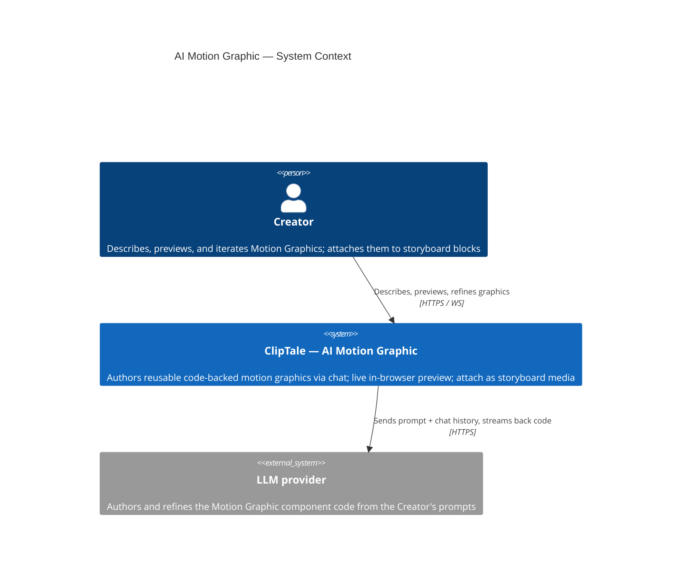
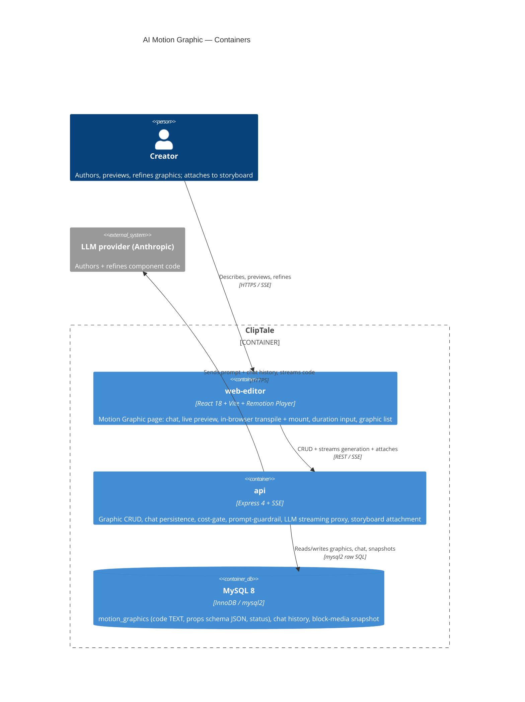
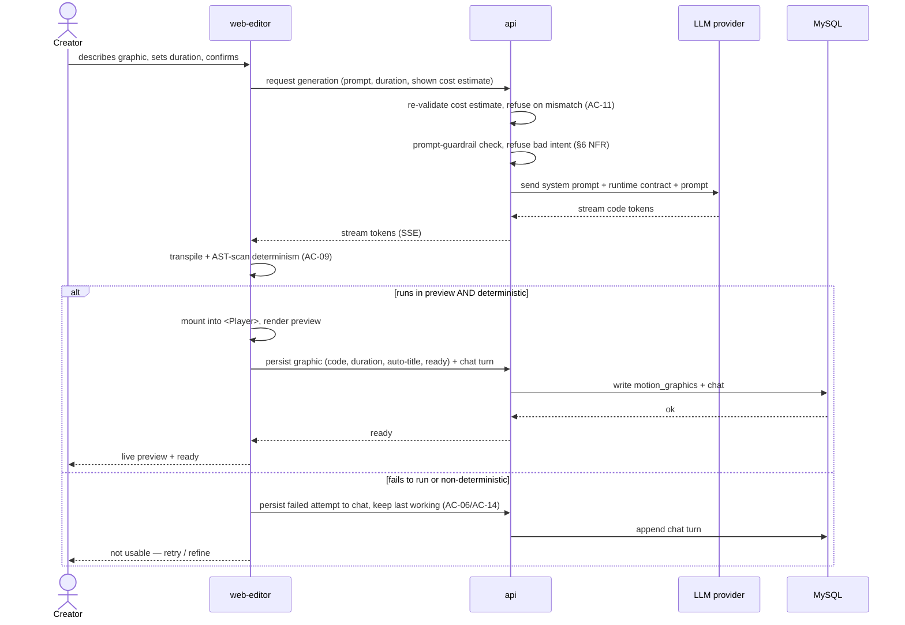

# Software Architecture Document — <slug>

<!-- 12 Arc42 sections. Empty section → <!-- N/A: <one-line reason> -->. -->
<!-- C4 Context (L1) lives inline in §3. C4 Container (L2) lives inline in §5. -->
<!-- Numbers in §10 come VERBATIM from spec.md §6 NFR — no inventing, no rounding. -->

## 1. Introduction and goals

**Intent.** ClipTale Creators cannot produce crisp, readable on-screen text/UI motion (title cards, lower-thirds, infographic/dashboard screens) — exactly the frames diffusion video models render worst (letters warp, drift episode-to-episode). This feature adds an **AI Motion Graphic** page where a Creator describes a graphic in natural language, an AI authors a reusable **code-backed** Motion Graphic, watches it in live preview, and iterates through a persistent chat that remains the graphic's editable source. The result is a **media asset** attachable to storyboard blocks as a frozen snapshot of code + duration. MVP1 executes the authored code **only in the browser live preview**; server-side render/export is deferred (spec §3, §8 OQ-1).

**Top-3 quality goals (1-liners; full scenarios in §10):**

1. **Render-determinism / preview↔export parity** — every ready graphic obeys the deterministic-render rule (AC-09) so the browser preview is guaranteed to match the future server export frame-for-frame.
2. **Tenant isolation under a new trust boundary** — executing untrusted, AI-authored code is bounded to a self-only blast radius (per-Creator, no sharing), backed by a prompt-guardrail (≥95% red-team refusal, spec §6).
3. **Interactive authoring responsiveness** — live preview ready ≤1500 ms after a code change; first streamed generation token ≤3 s p95.

**Stakeholders.**

| Role | Interest | Sign-off owner? |
|---|---|---|
| Creator | Authors / previews / iterates / attaches Motion Graphics | No |
| Tech Lead | SAD approval | Yes |
| Security Lead | New trust boundary (browser execution of AI-authored code) | Yes |

<!-- Decision overrides (¶4) — populated by the critic resolution loop, empty otherwise. -->

## 2. Constraints

**Technical.**
- TypeScript 5.4+ (strict, ESM), Node ≥20; Turborepo + npm workspaces monorepo (`apps/*`, `packages/*`).
- **api:** Express 4 + Helmet + CORS + express-rate-limit + Zod + `ws`. **web-editor:** React 18 + Vite 5 + React-Router v7 + TanStack Query 5 + Immer; state via a custom external store + `useSyncExternalStore` (no Redux/Zustand).
- MySQL 8 / InnoDB via `mysql2` raw SQL (no ORM); Redis 7 (BullMQ); S3 (AWS SDK v3, presigned URLs).
- **Remotion pinned 4.0.443** via root `overrides` — all `@remotion/*` kept aligned, never bumped piecemeal. One shared `packages/remotion-comps` bundle serves the browser `<Player>` and the server `@remotion/renderer`.
- Existing LLM provider: **OpenAI SDK** (`chat.completions`, `gpt-4o-mini`) inside media-worker BullMQ jobs — **no streaming and no multi-turn chat precedent**; no Anthropic SDK present.
- api layering: routes → controllers → services → repositories; no DI container, module singletons (`pool` / `redis` / `s3` / `config`).

**Organisational.**
- Effort / deadline: **no hard deadline fixed**; scope is bounded to MVP1 per spec §3 (server-side execution/export deferred).
- Team: full-stack (api + web-editor); Security Lead is a mandatory reviewer (new trust boundary).

**Conventions.**
- `docs/architecture-map.md` + `docs/architecture-rules.md` (authored rules) are canonical.
- IDs — UUID v4 `CHAR(36)` (`randomUUID()`); typed error classes (`apps/api/src/lib/errors.ts`, `err.statusCode` → JSON); numbered SQL migrations under `apps/api/src/db/migrations/` (next = **058**, in-process runner, `IF NOT EXISTS` guards); env only in `config.ts` (`APP_*`, Zod-validated); inline `CSSProperties` in co-located `*.styles.ts`; hand-maintained OpenAPI (`packages/api-contracts`) kept in sync in the same commit.

**Regulatory / external.**
- **Security review REQUIRED** (spec §6.1) — the feature introduces a new trust boundary: executing untrusted, AI-authored code in the browser with no execution sandbox in MVP1, relying on a prompt-guardrail + a self-only blast radius.
- Data classification: confidential (the graphic is the Creator's content **and** executable code; chat may carry proprietary creative direction). No new PII fields; ownership is per-account.

## 3. Context and scope

The feature lives inside the ClipTale platform (the existing media → storyboard → render pipeline). A Creator describes a graphic, the system has an external LLM provider author a code component, executes that component in a live in-browser preview, and persists it as a per-Creator media asset. The only external dependency in MVP1 is the LLM provider (code authoring); server-side render/export is deferred (spec §3, §8 OQ-1).

**Trust boundary.** AI-authored code is treated as **untrusted input** along its whole path — LLM → storage → browser execution. MVP1 ships no execution sandbox; the blast-radius boundary is the Creator's own browser session (self-only, no sharing), backed by a pre-generation prompt-guardrail.

<!-- brownfield: monorepo (Express 4 api + React 18 web-editor + BullMQ workers + Remotion 4.0.443 shared bundle), MySQL 8 raw SQL, OpenAI SDK present, no streaming-chat / runtime-code-eval precedent — per docs/architecture-map.md + targeted scan 2026-06-17. -->

**External systems (in / out):**

| Actor or system | Type | Interaction |
|---|---|---|
| Creator | Person | Describes, previews, refines graphics; attaches them to storyboard blocks |
| LLM provider | System (external) | Authors + refines the Motion Graphic component code from the Creator's prompt + chat history |
| Sandboxing / code-isolation service | — | **None (deliberate)** — MVP1 does not sandbox browser execution; it relies on the prompt-guardrail + the self-only blast radius |

**C4 Context (L1):**



## 4. Solution strategy

**Top strategic choices (the seeds for ADRs):**

1. **Target surfaces — a fullstack `[backend-service, web-frontend]`, no new worker in MVP1** (ADR-0001) — api endpoints (graphic CRUD, chat persistence, cost-gate, the LLM streaming proxy, storyboard attachment) + a new React SPA page in web-editor. MVP1 has no server-side render, so no `worker` surface; the LLM call streams from the api, not a fire-and-forget BullMQ job — the existing async-job pattern can't meet the TTFT ≤3 s / streaming UX of an authoring chat.

2. **UI architecture — a React SPA page inside the existing web-editor SPA** (inline, not ADR — the repo is already a Vite + React-Router SPA; SSR is ruled out by the existing stack, so there is no legitimate alternative). The page reuses the existing UI foundation (shared components, the external store, inline `*.styles.ts`), modelled on the generate-wizard feature; the storyboard attach UI reuses the existing block-media picker.

3. **LLM provider for code authoring — Anthropic Claude** (ADR-0002) — a new `@anthropic-ai/sdk` integration (streaming + prompt-caching) over the repo's existing OpenAI usage. Claude is stronger at code generation, and prompt-caching amortizes the system prompt + the Remotion runtime-API contract + prior chat turns across the persistent authoring loop. Default authoring model `claude-opus-4-8`.

4. **Streaming transport — Server-Sent Events from the api** (ADR-0003) — generation tokens stream to the chat over SSE, a minimal one-way channel that maps cleanly onto the LLM token stream, in preference to the existing `ws`+Redis realtime path (more machinery than a one-way token stream needs). Serves the TTFT ≤3 s and live-preview ≤1500 ms NFRs.

5. **Browser runtime — transpile-in-browser + dynamic component mount** (ADR-0004, the central pillar) — the AI authors a full Remotion TSX component; the browser transpiles it (Sucrase/Babel-standalone) and mounts it into a runtime composition wrapper driven into Remotion's `<Player>`. Chosen over a declarative JSON-spec interpreter, which would cap expressiveness and contradict the glossary's "code-defined" Motion Graphic.

6. **Execution security posture — no sandbox in MVP1, self-only blast radius** (ADR-0005, Security-signed) — per spec §6.1: browser execution is unsandboxed; the blast-radius boundary is the Creator's own session (per-Creator, no sharing) plus the prompt-guardrail. Residual self-exfiltration risk is accepted for MVP1; a server-side execution sandbox arrives with the deferred export milestone (§8 OQ-1).

7. **Determinism enforcement — author-time AST scan + a runtime shim** (ADR-0006) — a static AST scan rejects `Date.now()`/`new Date()`/`Math.random()`/`performance.now()` at authoring time (a graphic can't reach ready without passing), backed by a runtime shim that freezes those sources during execution. Enforces the deterministic-render rule (AC-09) so preview ↔ export parity holds.

8. **Prompt-guardrail + runtime allowlist** (ADR-0007, resolves spec §8 OQ-2) — a server-side guardrail step refuses exfiltration/subversion-intent prompts before the LLM call (≥95% red-team refusal, spec §6 NFR), plus a minimal import/runtime allowlist (render runtime + schema lib only) enforced at authoring time, rejecting anything else.

9. **Persistence — single-store MySQL, code as TEXT, version-capable + props-schema-JSON shape from day one** (ADR-0008) — the component code lives in a TEXT column on the graphic row (not an S3 blob), queried with the record and snapshotted in place on attach. A graphic remains a media asset via a new `motion_graphic` kind on the storyboard block-media pivot; its "content" is code in the DB, not a file in S3. Detailed schema is `data-model`'s job.

Each tactical decision in later sections traces to one of these seeds. Tactical decisions that *contradict* a strategic choice are red flags — surface them in §11.

## 5. Building block view

**Style.** Layered, following the repo conventions without divergence — api: `routes → controllers → services → repositories` with module singletons (`pool`/`config`), no DI; web-editor: a `features/<name>/` slice with `components/ · hooks/ · api.ts · types.ts`, modelled on the generate-wizard feature. The two declared surfaces (`backend-service`, `web-frontend`) are the two application containers below.

**Internal decomposition:**

```
apps/api/src/
├── routes/motionGraphic.routes.ts            → controllers/motionGraphic.controller.ts
├── services/motionGraphic.service.ts           CRUD, ownership, ready-state invariants (AC-07/AC-08)
├── services/motionGraphicAuthoring.service.ts  Anthropic SDK streaming proxy + SSE (ADR-0002/0003)
├── services/motionGraphicGuardrail.service.ts  pre-generation prompt guardrail + allowlist (ADR-0007)
├── services/motionGraphic.cost.service.ts      estimate mirror of storyboardPipeline.cost (cost-gate)
├── repositories/motionGraphic.repository.ts    motion_graphics (code TEXT), chat history — raw SQL
└── (storyboard) block-media attach extended: kind = motion_graphic → snapshot table (ADR-0009)

apps/web-editor/src/features/motion-graphic/    (browser-only runtime in MVP1 — DEC-5 inline)
├── components/   page, chat panel, full-canvas live preview, duration input, list + empty state
├── runtime/      in-browser transpile (Sucrase) + AST scan (ADR-0006) + runtime shim + mount → <Player>
├── hooks/  ·  api.ts  ·  types.ts
```

The browser runtime wrapper (transpile + AST-scan + shim + dynamic mount) lives **in the web-editor feature** (`runtime/`), not in `packages/remotion-comps` — MVP1 executes code only in the browser, so the runtime is local to the feature; the deferred server-side export milestone will promote a shared runtime contract into the bundle (a separate ADR at that time). The storyboard attach UI reuses the existing block-media picker.

**C4 Container (L2):**



## 6. Runtime view

**Critical flow 1: Generate a Motion Graphic (US-02 / AC-01, AC-06, AC-09, AC-11)**



**Critical flow 2: Attach a graphic to a storyboard block as a frozen snapshot (US-07 / AC-04, AC-08, AC-10)** — seeded at the `sequences` stage, which covers every remaining §5 acceptance criterion (refinement AC-03/AC-14, resume AC-05, authorization AC-07, duplicate AC-12, list AC-13) against the participants above.

## 7. Deployment view

<!-- 🎯 Why: the TOPOLOGY DevOps must know without reading the deploy charts — how many replicas,
     where the background worker lives, AT WHAT NUMBERS we scale.
     📋 Write: 2–3 sentences on topology + monitoring + concrete threshold numbers.
     📌 e.g. «500 authors → partition by quarter» (not «we'll think about scale later»).
     🎯 N/A allowed for XS/S that reuses an existing deployment unit with no change.
     Deployment-diagram scaffold → templates/deployment.md. -->

<Topology in 2–3 sentences. Where it runs, replicas, scaling thresholds.>

**Monitoring:**
- <Metrics — e.g. `<metric_name>`>
- <Alerts — e.g. «worker lag > 10 min → page on-call»>
- <Tracing — e.g. spans on the request boundary>

**Scaling thresholds:**
- <e.g. comfortable in one table up to N rows/year>
- <e.g. partition by quarter above N rows/year>

<!-- For XS/S with no deployment change: <!-- N/A: reuses existing deployment unit, no infra change --> -->

## 8. Crosscutting concepts

<!-- 🎯 Why: CROSS-CUTTING PATTERNS spanning several modules: logging, errors, authorization, ID
     strategy, events, caching. ⭐ The second-densest section. A pattern inside one module is NOT
     here; a project-wide convention belongs in the convention file.
     📋 Write: a table — concept / convention / where defined. One row per concept.
     📌 e.g. «sortable time-based IDs generated in the app layer» as a default from the convention file. -->

| Concept | Convention | Where defined |
|---|---|---|
| Logging | <e.g. structured, fields `module=<name>`> | <convention file §X or here> |
| Authentication | <e.g. token-based via middleware> | <convention file §X> |
| Error handling | <e.g. domain sentinel → ports error mapping → JSON> | <convention file §X> |
| ID strategy | <e.g. sortable time-based ID in the app layer> | <convention file §X> |
| Internationalisation | <e.g. N/A, single language> | — |
| Observability | <e.g. tracing on the request boundary> | — |
| Events | <module-specific patterns, if any> | <here> |

## 9. Architecture decisions

<!-- 🎯 Why: the REVERSE INDEX onto the adr/ folder. `ls adr/` gives the files; §9 gives the
     semantics — why they exist, which SAD section they attach to, what status.
     📋 Write: a 4-column table, one row per ADR. Mixed status is fine.
     📌 e.g. «0001 | Store content as a table of typed blocks | Accepted | §4». -->

| # | Title | Status | Section |
|---|---|---|---|
| <NNNN> | <imperative — e.g. "Use a sliding-window counter for rate limiting"> | Accepted | §<N> |
| <NNNN> | <imperative — e.g. "Co-locate the worker in the API process"> | Accepted | §<N> |

ADR files live under `docs/features/<slug>/adr/NNNN-<title>.md`.

## 10. Quality requirements

<!-- 🎯 Why: the QUALITY TREE — take a goal from §1 and break it into concrete leaves: tests,
     metrics, configs, drills. ⭐ Without §10, §1 is a manifesto. With §10 each declaration maps
     to something PROVABLE.
     📋 Write: per §1 goal — When / Then / How-verify. Numbers from spec §6 NFR VERBATIM (don't
     round ≤250ms to ≤300ms — that's a critic F6 hit).
     📌 e.g. «p95 ≤ 500 ms on a block update, verified by a 100 req/s load test». -->

Each top-3 goal from §1 expanded into a full scenario:

**QG-1. <quality attribute>**
- **When:** <trigger condition>
- **Then:** <expected behaviour with numbers from spec §6 NFR>
- **How verify:** <test / chaos drill / load test / metric>

**QG-2. <quality attribute>**
- **When:** <trigger>
- **Then:** <expected>
- **How verify:** <how>

**QG-3. <quality attribute>**
- **When:** <trigger>
- **Then:** <expected>
- **How verify:** <how>

## 11. Risks and technical debt

<!-- 🎯 Why: ⭐ collects EVERYTHING that can break — not only the technical. Without §11 risks get
     discussed at standups and lost; debt lives only in the head of whoever accepted it.
     📋 Write: a risk/debt table — severity — mitigation — owner. Accepted debt in its own block.
     📌 The first risk is often a product risk, not a technical one. That's normal. -->

<!-- Severity literals: Low / Medium / High for regular risks; "Open question" for rows created by
     a Save-as-OQ resolution during the Socratic walk (see references/socratic.md). -->

| Risk / debt | Severity | Mitigation | Owner |
|---|---|---|---|
| <e.g. Worker lag may reach hours during a downstream outage> | Medium | <alert >10 min, on-call playbook, retry backoff> | <DevOps> |
| <e.g. No event-schema versioning in v1> | Medium | <ADR-NNNN planned for v2, tolerate unknown fields> | <Backend> |
| Open architectural decision: <decision-headline> | Open question | Resolve before <stage trigger or YYYY-MM-DD>; <inline rationale from the Save-as-OQ> | <owner> |

**Accepted debt (acceptable in v1, plan to fix later):**
- <e.g. the entity is immutable / unversioned — OK for v1, may need audit versioning in v2>

## 12. Glossary

<!-- 🎯 Why: ⭐ the DOMAIN GLOSSARY that ends arguments a year later («checkpoint — weekly or
     biweekly? quarter — calendar or fiscal?»).
     📋 Write: a term / meaning table. Business + technical terms mixed.
     📌 e.g. «Lesson | a unit inside a course made of blocks (text, video)». -->

| Term | Meaning |
|---|---|
| <e.g. domain object A> | <its meaning in this domain> |
| <e.g. domain object B> | <its meaning> |
| <e.g. domain invariant name> | <the rule, in plain language> |
