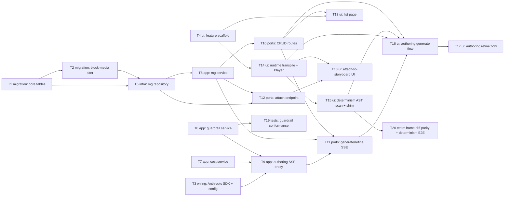

# Epic — ai-motion-graphic

> **Spec:** [spec.md](../spec.md) · **Design:** [sad.md](../sad.md) · **Data model:** [data-model.md](../data-model.md) · **API:** [openapi.yaml](../contracts/openapi.yaml) · **ADRs:** [adr/](../adr/)

## Goal

Ship the MVP1 **AI Motion Graphic** authoring loop: a new web-editor page where a Creator describes a graphic, an AI (Anthropic Claude) authors a reusable code-backed Remotion component streamed over SSE, the browser transpiles + determinism-checks it and previews it live, and the Creator iterates through a persistent chat. The graphic becomes a per-Creator media asset attachable to storyboard blocks as a frozen code+duration snapshot (spec §2 Goals).

## Scope

- **In:** new MySQL schema (3 tables + a `storyboard_block_media` alter); api endpoints (graphic CRUD, persistent chat, cost-gate, prompt-guardrail, Anthropic SSE proxy, storyboard attach); a React SPA feature slice with the browser runtime (transpile + AST determinism scan + shim + `<Player>` mount), authoring chat, live preview, list/duplicate/rename, and the attach UI. Surfaces: `backend-service`, `web-frontend` (sad frontmatter).
- **Out (spec §3):** cross-account sharing / shared template library; per-placement prop editing + prop forms (MVP2); project design tokens (MVP2); versioning UI / instance re-pinning (MVP3); pre-render-to-alpha-video; **server-side execution / final video export** of a graphic (deferred — MVP1 runs code only in the browser preview).

## Task map

## Tasks

See [tracker.md](./tracker.md) for status. Machine contract: [tasks.json](../tasks.json).

| # | Task | Layer | Blocked by | DoD (short) |
|---|---|---|---|---|
| T1 | Promote + apply the 3 core MG tables | migration | — | Migrations 058–060 apply + revert cleanly |
| T2 | Promote + apply `storyboard_block_media` alter | migration | T1 | 061 adds `motion_graphic` kind, nullable `file_id`, snapshot FK |
| T3 | Anthropic SDK dep + `APP_ANTHROPIC_API_KEY` + client | wiring | — | Key Zod-validated; singleton client boots |
| T4 | Scaffold motion-graphic feature slice + route | ui | — | `/motion-graphics` route renders a page shell |
| T5 | `motionGraphic.repository` (graphics + chat + snapshots) | infra | T1, T2 | Raw-SQL CRUD + frozen snapshot insert hit real MySQL |
| T6 | `motionGraphic.service` (ownership + ready-state) | app | T5 | Owner-filtered; non-owner→NotFound; verdict mapping |
| T7 | `motionGraphic.cost.service` (estimate + revalidate) | app | — | Mismatch→GateError, mirror of pipeline cost |
| T8 | `motionGraphicGuardrail.service` (guardrail + allowlist) | app | — | Bad-intent prompt refused; reject-by-default allowlist |
| T9 | `motionGraphicAuthoring.service` (Anthropic SSE proxy) | app | T3, T7, T8 | Gates before stream; token/done/error frames |
| T10 | MG CRUD routes + controller | ports | T6 | 6 ops per openapi; owner→404; routes mounted |
| T11 | Generate + refine SSE endpoints | ports | T9, T6, T10 | Pre-stream 422 gates; `text/event-stream` relay |
| T12 | Attach-to-block endpoint | ports | T5, T6 | Ready-gate→422; frozen snapshot persisted |
| T13 | MG list page (empty/rename/duplicate) | ui | T4, T10 | Owner list newest-first + empty state |
| T14 | Browser runtime: transpile + `<Player>` mount | ui | T4 | Authored TSX mounts + previews ≤1500 ms |
| T15 | Determinism AST scan + runtime shim | ui | T14 | Time/random sources rejected before ready |
| T16 | Authoring view: duration + generate SSE + create persist | ui | T11, T14, T15, T10 | Generate → preview → persist verdict |
| T17 | Authoring view: refine SSE + append-turn persist | ui | T16 | Refine → refresh; failed keeps last working |
| T18 | Attach-to-storyboard UI | ui | T12, T14 | Pick ready graphic → attach → render in block |
| T19 | Guardrail conformance suite (red-team) | tests | T8 | ≥95% refusal over the red-team set |
| T20 | CI frame-diff parity + determinism E2E | tests | T15 | Fixture parity + non-deterministic never ready |

## Risks / Hard rules

- **Determinism (AC-09, ADR-0006):** a graphic must animate only from `useCurrentFrame()` — no `Date.now()`/`new Date()`/`Math.random()`/`performance.now()`. Enforced author-time (AST scan) + runtime shim; a graphic that fails it never reaches `ready` (T15/T16/T17/T20).
- **Tenant isolation (AC-07, §6.1):** every read/write of a graphic, its chat, and its attachments is owner-filtered; a non-owner is answered **as though the graphic does not exist** on every surface (T6/T10/T11/T12).
- **No server-side execution in MVP1 (ADR-0001/0005):** the browser is authoritative for "does the code run"; the server is authoritative for ownership, ready-state, cost-gate and guardrail. No worker, no render fleet.
- **Cost gate is instrument-only, server re-validated (AC-11, §6.1):** never trust the client estimate; exact-match mirror of `storyboardPipeline.cost.service`, no credit ledger (T7/T11).
- **Guardrail runs server-side, pre-generation (ADR-0007, §6 NFR):** ≥95% red-team refusal before any LLM call; minimal reject-by-default allowlist (T8/T19).
- **Remotion pinned 4.0.443 (sad §2):** all `@remotion/*` aligned via root `overrides`; runtime version snapshotted at attach without re-validation (ADR-0010). No piecemeal bump.
- **Conventions:** UUID v4 `CHAR(36)`; typed errors (`apps/api/src/lib/errors.ts`) → `statusCode`/`code`/`details`; routes→controllers→services→repositories, no DI; camelCase wire keys; `{ error, code?, details? }` envelope; OpenAPI kept in sync in the same commit.
