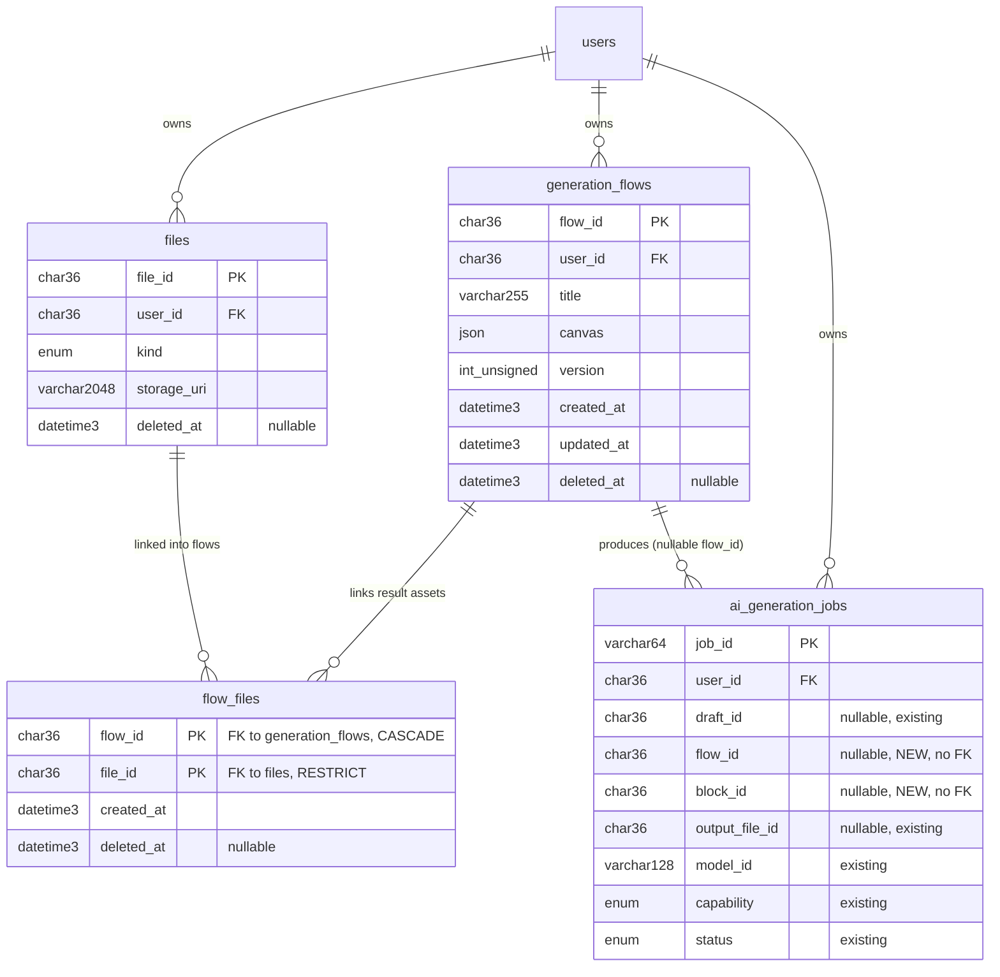

# Data model — generate-ai-flow

> Derived from `spec.md` §5 (acceptance criteria), `sad.md` §4/§6/§8 + Accepted ADRs 0001–0007,
> and the live `apps/api/src/db/migrations/` schema (conventions corroborated against
> `docs/architecture-map.md` §Migrations). Stack: MySQL 8 / InnoDB, `mysql2` raw SQL, no ORM.
>
> **Migrations are STAGED** under `docs/features/generate-ai-flow/migrations/` (feature-local
> ordinals `01`–`03`) — **nothing was written into the live `migrations/` tree**. `implement`
> promotes them (real numbers ≈ `046`/`047`/`048`) when the feature is built. See the audit report.

## Scope of change

This feature adds **two new tables** (`generation_flows`, `flow_files`) and **two nullable
columns + one index** on the existing `ai_generation_jobs`. It reuses the existing `files`
library and `users` tables unchanged. One **non-DB** persistence artifact — the model-catalog
schema extension (ADR-0006) — is recorded in [§ Catalog schema extension](#catalog-schema-extension-adr-0006--not-a-db-migration) but produces **no migration** (the catalog is TypeScript in `packages/api-contracts`, not a DB table).

## Aggregate roots

| Aggregate root | Owns | Notes |
|---|---|---|
| **GenerationFlow** (`generation_flows`) | the whole canvas (blocks + edges + positions + per-block params) as one JSON `canvas` column (ADR-0002); its `flow_files` links | New, owner-scoped per Creator (`user_id`), soft-deletable. The canvas is opaque to SQL; `block_id`s referenced elsewhere live inside it. |
| **File** (`files`, existing) | the library asset blob | **Not** owned by a flow — a result asset outlives its flow (AC-19). Linked to a flow only via the `flow_files` pivot. |
| **AiGenerationJob** (`ai_generation_jobs`, existing) | one generation run + its outcome | Independent lifecycle (ADR-0001/0007); gains nullable `flow_id`/`block_id` back-links, no FK — mirrors the existing `draft_id` pattern. |

## ER diagram

*(Existing tables show only the columns relevant to this feature; `users`/`files`/`ai_generation_jobs`
are not redefined by this migration set except where noted.)*

## Entities

### `generation_flows` — NEW (root aggregate; ADR-0002 / ADR-0003)

Owner-scoped, soft-deletable. The canvas is one JSON document (cheap whole-canvas reload, AC-10);
concurrent saves guarded by the monotonic `version` (AC-10b). Shape follows `generation_drafts`
(user-owned JSON doc) + `files` (audit/soft-delete) + `projects` (optimistic version).

| Column | Type | Null | Default | Notes |
|---|---|---|---|---|
| `flow_id` | `CHAR(36)` | NO | — | PK. UUID v4 from `randomUUID()` (repo ID convention). |
| `user_id` | `CHAR(36)` | NO | — | Owner. FK → `users(user_id)` `ON DELETE CASCADE`. Owner-scopes every read/write (§8 AuthZ, AC-04). |
| `title` | `VARCHAR(255)` | NO | `'Untitled flow'` | US-01 rename; sized as `projects.title`. |
| `canvas` | `JSON` | NO | — | The whole node graph (blocks/edges/positions/params), ADR-0002. Validated by a Zod schema in `packages/project-schema`, **not** by the DB. |
| `version` | `INT UNSIGNED` | NO | `1` | Optimistic-lock version (ADR-0003). A save carries its parent version; mismatch → `OptimisticLockError` (409). Monotonic, incremented per accepted save. |
| `created_at` | `DATETIME(3)` | NO | `CURRENT_TIMESTAMP(3)` | `files` audit convention. |
| `updated_at` | `DATETIME(3)` | NO | `CURRENT_TIMESTAMP(3)` ON UPDATE | autosave touch; drives the list ordering. |
| `deleted_at` | `DATETIME(3)` | YES | `NULL` | Soft delete (`WHERE deleted_at IS NULL`), convention from 029. AC-19: deleting a flow soft-deletes the row + its `flow_files`, never the `files` asset. |

### `flow_files` — NEW (pivot; ADR-0007)

Links a flow to the result assets it produced. Mirrors `draft_files` (022 + 029) verbatim.

| Column | Type | Null | Default | Notes |
|---|---|---|---|---|
| `flow_id` | `CHAR(36)` | NO | — | PK part. FK → `generation_flows(flow_id)` `ON DELETE CASCADE` (drop links when the flow is hard-deleted/purged). |
| `file_id` | `CHAR(36)` | NO | — | PK part. FK → `files(file_id)` `ON DELETE RESTRICT` (the asset outlives the flow — AC-19). |
| `created_at` | `DATETIME(3)` | NO | `CURRENT_TIMESTAMP(3)` | link time. |
| `deleted_at` | `DATETIME(3)` | YES | `NULL` | App-level soft delete (mirrors `draft_files` post-029): a flow delete soft-deletes its links; the FK CASCADE/RESTRICT pair is the hard-delete safety net. |

**PK:** composite `(flow_id, file_id)` — one link per (flow, asset).

### `ai_generation_jobs` — ALTER (existing; ADR-0001 / ADR-0007)

Two nullable back-link columns + one index. No FK (job lifecycle is independent of the flow —
exact reasoning as the existing `draft_id`, migration 026).

| Column | Type | Null | Default | Notes |
|---|---|---|---|---|
| `flow_id` | `CHAR(36)` | YES | `NULL` | NEW. The flow that triggered the run. No FK (orphan-safe; worker `INSERT IGNORE`s into `flow_files` on success). Added `AFTER draft_id`. |
| `block_id` | `CHAR(36)` | YES | `NULL` | NEW. The canvas generation-block id (lives inside `generation_flows.canvas` JSON, so no table to reference). Lets reattach-on-reopen (AC-08b) map a job → its result block. Added `AFTER flow_id`. |

*(Existing columns — `job_id` PK, `user_id`, `model_id`, `capability`, `prompt`, `options`,
`status`, `progress`, `result_asset_id`, `result_url`, `output_file_id`, `draft_id`,
`created_at`, `updated_at` — are unchanged.)*

## Indexes

Each index serves a concrete query from the spec/§6 sequences; no "just in case" indexes.

| Index | Table | Columns | Query it serves |
|---|---|---|---|
| `idx_generation_flows_user_active_updated` | `generation_flows` | `(user_id, deleted_at, updated_at DESC)` | **Flow 3 list / AC-04 / AC-10:** `WHERE user_id=? AND deleted_at IS NULL ORDER BY updated_at DESC`. Single composite covering equality (user, deleted) + ordered scan. Leading `user_id` also satisfies the `fk_generation_flows_user` FK-index requirement (§6 open-latency hint, ≤1500 ms). |
| `idx_flow_files_file` | `flow_files` | `(file_id)` | **FK index** for `fk_flow_files_file` (RESTRICT check on file delete) + reverse lookup "is this asset linked to any flow?" — the composite PK leads with `flow_id`, so `file_id` is uncovered alone. |
| `idx_ai_generation_jobs_flow_id` | `ai_generation_jobs` | `(flow_id)` | **Flow 2 reattach / AC-08b:** read every result block's job state for one flow — `WHERE flow_id=?`. |

*(PKs provide the point-lookup indexes: `generation_flows(flow_id)`, `flow_files(flow_id,file_id)`,
`ai_generation_jobs(job_id)`. The `fk_generation_flows_user` FK is covered by the leading `user_id`
of the composite index above — no extra index needed.)*

### `flow_model_pricing` — NEW (lookup; ADR-0008, amends ADR-0005; AC-20)

Per-model pricing the estimate formula reads — adjustable in the DB without a deploy (review
pass-15 escalation of the §8 pricing OQ). Standalone lookup table: `model_id` references the
**code catalog** (`packages/api-contracts` AI_MODELS), not another table, so it carries **no FK**
(same reasoning as `ai_generation_jobs.model_id`). Seeded from the static `FLOW_PRICE_TABLE`
(flat price → `base_amount`, factors NULL) so day-one estimates are unchanged.

| Column | Type | Null | Default | Notes |
|---|---|---|---|---|
| `model_id` | `VARCHAR(191)` | NO | — | PK. Catalog model id (e.g. `fal-ai/nano-banana-2`). 191 keeps the PK within the utf8mb4 index limit. |
| `currency` | `CHAR(3)` | NO | `'USD'` | ISO 4217; matches the openapi `Money.currency`. |
| `base_amount` | `DECIMAL(10,4)` | NO | — | Per-run floor — the seeded flat price. |
| `per_second` | `DECIMAL(10,6)` | YES | `NULL` | × effective output duration in seconds (video `duration`, music `duration` / `music_length_ms`÷1000). NULL = no duration component. |
| `per_image` | `DECIMAL(10,6)` | YES | `NULL` | × effective `num_images` (default 1). NULL = no per-image component. |
| `resolution_mult` | `JSON` | YES | `NULL` | Object map `{"480p": 1, "720p": 1.5, "1080p": 2.5}`; the block's effective `resolution` picks the multiplier, missing key / NULL → ×1. |
| `updated_at` | `DATETIME(3)` | NO | `CURRENT_TIMESTAMP(3)` ON UPDATE | audit of price edits. |

**Formula (estimate service, AC-20):**
`amount = round((base_amount + per_second × duration_s + per_image × num_images) × resolution_mult[resolution] ?? 1, 2)`
— effective param values come from the block's saved params, falling back to the catalog field
defaults (what the provider would actually run). No DB pricing row → static-table fallback,
`bestEffort: true` always.

## Catalog schema extension (ADR-0006) — NOT a DB migration

Spec §8 open question (*"Does the model catalog already declare alternative-input exclusivity
groups… or must that schema be added?"*, due **before `sdd:data-model`**) is **RESOLVED here**:

- **Finding:** the catalog (`packages/api-contracts/src/fal-models.ts`, `FalFieldSchema`) declares
  `name`, `type`, `label`, `required`, `default`, `enum`, `min`, `max` — but **no `modality`
  and no `exclusiveGroup`**. The one known XOR (`kling/o3` `prompt` ⊕ `multi_prompt`) is documented
  in JSDoc and *"enforced at submit time"* in API runtime, **not** in the schema (confirmed by
  `fal-models.test.ts`: *"XOR enforced by BE, not schema"*).
- **Resolution (ADR-0006):** the schema **must be extended**. Add to `FalFieldSchema`:
  - `modality?: 'text' | 'image' | 'audio' | 'video'` — derived per field `type`
    (`text`→text; `image_url`/`image_url_list`→image; `audio_url`/`audio_upload`→audio; video is an
    output modality). Drives connect-time handle typing (AC-02, ≤100 ms, no server round-trip) **and**
    Generate-time validation — one source for both surfaces.
  - `exclusiveGroup?: string` — fields sharing a group value form an "exactly one of" set
    (e.g. `kling/o3` `prompt`/`multi_prompt` → `exclusiveGroup: 'prompt_mode'`), replacing the
    hardcoded runtime XOR (AC-06).
- **Why no migration:** the catalog is **TypeScript/Zod in `packages/api-contracts`** (shared by
  `api`, `web-editor`, `media-worker`), versioned in code — there is no catalog DB table. The schema
  change + per-model backfill is an `implement`-stage code task (and surfaces in `sdd:api` as
  contract types), **not** a SQL migration. Recorded here only to close the OQ and fix the field names.

## Seeds

- **Bootstrap:** none — `generation_flows` rows are created by Creators at runtime; no system row.
- **Lookup data:** `flow_model_pricing` is seeded **inside migration 04** from the static
  `FLOW_PRICE_TABLE` values (one row per model id, flat price → `base_amount`, factor columns NULL)
  so the estimate behaviour is unchanged until an operator edits the rows. Capability/modality
  still live in the code catalog, not the DB.
- **Test fixtures (NOT in migrations):** integration tests (Vitest against real MySQL, `singleFork`)
  build a flow with a factory that inserts a `generation_flows` row (hardcoded UUID v7 ids, a minimal
  valid `canvas` JSON, `version = 1`, `user_id` = the seeded test user) and, for AC-19/AC-01 paths,
  a `files` row + a `flow_files` link. **PII guard:** any user/email in fixtures uses
  `user-<uuid>@example.test` / `Test Creator` — never real-looking data.

## Drift report

No drift to reconcile. `generation_flows` and `flow_files` are **net-new** — no pre-existing domain
struct/repository to compare against. The `ai_generation_jobs` change is **additive** (two nullable
columns + one index) and matches the existing `draft_id` link pattern; no field/column or
type/nullability mismatch is introduced. No `_drift/` fixes generated.

## Self-check

| Check | Result |
|---|---|
| **Naming matches the repo** | ✅ `CHAR(36)` UUID, `DATETIME(3)` audit, `deleted_at` soft-delete, `<entity>_id` PK + `fk_<table>_<ref>` / `idx_<table>_<cols>` naming. One deliberate choice flagged in the audit: PK named `flow_id` (the `files`/`projects` `<entity>_id` convention) rather than `id` (the `generation_drafts` convention) — chosen for a clean `flow_files.flow_id` FK. `user_id` chosen over `projects.owner_user_id` to match the closer peer `generation_drafts`. |
| **Down reversibility** | ✅ Every `.up` has a `.down`: `CREATE TABLE`→`DROP TABLE` (01, 02); `ADD COLUMN`×2 + `CREATE INDEX`→`DROP INDEX` + `DROP COLUMN`×2 (03). |
| **FK indexes** | ✅ `fk_generation_flows_user`→leading `user_id` of the composite index; `fk_flow_files_flow`→leading `flow_id` of the PK; `fk_flow_files_file`→`idx_flow_files_file`. New `ai_generation_jobs.flow_id`/`block_id` carry **no** FK (by design), so no FK index is owed; `flow_id` still indexed for the reattach query. |
| **Convention adherence** | ✅ Idempotent DDL (`IF NOT EXISTS` for tables; `INFORMATION_SCHEMA`+`PREPARE/EXECUTE` guards for the ALTER, matching 026/029); InnoDB / utf8mb4_unicode_ci; staged, not promoted. Divergences flagged above + in the audit. |
