# Software Architecture Document — generate-ai-flow

<!-- 12 Arc42 sections. Empty section → N/A: reason. -->
<!-- C4 Context (L1) lives inline in §3. C4 Container (L2) lives inline in §5. -->
<!-- Numbers in §10 come VERBATIM from spec.md §6 NFR — no inventing, no rounding. -->

## 1. Introduction and goals

**Intent.** generate-ai-flow gives a Creator a dedicated, visual, node-based "Generate AI" workspace to freely combine the existing catalog of AI models across text, image, video, and audio. The Creator assembles content blocks and generation blocks on a flow canvas, draws **typed connections** that are blocked at connect-time when modalities don't match, presses **Generate** one block at a time after a cost confirmation, and every result is auto-saved as a reusable asset in the Creator's general library, linked back to the flow. It reuses — not replaces — the existing single-model generation experience (spec §1, §3).

**Top-3 quality goals (1-liners; full scenarios in §10):**

1. **Cost-safety / financial integrity** — no paid provider call is ever made without a satisfied-required-inputs check, a cost confirmation, and a server-side per-Creator rate limit; a result asset enters the library only on a successful generation (spec §2, §6.1, §6).
2. **Owner-scoped confidentiality** — every flow list/read/write/delete and every Generate action is filtered by the calling Creator's identity; a non-owner gets no access and no existence disclosure (spec §6.1, AC-04/AC-05).
3. **Durability across sessions and async** — a flow (blocks, connections, parameters, results) and an in-flight generation survive reload, tab-close, and conflicting concurrent saves with no lost work and no lost outcome (spec §5 AC-08b/AC-10/AC-10b).

*(Canvas responsiveness — open ≤1500 ms, connection feedback ≤100 ms — is a real NFR but secondary to the three above; it is carried as a quality scenario in §10.)*

**Stakeholders.**

| Role | Interest | Sign-off owner? |
|---|---|---|
| Creator | Builds and runs generation flows; owns all flows and result assets | No |
| Tech Lead | SAD approval; owns the cost/validation/persistence architecture | Yes |
| Security Lead | New owner-scoped resource + financial-abuse (uncapped paid generation) vector | Yes |
| Product / Business owner | Rate-limit / quota / refund policy (spec §8 open questions) | No |

<!-- Decision overrides (¶4) — populated by the critic resolution loop, empty otherwise. -->

## 2. Constraints

*(Fixed inputs inherited from `docs/architecture-map.md` @ `reflects_commit 9f943df` — the brownfield this feature extends. Pinned, not chosen.)*

**Technical.**
- **Language / runtime:** TypeScript 5.4+ (strict, ESM), Node ≥ 20; Turborepo + npm-workspaces monorepo (`apps/*`, `packages/*`).
- **API:** Express 4 + Helmet + CORS + express-rate-limit + Zod; `ws` WebSocket realtime.
- **Frontend:** React 18 + Vite 5 + React-Router v7 + TanStack Query 5 + Immer; custom external store + `useSyncExternalStore` (no Zustand/Redux). Node canvas via **`@xyflow/react`** (the storyboard editor is the precedent).
- **Datastores:** MySQL 8 / InnoDB via `mysql2` raw parameterized SQL (no ORM); Redis 7 (BullMQ queues + realtime pub/sub channel `cliptale:realtime:v1`); S3 (AWS SDK v3, presigned upload/read URLs).
- **Workers:** BullMQ 5; generation runs on the **existing `media-worker`** (fal.ai + ElevenLabs) — no new worker container.
- **Architecture convention:** `routes → controllers → services → repositories`; module singletons (`pool`, `redis`, `s3`, `config`) imported directly — **no DI container**.

**Organisational.**
- **Effort / deadline:** not fixed at design time; no hard external release deadline.
- **Team:** the existing ClipTale fullstack team (no new headcount assumed).
- **Size:** L (per `.size`) — 10–15 ADRs expected for the feature.

**Conventions.**
- Canonical: `docs/architecture-map.md` (generated) + `docs/architecture-rules.md` (authored).
- **IDs:** UUID v4 via `randomUUID()` (`node:crypto`), stored `CHAR(36)`, validated `z.string().uuid()`. (Not ULID — `general_idea.md`'s ULID note is aspirational and contradicts live code.)
- **Errors:** typed classes in `apps/api/src/lib/errors.ts` (`ValidationError` 400, `NotFoundError` 404, `UnauthorizedError` 401, `ForbiddenError` 403, `ConflictError`/`OptimisticLockError` 409, `UnprocessableEntityError` 422, `GoneError` 410); central handler maps `err.statusCode`.
- **Migrations:** numbered SQL `NNN_description.sql` in `apps/api/src/db/migrations/` (next after `045`); in-process runner, `IF NOT EXISTS`-guarded; soft-deletes via `deleted_at IS NULL`.
- **API contract:** OpenAPI hand-maintained in `packages/api-contracts/src/openapi.ts` — no codegen; update spec + impl in the same commit.
- **Model catalog:** `packages/api-contracts` — `AI_MODELS` (`FalModel | ElevenLabsModel`), `capability` + per-field `required`/`type`; a new model/capability extends these catalogs.
- **UI / styling:** plain inline `CSSProperties` in co-located `*.styles.ts` (no Tailwind/CSS-modules/styled-components); tokens per `docs/design-guide.md`.
- **Config:** `apps/*/src/config.ts` is the only place reading `process.env`; vars `APP_*`, Zod-validated.

**Regulatory / external.**
- **Data classification:** confidential — flows + results are private creative work; no new personal-data fields introduced (spec §6.1). **Security review required.**
- **Paid third-party providers** (fal.ai, ElevenLabs): every Generate is a spend-bearing call → a financial-abuse vector that must be capped server-side (spec §6.1 abuse cases), not in the UI alone.

## 3. Context and scope

The Generate AI flow is a new owner-scoped workspace inside the existing ClipTale web editor. A signed-in Creator assembles a node graph, presses Generate per block, and receives results into both the canvas and their general library. ClipTale itself talks to two external systems: paid **AI providers** (fal.ai for image/video, ElevenLabs for audio) and an **S3-compatible object store** for media blobs. The **trust boundary is the API**: every flow list/read/write/delete and every Generate is authenticated (JWT) and owner-filtered there — the browser is untrusted, and Creator-supplied text is passed to providers strictly as content, never interpreted as instructions to ClipTale (spec §6.1).

<!-- brownfield: extends ClipTale (TS monorepo) — reuses the `media-worker` ai-generate pipeline, the user-scoped `files` library, the `@xyflow/react` storyboard canvas family, and the Redis→ws realtime channel; adds a new owner-scoped Flow resource in `api` + a new `generate-ai-flow` web-editor feature. -->

**External systems (in / out):**

| Actor or system | Type | Interaction |
|---|---|---|
| Creator | Person | Builds flows, draws typed connections, presses Generate, confirms cost; owns all flows + result assets |
| AI providers (fal.ai, ElevenLabs) | System (external) | Receive a generation request and return media (paid, per-call); the spend-bearing dependency |
| Object store (S3) | System (external) | Stores uploaded source media + generated result assets; served via presigned URLs |
| Identity / JWT auth | System (internal, existing) | The same auth/ACL middleware gates every flow + Generate operation; not re-built here |

**C4 Context (L1):**

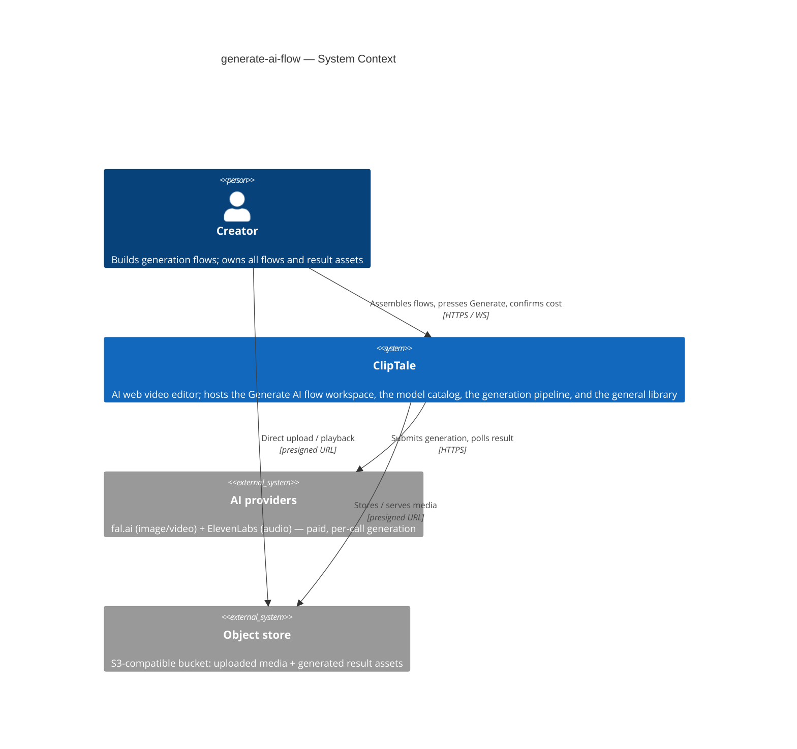

**In scope:** a new Generate AI page + flow CRUD; the flow canvas (blocks, typed connections, inspector); server-authoritative Generate (validation, cost gate, rate limit); result→library linkage; async progress + reattach. **Out of scope** (spec §3): replacing the single-model wizard, auto-DAG chain execution, new models/providers, real-time multi-Creator collaboration, multi-output per Generate.

## 4. Solution strategy

**Target surfaces.** `web-frontend` (a new `generate-ai-flow` feature module in the web-editor SPA) + `backend-service` (a new owner-scoped Flow resource + Generate endpoints in `api`) + reuse of the existing `worker` (generation runs on `media-worker` — no new container). A frontend-only design (persist via the browser, validate in the client) is **excluded by spec §6.1**: validation, the rate limit, and the cost gate must be server-authoritative, so a backend surface is mandatory. This is a forced choice with no legitimate alternative — recorded inline, not as an ADR. The web surface is an **SPA** (the web-editor already is one) and the canvas reuses **`@xyflow/react`** (the storyboard editor's library) rather than a bespoke canvas — consistency + a working precedent for typed connection validation, model-driven node types, and debounced autosave.

**Top strategic choices (the seeds for ADRs):**

1. **Reuse the existing generation rails, don't rebuild them** *(→ ADR-0001)* — a block's Generate runs through the existing `ai-generate` BullMQ job → `media-worker` (fal.ai/ElevenLabs) → S3 + the `files` library → the Redis→ws realtime channel. The job payload is extended with a flow linkage (`flow_id`/`block_id`); the submit/poll/download/ingest/progress machinery is untouched. This serves cost-safety (one audited spend path) and durability (the proven reattach-on-reopen flow), at the cost of coupling flow generation to the shared pipeline's shape.

2. **A Flow is a new owner-scoped, versioned canvas aggregate** *(→ ADR-0002, ADR-0003)* — a new soft-deletable `generation_flows` table owned per-Creator. The canvas (blocks + edges + positions + per-block params) is stored as **one JSON document column** (mirrors the storyboard autosave shape; cheap full-canvas reload) rather than relational block/edge rows. Concurrent saves (AC-10b) are guarded by an **optimistic version column** — a save carries its parent version, a mismatch is rejected with `OptimisticLockError` (409), the first save stays authoritative — the same idiom `projects` uses, deliberately diverging from the storyboard's blind-overwrite. Result→library links are kept relationally via a **`flow_files` pivot + `ai_generation_jobs.flow_id`** *(→ ADR-0007)*, mirroring `draft_files`: `ON DELETE CASCADE` on the flow, `RESTRICT` on the file, so deleting a flow drops the linkage but never the library asset (AC-19).

3. **Server-authoritative Generate (cost-safety)** *(→ ADR-0004, ADR-0005)* — every Generate re-validates all preconditions server-side before any provider call: required inputs resolved, alternative-exclusivity satisfied, content non-empty/valid, referenced library assets present, owner check (AC-02/03/05/06/17). Spend is capped by a **per-Creator Redis sliding-window rate limit** (≤ 30/min, spec §6) that scripting can't bypass — not IP middleware. Cost is surfaced by a **pre-flight estimate endpoint** backed by a **static per-model pricing table** (the catalog carries no pricing — spec §8 OQ); the Creator confirms the estimate before the paid call. The UI confirmation is advisory only.

4. **A typed, catalog-driven canvas** *(→ ADR-0006)* — input handles and connection compatibility derive from the model catalog's per-field modality. Because the catalog today carries neither explicit modality nor the alternative-exclusivity groups AC-06 needs (the XOR is hardcoded in API runtime), the **catalog schema is extended** with `modality` + `exclusiveGroup` metadata (materialized in `sdd:data-model`), making the rules data-driven so both the canvas (render + connect-time block, AC-02) and the API (Generate-time validation) read one source.

Each tactical decision in later sections traces to one of these four seeds. Tactical decisions that *contradict* a strategic choice are red flags surfaced in §11.

## 5. Building block view

**Style.** Layered on the backend (`routes → controllers → services → repositories`, module singletons, no DI — the repo convention) and a self-contained **feature module** on the frontend (`features/generate-ai-flow/` with `components/`, `hooks/`, `api.ts`, `types.ts`, modelled on generate-wizard). The Generate spend path is deliberately split from flow CRUD into its own service so the spend-bearing logic (validation + rate limit + cost gate) is isolated and independently testable for the security review.

**Internal decomposition:**

```
apps/api/src/
├── routes/generation-flows.routes.ts          # registered in index.ts after middleware
├── controllers/generation-flow.controller.ts  # Zod-validate, owner check, error mapping
├── services/
│   ├── generation-flow.service.ts             # CRUD, autosave, optimistic-version conflict (ADR-0003)
│   └── flow-generate.service.ts               # input resolution + validation + rate-limit + cost gate + enqueue (ADR-0004/0005)
├── repositories/
│   ├── generation-flow.repository.ts          # generation_flows (JSON canvas blob, ADR-0002)
│   └── flow-file.repository.ts                # flow_files pivot (ADR-0007)
├── lib/flow-pricing.ts                         # static per-model pricing table (ADR-0005)
└── db/migrations/
    ├── 046_generation_flows.sql                # owner-scoped, soft-delete, version column
    ├── 047_flow_files.sql                      # pivot: CASCADE on flow, RESTRICT on file
    └── 048_ai_jobs_flow_id.sql                 # nullable flow_id + block_id on ai_generation_jobs

apps/web-editor/src/features/generate-ai-flow/
├── components/  FlowListPage · FlowCanvas · {Content,Generation,Result}Node · Inspector · CostConfirmModal
├── hooks/       useFlowCanvas · useFlowAutosave (version-aware) · useFlowGeneration (reuses shared useJobPolling)
├── api.ts  types.ts
   (reuses shared/ai-generation + @xyflow/react; routes added in main.tsx → /generate-ai)

packages/api-contracts/   # catalog schema extension: modality + exclusiveGroup (ADR-0006); OpenAPI for flow + estimate + generate
packages/project-schema/  # flow-canvas Zod schema (ADR-0002) + extended ai-generate job payload (ADR-0001)
apps/media-worker/        # ai-generate handler extended to honor jobs.flow_id (ADR-0001/0007) — minimal change
```

**C4 Container (L2):**

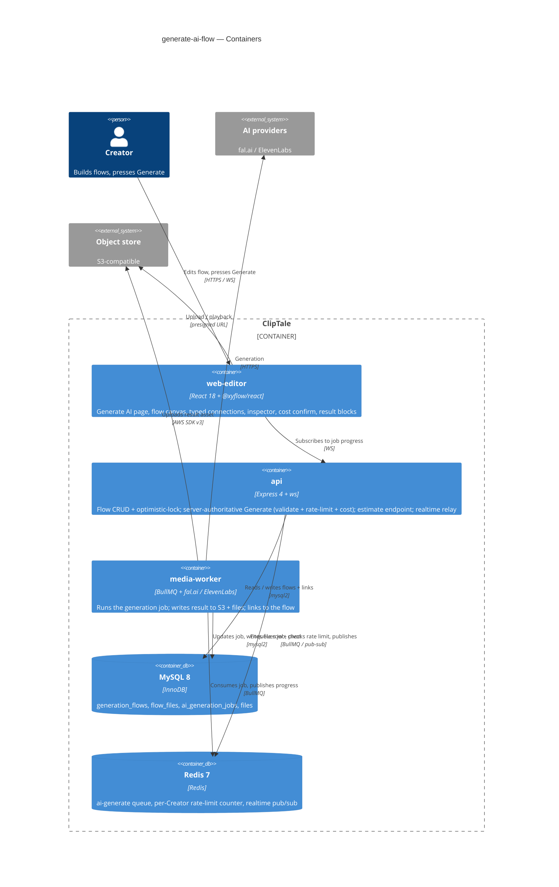

## 6. Runtime view

*(Seed flows; `sdd:sequences` covers every §5 AC with no cap. Participants are §5 names; messages are semantic — endpoint-level detail arrives at the `api` stage.)*

**Critical flow 1: Press Generate (happy path + cost gate — AC-01 / AC-11)**

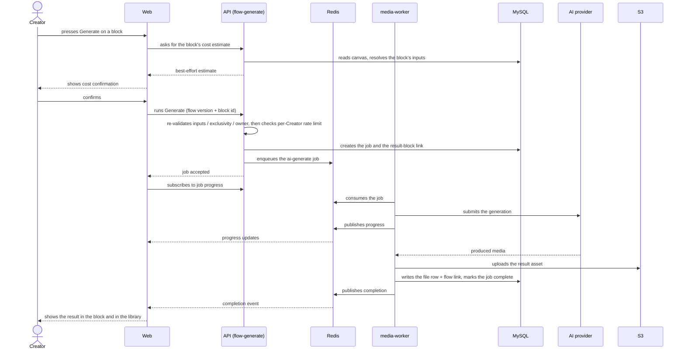

**Critical flow 2: Reattach on reopen (async durability — AC-08b)**

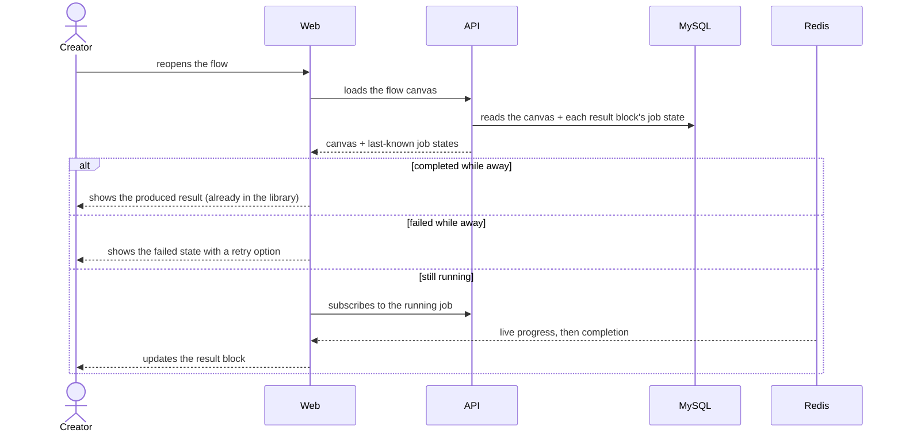

<!-- Flows below added by `sdd:sequences` (2026-06-03). Participant names reuse the §5 C4-container
     vocabulary already established by the two seed flows above (inherited from §2 constraints —
     a brownfield stack, not a premature runtime-view decision) so §6 reads consistently. -->

### Flow 3: Manage flows — list / create / rename / open (US-01, AC-04)

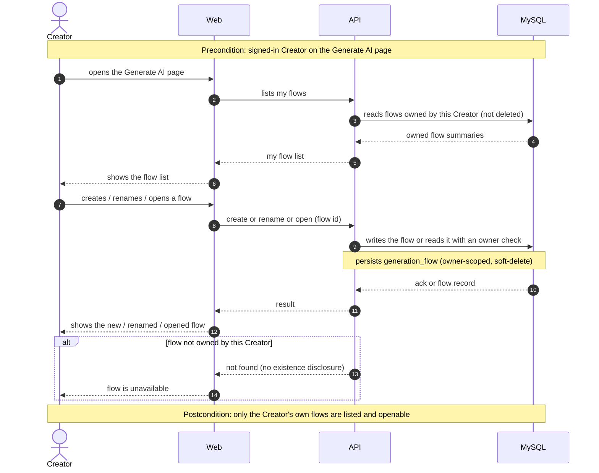

### Flow 4: Edit canvas and autosave (US-02 / US-03 / US-04, AC-15 / AC-16 / AC-10b)

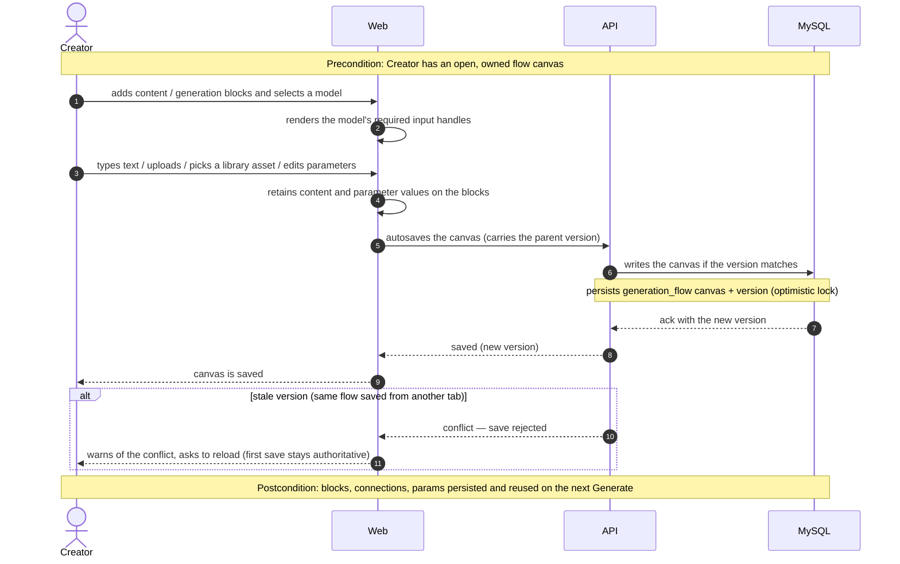

### Flow 5: Draw a typed connection (US-03 / US-07, AC-02 / AC-18)

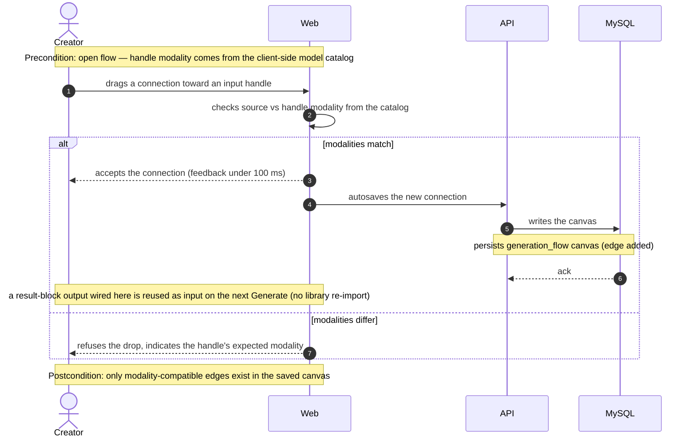

### Flow 6: Change a block's model — handle reconciliation (US-03, AC-07)

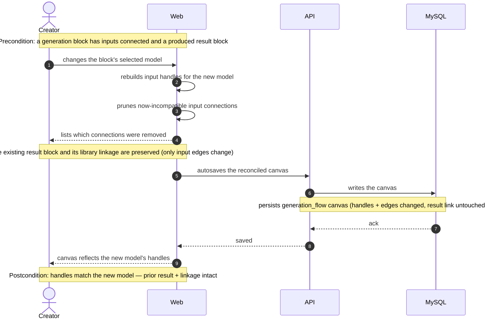

### Flow 7: Generate — server-side validation gate (US-05, AC-03 / AC-05 / AC-06 / AC-17)

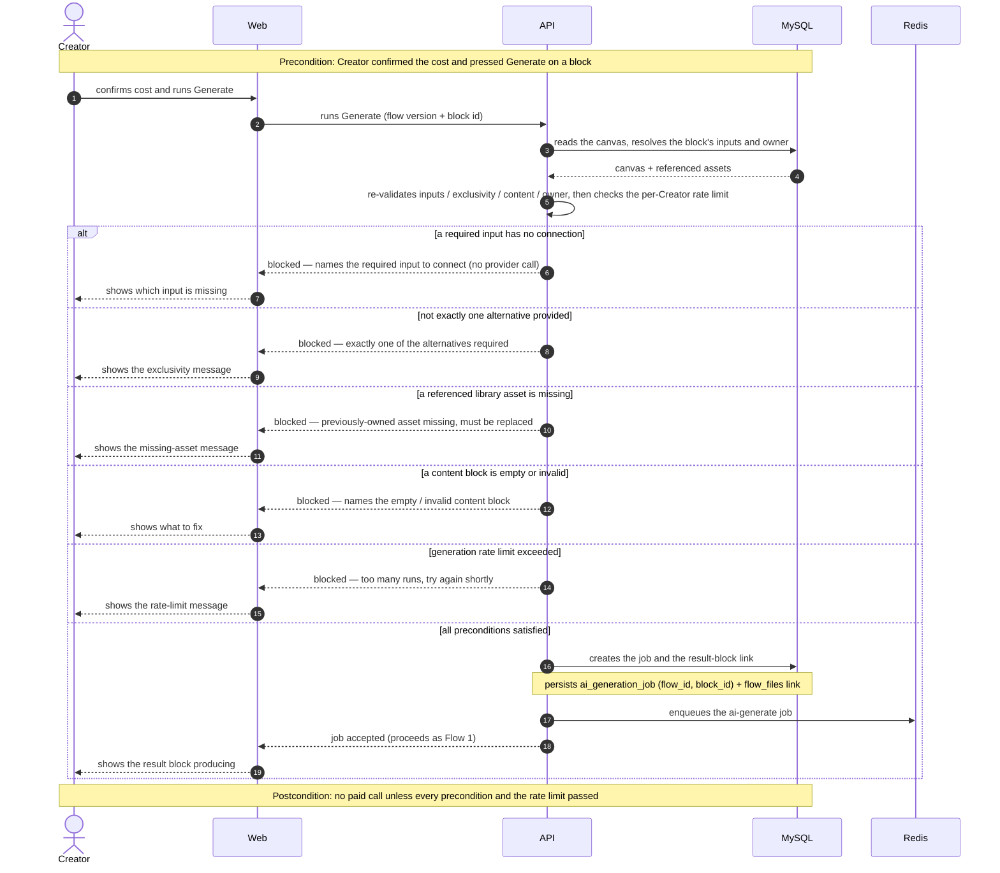

### Flow 8: Generation outcome at the worker — async (US-05 / US-06, AC-14 / AC-09)

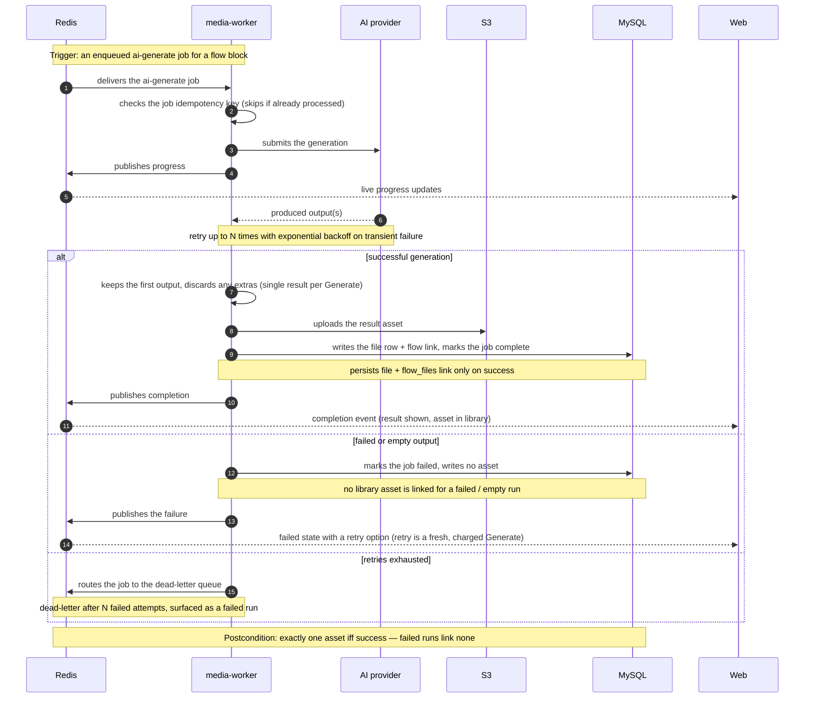

### Flow 9: Delete a flow — library assets preserved (US-01 / US-07, AC-19)

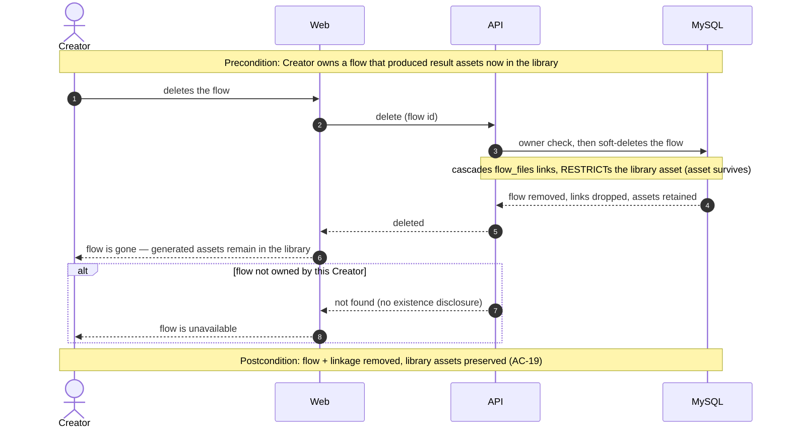

**Flagged for downstream stages** (flag only — not auto-written):
- *Idempotency strategy* (Flow 8): the ai-generate job needs an idempotency key so a redelivered/duplicate job never double-charges — confirm the existing pipeline already keys on `jobId`, else an ADR is owed.
- *Dead-letter shape* (Flow 8): "dead-letter after N attempts" reuses the existing BullMQ retry/DLQ config — `tasks`/`data-model` should pin N and the surfaced failed-state mapping.
- *Heavy-canvas read* (Flow 3 list, Flow 4 reload via §6 Flow 2): the open-latency target (≤1500 ms) drives an index on `generation_flows(owner, deleted_at)` — a `data-model` index hint.

## 7. Deployment view

No new deployment unit. The feature extends the already-deployed `api`, `web-editor`, and `media-worker` containers and the shared MySQL 8 / Redis 7 / S3 stores. Generation load rides the existing BullMQ `ai-generate` queue and its worker concurrency; the per-Creator rate limit (≤ 30/min, ADR-0004) bounds the enqueue rate so flows add no new burst class to the worker.

**Monitoring:**
- **Spend / abuse:** per-Creator rate-limit rejection counter; Generate attempts vs accepted (a rejection spike signals scripted abuse — spec §6.1).
- **Result integrity (spec §6):** generation success/failure rate + a library-write-vs-job-outcome reconciliation (a library asset must exist iff the job succeeded; a failed run writes none).
- **Latency SLIs:** open-flow p95 (target ≤ 1500 ms), autosave ack p95 (≤ 800 ms), connection-feedback (client metric, ≤ 100 ms).
- **Tracing:** spans on the Generate request boundary (validate → enqueue) and on the worker job.

**Alerts:**
- Generation failure-rate spike → page on-call (provider outage).
- ai-generate worker lag > 10 min → on-call (existing queue alert applies).
- Rate-limit rejection spike for a single Creator → security review trigger.

**Scaling thresholds:**
- **Flow size:** the open-latency target holds for flows up to ~50 blocks (spec §8 default); no hard cap enforced in v1. The heaviest case is a large graph with many image-preview result blocks — flagged in §11.
- **`generation_flows`:** one user-scoped, soft-deleted table, one row per flow; comfortable far beyond expected volume. Revisit partitioning only above multi-million rows (not anticipated).
- **Availability:** Generate AI page + flow APIs target 99.5% monthly SLO (spec §6).

## 8. Crosscutting concepts

| Concept | Convention | Where defined |
|---|---|---|
| Authentication | JWT via the existing auth middleware; realtime via `?token=` query param (media tags can't send headers) | `apps/api` middleware (existing) |
| Authorization | **Owner-scoped** — every flow list/read/write/delete + every Generate is filtered by the calling Creator's `userId`; result assets write into the acting Creator's library only | `generation-flow.controller` + `flow-generate.service` |
| Existence hiding (AC-04/AC-05) | A flow not owned by the caller returns **`NotFoundError` (404)** — never 403 — so existence is not revealed; a reference to a never-owned asset is denied the same way. The AC-05 "missing asset, replace it" message is shown **only** for an asset the Creator previously owned | here (§8) + controller |
| Error handling | Typed sentinels → controller mapping → JSON: `NotFoundError` 404 (non-owner/absent), `UnprocessableEntityError` 422 (missing/invalid input, AC-03/05/06/17), `OptimisticLockError` 409 (concurrent save, AC-10b), `ValidationError` 400 (bad request shape) | `apps/api/src/lib/errors.ts` (existing) |
| Cost-safety gate | Server-authoritative: before any provider call, re-validate inputs/exclusivity/owner → check the per-Creator rate limit → require a confirmed cost. The UI confirmation is advisory only | `flow-generate.service` (ADR-0004/0005) |
| Result integrity | A library asset is written **iff** the generation succeeds; a failed/empty run writes none and surfaces a retry (AC-09) | `media-worker` (existing `setOutputFile` on success) |
| Retry semantics | Retry is a **fresh Generate** — re-shows cost, may incur a new charge, counts against the rate limit (AC-09); not a free re-run | `flow-generate.service` |
| ID strategy | UUID v4 via `randomUUID()`, `CHAR(36)`, `z.string().uuid()` | repo convention |
| Events / realtime | Redis pub/sub → ws; reuse `ai.job.updated` (scoped by `jobId`) for result-block progress + reattach (AC-08b); no new channel | `lib/realtime.ts` (existing) |
| Model-change reconciliation (AC-07) | Changing a generation block's model rebuilds its input handles for the new model, prunes now-incompatible connections (telling the Creator which were removed), and **preserves** any existing result block + its library linkage — only input edges change | `useFlowCanvas` + catalog (ADR-0006) |
| Result reuse (AC-18) | A result block's output connects directly into a compatible input handle of another generation block (matched by modality); the result is reused as that input on the next Generate **without** re-importing through the library | `useFlowCanvas` + §6 flow |
| Run history (U5/AC-01) | Every accepted Generate APPENDS a new result block bound to its run via `params.jobId` (right of the gen block, stacked above prior results, newest on top); prior blocks — incl. failed runs — are retained and deletable manually. `getJobsByFlowId` returns the FULL ordered history; on reload each block resolves its own run, legacy unbound blocks fall back to the latest run per gen block | `FlowEditorPage` + `useFlowCanvas` |
| Canonical schema | Flow-canvas shape + ai-generate job payload as Zod in `packages/project-schema`; catalog modality/exclusivity in `packages/api-contracts` (ADR-0006) | schema-first convention |
| Soft delete | `deleted_at IS NULL` scoping; deleting a flow cascades `flow_files` links but RESTRICTs the asset (AC-19, ADR-0007) | repo convention |
| Input sanitization | Creator text is passed to providers as **content only**, never interpreted as ClipTale instructions (prompt-injection abuse case, spec §6.1) | `flow-generate.service` |
| Logging | Structured, `module=generate-ai-flow`; spend actions log Creator + model + outcome for abuse audit | repo convention |

## 9. Architecture decisions

| # | Title | Status | Section |
|---|---|---|---|
| 0001 | Reuse the ai-generate job pipeline for flow generation | Accepted | §4 |
| 0002 | Persist the flow canvas as a single JSON document column | Accepted | §4 |
| 0003 | Detect concurrent flow saves with an optimistic version column | Accepted | §4 |
| 0004 | Rate-limit Generate with a per-Creator Redis sliding-window counter | Accepted | §4 |
| 0005 | Surface cost via a pre-flight estimate endpoint and a static pricing table | Accepted | §4 |
| 0006 | Declare input modality and alternative-exclusivity groups in the model-catalog schema | Accepted | §4 |
| 0007 | Link flow results to the library via a flow_files pivot and jobs.flow_id | Accepted | §4 |

ADR files live under `docs/features/generate-ai-flow/adr/NNNN-<title>.md`.

*(Count sits at the lower end of the L band by design: the feature heavily reuses existing rails — the generation pipeline, the library, the realtime channel, the canvas library — so the irreversible net-new decisions are concentrated in persistence, cost-safety, and the catalog schema rather than spread across a greenfield build.)*

## 10. Quality requirements

**QG-1. Cost-safety / financial integrity**
- **When:** a Creator — or a script bypassing the UI — presses Generate, cancels a cost confirmation, exceeds the cap, or a generation fails.
- **Then:** no paid provider call without a satisfied-inputs check + confirmed cost; the rate limit holds at **≤ 30 Generate runs / minute / Creator** server-side regardless of UI (spec §6); a cancelled confirmation produces no charge/result/asset (AC-11); a library asset is added **only on a successful generation, failed runs add none** (spec §6 result integrity).
- **How verify:** integration test scripting the API past 30/min → rejected; cancel-confirmation test → no charge; forced-failure job → library-write reconciliation shows zero assets.

**QG-2. Owner-scoped confidentiality**
- **When:** a signed-in non-owner tries to open/list/save/delete/Generate on another Creator's flow, or references a never-owned asset.
- **Then:** access is denied with **`NotFoundError` (404)**, no flow contents and no existence disclosure (spec §6.1, AC-04); the AC-05 missing-asset message appears only for a previously-owned asset.
- **How verify:** authz integration tests across all flow operations (non-owner → 404); never-owned-asset reference → 404.

**QG-3. Durability across sessions and async**
- **When:** a Creator reopens a flow, closes the tab mid-generation, or saves the same flow from two tabs.
- **Then:** the canvas restores with the same blocks/connections/parameters/results (AC-10); an in-flight job **reattaches or shows its last-known outcome** with no lost result (AC-08b); a conflicting concurrent save is **rejected with 409**, first save authoritative (AC-10b). Open-flow p95 **≤ 1500 ms** (typical flow), autosave ack p95 **≤ 800 ms** (spec §6).
- **How verify:** E2E reload test; tab-close-during-generation test; two-tab conflict test → 409; navigation-timing load test for the latency targets.

**QG-4 (secondary). Canvas responsiveness**
- **When:** a Creator drags a connection toward an input handle.
- **Then:** accept/reject visual feedback within **p95 ≤ 100 ms** from drop (spec §6), driven by client-side catalog modality data (no server round-trip).
- **How verify:** client interaction metric on the connect gesture.

## 11. Risks and technical debt

*(Every spec §8 open question carries a row with both owner AND due, verbatim from spec §8. The two OQs due "before `sdd:design`" were resolved during this walk — marked resolved but kept here so the §8↔§11 mapping stays auditable.)*

| Risk / debt | Severity | Mitigation | Owner | Due |
|---|---|---|---|---|
| Generation rate-limit threshold / per-plan quota not finalized (spec §8 OQ) | Open question | Default ≤ 30/min/Creator, no credit quota, implemented now (ADR-0004) | Product / Business owner | before `sdd:tasks` |
| Per-model cost-estimate source — catalog carries no pricing; providers bill on actuals (spec §8 OQ) | Open question | Default: best-effort static per-model estimate (ADR-0005), reconcile out of band | Tech Lead + Business owner | before `sdd:api` |
| Refund/credit policy for a charged-but-failed generation undecided (spec §8 OQ) | Open question | Default: no automatic refund, retry offered | Product / Business owner | before launch |
| Catalog may not yet encode alternative-exclusivity groups AC-06 relies on (spec §8 OQ) | Open question | Validate + model in `sdd:data-model`; ADR-0006 commits to declaring it in the catalog schema | Tech Lead | before `sdd:data-model` |
| Undo/redo + version-snapshot depth (spec §8 OQ) — **resolved 2026-06-03**: none in v1, autosave + AC-10b conflict only (see Accepted debt) | Open question | Default accepted; `project-store` Immer-patches is the upgrade path if Creators ask for time-travel | Tech Lead | before `sdd:design` (met) |
| "Typical" flow size + per-flow block cap for the open-latency target (spec §8 OQ) — **resolved 2026-06-03**: target holds ≤ ~50 blocks, no hard cap v1 | Open question | Lazy-render off-screen previews; revisit a cap if telemetry shows breach (heaviest case: many image previews) | Tech Lead | before `sdd:design` (met) |
| Static pricing table drifts from real provider pricing (ADR-0005) | Medium | Label estimates best-effort; periodic manual update; reconcile actual charges out of band | Tech Lead + Business owner | ongoing |
| Provider failure / charged-but-empty generation | Medium | AC-09 failed state + retry (a fresh, charged Generate); never link a failed/empty asset; alert on failure-rate spike | Tech Lead | — |

**Accepted debt (acceptable in v1, plan to fix later):**
- **No undo/redo or version snapshots** for flows in v1 (spec §8 OQ resolved): autosave + the AC-10b 409 conflict warning only — no canvas history store. Revisit if Creators ask for time-travel; the `project-store` Immer-patches pattern is the upgrade path.
- **Static pricing table** requires manual upkeep (see risk above).
- **Single result per Generate** (AC-14) — multi-output models run for one output; multi-variant generation is a deferred non-goal (spec §3).
- **No auto-DAG chain execution** — Generate runs one block; multi-step results need sequential presses (deliberate non-goal, spec §3).

## 12. Glossary

| Term | Meaning |
|---|---|
| Creator | The signed-in owner of a generation flow; the only acting role. A non-owner has no access (returns 404) |
| Generation flow (flow) | A saved, reloadable owner-scoped node graph (blocks + connections + positions + params + result links) persisted as a JSON canvas document + a version column |
| Flow canvas | The `@xyflow/react` node-graph editing surface of one flow |
| Content block | A block supplying input: text / image / audio / video (uploaded or picked from the library) |
| Generation block | A block running a chosen model to produce media (image / video / audio generation) |
| Result block | The auto-created block showing a generation's progress then produced media; mapped to one job and one library asset |
| Input handle | A typed connection point on a generation block, one per required input field, typed by modality |
| Model-input compatibility | The invariant: a connection joins matching modalities only, and a block runs only when every required input (incl. exactly-one-of exclusivity groups) is satisfied |
| Cost confirmation | The pre-Generate gate surfacing a best-effort estimate; required before any paid provider call |
| Generate | The per-block spend-bearing action: server re-validates → rate-limit check → confirmed cost → enqueue → result into block + library |
| Optimistic version | The `generation_flows` version column; a save carrying a stale parent version is rejected with 409 (AC-10b) |
| flow_files | The pivot linking a flow to its result assets; CASCADE on flow delete, RESTRICT on the asset (AC-19) |
| General library | The Creator's user-scoped `files`-backed asset store where all results + uploads live, independent of any flow |
