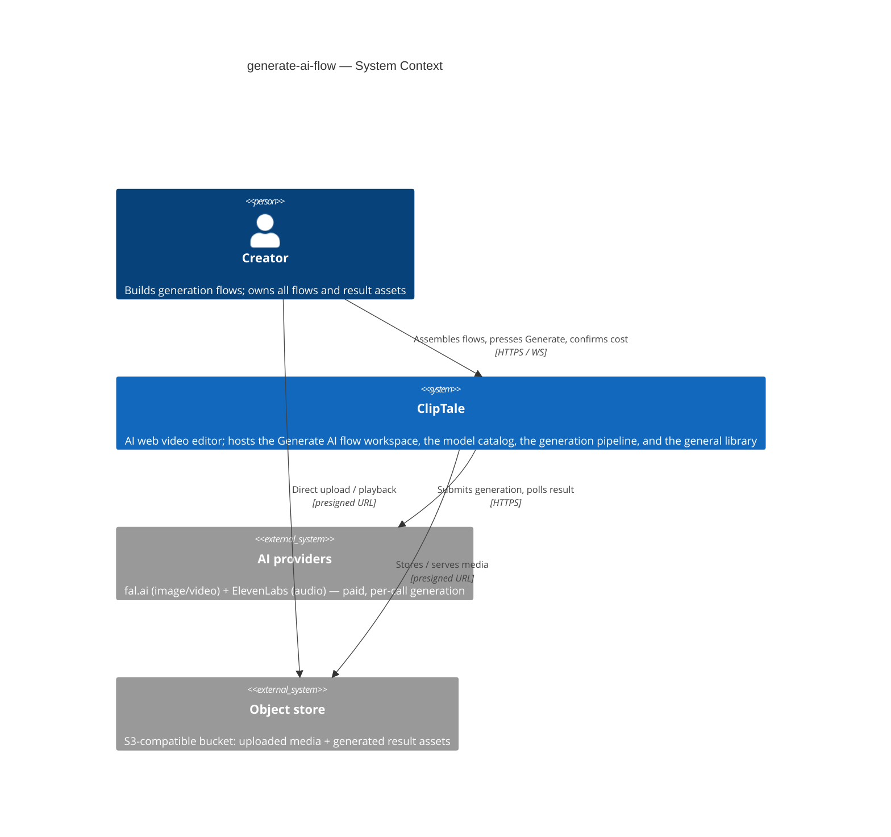
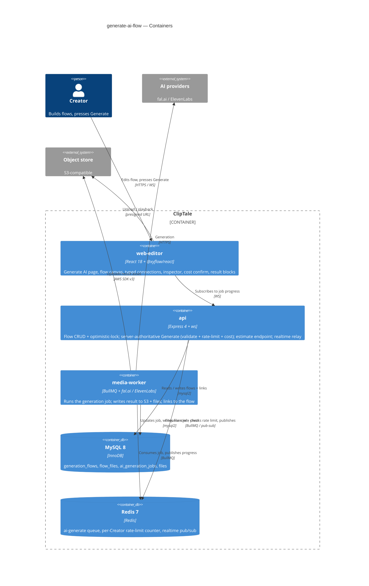

# Software Architecture Document — generate-ai-flow

<!-- 12 Arc42 sections. Empty section → N/A: reason. -->
<!-- C4 Context (L1) lives inline in §3. C4 Container (L2) lives inline in §5. -->
<!-- Numbers in §10 come VERBATIM from spec.md §6 NFR — no inventing, no rounding. -->

## 1. Introduction and goals

**Intent.** generate-ai-flow gives a Creator a dedicated, visual, node-based "Generate AI" workspace to freely combine the existing catalog of AI models across text, image, video, and audio. The Creator assembles content blocks and generation blocks on a flow canvas, draws **typed connections** that are blocked at connect-time when modalities don't match, presses **Generate** one block at a time after a cost confirmation, and every result is auto-saved as a reusable asset in the Creator's general library, linked back to the flow. It reuses — not replaces — the existing single-model generation experience (spec §1, §3).

**Top-3 quality goals (1-liners; full scenarios in §10):**

1. **Cost-safety / financial integrity** — no paid provider call is ever made without a satisfied-required-inputs check, a cost confirmation, and a server-side per-Creator rate limit; a result asset enters the library only on a successful generation (spec §2, §6.1, §6).
2. **Owner-scoped confidentiality** — every flow list/read/write/delete and every Generate action is filtered by the calling Creator's identity; a non-owner gets no access and no existence disclosure (spec §6.1, AC-04/AC-05).
3. **Durability across sessions and async** — a flow (blocks, connections, parameters, results) and an in-flight generation survive reload, tab-close, and conflicting concurrent saves with no lost work and no lost outcome (spec §5 AC-08b/AC-10/AC-10b).

*(Canvas responsiveness — open ≤1500 ms, connection feedback ≤100 ms — is a real NFR but secondary to the three above; it is carried as a quality scenario in §10.)*

**Stakeholders.**

| Role | Interest | Sign-off owner? |
|---|---|---|
| Creator | Builds and runs generation flows; owns all flows and result assets | No |
| Tech Lead | SAD approval; owns the cost/validation/persistence architecture | Yes |
| Security Lead | New owner-scoped resource + financial-abuse (uncapped paid generation) vector | Yes |
| Product / Business owner | Rate-limit / quota / refund policy (spec §8 open questions) | No |

<!-- Decision overrides (¶4) — populated by the critic resolution loop, empty otherwise. -->

## 2. Constraints

*(Fixed inputs inherited from `docs/architecture-map.md` @ `reflects_commit 9f943df` — the brownfield this feature extends. Pinned, not chosen.)*

**Technical.**
- **Language / runtime:** TypeScript 5.4+ (strict, ESM), Node ≥ 20; Turborepo + npm-workspaces monorepo (`apps/*`, `packages/*`).
- **API:** Express 4 + Helmet + CORS + express-rate-limit + Zod; `ws` WebSocket realtime.
- **Frontend:** React 18 + Vite 5 + React-Router v7 + TanStack Query 5 + Immer; custom external store + `useSyncExternalStore` (no Zustand/Redux). Node canvas via **`@xyflow/react`** (the storyboard editor is the precedent).
- **Datastores:** MySQL 8 / InnoDB via `mysql2` raw parameterized SQL (no ORM); Redis 7 (BullMQ queues + realtime pub/sub channel `cliptale:realtime:v1`); S3 (AWS SDK v3, presigned upload/read URLs).
- **Workers:** BullMQ 5; generation runs on the **existing `media-worker`** (fal.ai + ElevenLabs) — no new worker container.
- **Architecture convention:** `routes → controllers → services → repositories`; module singletons (`pool`, `redis`, `s3`, `config`) imported directly — **no DI container**.

**Organisational.**
- **Effort / deadline:** not fixed at design time; no hard external release deadline.
- **Team:** the existing ClipTale fullstack team (no new headcount assumed).
- **Size:** L (per `.size`) — 10–15 ADRs expected for the feature.

**Conventions.**
- Canonical: `docs/architecture-map.md` (generated) + `docs/architecture-rules.md` (authored).
- **IDs:** UUID v4 via `randomUUID()` (`node:crypto`), stored `CHAR(36)`, validated `z.string().uuid()`. (Not ULID — `general_idea.md`'s ULID note is aspirational and contradicts live code.)
- **Errors:** typed classes in `apps/api/src/lib/errors.ts` (`ValidationError` 400, `NotFoundError` 404, `UnauthorizedError` 401, `ForbiddenError` 403, `ConflictError`/`OptimisticLockError` 409, `UnprocessableEntityError` 422, `GoneError` 410); central handler maps `err.statusCode`.
- **Migrations:** numbered SQL `NNN_description.sql` in `apps/api/src/db/migrations/` (next after `045`); in-process runner, `IF NOT EXISTS`-guarded; soft-deletes via `deleted_at IS NULL`.
- **API contract:** OpenAPI hand-maintained in `packages/api-contracts/src/openapi.ts` — no codegen; update spec + impl in the same commit.
- **Model catalog:** `packages/api-contracts` — `AI_MODELS` (`FalModel | ElevenLabsModel`), `capability` + per-field `required`/`type`; a new model/capability extends these catalogs.
- **UI / styling:** plain inline `CSSProperties` in co-located `*.styles.ts` (no Tailwind/CSS-modules/styled-components); tokens per `docs/design-guide.md`.
- **Config:** `apps/*/src/config.ts` is the only place reading `process.env`; vars `APP_*`, Zod-validated.

**Regulatory / external.**
- **Data classification:** confidential — flows + results are private creative work; no new personal-data fields introduced (spec §6.1). **Security review required.**
- **Paid third-party providers** (fal.ai, ElevenLabs): every Generate is a spend-bearing call → a financial-abuse vector that must be capped server-side (spec §6.1 abuse cases), not in the UI alone.

## 3. Context and scope

The Generate AI flow is a new owner-scoped workspace inside the existing ClipTale web editor. A signed-in Creator assembles a node graph, presses Generate per block, and receives results into both the canvas and their general library. ClipTale itself talks to two external systems: paid **AI providers** (fal.ai for image/video, ElevenLabs for audio) and an **S3-compatible object store** for media blobs. The **trust boundary is the API**: every flow list/read/write/delete and every Generate is authenticated (JWT) and owner-filtered there — the browser is untrusted, and Creator-supplied text is passed to providers strictly as content, never interpreted as instructions to ClipTale (spec §6.1).

<!-- brownfield: extends ClipTale (TS monorepo) — reuses the `media-worker` ai-generate pipeline, the user-scoped `files` library, the `@xyflow/react` storyboard canvas family, and the Redis→ws realtime channel; adds a new owner-scoped Flow resource in `api` + a new `generate-ai-flow` web-editor feature. -->

**External systems (in / out):**

| Actor or system | Type | Interaction |
|---|---|---|
| Creator | Person | Builds flows, draws typed connections, presses Generate, confirms cost; owns all flows + result assets |
| AI providers (fal.ai, ElevenLabs) | System (external) | Receive a generation request and return media (paid, per-call); the spend-bearing dependency |
| Object store (S3) | System (external) | Stores uploaded source media + generated result assets; served via presigned URLs |
| Identity / JWT auth | System (internal, existing) | The same auth/ACL middleware gates every flow + Generate operation; not re-built here |

**C4 Context (L1):**



**In scope:** a new Generate AI page + flow CRUD; the flow canvas (blocks, typed connections, inspector); server-authoritative Generate (validation, cost gate, rate limit); result→library linkage; async progress + reattach. **Out of scope** (spec §3): replacing the single-model wizard, auto-DAG chain execution, new models/providers, real-time multi-Creator collaboration, multi-output per Generate.

## 4. Solution strategy

**Target surfaces.** `web-frontend` (a new `generate-ai-flow` feature module in the web-editor SPA) + `backend-service` (a new owner-scoped Flow resource + Generate endpoints in `api`) + reuse of the existing `worker` (generation runs on `media-worker` — no new container). A frontend-only design (persist via the browser, validate in the client) is **excluded by spec §6.1**: validation, the rate limit, and the cost gate must be server-authoritative, so a backend surface is mandatory. This is a forced choice with no legitimate alternative — recorded inline, not as an ADR. The web surface is an **SPA** (the web-editor already is one) and the canvas reuses **`@xyflow/react`** (the storyboard editor's library) rather than a bespoke canvas — consistency + a working precedent for typed connection validation, model-driven node types, and debounced autosave.

**Top strategic choices (the seeds for ADRs):**

1. **Reuse the existing generation rails, don't rebuild them** *(→ ADR-0001)* — a block's Generate runs through the existing `ai-generate` BullMQ job → `media-worker` (fal.ai/ElevenLabs) → S3 + the `files` library → the Redis→ws realtime channel. The job payload is extended with a flow linkage (`flow_id`/`block_id`); the submit/poll/download/ingest/progress machinery is untouched. This serves cost-safety (one audited spend path) and durability (the proven reattach-on-reopen flow), at the cost of coupling flow generation to the shared pipeline's shape.

2. **A Flow is a new owner-scoped, versioned canvas aggregate** *(→ ADR-0002, ADR-0003)* — a new soft-deletable `generation_flows` table owned per-Creator. The canvas (blocks + edges + positions + per-block params) is stored as **one JSON document column** (mirrors the storyboard autosave shape; cheap full-canvas reload) rather than relational block/edge rows. Concurrent saves (AC-10b) are guarded by an **optimistic version column** — a save carries its parent version, a mismatch is rejected with `OptimisticLockError` (409), the first save stays authoritative — the same idiom `projects` uses, deliberately diverging from the storyboard's blind-overwrite. Result→library links are kept relationally via a **`flow_files` pivot + `ai_generation_jobs.flow_id`** *(→ ADR-0007)*, mirroring `draft_files`: `ON DELETE CASCADE` on the flow, `RESTRICT` on the file, so deleting a flow drops the linkage but never the library asset (AC-19).

3. **Server-authoritative Generate (cost-safety)** *(→ ADR-0004, ADR-0005)* — every Generate re-validates all preconditions server-side before any provider call: required inputs resolved, alternative-exclusivity satisfied, content non-empty/valid, referenced library assets present, owner check (AC-02/03/05/06/17). Spend is capped by a **per-Creator Redis sliding-window rate limit** (≤ 30/min, spec §6) that scripting can't bypass — not IP middleware. Cost is surfaced by a **pre-flight estimate endpoint** backed by a **static per-model pricing table** (the catalog carries no pricing — spec §8 OQ); the Creator confirms the estimate before the paid call. The UI confirmation is advisory only.

4. **A typed, catalog-driven canvas** *(→ ADR-0006)* — input handles and connection compatibility derive from the model catalog's per-field modality. Because the catalog today carries neither explicit modality nor the alternative-exclusivity groups AC-06 needs (the XOR is hardcoded in API runtime), the **catalog schema is extended** with `modality` + `exclusiveGroup` metadata (materialized in `sdd:data-model`), making the rules data-driven so both the canvas (render + connect-time block, AC-02) and the API (Generate-time validation) read one source.

Each tactical decision in later sections traces to one of these four seeds. Tactical decisions that *contradict* a strategic choice are red flags surfaced in §11.

## 5. Building block view

**Style.** Layered on the backend (`routes → controllers → services → repositories`, module singletons, no DI — the repo convention) and a self-contained **feature module** on the frontend (`features/generate-ai-flow/` with `components/`, `hooks/`, `api.ts`, `types.ts`, modelled on generate-wizard). The Generate spend path is deliberately split from flow CRUD into its own service so the spend-bearing logic (validation + rate limit + cost gate) is isolated and independently testable for the security review.

**Internal decomposition:**

```
apps/api/src/
├── routes/generation-flows.routes.ts          # registered in index.ts after middleware
├── controllers/generation-flow.controller.ts  # Zod-validate, owner check, error mapping
├── services/
│   ├── generation-flow.service.ts             # CRUD, autosave, optimistic-version conflict (ADR-0003)
│   └── flow-generate.service.ts               # input resolution + validation + rate-limit + cost gate + enqueue (ADR-0004/0005)
├── repositories/
│   ├── generation-flow.repository.ts          # generation_flows (JSON canvas blob, ADR-0002)
│   └── flow-file.repository.ts                # flow_files pivot (ADR-0007)
├── lib/flow-pricing.ts                         # static per-model pricing table (ADR-0005)
└── db/migrations/
    ├── 046_generation_flows.sql                # owner-scoped, soft-delete, version column
    ├── 047_flow_files.sql                      # pivot: CASCADE on flow, RESTRICT on file
    └── 048_ai_jobs_flow_id.sql                 # nullable flow_id + block_id on ai_generation_jobs

apps/web-editor/src/features/generate-ai-flow/
├── components/  FlowListPage · FlowCanvas · {Content,Generation,Result}Node · Inspector · CostConfirmModal
├── hooks/       useFlowCanvas · useFlowAutosave (version-aware) · useFlowGeneration (reuses shared useJobPolling)
├── api.ts  types.ts
   (reuses shared/ai-generation + @xyflow/react; routes added in main.tsx → /generate-ai)

packages/api-contracts/   # catalog schema extension: modality + exclusiveGroup (ADR-0006); OpenAPI for flow + estimate + generate
packages/project-schema/  # flow-canvas Zod schema (ADR-0002) + extended ai-generate job payload (ADR-0001)
apps/media-worker/        # ai-generate handler extended to honor jobs.flow_id (ADR-0001/0007) — minimal change
```

**C4 Container (L2):**



## 6. Runtime view

<!-- pending Socratic walk -->

## 7. Deployment view

<!-- pending Socratic walk -->

## 8. Crosscutting concepts

<!-- pending Socratic walk -->

## 9. Architecture decisions

<!-- pending Socratic walk -->

## 10. Quality requirements

<!-- pending Socratic walk -->

## 11. Risks and technical debt

<!-- pending Socratic walk -->

## 12. Glossary

<!-- pending Socratic walk -->
