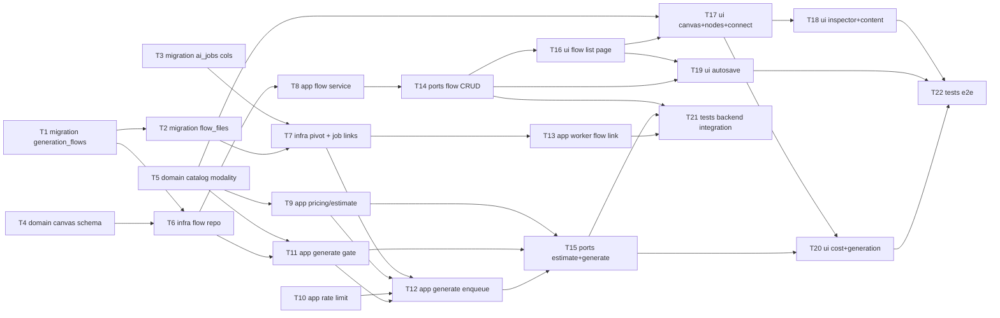

# Epic — generate-ai-flow

> **Spec:** [spec.md](../spec.md) · **Design:** [sad.md](../sad.md) · **Data model:** [data-model.md](../data-model.md) · **API:** [openapi.yaml](../contracts/openapi.yaml) · **ADRs:** [adr/](../adr/)

## Goal

Ship a dedicated, owner-scoped, node-based **"Generate AI"** workspace where a Creator combines the existing catalog of AI models across text/image/video/audio on a flow canvas, draws typed connections blocked at connect-time when modalities don't match, and presses **Generate** one block at a time behind a server-authoritative cost + rate-limit + validation gate (spec §2). Every result is auto-saved as a reusable asset in the Creator's general library, linked back to the flow, and the canvas + in-flight generations survive reload, tab-close, and concurrent saves.

## Scope

- **In:** new `generation_flows` + `flow_files` tables and `ai_generation_jobs` flow back-links (migration); flow-canvas + catalog schema (domain); flow + pivot repositories (infra); flow CRUD, cost-estimate, server-authoritative Generate (app); flow + generate controllers/routes (ports); the `generate-ai-flow` web-editor feature — list page, canvas, nodes, inspector, autosave, cost/generation (ui); the `media-worker` flow-link extension; backend integration + E2E (tests).
- **Out** (spec §3): replacing the single-model wizard or in-editor generation; auto-DAG chain execution; new models/providers; real-time multi-Creator collaboration; multi-output per Generate.

## Task map

**Parallel starts** (no deps): T1, T3, T4, T5, T10.

## Tasks

See [tracker.md](./tracker.md) for status. Machine contract: [tasks.json](../tasks.json).

| # | Task | Layer | Blocked by | DoD (short) |
|---|---|---|---|---|
| T1 | Stage migration 046 — generation_flows | migration | — | Promotes to live 046, applies + reverts cleanly; user-active-updated index present |
| T2 | Stage migration 047 — flow_files pivot | migration | T1 | CASCADE on flow / RESTRICT on file verified; applies + reverts |
| T3 | Stage migration 048 — ai_generation_jobs flow_id/block_id + index | migration | — | Nullable, no FK, idempotent ALTER; applies + reverts |
| T4 | Flow-canvas Zod schema + job-payload extension | domain | — | project-schema parses/round-trips FlowCanvas; payload carries flowId/blockId |
| T5 | Catalog modality + exclusiveGroup + backfill | domain | — | Every field gets modality; kling/o3 XOR → exclusiveGroup; unit tests pass |
| T6 | generation-flow.repository (CRUD + optimistic version) | infra | T1, T4 | Owner-scoped CRUD; stale-version save rejected, match increments |
| T7 | flow-file pivot repo + ai-job flow back-link methods | infra | T2, T3 | Link survives flow delete; per-flow job-state read works |
| T8 | generation-flow.service (CRUD, autosave, conflict) | app | T6 | Non-owner → NotFound; stale save → OptimisticLock; tests green |
| T9 | flow-pricing table + cost-estimate service | app | T5 | Best-effort Money estimate from canvas; known/unknown model handled |
| T10 | per-Creator Redis sliding-window rate limit | app | — | ≤30/min enforced server-side; over-cap → deny + retry-after |
| T11 | Generate validation gate | app | T6, T5 | Owner/input/exclusivity/content/asset checks → typed 422/404; all branches tested |
| T12 | Generate enqueue — job + link + idempotency | app | T7, T9, T10, T11 | Creates job (flow_id,block_id), enqueues, idempotent replay |
| T13 | media-worker honors flow_id (link/single/integrity) | app | T7 | Link only on success; first output kept; failed writes no asset |
| T14 | flow CRUD controller + routes + OpenAPI | ports | T8 | Six endpoints, owner check, 404/409; OpenAPI same commit |
| T15 | estimate + generate controllers + routes + OpenAPI | ports | T9, T11, T12 | 422/429/409 mapping; 429 sentinel added; Idempotency-Key required |
| T16 | FlowListPage + api.ts + /generate-ai route | ui | T14 | List + create/rename/delete/open; reachable at /generate-ai |
| T17 | FlowCanvas + nodes + typed-connect + reconciliation | ui | T5, T16 | Typed handles; incompatible drop refused; model change reconciles |
| T18 | Inspector + content input + params | ui | T17 | Text/upload/library-pick + optional params persist on blocks |
| T19 | useFlowAutosave (version-aware, 409) | ui | T16, T14 | Debounced save carries version; 409 → reload warning |
| T20 | CostConfirmModal + useFlowGeneration | ui | T17, T15 | Estimate→confirm→generate, progress, reattach, retry, dominant preview |
| T21 | Backend integration suite | tests | T14, T15, T13 | authz 404 / 409 / 429 / 422 branches / result-integrity recon green |
| T22 | E2E — full flow + restore + reattach + two-tab conflict | tests | T18, T19, T20 | Green in CI |

## Risks / Hard rules

- **Server-authoritative gate (spec §6.1, sad §8/§10 QG-1).** No paid provider call without the inputs/exclusivity/content/asset/owner check **and** the per-Creator rate limit **and** a confirmed cost. The UI confirmation is advisory only — T11/T12/T15 own this; T20 must not be the only gate.
- **Owner-scoping + existence hiding (AC-04/AC-05, QG-2).** Every flow op and Generate filters by `userId`; non-owner/absent → **404**, never 403. The AC-05 missing-asset message is shown only for a previously-owned asset.
- **Result integrity (spec §6, QG-1).** A library asset is written **iff** the generation succeeds — T13 must write none on failure/empty.
- **Single result per Generate (AC-14, spec §3).** Worker keeps the first output, discards extras.
- **No undo/redo / version snapshots in v1** (spec §8 resolved; sad §11 accepted debt) — autosave + the AC-10b 409 conflict only.
- **Latency targets (spec §6).** Open-flow p95 ≤1500 ms (T6 index), autosave ack ≤800 ms (T19), connect feedback ≤100 ms client-side (T17, no server round-trip).
- **Migrations are STAGED** under `docs/features/generate-ai-flow/migrations/` — `implement` promotes them to live `046/047/048`; do not write into the live tree from a task.
