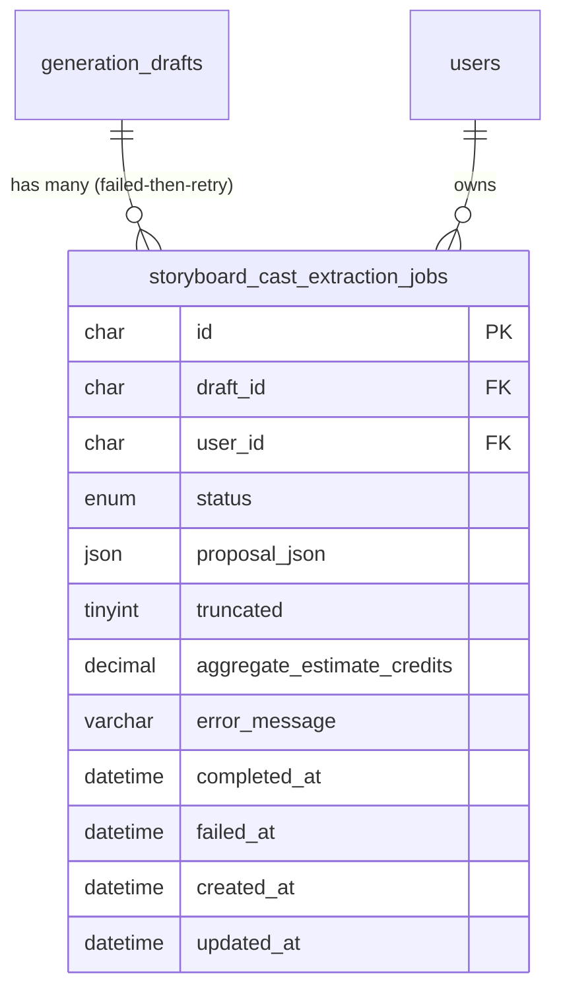

# Data model — reference-generation-autostart

> **Outcome (read this first):** this feature is **persistence-neutral** — it adds **no entity, no column, no index, and no migration**. The one backend change (ADR-0001: make `startExtraction` idempotent per draft) is a **read-then-conditional-insert in the service layer**, served by an index that **already exists** on the reused table `storyboard_cast_extraction_jobs`. The only typed-contract delta (`StartExtractionResult.status` literal → union) is a TypeScript change with no schema impact, carried into the `api` stage (ADR-0001 §Consequences). No staged migrations are produced.

## ER diagram

The feature reads and (idempotently) inserts rows in the **existing** `storyboard_cast_extraction_jobs` table (created in migration `052`, extended by `056`). Shown for traceability — **nothing in this diagram changes**.

## Entities

### `storyboard_cast_extraction_jobs` — **existing, unchanged**

Tracks the async cast-extraction job lifecycle and stores the AI-proposed cast JSON after completion. **Multiple rows per draft are allowed** (failed-then-retry) — this is why dedup is a *service-level "return the latest non-failed job"* rule (ADR-0001) and **not** a DB `UNIQUE(draft_id)` constraint (which the schema deliberately does not have). Source: `apps/api/src/db/migrations/052_create_storyboard_cast_extraction_jobs.sql` + `056_add_truncated_to_cast_extraction_jobs.sql`.

| Column | Type | Constraints | Notes |
|---|---|---|---|
| `id` | CHAR(36) | PK, app-generated UUID v4 | repo PK convention (CHAR(36) UUID) |
| `draft_id` | CHAR(36) | NOT NULL, FK → `generation_drafts(id)` ON DELETE CASCADE | dedup + latest-lookup key (indexed below) |
| `user_id` | CHAR(36) | NOT NULL, FK → `users(user_id)` ON DELETE CASCADE | owner-scope filter (indexed below) |
| `status` | ENUM(`queued`,`running`,`completed`,`failed`) | NOT NULL DEFAULT `queued` | ADR-0001: `queued`/`running`/`completed` = *existing* (returned); `failed` = not-existing (new start allowed) |
| `proposal_json` | JSON | NULL | AI-proposed cast; NULL while non-terminal / completed-empty |
| `truncated` | TINYINT(1) | NOT NULL DEFAULT 0 | added in `056`; proposal trimmed to cast size limit |
| `aggregate_estimate_credits` | DECIMAL(10,4) | NULL | cost estimate surfaced in the modal (Flow 3/4) |
| `error_message` | VARCHAR(512) | NULL | |
| `completed_at` | DATETIME(3) | NULL | |
| `failed_at` | DATETIME(3) | NULL | |
| `created_at` | DATETIME(3) | NOT NULL DEFAULT CURRENT_TIMESTAMP(3) | latest-lookup ordering key |
| `updated_at` | DATETIME(3) | NOT NULL DEFAULT CURRENT_TIMESTAMP(3) ON UPDATE CURRENT_TIMESTAMP(3) | |

**Aggregate root:** `generation_drafts` (the storyboard draft owns its extraction jobs).
**Access patterns (this feature):**
- *Idempotency / latest-extraction lookup* (sad §6 Flow 1/2/5; AC-01/AC-05/AC-07) → `findLatestCastExtractionJobForDraft`: `WHERE draft_id = ? AND user_id = ? ORDER BY created_at DESC, id DESC LIMIT 1` → **served by the existing `idx_storyboard_cast_extraction_draft_created`** (see Indexes).
- *Owner scope* → `user_id` residual filter; a draft belongs to one user, so `draft_id` is the selective predicate.
**Constraints:** PK on `id`; FKs to `generation_drafts(id)` and `users(user_id)` (both already FK-indexed). **No `UNIQUE(draft_id)`** — by design (retry rows + service-level dedup).

## Indexes

No new index is required — the one query this feature relies on is already covered. Listed for the self-check trail.

| Index | Columns | Query it serves | Status |
|---|---|---|---|
| `idx_storyboard_cast_extraction_draft_created` | `(draft_id, created_at DESC)` | Latest-extraction lookup for the idempotency guard + modal state (sad §6 Flow 1/2/5; AC-01/AC-05/AC-07; QG-3) | **Exists** (migration `052`) — no change |
| `idx_storyboard_cast_extraction_user` | `(user_id)` | FK index for `fk_storyboard_cast_extraction_user` | **Exists** (migration `052`) — no change |

> The sad §6 "persist hint for `data-model`" — *"the latest-extraction lookup keys on `draft_id` — index hint"* — is **already satisfied** by `idx_storyboard_cast_extraction_draft_created`. Adding a `draft_id`-only index would be a redundant "just in case" index (skill anti-pattern) since the composite leading column already serves `WHERE draft_id = ?`.

## Migrations

**None.** No `.up.sql` / `.down.sql` pairs are staged under `docs/features/reference-generation-autostart/migrations/` — there is nothing to migrate. The next live migration number would be `057` (the architecture-map's `000–045` count is stale; the live tree runs to `056`), but `implement` has no migration task to promote for this feature.

## Test fixtures

No new fixture factory is introduced. Tests for ADR-0001's idempotency guard reuse the existing cast-extraction job seam:
- The existing API integration-test path inserts `storyboard_cast_extraction_jobs` rows against the real MySQL (`singleFork: true`, never mocked — architecture-map §Tests). A duplicate-`startExtraction` test (QG-3) asserts the second call returns the existing row's `id` and that the row count for the draft stays at 1 — no new builder needed.
- PII guard: any seeded owner uses `user-<uuid>@example.test`.

## Drift check (field ↔ column)

`explorer` mapped the domain type `CastExtractionJob` (`apps/api/src/repositories/storyboardReference.repository.ts:20`) against the live DDL. **Zero drift** — every field has a column and vice-versa:

| Type field | Column | Verdict |
|---|---|---|
| `id` / `draftId` / `userId` | `id` / `draft_id` / `user_id` | ✓ |
| `status` | `status` | ✓ |
| `proposalJson` | `proposal_json` | ✓ |
| `truncated` | `truncated` | ✓ (added `056`) |
| `aggregateEstimateCredits` | `aggregate_estimate_credits` | ✓ |
| `errorMessage` / `completedAt` / `failedAt` | `error_message` / `completed_at` / `failed_at` | ✓ |
| `createdAt` / `updatedAt` | `created_at` / `updated_at` | ✓ |

No `_drift/` fix migrations needed.

## Self-check (4 mandatory)

1. **Naming matches repo convention** — N/A (no new object); existing names already follow `snake_case` + `idx_*` / `fk_*`.
2. **Down reversibility** — N/A (no `.up` emitted, so no `.down` required).
3. **FK indexes** — both FKs (`draft_id`, `user_id`) are already indexed; no new FK introduced.
4. **Convention adherence** — the no-`UNIQUE(draft_id)` + service-level dedup choice follows ADR-0001 and the existing "multiple rows per draft" design; no DB philosophy imposed.

**Next stage:** `api reference-generation-autostart` — reflect the `StartExtractionResult.status` literal → `queued | running | completed` union in the OpenAPI contract (ADR-0001 §Consequences), the one carried-forward delta.
