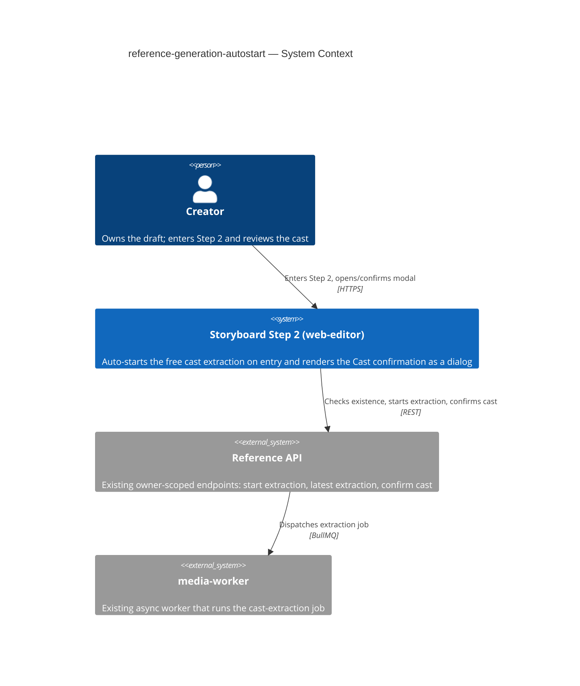
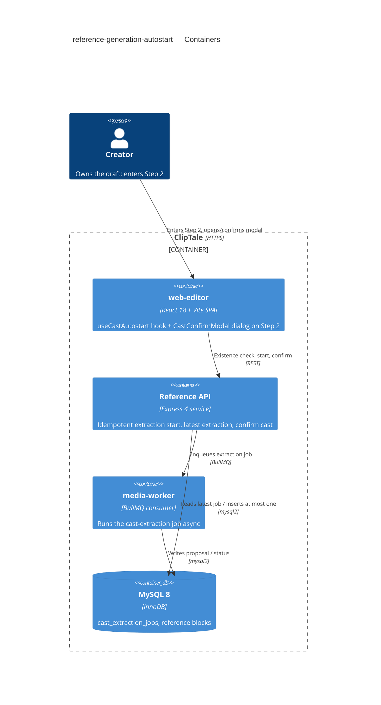

# Software Architecture Document — reference-generation-autostart

<!-- 12 Arc42 sections. Empty section → N/A: <one-line reason>. -->
<!-- C4 Context (L1) lives inline in §3. C4 Container (L2) lives inline in §5. -->
<!-- Numbers in §10 come VERBATIM from spec.md §6 NFR — no inventing, no rounding. -->

## 1. Introduction and goals

**Intent.** Remove the two friction points on a Creator's path into Step 2 (the Video Road Map): the manual "Start reference generation" click and the broken no-proposal surface. The feature (a) auto-starts the **free** cast extraction the first time a Creator enters Step 2 of a draft that has none yet — silently, once per draft, never duplicating — and (b) renders the Cast confirmation surface as a **proper modal** in every state. The single point of paid consent (the aggregate Cost confirmation) is preserved unchanged.

**Top-3 quality goals (1-liners; full scenarios in §10):**

1. **Auto-start latency** — extraction request issued ≤ 500 ms (p95) after page-ready, so the cast is already underway when the Creator opens the modal.
2. **Dialog correctness** — the Cast confirmation surface presents as a real centered dialog in *every* state; the stray-buttons defect can no longer occur.
3. **One-extraction-per-draft invariant** — repeated Step-2 entries never start a second extraction (zero duplicates).

**Stakeholders.**

| Role | Interest | Sign-off owner? |
|---|---|---|
| Creator | Enters Step 2; reference generation starts without a manual step; sees a real dialog | No |
| Tech Lead | SAD approval; owns the dedup-race resolution | Yes |
| Security Lead | Confirms no new authz boundary / PII (reuses owner-scoped free extraction) | No |

<!-- Decision overrides (¶4) — populated by the critic resolution loop and by reconciled §4 decisions. -->

**Decision overrides.**
- **Decision override: the feature touches the backend (one additive guard), not frontend-only** — rationale: the "0 duplicate extractions" NFR (spec §6) cannot be guaranteed by a client guard under multi-tab/multi-device concurrency; spec §1¶4 keys dedup on *persisted* state, so the invariant is enforced at the server (ADR-0001). This supersedes the initial frontend-only framing; proposal logic and endpoint signatures are unchanged. `target_surfaces` = `[web-frontend, backend-service]`.

## 2. Constraints

**Technical.**
- TypeScript 5.4+ (strict, ESM), Node ≥20.
- React 18 + Vite 5 + React-Router v7 + TanStack Query 5; project document via the custom external store + `useSyncExternalStore` (no Redux/Zustand).
- UI styling: plain inline `CSSProperties` in co-located `*.styles.ts` (no Tailwind / CSS-modules / styled-components).
- **Reuses the existing reference endpoints**, signatures unchanged: `POST /storyboards/:draftId/references/extract` (start free extraction), `GET /storyboards/:draftId/references/extraction` (latest extraction, `CastExtractionJob | null`), `POST /storyboards/:draftId/references/confirm` (confirm cast → paid first generation). Extraction runs async in `media-worker`.
- **One additive backend change** (ADR-0001): `startExtraction` becomes idempotent per draft (returns the existing job instead of creating a second). No request/response shape change, no proposal-logic change — see §1¶4 override.

**Organisational.**
- Effort budget: S (a few component-days, single squad).
- Owner: Oleksii (Storyboard squad). No external deadline beyond "before more flow is layered on Step 2".

**Conventions.**
- `docs/architecture-map.md` (current map) + `docs/architecture-rules.md` (authored rules).
- Feature-folder conventions of `apps/web-editor/src/features/storyboard/`: co-located `components/ + hooks/ + api.ts + types.ts`; server state via TanStack Query; per-component modal wrapper (no shared Modal primitive — see §8).
- IDs UUID v4; typed-error / owner-scoped access inherited from the existing reference API.

**Regulatory / external.**
- N/A — no new data category, no new PII, no new authz boundary. Auto-start runs inside the existing Creator-owns-draft context and touches only the free, non-charging extraction path (spec §6.1).

## 3. Context and scope

A Creator opens Step 2 (the Video Road Map) of their storyboard draft in the **web-editor** SPA. On entry the surface checks whether the draft already has a cast extraction and, finding none, silently asks the existing **Reference API** to start the free extraction, which the API dispatches as an async job to **media-worker**. The Creator later opens the Cast confirmation modal to review the proposal and (separately) confirm the paid first generation. The **trust boundary** is the existing owner-scoped check on the Reference API — only the draft owner can enter Step 2 and therefore trigger auto-start; this feature adds no new boundary and trusts no new input source.

<!-- brownfield: feature lives entirely in apps/web-editor/src/features/storyboard/ — StoryboardPage.tsx (Step-2 host), CastConfirmModal.tsx (renders bare divs today — the defect), api.ts (extract/extraction/confirm). Backend reference API + media-worker job shipped by storyboard-reference-flows / scene-generation-reference-gate, reused unchanged. -->

**External systems (in / out):**

| Actor or system | Type | Interaction |
|---|---|---|
| Creator | Person | Enters Step 2; opens/confirms the Cast confirmation modal; may use the manual control |
| Reference API | System (internal, existing) | Starts the free extraction, returns the latest extraction state, confirms the cast |
| media-worker | System (internal, existing) | Runs the cast-extraction job async; the API surfaces its result |

**C4 Context (L1):**



## 4. Solution strategy

**Top strategic choices (the seeds for ADRs):**

1. **Target surfaces — `web-frontend` (primary) + `backend-service` (additive guard).** The feature is overwhelmingly a web-editor change (when extraction starts; how the modal renders). It crosses into the backend only for the dedup guard in choice 3 — a small, additive idempotency check on the existing `startExtraction`, with **no change to proposal logic** (spec §3 non-goal preserved). The web-editor stays a React 18 SPA; no new state library, routing, or rendering model. Multi-surface here is the *consequence* of choice 3, so it carries no separate ADR — see ADR-0001.

2. **Auto-start via a dedicated `useCastAutostart(draftId)` hook, with TanStack Query as the single source of truth for extraction state.** Today extraction lives in `StoryboardPage` local state and is polled only while the modal is open — there is no entry-time existence check. The hook encapsulates the mount-time existence check, the conditional start, the in-flight guard, and the poll, exposing one query (`['cast-extraction', draftId]`) that both the auto-path and the manual control read. This unifies the manual and auto paths on one cache entry (so the manual control "surfaces the existing one" for free) and is testable in isolation. *Single-module, reversible — does not cross the blast-radius gate; recorded here, not as an ADR.*

3. **Dedup is enforced at the source of truth (server), with a client guard for traffic hygiene.** The spec requires *zero* second extractions per draft, and §1¶4 keys dedup on the draft's **persisted** state. The server's `startExtraction` is today **not** idempotent at the job level — it guards only against already-confirmed reference *blocks*, so two near-simultaneous starts (re-mount race, React 18 StrictMode double-effect, two tabs) would create two job rows. We make `startExtraction` **idempotent per draft** — return the existing queued/running/completed job instead of creating a second — so the invariant holds wherever the start arrives from; and keep a frontend in-flight guard so the common single-client re-mount never issues the redundant POST. This is the feature's one irreversible, multi-module decision → **ADR-0001**.

4. **Cast confirmation becomes a real dialog via a per-component backdrop+dialog wrapper, following the `SceneModal` precedent.** `CastConfirmModal` today returns bare `<div>`s in every branch (the no-proposal branch is the stray-buttons defect). We wrap it in the same inline-styled backdrop + centered dialog shell that `SceneModal`/`MusicBlockModal` use (`dialog` semantics, focus-on-mount, Esc-to-close), adding a distinct **completed-empty** state. This matches the repo convention "each modal owns its wrapper — no shared Modal primitive" (§8); extracting a shared primitive is deliberately out of scope for this S feature. *Convention-following — no ADR.*

Each tactical decision in later sections traces to one of these seeds. Tactical decisions that *contradict* a strategic choice are red flags — surfaced in §11.

## 5. Building block view

The web-editor follows the repo's **feature-folder** style (`features/<name>/` with co-located `components/ + hooks/ + api.ts + types.ts`; server state via TanStack Query; per-component modal wrappers). This feature adds no module — it extends `features/storyboard/`: one new hook owns the auto-start lifecycle, `CastConfirmModal` is refactored into a dialog, and `api.ts` is reused. The backend follows the existing layered chain (routes → controller → service → repository); only the extraction **service** gains the idempotency guard.

**Internal decomposition (changed / added files):**

```
apps/web-editor/src/features/storyboard/
├── components/
│   ├── StoryboardPage.tsx        # Step-2 host — mounts useCastAutostart, renders dialog (changed)
│   ├── CastConfirmModal.tsx      # backdrop+dialog wrapper; in-progress / proposal / completed-empty / failed (changed)
│   └── CastConfirmModal.styles.ts# backdrop + dialog shell styles, per SceneModal precedent (changed)
├── hooks/
│   └── useCastAutostart.ts       # NEW — mount existence-check + conditional start + in-flight guard + poll
└── api.ts                        # reused: startCastExtraction / getLatestCastExtraction / confirmCast

apps/api/src/services/
└── storyboardReference.extraction.service.ts  # startExtraction → idempotent per draft (ADR-0001)
```

**C4 Container (L2):**



The two declared `target_surfaces` map to the **web-editor** container (web-frontend) and the **Reference API** container (backend-service); `media-worker` and MySQL are existing infrastructure the flow depends on, unchanged.

## 6. Runtime view

<!-- drafting -->

## 7. Deployment view

<!-- drafting -->

## 8. Crosscutting concepts

<!-- drafting -->

## 9. Architecture decisions

<!-- drafting -->

## 10. Quality requirements

<!-- drafting -->

## 11. Risks and technical debt

<!-- drafting -->

## 12. Glossary

<!-- drafting -->
