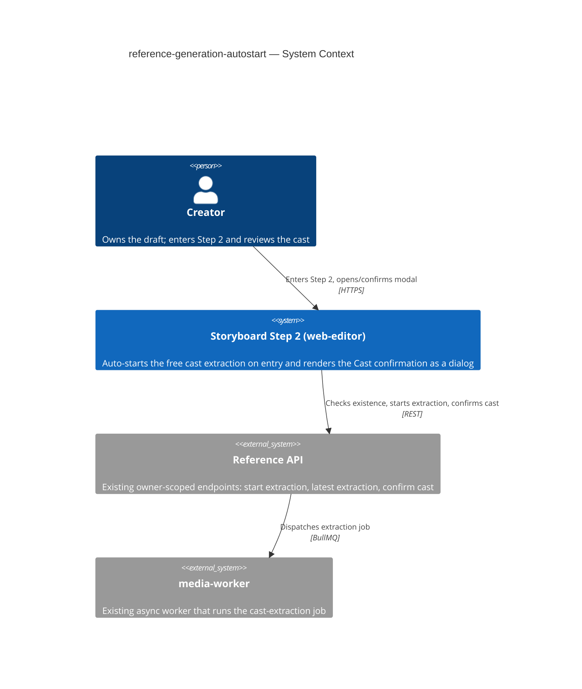
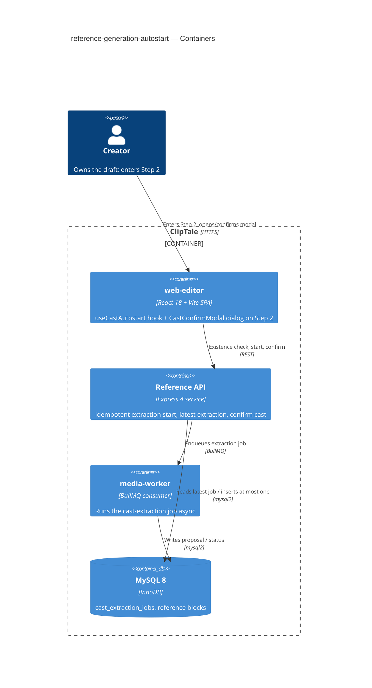
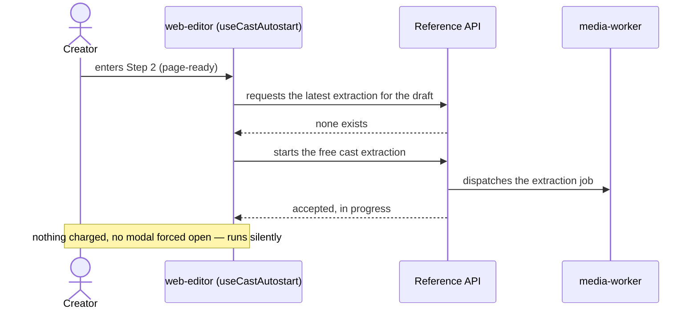
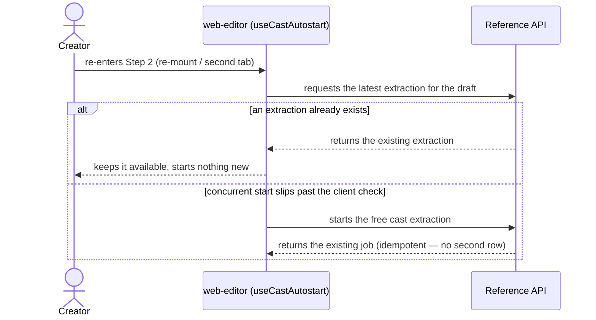

# Software Architecture Document — reference-generation-autostart

<!-- 12 Arc42 sections. Empty section → N/A: <one-line reason>. -->
<!-- C4 Context (L1) lives inline in §3. C4 Container (L2) lives inline in §5. -->
<!-- Numbers in §10 come VERBATIM from spec.md §6 NFR — no inventing, no rounding. -->

## 1. Introduction and goals

**Intent.** Remove the two friction points on a Creator's path into Step 2 (the Video Road Map): the manual "Start reference generation" click and the broken no-proposal surface. The feature (a) auto-starts the **free** cast extraction the first time a Creator enters Step 2 of a draft that has none yet — silently, once per draft, never duplicating — and (b) renders the Cast confirmation surface as a **proper modal** in every state. The single point of paid consent (the aggregate Cost confirmation) is preserved unchanged.

**Top-3 quality goals (1-liners; full scenarios in §10):**

1. **Auto-start latency** — extraction request issued ≤ 500 ms (p95) after page-ready, so the cast is already underway when the Creator opens the modal.
2. **Dialog correctness** — the Cast confirmation surface presents as a real centered dialog in *every* state; the stray-buttons defect can no longer occur.
3. **One-extraction-per-draft invariant** — repeated Step-2 entries never start a second extraction (zero duplicates).

**Stakeholders.**

| Role | Interest | Sign-off owner? |
|---|---|---|
| Creator | Enters Step 2; reference generation starts without a manual step; sees a real dialog | No |
| Tech Lead | SAD approval; owns the dedup-race resolution | Yes |
| Security Lead | Confirms no new authz boundary / PII (reuses owner-scoped free extraction) | No |

<!-- Decision overrides (¶4) — populated by the critic resolution loop and by reconciled §4 decisions. -->

**Decision overrides.**
- **Decision override: the feature touches the backend (one additive guard), not frontend-only** — rationale: the "0 duplicate extractions" NFR (spec §6) cannot be guaranteed by a client guard under multi-tab/multi-device concurrency; spec §1¶4 keys dedup on *persisted* state, so the invariant is enforced at the server (ADR-0001). This supersedes the initial frontend-only framing; proposal logic and endpoint signatures are unchanged. `target_surfaces` = `[web-frontend, backend-service]`.

## 2. Constraints

**Technical.**
- TypeScript 5.4+ (strict, ESM), Node ≥20.
- React 18 + Vite 5 + React-Router v7 + TanStack Query 5; project document via the custom external store + `useSyncExternalStore` (no Redux/Zustand).
- UI styling: plain inline `CSSProperties` in co-located `*.styles.ts` (no Tailwind / CSS-modules / styled-components).
- **Reuses the existing reference endpoints**, signatures unchanged: `POST /storyboards/:draftId/references/extract` (start free extraction), `GET /storyboards/:draftId/references/extraction` (latest extraction, `CastExtractionJob | null`), `POST /storyboards/:draftId/references/confirm` (confirm cast → paid first generation). Extraction runs async in `media-worker`.
- **One additive backend change** (ADR-0001): `startExtraction` becomes idempotent per draft (returns the existing job instead of creating a second). No new request field and no proposal-logic change; the one shape delta is that `StartExtractionResult.status` widens from the literal `'queued'` to the `queued | running | completed` union (so an already-running/completed job can be returned) — carried into the `api` stage. See §1¶4 override.

**Organisational.**
- Effort budget: S (a few component-days, single squad).
- Owner: Oleksii (Storyboard squad). No external deadline beyond "before more flow is layered on Step 2".

**Conventions.**
- `docs/architecture-map.md` (current map) + `docs/architecture-rules.md` (authored rules).
- Feature-folder conventions of `apps/web-editor/src/features/storyboard/`: co-located `components/ + hooks/ + api.ts + types.ts`; server state via TanStack Query; per-component modal wrapper (no shared Modal primitive — see §8).
- IDs UUID v4; typed-error / owner-scoped access inherited from the existing reference API.

**Regulatory / external.**
- N/A — no new data category, no new PII, no new authz boundary. Auto-start runs inside the existing Creator-owns-draft context and touches only the free, non-charging extraction path (spec §6.1).

## 3. Context and scope

A Creator opens Step 2 (the Video Road Map) of their storyboard draft in the **web-editor** SPA. On entry the surface checks whether the draft already has a cast extraction and, finding none, silently asks the existing **Reference API** to start the free extraction, which the API dispatches as an async job to **media-worker**. The Creator later opens the Cast confirmation modal to review the proposal and (separately) confirm the paid first generation. The **trust boundary** is the existing owner-scoped check on the Reference API — only the draft owner can enter Step 2 and therefore trigger auto-start; this feature adds no new boundary and trusts no new input source.

<!-- brownfield: feature lives entirely in apps/web-editor/src/features/storyboard/ — StoryboardPage.tsx (Step-2 host), CastConfirmModal.tsx (renders bare divs today — the defect), api.ts (extract/extraction/confirm). Backend reference API + media-worker job shipped by storyboard-reference-flows / scene-generation-reference-gate, reused unchanged. -->

**External systems (in / out):**

| Actor or system | Type | Interaction |
|---|---|---|
| Creator | Person | Enters Step 2; opens/confirms the Cast confirmation modal; may use the manual control |
| Reference API | System (internal, existing) | Starts the free extraction, returns the latest extraction state, confirms the cast |
| media-worker | System (internal, existing) | Runs the cast-extraction job async; the API surfaces its result |

**C4 Context (L1):**



## 4. Solution strategy

**Top strategic choices (the seeds for ADRs):**

1. **Target surfaces — `web-frontend` (primary) + `backend-service` (additive guard).** The feature is overwhelmingly a web-editor change (when extraction starts; how the modal renders). It crosses into the backend only for the dedup guard in choice 3 — a small, additive idempotency check on the existing `startExtraction`, with **no change to proposal logic** (spec §3 non-goal preserved). The web-editor stays a React 18 SPA; no new state library, routing, or rendering model. Multi-surface here is the *consequence* of choice 3, so it carries no separate ADR — see ADR-0001.

2. **Auto-start via a dedicated `useCastAutostart(draftId)` hook, with TanStack Query as the single source of truth for extraction state.** Today extraction lives in `StoryboardPage` local state and is polled only while the modal is open — there is no entry-time existence check. The hook encapsulates the mount-time existence check, the conditional start, the in-flight guard, and the poll, exposing one query (`['cast-extraction', draftId]`) that both the auto-path and the manual control read. This unifies the manual and auto paths on one cache entry (so the manual control "surfaces the existing one" for free) and is testable in isolation. *Single-module, reversible — does not cross the blast-radius gate; recorded here, not as an ADR.*

3. **Dedup is enforced at the source of truth (server), with a client guard for traffic hygiene.** The spec requires *zero* second extractions per draft, and §1¶4 keys dedup on the draft's **persisted** state. The server's `startExtraction` is today **not** idempotent at the job level — it guards only against already-confirmed reference *blocks*, so two near-simultaneous starts (re-mount race, React 18 StrictMode double-effect, two tabs) would create two job rows. We make `startExtraction` **idempotent per draft** — return the existing queued/running/completed job instead of creating a second — so the invariant holds wherever the start arrives from; and keep a frontend in-flight guard so the common single-client re-mount never issues the redundant POST. This is the feature's one irreversible, multi-module decision → **ADR-0001**.

4. **Cast confirmation becomes a real dialog via a per-component backdrop+dialog wrapper, following the `SceneModal` precedent.** `CastConfirmModal` today returns bare `<div>`s in every branch (the no-proposal branch is the stray-buttons defect). We wrap it in the same inline-styled backdrop + centered dialog shell that `SceneModal`/`MusicBlockModal` use (`dialog` semantics, focus-on-mount, Esc-to-close), adding a distinct **completed-empty** state. This matches the repo convention "each modal owns its wrapper — no shared Modal primitive" (§8); extracting a shared primitive is deliberately out of scope for this S feature. *Convention-following — no ADR.*

Each tactical decision in later sections traces to one of these seeds. Tactical decisions that *contradict* a strategic choice are red flags — surfaced in §11.

## 5. Building block view

The web-editor follows the repo's **feature-folder** style (`features/<name>/` with co-located `components/ + hooks/ + api.ts + types.ts`; server state via TanStack Query; per-component modal wrappers). This feature adds no module — it extends `features/storyboard/`: one new hook owns the auto-start lifecycle, `CastConfirmModal` is refactored into a dialog, and `api.ts` is reused. The backend follows the existing layered chain (routes → controller → service → repository); only the extraction **service** gains the idempotency guard.

**Internal decomposition (changed / added files):**

```
apps/web-editor/src/features/storyboard/
├── components/
│   ├── StoryboardPage.tsx        # Step-2 host — mounts useCastAutostart, renders dialog (changed)
│   ├── CastConfirmModal.tsx      # backdrop+dialog wrapper; in-progress / proposal / completed-empty / failed (changed)
│   └── CastConfirmModal.styles.ts# backdrop + dialog shell styles, per SceneModal precedent (changed)
├── hooks/
│   └── useCastAutostart.ts       # NEW — mount existence-check + conditional start + in-flight guard + poll
└── api.ts                        # reused: startCastExtraction / getLatestCastExtraction / confirmCast

apps/api/src/services/
└── storyboardReference.extraction.service.ts  # startExtraction → idempotent per draft (ADR-0001)
```

**C4 Container (L2):**



The two declared `target_surfaces` map to the **web-editor** container (web-frontend) and the **Reference API** container (backend-service); `media-worker` and MySQL are existing infrastructure the flow depends on, unchanged.

## 6. Runtime view

Seeded flows below; the `sequences` stage covers every §5 AC (no cap). Participants are the §5 containers; messages are semantic (endpoint-level detail arrives in the `api` stage).

**Critical flow 1: Step-2 entry auto-start (happy path, AC-01)**



**Critical flow 2: re-entry / concurrent start — no duplicate (AC-05, NFR "0 duplicates")**



**Critical flow 3: open the Cast confirmation modal — state-driven (AC-02, AC-03, AC-06)**

```mermaid
sequenceDiagram
    actor Creator
    participant Web as web-editor (CastConfirmModal)
    participant API as Reference API
    Note over Creator,Web: precondition — an extraction exists (auto-started or manual); modal currently closed
    Creator->>Web: opens the Cast confirmation modal
    Web->>Web: renders backdrop + centered dialog (never loose inline buttons)
    Web->>API: requests the latest extraction for the draft
    alt extraction still running
        API-->>Web: status in-progress, no proposal yet
        Web-->>Creator: shows "cast is being prepared", offers no confirm action
    else completed with a proposed cast
        API-->>Web: returns the proposal + aggregate cost estimate
        Web-->>Creator: shows the proposal + cost, enables the confirm action
    else completed but empty
        API-->>Web: status completed, empty proposal
        Web-->>Creator: shows "nothing to generate references for", close only
    end
    Note over Creator,Web: dialog wrapper identical in every state — stray-buttons defect impossible
```

**Critical flow 4: confirm cost → paid first generation (AC-04)**

```mermaid
sequenceDiagram
    actor Creator
    participant Web as web-editor (CastConfirmModal)
    participant API as Reference API
    participant Worker as media-worker
    participant DB as MySQL
    Note over Creator,Web: precondition — extraction completed with a proposed cast + aggregate cost; nothing charged yet
    Creator->>Web: reviews the proposal, clicks confirm cost
    Web->>API: confirms the cost for the proposed cast
    alt cost confirmed
        API->>DB: records the cost confirmation
        Note over API,DB: persists cost-confirmation; credit charge inherited unchanged
        API->>Worker: dispatches the paid first reference generation
        API-->>Web: accepted, paid generation started
        Web-->>Creator: shows generation underway
    else Creator dismisses without confirming
        Web-->>Creator: closes the modal — no charge, no paid generation
    end
    Note over Creator,API: credits spent only after an explicit confirm — the single consent gate
```

**Critical flow 5: manual recovery after a failed auto-start (AC-07)**

```mermaid
sequenceDiagram
    actor Creator
    participant Web as web-editor (useCastAutostart)
    participant API as Reference API
    participant Worker as media-worker
    Note over Creator,Web: precondition — auto-start never created an extraction (request was never accepted); no credits charged
    Creator->>Web: clicks "Start reference generation"
    Web->>API: starts the free cast extraction (idempotent per draft)
    alt no extraction exists yet
        API->>Worker: dispatches the extraction job
        API-->>Web: accepted, in progress
    else an extraction already exists
        API-->>Web: returns the existing extraction (no second row)
    end
    Web-->>Creator: opens the Cast confirmation modal
    Note over Creator,Web: the manual control always opens the modal; no charge for the failed attempt
```

**Flagged for downstream stages (flag only — no auto-ADR):**
- **Async dead-letter is feature-level, not queue-level.** The extraction job's *internal* retry/dead-letter behaviour is inherited unchanged (proposal logic is a non-goal). The spec's only async-failure case — "request was never accepted" — is recovered by Flow 5 (manual control), not a queue dead-letter branch; no new worker flow was drawn (owner choice, this stage).
- **Idempotent-start guard already has its ADR.** Flows 2 and 5 show the per-draft idempotent start; this is **ADR-0001** (§9), not a new decision.
- **No new participants.** Every participant (Creator, web-editor, Reference API, media-worker, MySQL) is already declared in the §5 C4Container — nothing for `design` to reconcile.
- **Persist hint for `data-model`.** Only Flow 4 mutates (`persists cost-confirmation`); all other flows read the latest extraction. The dedup invariant (AC-05) implies the latest-extraction lookup keys on `draft_id` — index hint for `data-model`.

## 7. Deployment view

<!-- N/A: reuses the existing web-editor, Reference API, and media-worker deployment units. ADR-0001 is a code change to an existing service, not an infra change — no new replica, queue, or topology. -->

## 8. Crosscutting concepts

| Concept | Convention | Where defined |
|---|---|---|
| Authentication / AuthZ | Inherited owner-scoped check on the Reference API (`resolveDraftOwner`); only the draft owner enters Step 2, so only they auto-start. No new boundary. | existing api service · spec §6.1 |
| Error handling | Typed server errors (`CastAlreadyExtractedError` 409, etc.) unchanged. Client: a **failed auto-start** (request never accepted) is swallowed silently — no toast — and recovered only via the manual control (spec §1¶4, AC-07). | `apps/api/src/lib/errors.ts` · here |
| Dedup / idempotency | Server is the source of truth: `startExtraction` returns the existing queued/running/completed job rather than creating a second (ADR-0001). Client `useCastAutostart` adds an in-flight guard so a re-mounting client never issues the redundant request. `failed` = not existing (a new start is allowed). | ADR-0001 · §4 choice 3 |
| State / data fetching | Extraction state is a single TanStack Query entry `['cast-extraction', draftId]`; the manual control and auto-start both read/refresh it. Project doc stays in the custom external store (untouched). | §4 choice 2 · architecture-map §Frontend |
| Polling | While the extraction is non-terminal (`queued`/`running`), the hook polls on the existing 3 s interval; stops on `completed`/`failed`. | existing `StoryboardPage` pattern, moved into the hook |
| Modal / dialog | Per-component backdrop + centered dialog wrapper with `dialog` semantics, focus-on-mount, Esc-to-close — following `SceneModal`. No shared Modal primitive (repo convention: each modal owns its wrapper). | `SceneModal.styles.ts` precedent · §4 choice 4 |
| Idempotent no-op UX | Auto-start never forces the modal open and never charges; an empty proposal is a **completed-empty** modal state ("nothing to generate references for"), not an error. | spec §1¶4, AC-03/AC-06 |

## 9. Architecture decisions

| # | Title | Status | Section |
|---|---|---|---|
| 0001 | Make cast-extraction start idempotent per draft (return the existing job) | Accepted | §4 |

ADR files live under `docs/features/reference-generation-autostart/adr/NNNN-<title>.md`.

## 10. Quality requirements

**QG-1. Auto-start latency**
- **When:** Step-2 page-ready — the page is mounted AND the draft + cast-extraction-existence check has resolved (the existence check is inside this budget).
- **Then:** the extraction request is issued ≤ 500 ms (p95) from page-ready.
- **How verify:** front-end timing metric / RUM (spec §6 NFR row 1).

**QG-2. Dialog correctness**
- **When:** the Cast confirmation modal is shown in any state (pre-proposal, running, proposal-ready, completed-empty, failed).
- **Then:** it presents as a proper centered dialog with a backdrop and **0 stray-buttons-defect occurrences** in any state; first paint ≤ 150 ms (p95) after open.
- **How verify:** UI regression test + visual review (stray-buttons row); front-end render metric (modal-first-paint row) — spec §6 NFR rows 2 & 4.

**QG-3. One-extraction-per-draft invariant**
- **When:** a Creator makes repeated Step-2 entries (including re-mount / re-focus / concurrent tabs) on the same draft.
- **Then:** **0 second-extractions per draft**.
- **How verify:** extraction-job audit count per draft (spec §6 NFR row 3); integration test asserting `startExtraction` returns the existing job under a duplicate call (ADR-0001).

## 11. Risks and technical debt

| Risk / debt | Severity | Mitigation | Owner |
|---|---|---|---|
| Re-mount / concurrent-tab race before the first extraction persists could create a duplicate | Low | Closed by ADR-0001 (server idempotent start) + client in-flight guard; verified by QG-3 integration test | Tech Lead |
| Extra existence-check GET on every Step-2 entry adds latency / traffic | Low | Inside the 500 ms budget (QG-1); TanStack Query caches the entry so re-mounts within stale-time reuse it | Storyboard squad |
| Open architectural decision: auto-retry a failed auto-start before manual fallback | Open question | Resolve before `sdd:tasks`; default = no auto-retry, recover via the manual control (spec OQ-1) | Oleksii (Storyboard squad) |
| Open architectural decision: auto-open the modal once the proposal is ready | Open question | Resolve before `sdd:tasks`; default = stay closed, background extraction (spec OQ-2) | PM |
| Open architectural decision: behaviour on a draft that already has *confirmed* reference blocks | Open question | Resolve before `sdd:tasks`; default = strict no-op once any extraction/blocks exist (spec OQ-3, `CastAlreadyExtractedError`) | Tech Lead |

**Accepted debt (acceptable in v1, plan to fix later):**
- No shared `<Modal>` primitive — the backdrop+dialog wrapper is duplicated across `SceneModal`, `MusicBlockModal`, and now `CastConfirmModal`. Acceptable per the current repo convention; a future extraction to `shared/components/` is the migration trigger when a 4th modal appears.

## 12. Glossary

| Term | Meaning |
|---|---|
| Reference-generation auto-start | Starting the free cast extraction automatically and silently on the first Step-2 entry for a draft that has none; once per draft, no-op when one exists, never charges or forces a modal open. |
| Auto-start (per-entry) | "Entry" = each Step-2 open/re-mount/re-focus; auto-start re-checks the draft's **persisted** extraction state each time and fires only when none exists. |
| Failed auto-start | An auto-start whose start request was **never accepted** (no extraction created). A created-but-errored extraction counts as *existing* (no-op), not failed — only the never-started case is recovered via the manual control. |
| Idempotent start | `startExtraction` returns the existing queued/running/completed job for the draft instead of creating a second (ADR-0001); `failed` is treated as not-existing so a new start is allowed. |
| In-flight guard | A client-side per-draft guard in `useCastAutostart` that suppresses the redundant start request during a re-mount (a latency/traffic optimization, not the correctness mechanism). |
| Completed-empty state | The Cast confirmation modal state when extraction finished proposing no characters/environments — a "nothing to generate references for" surface with a close action and no confirm; counts as *ready*, not in-progress. |
| Stray-buttons defect | The removed defect: the no-proposal state rendered two unstyled buttons inline at the page bottom instead of a dialog. |
