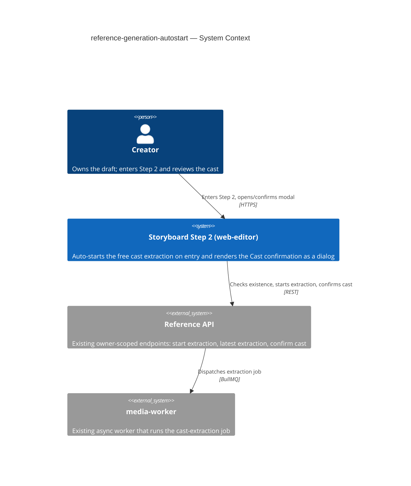

# Software Architecture Document — reference-generation-autostart

<!-- 12 Arc42 sections. Empty section → N/A: <one-line reason>. -->
<!-- C4 Context (L1) lives inline in §3. C4 Container (L2) lives inline in §5. -->
<!-- Numbers in §10 come VERBATIM from spec.md §6 NFR — no inventing, no rounding. -->

## 1. Introduction and goals

**Intent.** Remove the two friction points on a Creator's path into Step 2 (the Video Road Map): the manual "Start reference generation" click and the broken no-proposal surface. The feature (a) auto-starts the **free** cast extraction the first time a Creator enters Step 2 of a draft that has none yet — silently, once per draft, never duplicating — and (b) renders the Cast confirmation surface as a **proper modal** in every state. The single point of paid consent (the aggregate Cost confirmation) is preserved unchanged.

**Top-3 quality goals (1-liners; full scenarios in §10):**

1. **Auto-start latency** — extraction request issued ≤ 500 ms (p95) after page-ready, so the cast is already underway when the Creator opens the modal.
2. **Dialog correctness** — the Cast confirmation surface presents as a real centered dialog in *every* state; the stray-buttons defect can no longer occur.
3. **One-extraction-per-draft invariant** — repeated Step-2 entries never start a second extraction (zero duplicates).

**Stakeholders.**

| Role | Interest | Sign-off owner? |
|---|---|---|
| Creator | Enters Step 2; reference generation starts without a manual step; sees a real dialog | No |
| Tech Lead | SAD approval; owns the dedup-race resolution | Yes |
| Security Lead | Confirms no new authz boundary / PII (reuses owner-scoped free extraction) | No |

<!-- Decision overrides (¶4) — populated by the critic resolution loop, empty otherwise. -->

## 2. Constraints

**Technical.**
- TypeScript 5.4+ (strict, ESM), Node ≥20.
- React 18 + Vite 5 + React-Router v7 + TanStack Query 5; project document via the custom external store + `useSyncExternalStore` (no Redux/Zustand).
- UI styling: plain inline `CSSProperties` in co-located `*.styles.ts` (no Tailwind / CSS-modules / styled-components).
- **No backend change.** Reuses the existing reference endpoints unchanged: `POST /storyboards/:draftId/references/extract` (start free extraction), `GET /storyboards/:draftId/references/extraction` (latest extraction, `CastExtractionJob | null`), `POST /storyboards/:draftId/references/confirm` (confirm cast → paid first generation). Extraction runs async in `media-worker`.

**Organisational.**
- Effort budget: S (a few component-days, single squad).
- Owner: Oleksii (Storyboard squad). No external deadline beyond "before more flow is layered on Step 2".

**Conventions.**
- `docs/architecture-map.md` (current map) + `docs/architecture-rules.md` (authored rules).
- Feature-folder conventions of `apps/web-editor/src/features/storyboard/`: co-located `components/ + hooks/ + api.ts + types.ts`; server state via TanStack Query; per-component modal wrapper (no shared Modal primitive — see §8).
- IDs UUID v4; typed-error / owner-scoped access inherited from the existing reference API.

**Regulatory / external.**
- N/A — no new data category, no new PII, no new authz boundary. Auto-start runs inside the existing Creator-owns-draft context and touches only the free, non-charging extraction path (spec §6.1).

## 3. Context and scope

A Creator opens Step 2 (the Video Road Map) of their storyboard draft in the **web-editor** SPA. On entry the surface checks whether the draft already has a cast extraction and, finding none, silently asks the existing **Reference API** to start the free extraction, which the API dispatches as an async job to **media-worker**. The Creator later opens the Cast confirmation modal to review the proposal and (separately) confirm the paid first generation. The **trust boundary** is the existing owner-scoped check on the Reference API — only the draft owner can enter Step 2 and therefore trigger auto-start; this feature adds no new boundary and trusts no new input source.

<!-- brownfield: feature lives entirely in apps/web-editor/src/features/storyboard/ — StoryboardPage.tsx (Step-2 host), CastConfirmModal.tsx (renders bare divs today — the defect), api.ts (extract/extraction/confirm). Backend reference API + media-worker job shipped by storyboard-reference-flows / scene-generation-reference-gate, reused unchanged. -->

**External systems (in / out):**

| Actor or system | Type | Interaction |
|---|---|---|
| Creator | Person | Enters Step 2; opens/confirms the Cast confirmation modal; may use the manual control |
| Reference API | System (internal, existing) | Starts the free extraction, returns the latest extraction state, confirms the cast |
| media-worker | System (internal, existing) | Runs the cast-extraction job async; the API surfaces its result |

**C4 Context (L1):**

## 4. Solution strategy

<!-- drafting -->

## 5. Building block view

<!-- drafting -->

## 6. Runtime view

<!-- drafting -->

## 7. Deployment view

<!-- drafting -->

## 8. Crosscutting concepts

<!-- drafting -->

## 9. Architecture decisions

<!-- drafting -->

## 10. Quality requirements

<!-- drafting -->

## 11. Risks and technical debt

<!-- drafting -->

## 12. Glossary

<!-- drafting -->
