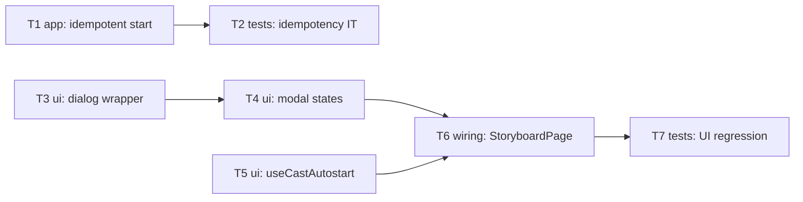

# Epic — reference-generation-autostart

> **Spec:** [spec.md](../spec.md) · **Design:** [sad.md](../sad.md) · **Data model:** [data-model.md](../data-model.md) · **API:** [openapi.yaml](../contracts/openapi.yaml) · **ADRs:** [adr/](../adr/)

## Goal

Remove the two friction points on a Creator's path into Step 2 (the Video Road Map): the manual "Start reference generation" click and the broken no-proposal surface. We (a) auto-start the **free** cast extraction the first time a Creator enters Step 2 of a draft that has none yet — silently, once per draft, never duplicating — and (b) render the Cast confirmation surface as a **proper dialog** in every state. The single point of paid consent (the aggregate Cost confirmation) is preserved unchanged (spec §2 Goals).

## Scope

- **In:** one additive backend guard — `startExtraction` becomes idempotent per draft (ADR-0001); the new `useCastAutostart` hook (existence-check + silent conditional start + in-flight guard + poll); the `CastConfirmModal` refactor into a backdrop+dialog with in-progress / proposal-ready / completed-empty states; wiring both into `StoryboardPage`.
- **Out** (spec §3): cast-extraction proposal logic / what it reads from Step 1; the Cost-confirmation amount, credit accounting, paid first-generation flow; the downstream Reference-done gate; any auto-confirm / auto-pay; a shared `<Modal>` primitive (accepted debt, sad §11).

## Task map

## Tasks

See [tracker.md](./tracker.md) for status. Machine contract: [tasks.json](../tasks.json).

| # | Task | Layer | Blocked by | DoD (short) |
|---|---|---|---|---|
| T1 | Make `startExtraction` idempotent per draft + widen status union | app | — | duplicate start returns the existing job, no second row; `failed` latest → fresh `queued` |
| T2 | Backend integration test — idempotent start (QG-3) | tests | T1 | duplicate-call test asserts same `jobId` + row count stays 1 |
| T3 | Refactor `CastConfirmModal` into a backdrop+dialog wrapper (every state) | ui | — | 0 stray-buttons; `role="dialog"`, focus-on-mount, Esc-to-close in all states |
| T4 | Modal states — in-progress / proposal-ready / completed-empty | ui | T3 | confirm action exists only in proposal-ready; completed-empty shows close-only |
| T5 | New `useCastAutostart(draftId)` hook + widen client return type | ui | — | mount existence-check fires one silent start when none exists; in-flight guard suppresses re-mount POST |
| T6 | Wire `useCastAutostart` + manual control into `StoryboardPage` | wiring | T4, T5 | auto-start never forces the modal; manual control always opens it and surfaces the existing extraction |
| T7 | Frontend UI regression — no stray buttons, no duplicate, consent preserved | tests | T6 | regression asserts 0 stray-buttons across states, single extraction on re-entry, confirm path unchanged |

## Risks / Hard rules

- **Spec §3 non-goal — proposal logic untouched.** ADR-0001 is a *pre-insert existence check* only; no task may change what cast extraction proposes or reads from Step 1.
- **Spec §2 / AC-04 — single consent gate.** No task may charge credits or start paid generation without the explicit Cost confirmation; auto-start covers only the free extraction.
- **Dedup keys on persisted state, not a session flag** (spec §1¶4, ADR-0001) — the invariant is enforced at the server; the client guard is a latency/traffic optimization, never the correctness mechanism.
- **sad §8 / §11 — no shared Modal primitive.** Each modal owns its wrapper (follow the `SceneModal` precedent); extracting a shared primitive is out of scope.
- **NFR (spec §6):** auto-start dispatch ≤ 500 ms p95 from page-ready (existence check inside the budget — single cached query); modal first paint ≤ 150 ms p95; **0** duplicate extractions; **0** stray-buttons occurrences.
