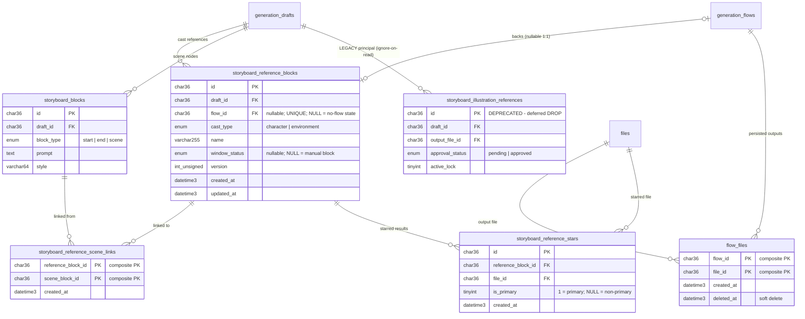

# Data model — scene-generation-reference-gate

> **Brownfield delta.** Ця фіча **не додає жодної таблиці, колонки чи індексу**: Reference-done
> gate (ADR-0002) і single-output selection (ADR-0003) — це нові *читання* наявної схеми
> (міграції 031, 046–048, 053–055). Єдина схемна дія — **відкладений DROP** legacy-таблиці
> `storyboard_illustration_references` (ADR-0004, spec §8 OQ-1 — рішення зафіксовано
> 2026-06-09: deferred DROP), стейджений під `migrations/_deferred/` і **не** промоутиться
> разом із фічею.

## ER diagram

Сутності, які гейт і selection читають (усі наявні; legacy-таблиця показана як deprecated).

## Entities

Усі сутності **наявні й незмінні** — таблиці нижче документують, *що саме* з них читає ця фіча.
Конвенції репо (UUID v4 `CHAR(36)`, `created_at`/`updated_at DATETIME(3)`, soft delete через
`deleted_at`, FK + явні KEY) уже дотримані в міграціях-джерелах.

### `storyboard_reference_blocks` (053 — без змін)

**Aggregate root** кураційних даних касту (успадковано з `storyboard-reference-flows`).

| Column | Type | Constraints | Роль у цій фічі |
|---|---|---|---|
| `id` | CHAR(36) | PK | ідентичність блока в blocking-list відмови гейта (AC-02) |
| `draft_id` | CHAR(36) | NOT NULL, FK → `generation_drafts(id)` CASCADE | full-set scope гейта: всі блоки драфта |
| `flow_id` | CHAR(36) | NULL, UNIQUE, FK → `generation_flows(flow_id)` SET NULL | міст до outputs: `flow_files.flow_id`; `NULL` (no-flow) ⇒ outputs не існують ⇒ блок not-ready |
| `cast_type` | ENUM('character','environment') | NOT NULL | обидва типи гейтяться однаково |
| `name` | VARCHAR(255) | NOT NULL | імʼя блока у відмові гейта (named blocking block) |
| `window_status` | ENUM('pending','running','done','failed') | NULL | **не** входить у readiness-предикат (ADR-0002): NULL = manual блок; читається лише для UI-статусу |
| `version` | INT UNSIGNED | NOT NULL DEFAULT 1 | compare-and-set лінк-сейвів — без змін |

**Readiness-предикат (єдиний для rolling-window і manual блоків, ADR-0002):**
блок ready ⟺ `flow_id IS NOT NULL` **і** існує ≥1 рядок
`flow_files WHERE flow_id = b.flow_id AND deleted_at IS NULL`.
Сире `window_status` у предикат не входить — саме це закриває manual-block / unstarred-deadlock
(spec §1 ¶4, ризик §11 «manual-block readiness misread»).

### `storyboard_reference_scene_links` (054 — без змін)

| Column | Type | Constraints | Роль у цій фічі |
|---|---|---|---|
| `reference_block_id` | CHAR(36) | PK (1/2), FK → blocks CASCADE | які блоки гейтять сцену S (scene-scoped гейт, AC-03/AC-03b) |
| `scene_block_id` | CHAR(36) | PK (2/2), FK → `storyboard_blocks(id)` CASCADE | reference boundary (AC-05): worker читає лише лінки сцени S |

### `storyboard_reference_stars` (055 — без змін)

| Column | Type | Constraints | Роль у цій фічі |
|---|---|---|---|
| `reference_block_id` | CHAR(36) | NOT NULL, FK CASCADE; UNIQUE `(reference_block_id, file_id)`; UNIQUE `(reference_block_id, is_primary)` | старіння тепер лише *обирає* output (ADR-0003) — не гейтить |
| `file_id` | CHAR(36) | NOT NULL, FK → `files(file_id)` CASCADE | primary star → кандидат selected output |
| `is_primary` | TINYINT(1) | NULL (1 = primary) | AC-06b: primary годує сцену лише якщо файл є completed-usable output блока |

**Selection-правило (ADR-0003, на лінкований блок рівно один output):**
1. primary star (`is_primary = 1`), якщо його `file_id` присутній серед usable outputs блока
   (`flow_files(flow_id, file_id)` із `deleted_at IS NULL` — point-lookup по PK);
2. інакше — **latest completed output**: `flow_files WHERE flow_id = ? AND deleted_at IS NULL
   ORDER BY created_at DESC, file_id DESC LIMIT 1` (AC-06; tie-break по `file_id` для
   детермінізму при однаковому `created_at(3)`).

### `flow_files` (047 — без змін)

| Column | Type | Constraints | Роль у цій фічі |
|---|---|---|---|
| `flow_id` | CHAR(36) | PK (1/2), FK → `generation_flows` CASCADE | **джерело правди output-existence** (ADR-0002) |
| `file_id` | CHAR(36) | PK (2/2), FK → `files` RESTRICT | selected output, що годує сцену |
| `deleted_at` | DATETIME(3) | NULL | видалений результат ≠ usable output (AC-06b fallback) |

### `storyboard_blocks` (031 — без змін)

| Column | Type | Constraints | Роль у цій фічі |
|---|---|---|---|
| `draft_id` | CHAR(36) | NOT NULL, FK CASCADE, KEY | перелік сцен драфта для AC-04b |
| `block_type` | ENUM('start','end','scene') | NOT NULL | AC-04b стосується лише `'scene'` |
| `prompt`, `style` | TEXT / VARCHAR(64) | NULL | zero-reference шлях (AC-04): промпт + derived style |

### `storyboard_illustration_references` (040+041 — **deprecated, deferred DROP**)

Legacy principal image. Рантайм **не читає** її на scene-шляху (ADR-0004, AC-08): не годує
сцену, не впливає на гейт. Row-доля (spec §8 OQ-1) **фіналізована 2026-06-09: відкладений
DROP** — стейджений під [`migrations/_deferred/`](./migrations/_deferred/), промоутиться
*окремою* зміною після KPI-вікна (`principal_image_generations = 0` протягом 7 днів
post-rollout, spec §7), щоб зберегти шлях відкату фічі. До того часу рядки інертні
(accepted debt, sad §11).

## Queries → indexes (gate path)

Кожен запит gate-шляху з sequence-діаграм (sad §6) і індекс, що його покриває. **Нових
індексів нуль** — усі читання лягають на наявні.

| # | Запит (Flow / AC) | SQL-форма | Покриває |
|---|---|---|---|
| Q1 | Full-set readiness: усі блоки драфта + output-existence (Flow 1, AC-01/AC-02/AC-07) | `FROM storyboard_reference_blocks b WHERE b.draft_id = ? ORDER BY b.sort_order` + `EXISTS(SELECT 1 FROM flow_files ff WHERE ff.flow_id = b.flow_id AND ff.deleted_at IS NULL)` | `idx_storyboard_reference_blocks_draft_sort (draft_id, sort_order)`; EXISTS — префікс PK `flow_files(flow_id, file_id)` |
| Q2 | Scene-scoped readiness: блоки, лінковані до S (Flow 2, AC-03/AC-03b) | `FROM storyboard_reference_scene_links l JOIN storyboard_reference_blocks b ON b.id = l.reference_block_id WHERE l.scene_block_id = ?` + той самий EXISTS | `idx_storyboard_reference_scene_links_scene (scene_block_id)` → PK blocks |
| Q3 | Reference-less сцени (Flow 1, AC-04b) | `FROM storyboard_blocks s LEFT JOIN storyboard_reference_scene_links l ON l.scene_block_id = s.id WHERE s.draft_id = ? AND s.block_type = 'scene' AND l.scene_block_id IS NULL` | `idx_storyboard_blocks_draft_id (draft_id)` + anti-join по `idx_storyboard_reference_scene_links_scene` |
| Q4 | Primary star блока (Flow 2/3, AC-06b) | `FROM storyboard_reference_stars WHERE reference_block_id = ? AND is_primary = 1 LIMIT 1` | `uq_storyboard_reference_stars_primary (reference_block_id, is_primary)` |
| Q5 | Usability primary-стара (AC-06b) | `FROM flow_files WHERE flow_id = ? AND file_id = ? AND deleted_at IS NULL` | PK `flow_files(flow_id, file_id)` (point-lookup) |
| Q6 | Latest completed output — fallback (Flow 3, AC-06) | `FROM flow_files WHERE flow_id = ? AND deleted_at IS NULL ORDER BY created_at DESC, file_id DESC LIMIT 1` | Префікс PK `flow_files(flow_id, …)`; filesort по обмеженій кількості outputs одного flow (десятки) — у межах NFR p95 ≤ 500 мс; окремий індекс `(flow_id, deleted_at, created_at)` **свідомо не додано** (no "just in case", кардинальність на flow мізерна) |
| Q7 | Лінки сцени S у worker — reference boundary (Flow 3, AC-05) | `FROM storyboard_reference_blocks b JOIN storyboard_reference_scene_links l ON l.reference_block_id = b.id WHERE l.scene_block_id = ? AND b.draft_id = ?` (наявний read `storyboardReferenceCuration.repository.ts`) | `idx_storyboard_reference_scene_links_scene` |

NFR-нотатка (sad §10 QG-3): увесь gate-шлях — Q1–Q3 на старті + Q4–Q6 на selection — суто
persisted reads по індексах вище; жодного виклику провайдера (NFR spec §6).

## Migrations

- **У складі фічі: нуль міграцій.** Гейт і selection — читання наявної схеми; принцип
  ignore-on-read (ADR-0004) міграції не потребує. Підтверджує sad §7 («нова міграція в цій
  фічі не потрібна»).
- **Відкладений DROP (поза фічею):** [`migrations/_deferred/01_drop_storyboard_illustration_references.up.sql`](./migrations/_deferred/01_drop_storyboard_illustration_references.up.sql)
  (+ `.down.sql` із повним відновленням DDL 040+041). **`implement` НЕ промоутить `_deferred/`
  разом із фічею.** Умова промоуту: KPI `principal_image_generations = 0` тримається 7 днів
  post-rollout (spec §7) і principal-код вилучено з усіх поверхонь. Промоут-номер — наступний
  вільний на той момент (зараз був би `057`).

## Test fixtures

Стиль репо: локальні async seed-хелпери в co-located інтеграційних тестах проти живого MySQL
(прецедент — `apps/api/src/repositories/storyboardReference.repository.test.ts:78` `seedDraft`),
користувачі лише `<id>@example.test`. Для гейта знадобляться (НЕ в migrations/):

- `seedDraftWithCast(userId, { blocks })` — драфт + reference-блоки заданих станів: rolling-window
  done-з-output, running-без-output, manual-з-flow-output, manual-без-flow (`flow_id NULL`).
- `seedFlowOutput(flowId, { deleted? })` — рядок `flow_files` (= completed output; `deleted_at`
  для AC-06b fallback-кейсу).
- `seedSceneLink(referenceBlockId, sceneBlockId)` / `seedScene(draftId)` — сцени та лінки для
  AC-03/AC-04b/AC-05.
- `seedStar(referenceBlockId, fileId, { isPrimary })` — primary/non-primary стари для AC-06/AC-06b.
- `seedLegacyPrincipal(draftId)` — рядок `storyboard_illustration_references` для AC-08
  (ignore-on-read регресія).

## Drift report

Перевірено row-типи репозиторіїв проти DDL (053–055, 047): `storyboardReference.repository.ts`
(повний select-list 15 колонок = 053), `storyboardReferenceCuration.repository.ts` (stars/links =
054–055), `flow-file.repository.ts` (= 047). **Дрейфу не виявлено** — field-without-column: 0,
column-without-field: 0, type/nullability-mismatch: 0. `_drift/` не створювався.
