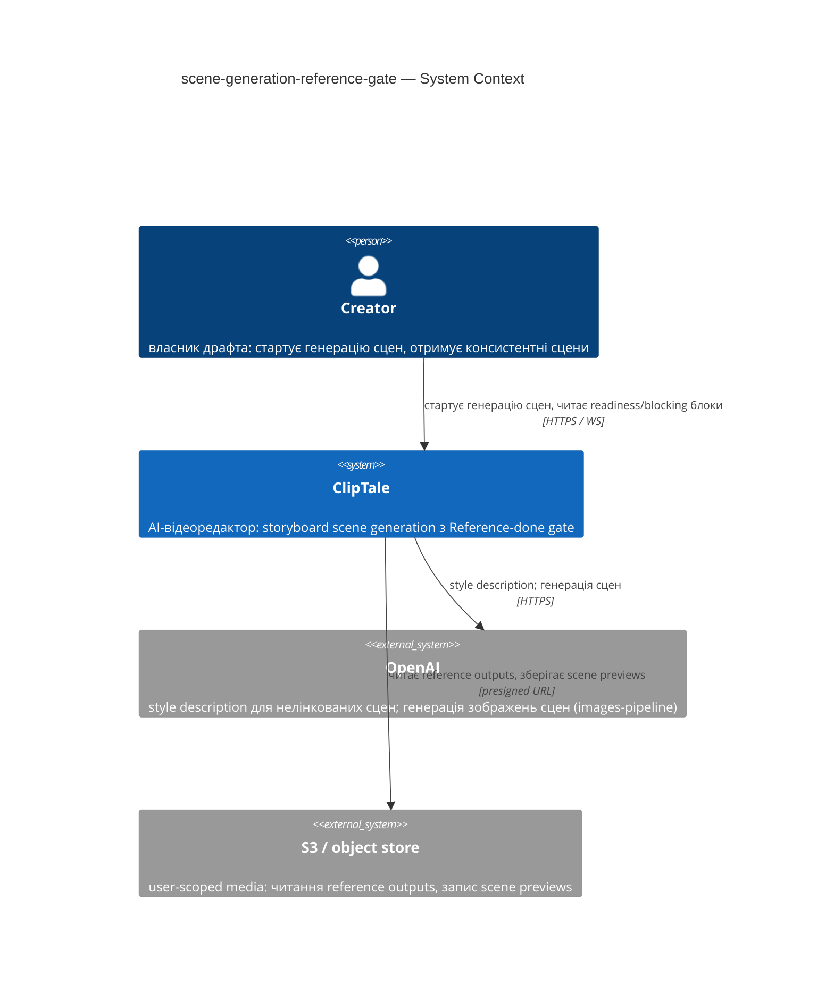
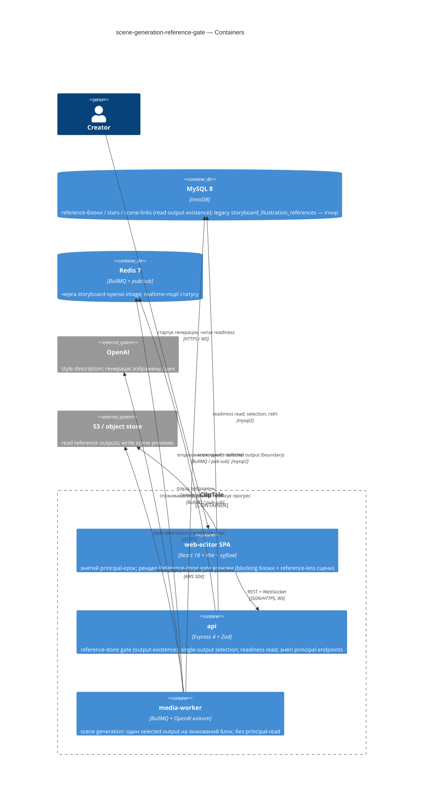

# Software Architecture Document — scene-generation-reference-gate

<!-- 12 Arc42 sections. Empty section → <!-- N/A: <one-line reason> -->. -->
<!-- C4 Context (L1) lives inline in §3. C4 Container (L2) lives inline in §5. -->
<!-- Numbers in §10 come VERBATIM from spec.md §6 NFR — no inventing, no rounding. -->

## 1. Introduction and goals

<!-- 🎯 Why: durable memory of «what + the three dominant qualities + who cares». A year from
     now nobody recalls which three qualities were critical for this system.
     📋 Write: 1 ¶ intent + 3 lines of top-3 quality goals + a stakeholders table.
     ¶4 is the override slot — critic `Override` resolutions emit «Decision override: <headline>
     — rationale: <reason>» bullets here so downstream skills see the deliberate choice. -->

**Intent.** Замінити двотрекову модель готовності сторіборда — старіння кожного reference-блока *плюс* окремий up-front **principal image** — на єдиний **Reference-done gate**: повна генерація сцен стартує лише коли кожен character/environment reference-блок драфта є **ready reference block** (має ≥1 завершений результат), а в драфті з ≥1 reference-блоком кожна сцена має лінк до референса; сцени споживають **selected reference output** своїх лінкованих блоків (рівно один на блок), а legacy principal image вилучено зі scene-шляху. Мета (spec §2): консистентні персонажі/оточення в кожній сцені, єдиний зрозумілий шлях готовності замість двох, і неможливість стартувати генерацію поки референс не завершено.

**Top-3 quality goals (1-liners; full scenarios in §10):**

1. **Коректність гейта без дедлоків** — готовність визначається існуванням output, а не сирим `window_status` і не starring-ом; manually-added блоки (без rolling-window стану) і завершені-але-незазірковані блоки ніколи не клинять гейт і сцена ніколи не лишається з порожнім референсом.
2. **Цілісність reference boundary** — 0 сцен, що отримали output нелінкованого блока (spec §6, invariant assertion в автотестах).
3. **Дешевий і швидкий гейт** — старт генерації сцен p95 ≤ 500 мс, status/readiness read p95 ≤ 300 мс; оцінка готовності не тригерить жодної платної генерації.

**Stakeholders.**

| Role | Interest | Sign-off owner? |
|---|---|---|
| Creator | стартує генерацію сцен, отримує консистентні сцени, дізнається які референси блокують | No |
| PM (Oleksii) | KPI spec §7 (reference-utilization ≥ 80%, gate-deadlock 0, principal-gen → 0, consistency complaints −30%); консультується на §10/§11 | No |
| Tech Lead | затвердження SAD, технічні OQ spec §8 | Yes |
| Security Lead | review (spec §6.1 → security review **N/A**: без нового authz-периметра й нових PII) | No |

<!-- Decision overrides (¶4) — populated by the critic resolution loop, empty otherwise. -->

## 2. Constraints

<!-- 🎯 Why: §4 strategy only works when §2 has fixed WHAT IS ALREADY FIXED — stack, versions,
     deadline, regulatory. This is an input, not an output.
     📋 Write: four blocks — Technical / Organisational / Conventions / Regulatory.
     📌 Pin versions («<datastore> 18», not «<datastore>»); «Q3 deadline — hard», not «ideally».
     Never N/A — every feature inherits at least Conventions + Technical. -->

**Technical.**
- TypeScript 5.4+ (strict, ESM), Node ≥ 20; монорепо Turborepo + npm workspaces (`apps/*`, `packages/*`).
- Backend: Express 4 + Zod-валідація; realtime через `ws` + Redis pub/sub; черги BullMQ 5 на Redis 7.
- Frontend: React 18 + Vite 5 (SPA), TanStack Query 5, storyboard-канвас на `@xyflow/react`; стилі — інлайн `CSSProperties` у co-located `*.styles.ts`.
- DB: MySQL 8 / InnoDB через `mysql2` raw SQL (без ORM); міграції `NNN_*.sql` з in-process runner (останній номер — `056`); IDs — UUID v4 `CHAR(36)`.
- Генерація сцен виконується тільки в media-worker через існуючу чергу `storyboard-openai-image` (OpenAI images-pipeline); reference-генерація — окремий rolling-window на черзі `ai-generate`. Цей feature **споживає** їхній persisted-стан, не змінює сам механізм генерації.
- **Нуль інфраструктурних оверрайдів**: жодної нової БД, черги чи зовнішнього сервісу. Рішення, що цьому суперечить, потребує явної Override-нотатки з посиланням на §11.

**Organisational.**
- Соло-розробка (owner = Oleksii / Storyboard squad); дедлайн у спеці не зафіксовано.
- Розмір фічі — **M** (фокусована ревізія контракту, а не нова підсистема).

**Conventions.**
- `docs/architecture-map.md` + `docs/architecture-rules.md`: routes → controllers → services → repositories; типізовані error-класи (`apps/api/src/lib/errors.ts`); `config.ts` — єдине місце читання `process.env` (`APP_*`); OpenAPI (`packages/api-contracts/src/openapi.ts`) оновлюється в тому самому коміті.
- Прецедент, який ця фіча **ревізує**: `storyboard-reference-flows` (merged 2026-06-07) — зокрема її star gate (ADR-0011) і multi-candidate selection (ADR-0008). Нові ADR цієї фічі їх supersede-ять.

**Regulatory / external.**
- Spec §6.1: internal data — драфти, reference-блоки й згенеровані зображення приватні для власника-Creator-а; жодних нових PII-полів.
- Жодних нових ролей чи authz-периметрів; усе лишається owner-scoped. **Security review N/A** (spec §6.1: без нового authz-кордону, без нових PII, без нової зовнішньої поверхні).

## 3. Context and scope

<!-- 🎯 Why: draws the SYSTEM BOUNDARY — who talks to it from outside, where the trust zone ends.
     Without §3, §5 and §8 (authorization) blur — unclear what's «inside» vs «outside».
     📋 Write: 2–3 sentences of business context + an external-systems table + a C4Context block.
     📌 «External: none (deliberate, no third-party in v1)» is itself a decision worth stating.
     Trust boundary — the line past which you don't trust data without checking it.
     Never N/A — greenfield still draws the planned actors + external systems. -->

Creator у storyboard-візарді ClipTale генерує мультисценові сцени. Ця фіча змінює дві речі на scene-шляху: **передумову старту** генерації (зі star gate на Reference-done gate, що читає існування завершеного output) і **вибір референсів** (один selected output на лінкований блок замість multi-candidate; principal image вилучено). Межа довіри незмінна: кожна операція старту/регенерації/readiness owner-scoped — non-owner отримує відмову без розкриття існування чи стану референсів/сцен драфта (spec §6.1).

<!-- brownfield: scene-start gate + selection живуть у apps/api/src/services/storyboardIllustration.service.ts (assertFullSetStarGate / assertSceneStarGate, StarGateFailedError) та apps/media-worker/src/jobs/{storyboardOpenAIImage.job.ts, referenceSelection.ts}; principal image — storyboard_illustration_references (migration 040) + storyboardIllustration.jobs.ts; reference-стан — storyboard_reference_blocks/stars/scene_links (migrations 053–055). Скан 2026-06-09; architecture-map.md відстає (reflects 9f943df, +216 комітів) — рекомендовано re-run survey. -->

**External systems (in / out):**

| Actor or system | Type | Interaction |
|---|---|---|
| Creator | Person | стартує генерацію сцен (full-draft / per-scene), отримує consistent scene previews, бачить які референси блокують |
| OpenAI | System (external) | derived style description для нелінкованих сцен + генерація зображень сцен (images-pipeline, черга `storyboard-openai-image`) |
| S3 / object store | System (external) | читання selected reference outputs, запис scene previews (presigned URLs, приватні бакети) |

**C4 Context (L1):** <!-- syntax → references/c4-mermaid-syntax.md. Real names, no <placeholder> stubs. -->



## 4. Solution strategy

<!-- 🎯 Why: the 3–4 STRATEGIC PILLARS every ADR grows from. Without §4 each ADR looks random —
     there's no umbrella. ⭐ The densest section — the blast-radius gate fires almost always here
     (decisions are irreversible + multi-module).
     📋 Write: 3–4 choices; each a heading + 2–3 sentences of rationale.
     📌 «Store content as a table of typed blocks» is a pillar — ADR-0001 grows from it. -->

**Target surfaces:** `[backend-service, web-frontend, worker]` (ADR-0001) — гейт і вибір референсів у `apps/api`; зведення multi→single і зняття principal-read у `apps/media-worker`; зняття principal-кроку та рендер gate-відмови в React SPA. **UI-архітектура web-поверхні (інлайн, без ADR):** існуюча React SPA; екран storyboard прибирає principal-image модалку й рендерить Reference-done-gate відмову (named blocking blocks + reference-less scenes) наявними примітивами (`shared/components/`, інлайн `*.styles.ts`). Альтернатив немає — репо вже SPA, дублювати стилістичну систему заборонено конвенціями.

**Top strategic choices (the seeds for ADRs):**

1. **Три поверхні: api + web-editor + media-worker** (ADR-0001). Гейт і selection — авторитетно в api-сервісі при старті; worker зводить multi-candidate→single і перестає читати principal у scene-джобу; SPA прибирає principal-крок (US-07) і показує відмову з named blocking blocks + reference-less scenes (US-02, AC-04b). Успадковує патерн поверхонь предка.
2. **Reference-done gate читає persisted output-existence, server-side в api-сервісі при старті** (ADR-0002, supersedes предкову ADR-0011). Готовність = «у блока існує ≥1 завершений output», а НЕ сирий `window_status` і НЕ підписка на live completion-event. Саме output-existence закриває manual-block / unstarred-but-complete deadlock (spec §1 ¶4) і AC-07 (ще-генерується = немає persisted output = not-ready, без окремої completion-event-підписки). Dual-scope: full-set для full-draft старту, scene-linked для per-scene регенерації. Зберігає «гейт в api-сервісі» предка, змінює лише *умову готовності*.
3. **Один selected reference output на лінкований блок: primary star якщо це completed-usable output, інакше latest completed output** (ADR-0003, supersedes предкову ADR-0008). Retire multi-candidate top-up-to-model-capacity. Старіння тепер лише *обирає* який output годує сцену — воно більше не гейтить старт і не передає кілька кандидатів на блок; рівно один output на лінкований блок досягає сцени. Гарантує, що ready+linked блок ніколи не reference-less (fallback на latest completed).
4. **Retire principal image через ignore-on-read у рантаймі; row-міграцію (drop/backfill) відкласти у `data-model`** (ADR-0004). Scene-шлях більше не генерує, не апрувить і не читає principal image; будь-який legacy-рядок `storyboard_illustration_references` ігнорується на читанні — він не годує сцену й не впливає на гейт (AC-08). Row-level доля рядків — OQ для data-model (§11), не потрібна для цієї поведінки.

**Інлайн-рішення (без ADR):** AC-04b «кожна сцена мусить мати лінк до референса, щойно драфт містить ≥1 reference-блок» — частина правила Reference-done gate (ADR-0002), а не окреме рішення; драфт із **нуль** reference-блоків проходить гейт за no-linked-blocks-правилом (промпт + style description, AC-04).

Each tactical decision in later sections should trace to one of these seeds. Tactical decisions that *contradict* a strategic choice are red flags — surface them in §11.

## 5. Building block view

<!-- 🎯 Why: INTERNAL DECOMPOSITION — modules, containers, datastores. The static topology: who
     may talk to whom. Without §5, §6 (the flows) has no vocabulary of participants.
     📋 Write: 1 ¶ on the style (layered / hexagonal / clean / event-driven) + a folder tree + a
     C4Container block.
     📌 Draw ONE Container per declared `target_surface` (frontmatter): a fullstack
     [backend-service, web-frontend] = a backend-API container + a web/SPA container; a
     [backend-service, mobile-app] = the API + the mobile app. The Container(web, …) line below is
     just one surface's container — swap/add per what was declared in §4. → _shared/surfaces.md
     📌 e.g. «web app, content API, media worker, datastore, object store, CDN». -->

Розширення існуючої layered-архітектури — **жодного нового деплой-юніта й жодного нового домену**: гейт, selection і status уже живуть у домені `storyboardIllustration`, тож фіча модифікує наявні файли за конвенцією routes → controllers → services → repositories, а worker змінює два наявні job-модулі. По одному C4-контейнеру на заявлену поверхню (`backend-service` → api, `web-frontend` → web-editor, `worker` → media-worker).

**Internal decomposition:**

```
apps/api/src/
├── services/storyboardIllustration.service.ts      ← assertFullSetStarGate / assertSceneStarGate
│                                                      → reference-done gate (output-existence, ADR-0002);
│                                                      зняти principal replace/edit зі scene-шляху (ADR-0004)
├── services/storyboardIllustration.status.ts        ← прибрати getLatestReference (principal) з readiness-read
├── services/storyboardIllustration.jobs.ts          ← прибрати ensureReadyReference / createReferenceJob зі scene-старту
├── repositories/storyboardReference*.repository.ts  ← новий read «ready block = ≥1 completed output»
│                                                      (rolling-window: window_status=done + output; manual: flow має ≥1 result)
├── lib/errors.ts                                    ← gate-error: StarGateFailedError → ReferenceNotReadyError (код + details)
└── controllers/storyboardIllustration.controller.ts ← зняти principal-image endpoints зі scene-шляху
apps/media-worker/src/jobs/
├── referenceSelection.ts        ← selectSceneReferences: multi-candidate top-up → один output (primary→latest, ADR-0003)
└── storyboardOpenAIImage.job.ts ← resolveSceneInputs: прибрати principal referenceOutputFileId (ADR-0004)
apps/web-editor/src/features/storyboard/
└── ← зняти principal-image модалку/крок (US-07); рендер Reference-done-gate відмови
   (named blocking blocks + reference-less scenes, US-02 / AC-04b)
```

Інлайн-рішення (D5.1, без ADR): уся нова логіка концентрується в наявному домені `storyboardIllustration`; readiness-read — новий метод у наявних reference-репозиторіях; у `shared/` ніщо не мігрує без другого споживача (правило репо). Авторитет гейта — в api; worker-side `checkScopedStarGate` стає рудиментом (захист-у-глибину, не джерело правди).

**C4 Container (L2):** <!-- syntax → references/c4-mermaid-syntax.md. Real names, no <placeholder> stubs. ONE Container per declared target_surface. -->



## 6. Runtime view

<!-- 🎯 Why: the RUNTIME FLOW of 1–2 critical scenarios — who talks to whom, when, in what order.
     Without §6, §5 is just boxes with no life.
     📋 Write: a Mermaid sequenceDiagram. Participants are names from §5 (don't invent new ones).
     Messages are semantic («saves a draft»), NO HTTP verbs / paths / status codes — endpoint-level
     sequences arrive at the `api` stage.
     📌 e.g. «author → web: composes draft → web → content API: save». Seed the primary flow(s) here;
     the `sequences` stage then covers every §5 AC (no cap). Never N/A for M+; XS/S keeps ≥1 happy-path flow. -->

**Critical flow 1: <flow name>**

```mermaid
sequenceDiagram
    actor Actor
    participant Web
    participant Service
    participant Store
    Actor->>Web: <action>
    Web->>Service: <call>
    Service->>Store: <write>
    Store-->>Service: ok
    Service-->>Web: result
    Web-->>Actor: confirmation
```

**Critical flow 2: <e.g. async event propagation>** — <if applicable, otherwise N/A>.

## 7. Deployment view

<!-- 🎯 Why: the TOPOLOGY DevOps must know without reading the deploy charts — how many replicas,
     where the background worker lives, AT WHAT NUMBERS we scale.
     📋 Write: 2–3 sentences on topology + monitoring + concrete threshold numbers.
     📌 e.g. «500 authors → partition by quarter» (not «we'll think about scale later»).
     🎯 N/A allowed for XS/S that reuses an existing deployment unit with no change.
     Deployment-diagram scaffold → templates/deployment.md. -->

<Topology in 2–3 sentences. Where it runs, replicas, scaling thresholds.>

**Monitoring:**
- <Metrics — e.g. `<metric_name>`>
- <Alerts — e.g. «worker lag > 10 min → page on-call»>
- <Tracing — e.g. spans on the request boundary>

**Scaling thresholds:**
- <e.g. comfortable in one table up to N rows/year>
- <e.g. partition by quarter above N rows/year>

<!-- For XS/S with no deployment change: <!-- N/A: reuses existing deployment unit, no infra change --> -->

## 8. Crosscutting concepts

<!-- 🎯 Why: CROSS-CUTTING PATTERNS spanning several modules: logging, errors, authorization, ID
     strategy, events, caching. ⭐ The second-densest section. A pattern inside one module is NOT
     here; a project-wide convention belongs in the convention file.
     📋 Write: a table — concept / convention / where defined. One row per concept.
     📌 e.g. «sortable time-based IDs generated in the app layer» as a default from the convention file. -->

| Concept | Convention | Where defined |
|---|---|---|
| Logging | <e.g. structured, fields `module=<name>`> | <convention file §X or here> |
| Authentication | <e.g. token-based via middleware> | <convention file §X> |
| Error handling | <e.g. domain sentinel → ports error mapping → JSON> | <convention file §X> |
| ID strategy | <e.g. sortable time-based ID in the app layer> | <convention file §X> |
| Internationalisation | <e.g. N/A, single language> | — |
| Observability | <e.g. tracing on the request boundary> | — |
| Events | <module-specific patterns, if any> | <here> |

## 9. Architecture decisions

<!-- 🎯 Why: the REVERSE INDEX onto the adr/ folder. `ls adr/` gives the files; §9 gives the
     semantics — why they exist, which SAD section they attach to, what status.
     📋 Write: a 4-column table, one row per ADR. Mixed status is fine.
     📌 e.g. «0001 | Store content as a table of typed blocks | Accepted | §4». -->

| # | Title | Status | Section |
|---|---|---|---|
| <NNNN> | <imperative — e.g. "Use a sliding-window counter for rate limiting"> | Accepted | §<N> |
| <NNNN> | <imperative — e.g. "Co-locate the worker in the API process"> | Accepted | §<N> |

ADR files live under `docs/features/<slug>/adr/NNNN-<title>.md`.

## 10. Quality requirements

<!-- 🎯 Why: the QUALITY TREE — take a goal from §1 and break it into concrete leaves: tests,
     metrics, configs, drills. ⭐ Without §10, §1 is a manifesto. With §10 each declaration maps
     to something PROVABLE.
     📋 Write: per §1 goal — When / Then / How-verify. Numbers from spec §6 NFR VERBATIM (don't
     round ≤250ms to ≤300ms — that's a critic F6 hit).
     📌 e.g. «p95 ≤ 500 ms on a block update, verified by a 100 req/s load test». -->

Each top-3 goal from §1 expanded into a full scenario:

**QG-1. <quality attribute>**
- **When:** <trigger condition>
- **Then:** <expected behaviour with numbers from spec §6 NFR>
- **How verify:** <test / chaos drill / load test / metric>

**QG-2. <quality attribute>**
- **When:** <trigger>
- **Then:** <expected>
- **How verify:** <how>

**QG-3. <quality attribute>**
- **When:** <trigger>
- **Then:** <expected>
- **How verify:** <how>

## 11. Risks and technical debt

<!-- 🎯 Why: ⭐ collects EVERYTHING that can break — not only the technical. Without §11 risks get
     discussed at standups and lost; debt lives only in the head of whoever accepted it.
     📋 Write: a risk/debt table — severity — mitigation — owner. Accepted debt in its own block.
     📌 The first risk is often a product risk, not a technical one. That's normal. -->

<!-- Severity literals: Low / Medium / High for regular risks; "Open question" for rows created by
     a Save-as-OQ resolution during the Socratic walk (see references/socratic.md). -->

| Risk / debt | Severity | Mitigation | Owner |
|---|---|---|---|
| <e.g. Worker lag may reach hours during a downstream outage> | Medium | <alert >10 min, on-call playbook, retry backoff> | <DevOps> |
| <e.g. No event-schema versioning in v1> | Medium | <ADR-NNNN planned for v2, tolerate unknown fields> | <Backend> |
| Open architectural decision: <decision-headline> | Open question | Resolve before <stage trigger or YYYY-MM-DD>; <inline rationale from the Save-as-OQ> | <owner> |

**Accepted debt (acceptable in v1, plan to fix later):**
- <e.g. the entity is immutable / unversioned — OK for v1, may need audit versioning in v2>

## 12. Glossary

<!-- 🎯 Why: ⭐ the DOMAIN GLOSSARY that ends arguments a year later («checkpoint — weekly or
     biweekly? quarter — calendar or fiscal?»).
     📋 Write: a term / meaning table. Business + technical terms mixed.
     📌 e.g. «Lesson | a unit inside a course made of blocks (text, video)». -->

| Term | Meaning |
|---|---|
| <e.g. domain object A> | <its meaning in this domain> |
| <e.g. domain object B> | <its meaning> |
| <e.g. domain invariant name> | <the rule, in plain language> |
