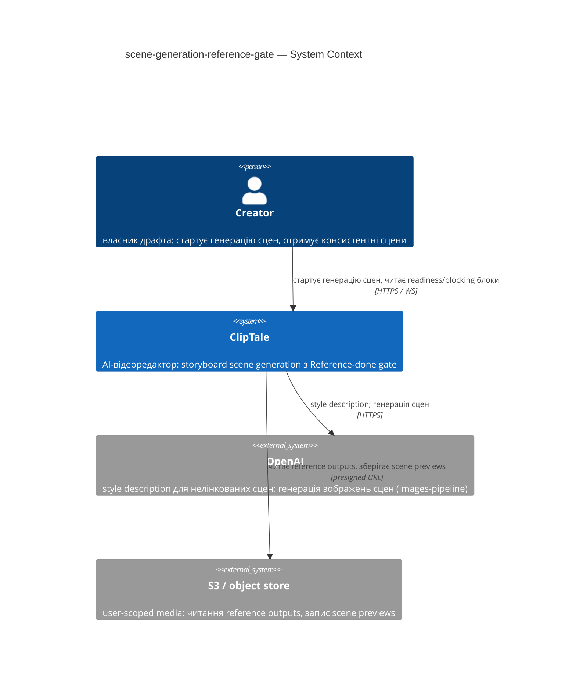
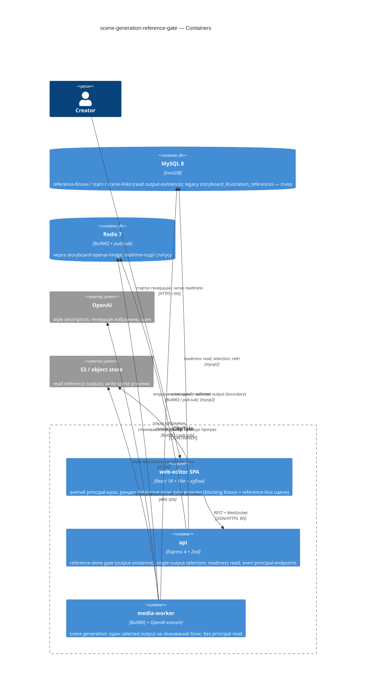
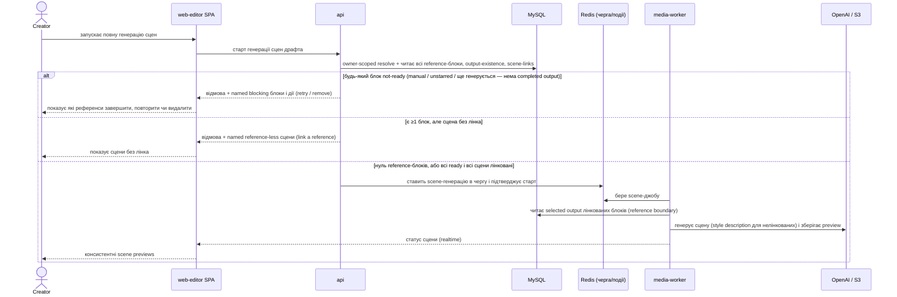
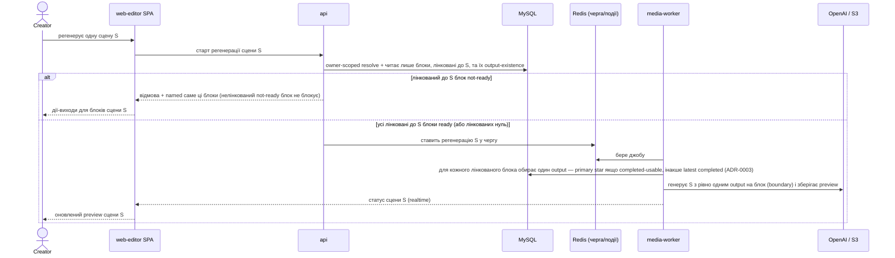
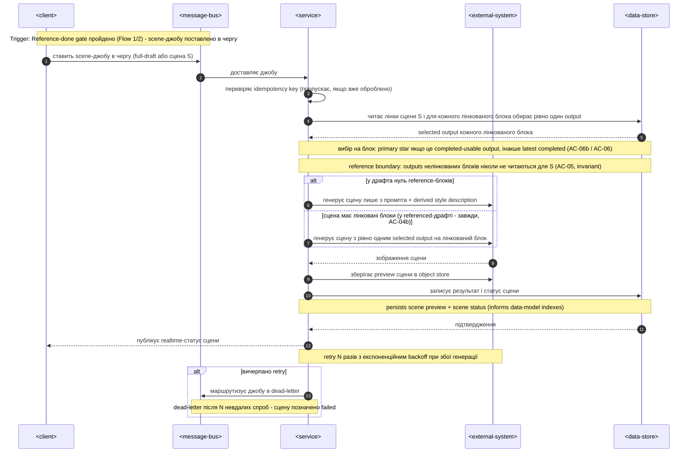
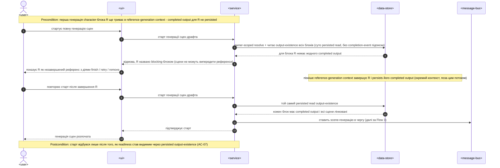
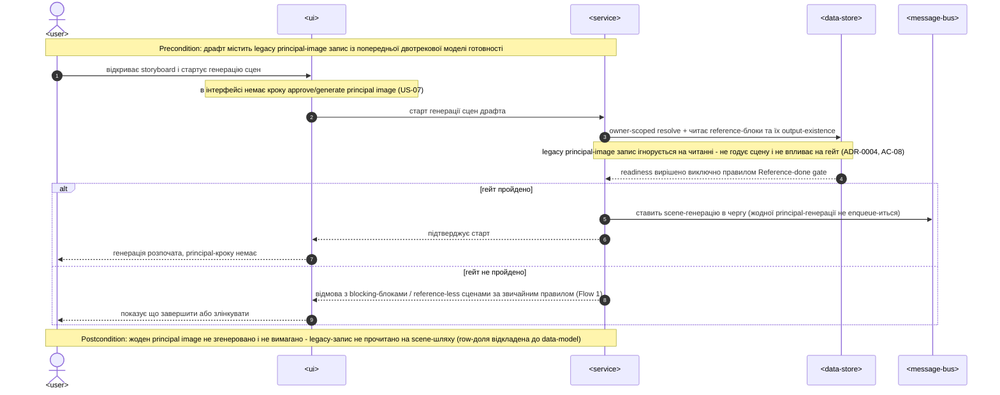
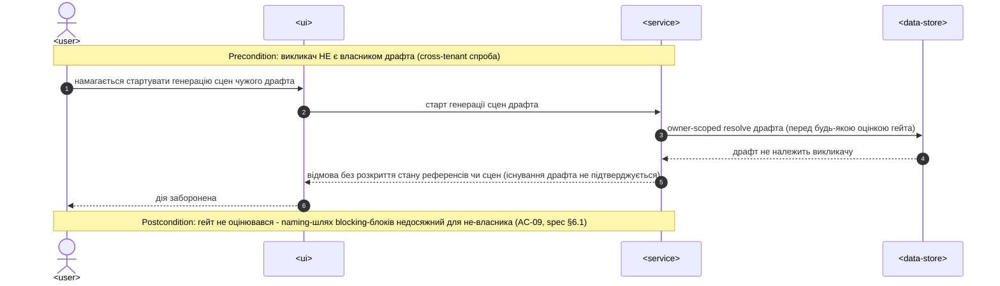

# Software Architecture Document — scene-generation-reference-gate

<!-- 12 Arc42 sections. Empty section → <!-- N/A: <one-line reason> -->. -->
<!-- C4 Context (L1) lives inline in §3. C4 Container (L2) lives inline in §5. -->
<!-- Numbers in §10 come VERBATIM from spec.md §6 NFR — no inventing, no rounding. -->

## 1. Introduction and goals

<!-- 🎯 Why: durable memory of «what + the three dominant qualities + who cares». A year from
     now nobody recalls which three qualities were critical for this system.
     📋 Write: 1 ¶ intent + 3 lines of top-3 quality goals + a stakeholders table.
     ¶4 is the override slot — critic `Override` resolutions emit «Decision override: <headline>
     — rationale: <reason>» bullets here so downstream skills see the deliberate choice. -->

**Intent.** Замінити двотрекову модель готовності сторіборда — старіння кожного reference-блока *плюс* окремий up-front **principal image** — на єдиний **Reference-done gate**: повна генерація сцен стартує лише коли кожен character/environment reference-блок драфта є **ready reference block** (має ≥1 завершений результат), а в драфті з ≥1 reference-блоком кожна сцена має лінк до референса; сцени споживають **selected reference output** своїх лінкованих блоків (рівно один на блок), а legacy principal image вилучено зі scene-шляху. Мета (spec §2): консистентні персонажі/оточення в кожній сцені, єдиний зрозумілий шлях готовності замість двох, і неможливість стартувати генерацію поки референс не завершено.

**Top-3 quality goals (1-liners; full scenarios in §10):**

1. **Коректність гейта без дедлоків** — готовність визначається існуванням output, а не сирим `window_status` і не starring-ом; manually-added блоки (без rolling-window стану) і завершені-але-незазірковані блоки ніколи не клинять гейт і сцена ніколи не лишається з порожнім референсом.
2. **Цілісність reference boundary** — 0 сцен, що отримали output нелінкованого блока (spec §6, invariant assertion в автотестах).
3. **Дешевий і швидкий гейт** — старт генерації сцен p95 ≤ 500 мс, status/readiness read p95 ≤ 300 мс; оцінка готовності не тригерить жодної платної генерації.

**Stakeholders.**

| Role | Interest | Sign-off owner? |
|---|---|---|
| Creator | стартує генерацію сцен, отримує консистентні сцени, дізнається які референси блокують | No |
| PM (Oleksii) | KPI spec §7 (reference-utilization ≥ 80%, gate-deadlock 0, principal-gen → 0, consistency complaints −30%); консультується на §10/§11 | No |
| Tech Lead | затвердження SAD, технічні OQ spec §8 | Yes |
| Security Lead | review (spec §6.1 → security review **N/A**: без нового authz-периметра й нових PII) | No |

<!-- Decision overrides (¶4) — populated by the critic resolution loop, empty otherwise. -->

## 2. Constraints

<!-- 🎯 Why: §4 strategy only works when §2 has fixed WHAT IS ALREADY FIXED — stack, versions,
     deadline, regulatory. This is an input, not an output.
     📋 Write: four blocks — Technical / Organisational / Conventions / Regulatory.
     📌 Pin versions («<datastore> 18», not «<datastore>»); «Q3 deadline — hard», not «ideally».
     Never N/A — every feature inherits at least Conventions + Technical. -->

**Technical.**
- TypeScript 5.4+ (strict, ESM), Node ≥ 20; монорепо Turborepo + npm workspaces (`apps/*`, `packages/*`).
- Backend: Express 4 + Zod-валідація; realtime через `ws` + Redis pub/sub; черги BullMQ 5 на Redis 7.
- Frontend: React 18 + Vite 5 (SPA), TanStack Query 5, storyboard-канвас на `@xyflow/react`; стилі — інлайн `CSSProperties` у co-located `*.styles.ts`.
- DB: MySQL 8 / InnoDB через `mysql2` raw SQL (без ORM); міграції `NNN_*.sql` з in-process runner (останній номер — `056`); IDs — UUID v4 `CHAR(36)`.
- Генерація сцен виконується тільки в media-worker через існуючу чергу `storyboard-openai-image` (OpenAI images-pipeline); reference-генерація — окремий rolling-window на черзі `ai-generate`. Цей feature **споживає** їхній persisted-стан, не змінює сам механізм генерації.
- **Нуль інфраструктурних оверрайдів**: жодної нової БД, черги чи зовнішнього сервісу. Рішення, що цьому суперечить, потребує явної Override-нотатки з посиланням на §11.

**Organisational.**
- Соло-розробка (owner = Oleksii / Storyboard squad); дедлайн у спеці не зафіксовано.
- Розмір фічі — **M** (фокусована ревізія контракту, а не нова підсистема).

**Conventions.**
- `docs/architecture-map.md` + `docs/architecture-rules.md`: routes → controllers → services → repositories; типізовані error-класи (`apps/api/src/lib/errors.ts`); `config.ts` — єдине місце читання `process.env` (`APP_*`); OpenAPI (`packages/api-contracts/src/openapi.ts`) оновлюється в тому самому коміті.
- Прецедент, який ця фіча **ревізує**: `storyboard-reference-flows` (merged 2026-06-07) — зокрема її star gate (ADR-0011) і multi-candidate selection (ADR-0008). Нові ADR цієї фічі їх supersede-ять.

**Regulatory / external.**
- Spec §6.1: internal data — драфти, reference-блоки й згенеровані зображення приватні для власника-Creator-а; жодних нових PII-полів.
- Жодних нових ролей чи authz-периметрів; усе лишається owner-scoped. **Security review N/A** (spec §6.1: без нового authz-кордону, без нових PII, без нової зовнішньої поверхні).

## 3. Context and scope

<!-- 🎯 Why: draws the SYSTEM BOUNDARY — who talks to it from outside, where the trust zone ends.
     Without §3, §5 and §8 (authorization) blur — unclear what's «inside» vs «outside».
     📋 Write: 2–3 sentences of business context + an external-systems table + a C4Context block.
     📌 «External: none (deliberate, no third-party in v1)» is itself a decision worth stating.
     Trust boundary — the line past which you don't trust data without checking it.
     Never N/A — greenfield still draws the planned actors + external systems. -->

Creator у storyboard-візарді ClipTale генерує мультисценові сцени. Ця фіча змінює дві речі на scene-шляху: **передумову старту** генерації (зі star gate на Reference-done gate, що читає існування завершеного output) і **вибір референсів** (один selected output на лінкований блок замість multi-candidate; principal image вилучено). Межа довіри незмінна: кожна операція старту/регенерації/readiness owner-scoped — non-owner отримує відмову без розкриття існування чи стану референсів/сцен драфта (spec §6.1).

<!-- brownfield: scene-start gate + selection живуть у apps/api/src/services/storyboardIllustration.service.ts (assertFullSetStarGate / assertSceneStarGate, StarGateFailedError) та apps/media-worker/src/jobs/{storyboardOpenAIImage.job.ts, referenceSelection.ts}; principal image — storyboard_illustration_references (migration 040) + storyboardIllustration.jobs.ts; reference-стан — storyboard_reference_blocks/stars/scene_links (migrations 053–055). Скан 2026-06-09; architecture-map.md відстає (reflects 9f943df, +216 комітів) — рекомендовано re-run survey. -->

**External systems (in / out):**

| Actor or system | Type | Interaction |
|---|---|---|
| Creator | Person | стартує генерацію сцен (full-draft / per-scene), отримує consistent scene previews, бачить які референси блокують |
| OpenAI | System (external) | derived style description для нелінкованих сцен + генерація зображень сцен (images-pipeline, черга `storyboard-openai-image`) |
| S3 / object store | System (external) | читання selected reference outputs, запис scene previews (presigned URLs, приватні бакети) |

**C4 Context (L1):** <!-- syntax → references/c4-mermaid-syntax.md. Real names, no <placeholder> stubs. -->



## 4. Solution strategy

<!-- 🎯 Why: the 3–4 STRATEGIC PILLARS every ADR grows from. Without §4 each ADR looks random —
     there's no umbrella. ⭐ The densest section — the blast-radius gate fires almost always here
     (decisions are irreversible + multi-module).
     📋 Write: 3–4 choices; each a heading + 2–3 sentences of rationale.
     📌 «Store content as a table of typed blocks» is a pillar — ADR-0001 grows from it. -->

**Target surfaces:** `[backend-service, web-frontend, worker]` (ADR-0001) — гейт і вибір референсів у `apps/api`; зведення multi→single і зняття principal-read у `apps/media-worker`; зняття principal-кроку та рендер gate-відмови в React SPA. **UI-архітектура web-поверхні (інлайн, без ADR):** існуюча React SPA; екран storyboard прибирає principal-image модалку й рендерить Reference-done-gate відмову (named blocking blocks + reference-less scenes) наявними примітивами (`shared/components/`, інлайн `*.styles.ts`). Альтернатив немає — репо вже SPA, дублювати стилістичну систему заборонено конвенціями.

**Top strategic choices (the seeds for ADRs):**

1. **Три поверхні: api + web-editor + media-worker** (ADR-0001). Гейт і selection — авторитетно в api-сервісі при старті; worker зводить multi-candidate→single і перестає читати principal у scene-джобу; SPA прибирає principal-крок (US-07) і показує відмову з named blocking blocks + reference-less scenes (US-02, AC-04b). Успадковує патерн поверхонь предка.
2. **Reference-done gate читає persisted output-existence, server-side в api-сервісі при старті** (ADR-0002, supersedes предкову ADR-0011). Готовність = «у блока існує ≥1 завершений output», а НЕ сирий `window_status` і НЕ підписка на live completion-event. Саме output-existence закриває manual-block / unstarred-but-complete deadlock (spec §1 ¶4) і AC-07 (ще-генерується = немає persisted output = not-ready, без окремої completion-event-підписки). Dual-scope: full-set для full-draft старту, scene-linked для per-scene регенерації. Зберігає «гейт в api-сервісі» предка, змінює лише *умову готовності*.
3. **Один selected reference output на лінкований блок: primary star якщо це completed-usable output, інакше latest completed output** (ADR-0003, supersedes предкову ADR-0008). Retire multi-candidate top-up-to-model-capacity. Старіння тепер лише *обирає* який output годує сцену — воно більше не гейтить старт і не передає кілька кандидатів на блок; рівно один output на лінкований блок досягає сцени. Гарантує, що ready+linked блок ніколи не reference-less (fallback на latest completed).
4. **Retire principal image через ignore-on-read у рантаймі; row-міграцію (drop/backfill) відкласти у `data-model`** (ADR-0004). Scene-шлях більше не генерує, не апрувить і не читає principal image; будь-який legacy-рядок `storyboard_illustration_references` ігнорується на читанні — він не годує сцену й не впливає на гейт (AC-08). Row-level доля рядків — OQ для data-model (§11), не потрібна для цієї поведінки.

**Інлайн-рішення (без ADR):** AC-04b «кожна сцена мусить мати лінк до референса, щойно драфт містить ≥1 reference-блок» — частина правила Reference-done gate (ADR-0002), а не окреме рішення; драфт із **нуль** reference-блоків проходить гейт за no-linked-blocks-правилом (промпт + style description, AC-04).

Each tactical decision in later sections should trace to one of these seeds. Tactical decisions that *contradict* a strategic choice are red flags — surface them in §11.

## 5. Building block view

<!-- 🎯 Why: INTERNAL DECOMPOSITION — modules, containers, datastores. The static topology: who
     may talk to whom. Without §5, §6 (the flows) has no vocabulary of participants.
     📋 Write: 1 ¶ on the style (layered / hexagonal / clean / event-driven) + a folder tree + a
     C4Container block.
     📌 Draw ONE Container per declared `target_surface` (frontmatter): a fullstack
     [backend-service, web-frontend] = a backend-API container + a web/SPA container; a
     [backend-service, mobile-app] = the API + the mobile app. The Container(web, …) line below is
     just one surface's container — swap/add per what was declared in §4. → _shared/surfaces.md
     📌 e.g. «web app, content API, media worker, datastore, object store, CDN». -->

Розширення існуючої layered-архітектури — **жодного нового деплой-юніта й жодного нового домену**: гейт, selection і status уже живуть у домені `storyboardIllustration`, тож фіча модифікує наявні файли за конвенцією routes → controllers → services → repositories, а worker змінює два наявні job-модулі. По одному C4-контейнеру на заявлену поверхню (`backend-service` → api, `web-frontend` → web-editor, `worker` → media-worker).

**Internal decomposition:**

```
apps/api/src/
├── services/storyboardIllustration.service.ts      ← assertFullSetStarGate / assertSceneStarGate
│                                                      → reference-done gate (output-existence, ADR-0002);
│                                                      зняти principal replace/edit зі scene-шляху (ADR-0004)
├── services/storyboardIllustration.status.ts        ← прибрати getLatestReference (principal) з readiness-read
├── services/storyboardIllustration.jobs.ts          ← прибрати ensureReadyReference / createReferenceJob зі scene-старту
├── repositories/storyboardReference*.repository.ts  ← новий read «ready block = ≥1 completed output»
│                                                      (rolling-window: window_status=done + output; manual: flow має ≥1 result)
├── lib/errors.ts                                    ← gate-error: StarGateFailedError → ReferenceNotReadyError (код + details)
└── controllers/storyboardIllustration.controller.ts ← зняти principal-image endpoints зі scene-шляху
apps/media-worker/src/jobs/
├── referenceSelection.ts        ← selectSceneReferences: multi-candidate top-up → один output (primary→latest, ADR-0003)
└── storyboardOpenAIImage.job.ts ← resolveSceneInputs: прибрати principal referenceOutputFileId (ADR-0004)
apps/web-editor/src/features/storyboard/
└── ← зняти principal-image модалку/крок (US-07); рендер Reference-done-gate відмови
   (named blocking blocks + reference-less scenes, US-02 / AC-04b)
```

Інлайн-рішення (D5.1, без ADR): уся нова логіка концентрується в наявному домені `storyboardIllustration`; readiness-read — новий метод у наявних reference-репозиторіях; у `shared/` ніщо не мігрує без другого споживача (правило репо). Авторитет гейта — в api; worker-side `checkScopedStarGate` стає рудиментом (захист-у-глибину, не джерело правди).

**C4 Container (L2):** <!-- syntax → references/c4-mermaid-syntax.md. Real names, no <placeholder> stubs. ONE Container per declared target_surface. -->



## 6. Runtime view

<!-- 🎯 Why: the RUNTIME FLOW of 1–2 critical scenarios — who talks to whom, when, in what order.
     Without §6, §5 is just boxes with no life.
     📋 Write: a Mermaid sequenceDiagram. Participants are names from §5 (don't invent new ones).
     Messages are semantic («saves a draft»), NO HTTP verbs / paths / status codes — endpoint-level
     sequences arrive at the `api` stage.
     📌 e.g. «author → web: composes draft → web → content API: save». Seed the primary flow(s) here;
     the `sequences` stage then covers every §5 AC (no cap). Never N/A for M+; XS/S keeps ≥1 happy-path flow. -->

**Critical flow 1: Full-draft старт через Reference-done gate** (US-01/US-02; гілки AC-02 not-ready, AC-04b reference-less, AC-04 zero-ref інлайн)



**Critical flow 2: Per-scene регенерація — scene-scoped gate + single-output selection** (US-03/US-05/US-06; AC-03/AC-03b/AC-06/AC-06b)



### Critical flow 3: Виконання scene-джоби — reference boundary + один selected output (async)

(US-05/US-06; AC-05 dedicated, деталізація AC-06/AC-06b; generic-учасники за правилом стадії `sequences` — конкретні імена зафіксовані в §5)



### Critical flow 4: Cross-context readiness — генерація сцен не випереджає генерацію референсів

(US-01; AC-07 dedicated — still-generating блок = немає persisted output = not-ready; гейт читає persisted стан, не підписується на live-події; generic-учасники)



### Critical flow 5: Principal image вилучено — legacy-запис ігнорується на читанні

(US-07; AC-08 dedicated — жодної principal-генерації, жодного approve-кроку; ignore-on-read за ADR-0004; generic-учасники)



### Critical flow 6: Відмова не-власнику — ownership перед будь-якою оцінкою гейта

(US-01; AC-09 dedicated — non-owner не досягає naming-шляху blocking-блоків; spec §6.1; generic-учасники)



**Покриття §4/§5 → потоки** (стадія `sequences`, 2026-06-09; жоден US/AC не лишився непокритим):

| US / AC | Де показано |
|---|---|
| US-01 | Flow 1 (happy), Flow 4 (cross-context), Flow 6 (authz) |
| US-02 | Flow 1, alt-гілка not-ready |
| US-03 | Flow 2 |
| US-04 | Flow 1, гілка «нуль reference-блоків» |
| US-05 | Flow 1 (AC-04b гілка), Flow 3 (boundary) |
| US-06 | Flow 2, Flow 3 (selection) |
| US-07 | Flow 5 |
| AC-01 | Flow 1, гілка «всі ready і всі сцени лінковані» |
| AC-02 | Flow 1, alt-гілка not-ready (named blocking блоки + дії) |
| AC-03 | Flow 2, гілка «усі лінковані до S блоки ready» |
| AC-03b | Flow 2, alt-гілка «лінкований до S блок not-ready» |
| AC-04 | Flow 1, гілка «нуль reference-блоків»; worker-бік — Flow 3, гілка zero-ref |
| AC-04b | Flow 1, alt-гілка «сцена без лінка» |
| AC-05 | Flow 3 (dedicated) — інваріант reference boundary нотаткою + читання лише лінкованих блоків |
| AC-06 | Flow 2 (selection-крок) + Flow 3, нотатка «інакше latest completed» |
| AC-06b | Flow 2 (selection-крок) + Flow 3, нотатка «primary star якщо completed-usable» |
| AC-07 | Flow 4 (dedicated) — persisted read, без completion-event підписки |
| AC-08 | Flow 5 (dedicated) — ignore-on-read, жодного principal-кроку |
| AC-09 | Flow 6 (dedicated) — ownership перед оцінкою гейта, без розкриття стану |

**Нотатки стадії `sequences`:** нових учасників поза §5 не знадобилося; ADR-вартих рішень не виявлено (idempotency/retry/dead-letter у Flow 3 — наявні політики scene-джоб, §8). Flows 1–2 успадковані від стадії `design` з конкретними іменами §5 і не редагувалися; Flows 3–6 — generic-учасники за правилом runtime view.

## 7. Deployment view

<!-- 🎯 Why: the TOPOLOGY DevOps must know without reading the deploy charts — how many replicas,
     where the background worker lives, AT WHAT NUMBERS we scale.
     📋 Write: 2–3 sentences on topology + monitoring + concrete threshold numbers.
     📌 e.g. «500 authors → partition by quarter» (not «we'll think about scale later»).
     🎯 N/A allowed for XS/S that reuses an existing deployment unit with no change.
     Deployment-diagram scaffold → templates/deployment.md. -->

Жодних змін інфраструктури: фіча деплоїться в наявних контейнерах (`api`, `web-editor`, `media-worker`) через стандартний docker-compose/CI. **Нова міграція в цій фічі не потрібна** — readiness читається з наявних reference-таблиць (053–055), а row-доля legacy `storyboard_illustration_references` — OQ для `data-model` (§11). Реплікація й масштабування контейнерів незмінні.

**Monitoring (прив'язка до NFR spec §6 + KPI §7):**
- `scene_start_latency_p95` — час старту генерації сцен, включно з оцінкою гейта (NFR ≤ 500 мс).
- `readiness_read_latency_p95` — час readiness/status read драфта (NFR ≤ 300 мс).
- `gate_deadlock_incidents` — драфти, що не стартують попри завершені Creator-ом референси (KPI §7, target 0). **Алерт:** будь-який інцидент → ревізія readiness-логіки.
- `reference_utilization_rate` — частка сцен, що спожили ≥1 лінкований output (KPI §7, ≥ 80% за 30 днів).
- `principal_image_generations` — legacy-шлях; target → 0 за 7 днів post-rollout (KPI §7).

**Scaling thresholds:**
- Черга `storyboard-openai-image` спільна; гейт додає лише дешевий persisted read на старті — у межах поточної пропускної здатності.
- Якщо лаг черги стабільно росте — масштабувати репліки media-worker (наявний механізм), модель гейта не змінюється.

## 8. Crosscutting concepts

<!-- 🎯 Why: CROSS-CUTTING PATTERNS spanning several modules: logging, errors, authorization, ID
     strategy, events, caching. ⭐ The second-densest section. A pattern inside one module is NOT
     here; a project-wide convention belongs in the convention file.
     📋 Write: a table — concept / convention / where defined. One row per concept.
     📌 e.g. «sortable time-based IDs generated in the app layer» as a default from the convention file. -->

| Concept | Convention | Where defined |
|---|---|---|
| Authentication | наявний token-middleware | `architecture-rules.md` |
| Authorization | owner-scoped resolve **перед** оцінкою гейта; non-owner — відмова без розкриття стану референсів/сцен (AC-09) | spec §6.1 + конвенція |
| Error handling | типізовані error-класи → central handler → JSON; **новий `ReferenceNotReadyError`** (422, `details: { blocks: [...], scenes: [...] }`) замінює `StarGateFailedError` на scene-старті | `apps/api/src/lib/errors.ts` |
| Gate evaluation cost | readiness — суто persisted read; **жодного виклику провайдера** на gate-шляху (NFR §6: readiness eval + blocking/unlinked naming + status read) | here |
| Realtime / events | наявні Redis pub/sub → WS статуси сцен — без змін | `lib/realtime.ts` |
| Idempotency / retry | наявні політики scene-джоб (Idempotency-Key, backoff) — без змін | конвенція |
| ID strategy | UUID v4 `CHAR(36)` через `randomUUID()` | конвенція |
| Validation | Zod у контролерах | конвенція |
| Principal image | ignore-on-read у рантаймі (ADR-0004) — не годує сцену, не впливає на гейт (AC-08) | here |
| Internationalisation | N/A — одна мова інтерфейсу (як у репо) | — |

## 9. Architecture decisions

<!-- 🎯 Why: the REVERSE INDEX onto the adr/ folder. `ls adr/` gives the files; §9 gives the
     semantics — why they exist, which SAD section they attach to, what status.
     📋 Write: a 4-column table, one row per ADR. Mixed status is fine.
     📌 e.g. «0001 | Store content as a table of typed blocks | Accepted | §4». -->

| # | Title | Status | Section |
|---|---|---|---|
| 0001 | Target the backend-service, web-frontend and worker surfaces | Accepted | §4 |
| 0002 | Gate scene generation on persisted reference-output existence (supersedes storyboard-reference-flows ADR-0011) | Accepted | §4 |
| 0003 | Feed each linked block a single selected reference output (supersedes storyboard-reference-flows ADR-0008) | Accepted | §4 |
| 0004 | Retire the principal image by ignoring it on read, defer row migration | Accepted | §4 |

ADR files live under `docs/features/scene-generation-reference-gate/adr/NNNN-<title>.md`.

## 10. Quality requirements

<!-- 🎯 Why: the QUALITY TREE — take a goal from §1 and break it into concrete leaves: tests,
     metrics, configs, drills. ⭐ Without §10, §1 is a manifesto. With §10 each declaration maps
     to something PROVABLE.
     📋 Write: per §1 goal — When / Then / How-verify. Numbers from spec §6 NFR VERBATIM (don't
     round ≤250ms to ≤300ms — that's a critic F6 hit).
     📌 e.g. «p95 ≤ 500 ms on a block update, verified by a 100 req/s load test». -->

Each top-3 goal from §1 expanded into a full scenario:

**QG-1. Коректність гейта без дедлоків**
- **When:** Creator стартує генерацію на драфті з manually-added блоками (без `window_status`), завершеними-але-незазіркованими блоками, або нуль reference-блоків.
- **Then:** гейт оцінює готовність за існуванням persisted output, тож manual/unstarred/still-generating блоки читаються коректно — гейт ніколи не клинить готовий драфт; коли блок ready+linked, але без зірки, сцена отримує latest completed output (ніколи не порожній референс, AC-06/AC-06b).
- **How verify:** інтеграційні тести AC-04 / AC-04b / AC-06 / AC-06b / AC-07 + KPI `gate_deadlock_incidents` = 0 (spec §7, перші 30 днів).

**QG-2. Цілісність reference boundary**
- **When:** генерується сцена S, лінкована до частини блоків і не лінкована до інших, усі ready.
- **Then:** **0 scenes fed an output from an unlinked block** (spec §6 verbatim) — тільки selected outputs лінкованих до S блоків годують S.
- **How verify:** **invariant assertion covered by automated tests** (spec §6 measurement verbatim) — AC-05.

**QG-3. Дешевий і швидкий гейт**
- **When:** старт генерації сцен (вкл. оцінку гейта) / readiness read драфта.
- **Then:** старт p95 **≤ 500 ms** і readiness read p95 **≤ 300 ms** (spec §6 verbatim); **no additional paid generation triggered by evaluating readiness** — gate-шлях (readiness eval + blocking/unlinked naming + status read) не викликає платного провайдера.
- **How verify:** API request timing metric на start/status операціях; code review + integration test, що на gate-шляху немає виклику провайдера (spec §6 measurement verbatim).

## 11. Risks and technical debt

<!-- 🎯 Why: ⭐ collects EVERYTHING that can break — not only the technical. Without §11 risks get
     discussed at standups and lost; debt lives only in the head of whoever accepted it.
     📋 Write: a risk/debt table — severity — mitigation — owner. Accepted debt in its own block.
     📌 The first risk is often a product risk, not a technical one. That's normal. -->

<!-- Severity literals: Low / Medium / High for regular risks; "Open question" for rows created by
     a Save-as-OQ resolution during the Socratic walk (see references/socratic.md). -->

| Risk / debt | Severity | Mitigation | Owner |
|---|---|---|---|
| Reference-done gate створює drop-off у воронці (Creator не може стартувати, KPI §7) | High | гейт завжди називає blocking блоки + reference-less сцени + дії-виходи (AC-02/AC-04b); KPI `gate_deadlock_incidents` + ревізія PM при просіданні | PM (Oleksii) |
| Manual-block readiness misread: output-existence для manual-блока (без `window_status`) читається інакше, ніж для rolling-window | Medium | єдиний readiness-предикат «≥1 completed output» для обох видів блоків; інтеграційні тести AC-04b + manual-block; ADR-0002 | Tech Lead |
| ~~Open architectural decision: row-доля legacy principal-image рядків (drop / backfill / ignore)~~ **Resolved 2026-06-09 (data-model):** ignore-on-read + deferred DROP, стейджено в `migrations/_deferred/`, промоут після KPI-вікна (spec §8 OQ-1) | Closed | див. [data-model.md](./data-model.md) §Migrations | Tech Lead |
| Open architectural decision: reference-блок застряг in-progress (job lost, completion ніколи не fire) тримає гейт закритим | Open question | Resolve before `sdd:tasks`; default — out of scope (delete/retry блока), revisit якщо deadlock-інциденти > 0 (spec §8 OQ-2) | Tech Lead |
| Open architectural decision: mid-run регенерація reference-блока під час повного scene-пасу — re-validate per scene чи one-shot start check | Open question | Resolve before `sdd:tasks`; default — one-shot check at start, документований known limitation (spec §8 OQ-3) | Tech Lead |

**Accepted debt (acceptable in v1, plan to fix later):**
- Legacy `storyboard_illustration_references` рядки лишаються в БД й ігноруються на читанні, доки `data-model` не вирішить їхню row-долю (ADR-0004).
- Один selected output на блок знижує креативну варіативність порівняно з multi-candidate-моделлю предка — прийнято свідомо; старіння й далі контролює *який* output (ADR-0003).
- TOCTOU-вікно між api-гейтом і виконанням у worker: гейт — знімок output-existence на момент старту (успадковано від `storyboard-reference-flows`, ADR-0002).

## 12. Glossary

<!-- 🎯 Why: ⭐ the DOMAIN GLOSSARY that ends arguments a year later («checkpoint — weekly or
     biweekly? quarter — calendar or fiscal?»).
     📋 Write: a term / meaning table. Business + technical terms mixed.
     📌 e.g. «Lesson | a unit inside a course made of blocks (text, video)». -->

| Term | Meaning |
|---|---|
| Ready reference block | reference-блок з ≥1 completed result, придатним годувати сцену; rolling-window: `window_status=done` + output; manual: лінкований flow дав ≥1 result ([CONTEXT](./CONTEXT.md)) |
| Reference-done gate | правило готовності старту (replaces Star gate): full-draft стартує лише коли кожен блок ready І (за наявності ≥1 блока) кожна сцена лінкована; per-scene — лише блоки, лінковані до сцени; авторитетний server-side в api (ADR-0002) ([CONTEXT](./CONTEXT.md)) |
| Selected reference output | єдиний output, що годує сцену для лінкованого блока: primary star якщо completed-usable, інакше latest completed output (ADR-0003) ([CONTEXT](./CONTEXT.md)) |
| Reference-generation context | контекст, що *продукує* outputs (media-worker rolling-window + flows manual-блоків); гейт читає його **persisted** стан, не підписується на live-подію (ADR-0002) ([CONTEXT](./CONTEXT.md)) |
| Principal image (deprecated) | legacy single up-front референс (`storyboard_illustration_references`); ця фіча його retire-ить — ignore-on-read, не годує сцену, не гейтить (ADR-0004) ([CONTEXT](./CONTEXT.md)) |
| Blocking block | non-ready блок, названий у відмові гейта, щоб Creator знав що завершити/повторити/видалити ([CONTEXT](./CONTEXT.md)) |
| Scene block / Scene generation | блок-сцена на Video Road Map; його preview продукує scene generation (full-draft або per-scene), споживаючи selected reference outputs лінкованих блоків ([CONTEXT](./CONTEXT.md)) |
| Reference boundary | для сцени S годують лише selected outputs блоків, лінкованих до S; images нелінкованих блоків ніколи не використовуються для S (успадкований інваріант, AC-05) ([CONTEXT](./CONTEXT.md)) |
