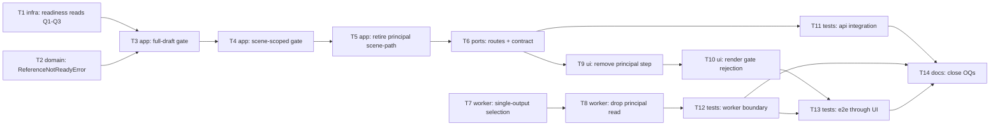

# Epic — scene-generation-reference-gate

> **Spec:** [spec.md](../spec.md) · **Design:** [sad.md](../sad.md) · **Data model:** [data-model.md](../data-model.md) · **API:** [openapi.yaml](../contracts/openapi.yaml) · **ADRs:** [adr/](../adr/)

## Goal

Замінити двотрекову модель готовності сторіборда (star gate + principal image) на єдиний **Reference-done gate**: повна генерація сцен стартує лише коли кожен reference-блок має ≥1 завершений output і (за наявності ≥1 блока) кожна сцена лінкована; сцени споживають рівно один selected output на лінкований блок; legacy principal image вилучено зі scene-шляху (spec §2, ADR-0002/0003/0004).

## Scope

- **In:** шари `domain` / `infra` / `app` / `ports` в `apps/api`, `domain` / `infra` в `apps/media-worker`, `ui` в `apps/web-editor` (поверхні sad frontmatter `target_surfaces: [backend-service, web-frontend, worker]`), `tests`, `docs`. **Нуль migration-задач** — фіча не додає DDL ([data-model.md](../data-model.md)); deferred DROP у [`migrations/_deferred/`](../migrations/_deferred/) **не** промоутиться з фічею.
- **Out (spec §3):** cast extraction / confirmation; механізм reference-генерації та rolling-window; watchdog/reaper для застряглих reference-джоб; music blocks.

## Task map

Паралельні старти: **T1 ∥ T2 ∥ T7** (api-infra, api-domain, worker — незалежні гілки); далі T11 ∥ T9/T10 ∥ T12.

## Tasks

See [tracker.md](./tracker.md) for status. Machine contract: [tasks.json](../tasks.json).

| # | Task | Layer | Blocked by | DoD (short) |
|---|---|---|---|---|
| T1 | [Readiness reads (Q1–Q3) у reference-репозиторіях](./readiness-reads-repository.md) | infra | — | три read-методи за data-model Q1–Q3, інтеграційні тести станів блоків |
| T2 | [ReferenceNotReadyError замість StarGateFailedError](./reference-not-ready-error.md) | domain | — | 422 + коди `references.reference_gate_failed` / `references.unlinked_scenes` + details |
| T3 | [Full-draft Reference-done gate у сервісі](./full-draft-reference-done-gate.md) | app | T1, T2 | гейт за output-existence, zero-block pass, named rejection, ownership перед гейтом |
| T4 | [Scene-scoped gate для per-scene регенерації](./scene-scoped-gate.md) | app | T3 | лише блоки сцени гейтять; нелінкований not-ready не блокує |
| T5 | [Зняти principal image зі scene-шляху (app)](./retire-principal-from-scene-path-app.md) | app | T4 | без ensureReadyReference/getLatestReference; wire-тип без `reference`/двох фаз |
| T6 | [Видалити principal-endpoints + оновити contract package](./remove-principal-endpoints-and-contract.md) | ports | T5 | 4 routes видалено (404), `api-contracts` openapi.ts оновлено тим самим комітом |
| T7 | [Один selected output на блок у worker-selection](./single-output-selection-worker.md) | domain | — | primary star якщо usable, інакше latest completed; рудимент без star-вимоги |
| T8 | [Прибрати principal-read зі scene-джоби](./scene-job-drop-principal-read.md) | infra | T7 | resolveSceneInputs без principal; zero-ref → prompt + style |
| T9 | [Зняти principal-крок зі storyboard SPA](./ui-remove-principal-step.md) | ui | T6 | Principal*-компоненти видалено, флоу без approve-кроку |
| T10 | [Рендер відмови Reference-done gate](./ui-render-gate-rejection.md) | ui | T9 | named blocking блоки + unlinked сцени з діями, наявні примітиви |
| T11 | [API-інтеграційні тести гейта (live MySQL)](./api-gate-integration-tests.md) | tests | T6 | усі gate-AC + legacy-principal ignore + no-provider-call |
| T12 | [Worker-тести boundary-інваріанта + selection](./worker-boundary-selection-tests.md) | tests | T8 | 0 сцен з output нелінкованого блока; fallback-кейси selection |
| T13 | [Playwright e2e гейта через UI](./e2e-gate-through-ui.md) | tests | T10, T12 | blocked → finish → started, без principal-кроку |
| T14 | [Закрити OQ-2/OQ-3 + задокументувати known limitations](./docs-known-limitations.md) | docs | T11, T12, T13 | spec §8 OQ закриті defaults-ами; deferred DROP-умова зафіксована |

## Risks / Hard rules

- **Gate-evaluation cost (spec §6, hard):** жодного виклику платного провайдера на gate-шляху (readiness eval + naming + status read) — суто persisted reads (data-model Q1–Q6). T3/T4/T5 не сміють тригерити генерацію; T11 це асертить.
- **Reference boundary (spec §6, hard):** 0 сцен, що отримали output нелінкованого блока — invariant assertion в автотестах (T7/T8/T12).
- **Ownership перед гейтом (AC-09, spec §6.1):** non-owner ніколи не досягає naming-шляху; відповіді не розкривають стан драфта.
- **Нуль інфраструктурних оверрайдів (sad §2):** жодної нової БД/черги/сервісу; жодного нового індексу (data-model: Q6 filesort прийнято свідомо).
- **`_deferred/` не промоутити (data-model §Migrations):** `implement` НЕ переносить `migrations/_deferred/` у живі міграції — промоут окремою зміною після KPI-вікна (7 днів `principal_image_generations = 0`).
- **Конвенція контракту:** `packages/api-contracts/src/openapi.ts` оновлюється в тому самому коміті, що й зміна поведінки endpoint-а (T6).
- **UI reuse (surfaces-правило):** T9/T10 компонують наявні `shared/components/` + co-located `*.styles.ts`; нових стилістичних систем/токенів не заводити.
- **Прийняті дефолти OQ (зафіксовано на цьому геті, 2026-06-09):** OQ-2 — reaper/force-fail застряглого блока **out of scope** (delete/retry наявними контролами; revisit якщо `gate_deadlock_incidents` > 0); OQ-3 — **one-shot check at start** (без per-scene re-validate mid-run), документований known limitation (T14). Узгоджено з accepted debt sad §11 (TOCTOU-вікно).
