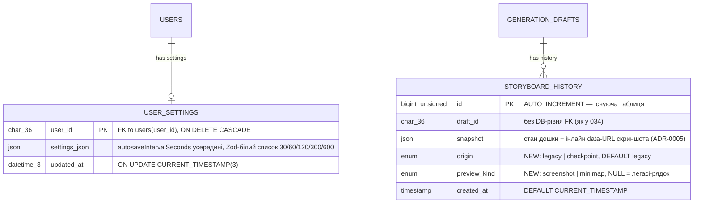

# Data model — storyboard-autosave-checkpoints

> Джерела: spec §5 (AC-02, AC-08…AC-11c), sad §4 ADR-0003/0004/0005, sad §6 persist-підказки стадії sequences.
> Рішення, підтверджені власником 2026-06-05: HISTORY_CAP лишається **50**; `origin` — **ENUM** (конвенція репо);
> частка minimap-фолбеків рахується через окрему колонку **`preview_kind`** (дешевий COUNT без парсингу JSON).

## ER diagram

## Entities

### Aggregate root: `users` (існуючий) → `user_settings` (нова)

Один рядок на користувача; преференції живуть у JSON (ADR-0004, прецедент `user_project_ui_state` 028).
Рядок створюється ліниво при першому записі з Settings-сторінки; відсутність рядка = дефолти app-шару
(інтервал 60 с, AC-11b).

| Column | Type | Constraints | Notes |
|---|---|---|---|
| `user_id` | CHAR(36) | PK, FK → `users(user_id)` ON DELETE CASCADE | UUID v4 — конвенція репо; PK покриває FK-індекс |
| `settings_json` | JSON | NOT NULL | `{ "autosaveIntervalSeconds": 60 }`; білий список пресетів 30/60/120/300/600 с — Zod в app-шарі (ADR-0004), БД вміст не типізує (норма репо) |
| `updated_at` | DATETIME(3) | NOT NULL DEFAULT CURRENT_TIMESTAMP(3) ON UPDATE CURRENT_TIMESTAMP(3) | точно за прецедентом 028; `created_at` відсутній — прецедент його не має |

**Aggregate root:** `users` володіє `user_settings` (1:0..1).
**Access patterns:** читання при відкритті дошки + читання/upsert на Settings-сторінці — завжди point-lookup за `user_id` → обслуговується PK, окремий індекс не потрібен.
**Constraints:** PK = FK-колонка; ownership (AC-11c) — перевірка `req.user.userId` в service-шарі, як скрізь у репо.

### Aggregate root: `generation_drafts` (існуючий) → `storyboard_history` (розширюється)

Існуюча таблиця 034 (`id`, `draft_id`, `snapshot`, `created_at`) — додаються дві колонки, жодна існуюча не змінюється.
`draft_id` свідомо без DB-рівня FK — так у 034; не запроваджуємо констрейнт, якого існуюча таблиця не має.

| Column | Type | Constraints | Notes |
|---|---|---|---|
| `id` | BIGINT UNSIGNED | PK, AUTO_INCREMENT | існуюча; `ORDER BY id` = порядок вставки |
| `draft_id` | CHAR(36) | NOT NULL | існуюча; без FK (як у 034) |
| `snapshot` | JSON | NOT NULL | існуюча; checkpoint-и додають інлайн data-URL JPEG 320×180 ~15–25 КБ (ADR-0005) |
| `origin` | ENUM('legacy','checkpoint') | NOT NULL DEFAULT 'legacy' | **нова** (ADR-0003); DEFAULT миттєво «бекфілить» існуючі рядки в `legacy` (INSTANT ALTER); нові checkpoint-и пишуть `'checkpoint'` явно |
| `preview_kind` | ENUM('screenshot','minimap') | NULL DEFAULT NULL | **нова**; NULL = легасі-рядок (поняття не застосовне); живить серверний підрахунок частки фолбеків (NFR < 2 %) без парсингу snapshot JSON |
| `created_at` | TIMESTAMP | NOT NULL DEFAULT CURRENT_TIMESTAMP | існуюча |

**Aggregate root:** `generation_drafts` володіє `storyboard_history` (1:N, кап 50 — app-шар `HISTORY_CAP`, підтверджено: лишається 50).
**Access patterns:** список панелі (фільтр checkpoint, новіші зверху) → індекс `idx_storyboard_history_draft_origin`; insert+prune → існуючий індекс; фолбек-частка → аналітичний COUNT без індексу.
**Constraints:** prune лишається origin-агностичним — легасі-рядки «старіють» через існуючий 50-кап (spec Non-goal: без чищення легасі); ownership (AC-13) — service-шар.

## Indexes

| Index | Columns | Query it serves |
|---|---|---|
| `idx_storyboard_history_draft_origin` | `(draft_id, origin, id DESC)` | **нова** — список History-панелі (sad §6 «Відкриття History-панелі», AC-08): `WHERE draft_id = ? AND origin = 'checkpoint' ORDER BY id DESC LIMIT 50`; рівність по префіксу + `id DESC` дає читання без сортування → NFR panel load ≤ 500 мс p95 |
| `idx_storyboard_history_draft_created` | `(draft_id, created_at DESC)` | існуючий (034) — лишається: prune-запит `WHERE draft_id = ? ORDER BY id DESC` (insertHistoryAndPrune) ходить по `draft_id`-префіксу |
| PK `user_settings(user_id)` | `(user_id)` | point-lookup налаштувань при відкритті дошки (sad §6 «Читання autosave interval», NFR ≤ 300 мс p95) і upsert із Settings (AC-09); PK одночасно покриває FK |

Свідомо **без** індексу: серверний підрахунок частки фолбеків (`WHERE origin='checkpoint'` GROUP BY `preview_kind`) — рідкий аналітичний запит по капованій таблиці (≤ 50 рядків/draft); індекс «про запас» коштував би кожен insert.

## Seeds

Сіди не потрібні: bootstrap-даних немає (рядок `user_settings` створюється ліниво першим записом
користувача), lookup-даних немає (білий список пресетів — Zod-константа app-шару за ADR-0004,
не довідкова таблиця). PII-guard не зачеплений — жодного сіда.

## Test fixtures

НЕ в migrations/ — у Vitest-тестах за конвенцією репо (co-located, інтеграційні на живому MySQL, `singleFork`):

- `insertTestUser(pool)` — рядок `users` з `user-<uuid>@example.test` (PII-guard: лише `example.test`).
- `insertUserSettings(pool, userId, { autosaveIntervalSeconds })` — рядок `user_settings` для тестів читання/upsert/ownership (AC-09…AC-11c).
- `insertHistoryEntry(pool, draftId, { origin, previewKind, snapshot })` — рядки `storyboard_history` обох походжень для тестів фільтра панелі (AC-08), prune-у з мішаними origin та фолбек-підрахунку.

## TBD

Немає — усі три відкриті рішення стадії закриті власником 2026-06-05 (кап 50; ENUM; `preview_kind`).
