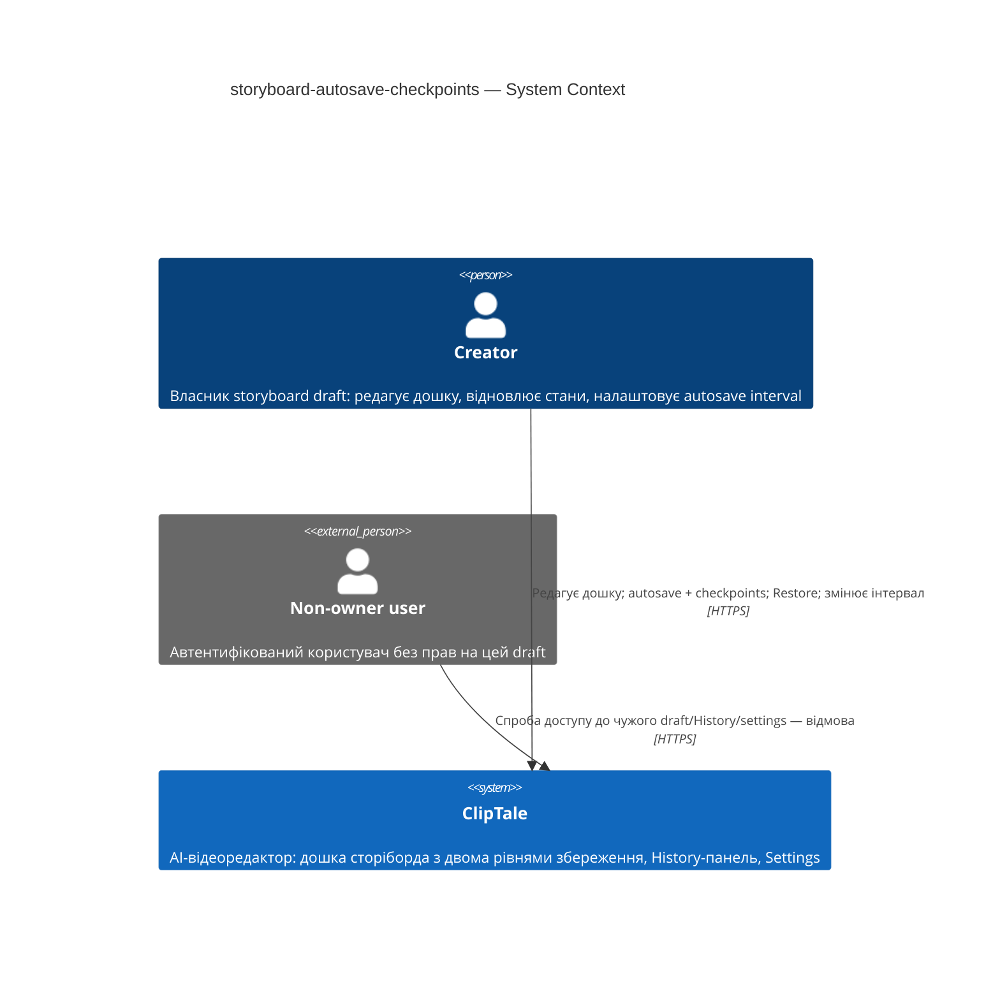
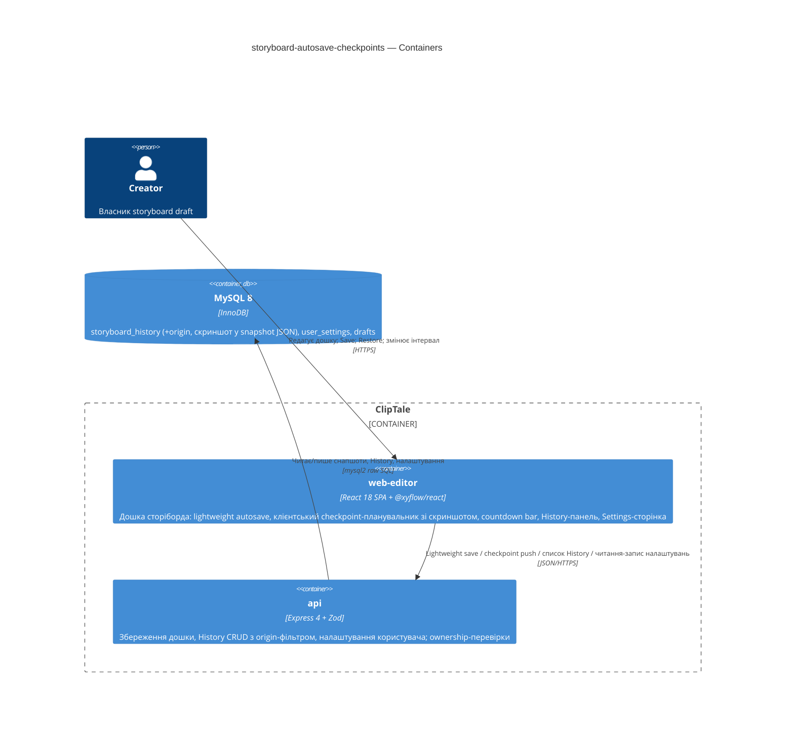

# Software Architecture Document — storyboard-autosave-checkpoints

<!-- 12 Arc42 sections. Empty section → <!-- N/A: <one-line reason> -->. -->
<!-- C4 Context (L1) lives inline in §3. C4 Container (L2) lives inline in §5. -->
<!-- Numbers in §10 come VERBATIM from spec.md §6 NFR — no inventing, no rounding. -->

## 1. Introduction and goals

<!-- 🎯 Why: durable memory of «what + the three dominant qualities + who cares». A year from
     now nobody recalls which three qualities were critical for this system.
     📋 Write: 1 ¶ intent + 3 lines of top-3 quality goals + a stakeholders table.
     ¶4 is the override slot — critic `Override` resolutions emit «Decision override: <headline>
     — rationale: <reason>» bullets here so downstream skills see the deliberate choice. -->

**Intent.** Розділити збереження сторіборда (сторінка «Video Road Map») на два рівні: (i) **lightweight autosave** — як і сьогодні, зберігає стан дошки за кілька секунд після кожної зміни, але більше не створює History entries і не знімає скриншоти; (ii) **checkpoint save** — раз на налаштований Creator-ом autosave interval (пресети 30 с / 1 / 2 / 5 / 10 хв, дефолт 1 хв) або вручну кнопкою Save знімає layout screenshot і створює History entry. Каденція видима через checkpoint countdown bar у верхньому правому куті; інтервал редагується на новій сторінці Settings — першій персональній settings-поверхні продукту (ліве меню Home). Мета — знизити навантаження з «запис історії + скриншот на кожну зміну» до «щонайбільше один на інтервал», не зменшивши свіжість збережених даних.

**Top-3 quality goals (1-liners; full scenarios in §10):**

1. **Ефективність записів** — ≤ 1 History entry на autosave interval на draft (замість одного на кожну зміну сьогодні), без втрати свіжості збереженого стану.
2. **Надійність точок відновлення** — checkpoint ніколи не зникає мовчки: збій/таймаут зняття скриншота (> 5 с) понижує прев'ю до SVG-мінімапи, але запис створюється; частка фолбеків < 2 %.
3. **Відгук інтерфейсу** — full-screen loader ≤ 1 с p95; підтвердження lightweight autosave ≤ 500 мс p95; завантаження History-панелі ≤ 500 мс p95; читання налаштувань при відкритті дошки ≤ 300 мс p95.

**Stakeholders.**

| Role | Interest | Sign-off owner? |
|---|---|---|
| Creator | Редагує дошку; покладається на autosave, History та Settings | No |
| Steven Hayes (PM) | Продуктові рішення; консультується по §10 quality goals та §11 severities | No |
| Tech Lead | Затвердження SAD | Yes |
| Security Lead | Security review — обов'язковий за spec §6.1 (перший per-user settings surface) | Yes |

<!-- Decision overrides (¶4) — populated by the critic resolution loop, empty otherwise. -->

## 2. Constraints

<!-- 🎯 Why: §4 strategy only works when §2 has fixed WHAT IS ALREADY FIXED — stack, versions,
     deadline, regulatory. This is an input, not an output.
     📋 Write: four blocks — Technical / Organisational / Conventions / Regulatory.
     📌 Pin versions («<datastore> 18», not «<datastore>»); «Q3 deadline — hard», not «ideally».
     Never N/A — every feature inherits at least Conventions + Technical. -->

**Technical.**
- TypeScript 5.4+ (strict, ESM), Node ≥ 20; монорепо Turborepo + npm workspaces.
- Frontend: React 18 + Vite 5, React-Router v7, TanStack Query 5; стан — кастомний external store + `useSyncExternalStore` (без Zustand/Redux); канвас сторіборда — `@xyflow/react`.
- Backend: Express 4 + Zod-валідація; типізовані error-класи (`apps/api/src/lib/errors.ts`) з центральним хендлером.
- БД: MySQL 8 / InnoDB через `mysql2` raw SQL (без ORM); міграції — нумеровані `NNN_*.sql` (наступний номер 050), in-process runner (`APP_MIGRATE_ON_BOOT`).
- Зняття скриншота: бібліотека `html-to-image` вже в стеку (`apps/web-editor/src/features/storyboard/utils/captureCanvasThumbnail.ts` — JPEG 320×180, q0.6); виконується в браузері, на main thread.
- Існуючий save-шлях: `useStoryboardAutosave` (дебаунс 5 с) → `PUT /storyboards/:draftId`; історія: `POST /storyboards/:draftId/history` → `insertHistoryAndPrune`, кап 50 записів (`HISTORY_CAP`, `storyboard.service.ts:18`).

**Organisational.**
- Розмір фічі M (1–2 спринти); бюджет/дедлайн у специфікації не зафіксовані → `TBD by PM` (рядок у §11).
- Команда: соло-розробка з AI-агентами (SDD-пайплайн).

**Conventions.**
- `docs/architecture-rules.md` + `docs/architecture-map.md` — канонічні: api-домен = `routes → controllers → services → repositories` (без DI, singletons); web-фіча = `features/<name>/{components,hooks,api.ts,types.ts}`; UUID v4 `CHAR(36)`; `config.ts` — єдине місце читання env (`APP_*`); стилі — co-located `*.styles.ts` (inline `CSSProperties`, без Tailwind); тести Vitest co-located, інтеграційні — на живому MySQL (`singleFork`); E2E — Playwright.
- Нових зовнішніх залежностей фіча не додає.

**Regulatory / external.**
- Класифікація даних: internal — board snapshot-и та layout screenshot-и містять контент Creator-а (spec §6.1); нова преференція (autosave interval) — несенситивна.
- Security review обов'язковий (spec §6.1): перший per-user settings surface; ownership-правила drafts/history переносяться на нові поверхні (settings читає/пише лише власник акаунта).

## 3. Context and scope

<!-- 🎯 Why: draws the SYSTEM BOUNDARY — who talks to it from outside, where the trust zone ends.
     Without §3, §5 and §8 (authorization) blur — unclear what's «inside» vs «outside».
     📋 Write: 2–3 sentences of business context + an external-systems table + a C4Context block.
     📌 «External: none (deliberate, no third-party in v1)» is itself a decision worth stating.
     Trust boundary — the line past which you don't trust data without checking it.
     Never N/A — greenfield still draws the planned actors + external systems. -->

Creator редагує свій storyboard draft на сторінці дошки ClipTale. Система безперервно зберігає поточний стан (lightweight autosave), періодично — за autosave interval або вручну — створює візуальні точки відновлення (checkpoint save → History entry зі layout screenshot), і дає Creator-у керувати каденцією через сторінку Settings. Уся фіча живе всередині існуючої системи ClipTale (web-editor SPA + api + MySQL); довірча межа — автентифікований акаунт: draft, його History та налаштування доступні лише власнику.

<!-- brownfield: existing save path useStoryboardAutosave (5s debounce) → PUT /storyboards/:draftId; history POST /storyboards/:draftId/history with 50-cap prune; screenshot via html-to-image in-browser; no per-user settings surface yet (HomeSidebar has 3 nav items); scan 2026-06-05 -->

**External systems (in / out):**

| Actor or system | Type | Interaction |
|---|---|---|
| Creator | Person | Редагує дошку; отримує autosave + checkpoint-и; керує autosave interval у Settings; виконує Restore |
| Non-owner (signed-in user, не власник draft) | Person (external to trust zone) | Будь-який доступ до чужого draft, History чи налаштувань — відмова |
| Зовнішні сервіси | — | **Немає (свідомо):** зняття скриншота виконується в браузері (`html-to-image`), збереження — в існуючу MySQL; жодних third-party інтеграцій у v1 |

**C4 Context (L1):**



## 4. Solution strategy

<!-- 🎯 Why: the 3–4 STRATEGIC PILLARS every ADR grows from. Without §4 each ADR looks random —
     there's no umbrella. ⭐ The densest section — the blast-radius gate fires almost always here
     (decisions are irreversible + multi-module).
     📋 Write: 3–4 choices; each a heading + 2–3 sentences of rationale.
     📌 «Store content as a table of typed blocks» is a pillar — ADR-0001 grows from it. -->

**Top strategic choices (the seeds for ADRs):**

1. **Цільові поверхні: `web-frontend` + `backend-service` (ADR-0001).** Фіча наскрізна: браузерна частина (розділені хуки збереження, countdown bar, full-screen loader, фільтрована History-панель, Settings-сторінка) + бекенд (settings-ендпоінти, маркер/фільтр історії, міграції). Воркери не задіяні — скриншот можливий лише в живому DOM. *UI-архітектура для web-frontend — без окремого рішення: репозиторій уже зафіксував SPA (React 18 + Vite, §2); альтернатив, не виключених констрейнтами, немає → інлайн-нотатка, без ADR. Нові екрани компонуються з наявних shared-компонентів і `*.styles.ts`-підходу (карта архітектури, §Frontend).*
2. **Клієнтський планувальник checkpoint-ів (ADR-0002).** Браузер володіє всім розкладом: countdown-таймер, деферал під час drag/typing (кап — один додатковий інтервал), обробка `visibilitychange` (прострочений checkpoint ≤ 10 с після повернення, AC-03c), pre-restore checkpoint. Бекенд — тонкий CRUD із валідацією. Причина: layout screenshot знімається лише з живого DOM (`html-to-image`); сервер фізично не має джерела зображення. Скриншот + снапшот ідуть одним запитом — атомарність живить quality goal №2. **Мульти-таб / мульти-девайс: last-writer-wins, як сьогодні** (закриває spec §8 OQ-1; рідкісний режим двох активних вкладок може дати до 2 checkpoint-ів на інтервал — ризик-рядок у §11).
3. **Явний маркер походження History entry (ADR-0003).** Колонка `origin` у `storyboard_history` (легасі-дефолт для існуючих рядків; нові checkpoint-и — `'checkpoint'`); History-панель і API фільтрують легасі на рівні SQL (AC-08), частка minimap-фолбеків рахується серверним запитом (NFR). Деталі колонки/індексу — на етапі `data-model`.
4. **Узагальнене сховище налаштувань користувача (ADR-0004).** Нова таблиця `user_settings` (user_id PK + JSON + updated_at) за прецедентом `user_project_ui_state`, але per-account. Autosave interval — перше поле; майбутні преференції додаються без міграцій (spec Goal 3 «scaffolding first»). Валідація білого списку пресетів (30/60/120/300/600 с) — Zod в app-шарі, як скрізь у репозиторії.
5. **Layout screenshot — інлайн data-URL у snapshot JSON (ADR-0005).** Як сьогодні: JPEG 320×180 (~15–25 КБ) усередині JSON-колонки; один POST = запис + прев'ю атомарно, нуль нової інфраструктури. S3-винесення відхилено для v1: двофазний запис створює режими збоїв, що суперечать quality goal №2 («checkpoint ніколи не зникає мовчки»).

Each tactical decision in later sections should trace to one of these seeds. Tactical decisions that *contradict* a strategic choice are red flags — surface them in §11.

## 5. Building block view

<!-- 🎯 Why: INTERNAL DECOMPOSITION — modules, containers, datastores. The static topology: who
     may talk to whom. Without §5, §6 (the flows) has no vocabulary of participants.
     📋 Write: 1 ¶ on the style (layered / hexagonal / clean / event-driven) + a folder tree + a
     C4Container block.
     📌 Draw ONE Container per declared `target_surface` (frontmatter): a fullstack
     [backend-service, web-frontend] = a backend-API container + a web/SPA container; a
     [backend-service, mobile-app] = the API + the mobile app. The Container(web, …) line below is
     just one surface's container — swap/add per what was declared in §4. → _shared/surfaces.md
     📌 e.g. «web app, content API, media worker, datastore, object store, CDN». -->

Шаруватість успадкована від репозиторію (без нових стилів): фронтенд — фіча-модулі `features/<name>/{components,hooks,api.ts,types.ts}` зі станом у хуках/external store; бекенд — ланцюг `routes → controllers → services → repositories` із прямими singleton-імпортами. Фіча **розширює** модуль `features/storyboard/` (нові хуки/компоненти збереження), **додає** новий фіча-модуль `features/settings/` (Settings-сторінка) і новий бекенд-домен `settings` (окремий ланцюг, не вштовхнутий у storyboard-домен — інший життєвий цикл і інша таблиця).

**Internal decomposition:**

```
apps/web-editor/src/features/
├── storyboard/                                  (розширюється)
│   ├── hooks/useStoryboardAutosave.ts           без змін — lightweight autosave, дебаунс 5 с
│   ├── hooks/useCheckpointScheduler.ts          НОВИЙ — countdown-таймер, деферал drag/typing,
│   │                                            visibility-обробка, прострочений запуск, double-save guard
│   ├── hooks/useStoryboardHistoryPush.ts        стає checkpoint-push: скриншот + снапшот одним запитом
│   ├── components/CheckpointCountdownBar.tsx    НОВИЙ — countdown bar + кнопка Save (idle-стан «all saved»)
│   ├── components/CheckpointCaptureOverlay.tsx  НОВИЙ — full-screen loader на час зняття
│   ├── components/StoryboardHistoryPanel.tsx    фільтр «лише checkpoint-и»; pre-restore checkpoint перед Restore
│   └── utils/captureCanvasThumbnail.ts          + 5-с таймаут → minimap-фолбек (AC-04)
└── settings/                                    НОВИЙ фіча-модуль
    ├── components/SettingsPage.tsx              пресети інтервалу; помилки збереження/читання (AC-11, AC-11b)
    ├── api.ts                                   читання/запис налаштувань через apiClient
    └── types.ts
    (+ пункт Settings у features/home/components/HomeSidebar.tsx)

apps/api/src/
├── routes/settings.routes.ts                    НОВИЙ ланцюг — читання/запис налаштувань власника
├── controllers/settings.controller.ts
├── services/settings.service.ts
├── repositories/settings.repository.ts
├── routes|controllers|services/storyboard.*     розширення: origin-маркер при записі, фільтр легасі в списку
└── db/migrations/                               050_user_settings.sql + 051_history_origin.sql (точна форма — data-model)
```

**C4 Container (L2):**



## 6. Runtime view

<!-- 🎯 Why: the RUNTIME FLOW of 1–2 critical scenarios — who talks to whom, when, in what order.
     Without §6, §5 is just boxes with no life.
     📋 Write: a Mermaid sequenceDiagram. Participants are names from §5 (don't invent new ones).
     Messages are semantic («saves a draft»), NO HTTP verbs / paths / status codes — endpoint-level
     sequences arrive at the `api` stage.
     📌 e.g. «author → web: composes draft → web → content API: save». Seed the primary flow(s) here;
     the `sequences` stage then covers every §5 AC (no cap). Never N/A for M+; XS/S keeps ≥1 happy-path flow. -->

**Critical flow 1: <flow name>**

```mermaid
sequenceDiagram
    actor Actor
    participant Web
    participant Service
    participant Store
    Actor->>Web: <action>
    Web->>Service: <call>
    Service->>Store: <write>
    Store-->>Service: ok
    Service-->>Web: result
    Web-->>Actor: confirmation
```

**Critical flow 2: <e.g. async event propagation>** — <if applicable, otherwise N/A>.

## 7. Deployment view

<!-- 🎯 Why: the TOPOLOGY DevOps must know without reading the deploy charts — how many replicas,
     where the background worker lives, AT WHAT NUMBERS we scale.
     📋 Write: 2–3 sentences on topology + monitoring + concrete threshold numbers.
     📌 e.g. «500 authors → partition by quarter» (not «we'll think about scale later»).
     🎯 N/A allowed for XS/S that reuses an existing deployment unit with no change.
     Deployment-diagram scaffold → templates/deployment.md. -->

<Topology in 2–3 sentences. Where it runs, replicas, scaling thresholds.>

**Monitoring:**
- <Metrics — e.g. `<metric_name>`>
- <Alerts — e.g. «worker lag > 10 min → page on-call»>
- <Tracing — e.g. spans on the request boundary>

**Scaling thresholds:**
- <e.g. comfortable in one table up to N rows/year>
- <e.g. partition by quarter above N rows/year>

<!-- For XS/S with no deployment change: <!-- N/A: reuses existing deployment unit, no infra change --> -->

## 8. Crosscutting concepts

<!-- 🎯 Why: CROSS-CUTTING PATTERNS spanning several modules: logging, errors, authorization, ID
     strategy, events, caching. ⭐ The second-densest section. A pattern inside one module is NOT
     here; a project-wide convention belongs in the convention file.
     📋 Write: a table — concept / convention / where defined. One row per concept.
     📌 e.g. «sortable time-based IDs generated in the app layer» as a default from the convention file. -->

| Concept | Convention | Where defined |
|---|---|---|
| Logging | <e.g. structured, fields `module=<name>`> | <convention file §X or here> |
| Authentication | <e.g. token-based via middleware> | <convention file §X> |
| Error handling | <e.g. domain sentinel → ports error mapping → JSON> | <convention file §X> |
| ID strategy | <e.g. sortable time-based ID in the app layer> | <convention file §X> |
| Internationalisation | <e.g. N/A, single language> | — |
| Observability | <e.g. tracing on the request boundary> | — |
| Events | <module-specific patterns, if any> | <here> |

## 9. Architecture decisions

<!-- 🎯 Why: the REVERSE INDEX onto the adr/ folder. `ls adr/` gives the files; §9 gives the
     semantics — why they exist, which SAD section they attach to, what status.
     📋 Write: a 4-column table, one row per ADR. Mixed status is fine.
     📌 e.g. «0001 | Store content as a table of typed blocks | Accepted | §4». -->

| # | Title | Status | Section |
|---|---|---|---|
| <NNNN> | <imperative — e.g. "Use a sliding-window counter for rate limiting"> | Accepted | §<N> |
| <NNNN> | <imperative — e.g. "Co-locate the worker in the API process"> | Accepted | §<N> |

ADR files live under `docs/features/<slug>/adr/NNNN-<title>.md`.

## 10. Quality requirements

<!-- 🎯 Why: the QUALITY TREE — take a goal from §1 and break it into concrete leaves: tests,
     metrics, configs, drills. ⭐ Without §10, §1 is a manifesto. With §10 each declaration maps
     to something PROVABLE.
     📋 Write: per §1 goal — When / Then / How-verify. Numbers from spec §6 NFR VERBATIM (don't
     round ≤250ms to ≤300ms — that's a critic F6 hit).
     📌 e.g. «p95 ≤ 500 ms on a block update, verified by a 100 req/s load test». -->

Each top-3 goal from §1 expanded into a full scenario:

**QG-1. <quality attribute>**
- **When:** <trigger condition>
- **Then:** <expected behaviour with numbers from spec §6 NFR>
- **How verify:** <test / chaos drill / load test / metric>

**QG-2. <quality attribute>**
- **When:** <trigger>
- **Then:** <expected>
- **How verify:** <how>

**QG-3. <quality attribute>**
- **When:** <trigger>
- **Then:** <expected>
- **How verify:** <how>

## 11. Risks and technical debt

<!-- 🎯 Why: ⭐ collects EVERYTHING that can break — not only the technical. Without §11 risks get
     discussed at standups and lost; debt lives only in the head of whoever accepted it.
     📋 Write: a risk/debt table — severity — mitigation — owner. Accepted debt in its own block.
     📌 The first risk is often a product risk, not a technical one. That's normal. -->

<!-- Severity literals: Low / Medium / High for regular risks; "Open question" for rows created by
     a Save-as-OQ resolution during the Socratic walk (see references/socratic.md). -->

| Risk / debt | Severity | Mitigation | Owner |
|---|---|---|---|
| <e.g. Worker lag may reach hours during a downstream outage> | Medium | <alert >10 min, on-call playbook, retry backoff> | <DevOps> |
| <e.g. No event-schema versioning in v1> | Medium | <ADR-NNNN planned for v2, tolerate unknown fields> | <Backend> |
| Open architectural decision: <decision-headline> | Open question | Resolve before <stage trigger or YYYY-MM-DD>; <inline rationale from the Save-as-OQ> | <owner> |

**Accepted debt (acceptable in v1, plan to fix later):**
- <e.g. the entity is immutable / unversioned — OK for v1, may need audit versioning in v2>

## 12. Glossary

<!-- 🎯 Why: ⭐ the DOMAIN GLOSSARY that ends arguments a year later («checkpoint — weekly or
     biweekly? quarter — calendar or fiscal?»).
     📋 Write: a term / meaning table. Business + technical terms mixed.
     📌 e.g. «Lesson | a unit inside a course made of blocks (text, video)». -->

| Term | Meaning |
|---|---|
| <e.g. domain object A> | <its meaning in this domain> |
| <e.g. domain object B> | <its meaning> |
| <e.g. domain invariant name> | <the rule, in plain language> |
