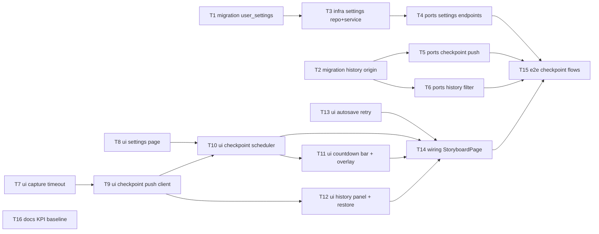

# Epic — storyboard-autosave-checkpoints

> **Spec:** [spec.md](../spec.md) · **Design:** [sad.md](../sad.md) · **Data model:** [data-model.md](../data-model.md) · **API:** [openapi.yaml](../contracts/openapi.yaml) · **ADRs:** [adr/](../adr/)

## Goal

Розділити збереження сторіборда на два рівні: lightweight autosave (без History entries і скриншотів) та checkpoint save (скриншот + History entry раз на налаштований інтервал або вручну). Це скорочує history-записи й скриншот-роботу з «на кожну зміну» до «щонайбільше один на інтервал» (spec §2 Goal 1), дає видимі точки відновлення з countdown bar (Goal 2) і запроваджує першу per-user Settings-сторінку (Goal 3).

## Scope

- **In:** дві staged-міграції (`user_settings`, `origin`/`preview_kind` у `storyboard_history`); новий бекенд-домен settings (`routes → controllers → services → repositories`); розширення storyboard history endpoints (checkpoint push + origin-фільтр); клієнтський checkpoint-планувальник, countdown bar, full-screen loader, фільтрована History-панель, pre-restore checkpoint; новий фіча-модуль `features/settings/`; autosave-ретрай з індикатором (AC-01b); e2e-тести; KPI-1 базлайн.
- **Out (spec §3):** timeline-editor autosave; multi-tab conflict resolution (last-writer-wins, ADR-0002); per-change history; чищення легасі-записів у сховищі; додаткові налаштування на Settings-сторінці.

## Task map

Паралельні гілки: settings-бекенд (T1→T3→T4) ∥ history-бекенд (T2→T5/T6) ∥ фронтенд (T7/T8/T13 стартують одразу). T16 — незалежна, але **due before release branch** (spec §8 OQ-3).

## Tasks

See [tracker.md](./tracker.md) for status. Machine contract: [tasks.json](../tasks.json).

| # | Task | Layer | Blocked by | DoD (short) |
|---|---|---|---|---|
| T1 | [Staged-міграція user_settings](./t01-migration-user-settings.md) | migration | — | up застосовується і down відкочується чисто на живому MySQL |
| T2 | [Staged-міграція origin + preview_kind](./t02-migration-history-origin-preview.md) | migration | — | INSTANT ALTER; існуючі рядки = legacy; up/down чисті |
| T3 | [Settings repository + service](./t03-settings-repository-service.md) | infra | T1 | інтеграційні тести: дефолти без рядка, lazy upsert, point-lookup |
| T4 | [Settings endpoints GET/PUT /users/me/settings](./t04-settings-endpoints.md) | ports | T3 | контрактні відповіді AC-09/10/11/11c; Zod-білий список |
| T5 | [Checkpoint push: POST history + origin/previewKind](./t05-checkpoint-push-endpoint.md) | ports | T2 | вставка stamps origin=checkpoint; previewKind обовʼязковий; prune працює |
| T6 | [History list: фільтр origin=checkpoint](./t06-history-list-filter.md) | ports | T2 | GET повертає лише checkpoint-и, новіші зверху, ≤50, з previewKind |
| T7 | [captureCanvasThumbnail: 5-с таймаут + фолбек](./t07-capture-timeout-fallback.md) | ui | — | таймаут/збій → типізований fallback-результат; юніт-тести |
| T8 | [Settings-сторінка + роут + пункт меню](./t08-settings-page-ui.md) | ui | — | пресети, помилки AC-11; компонентні тести |
| T9 | [Checkpoint push client (rework useStoryboardHistoryPush)](./t09-checkpoint-push-client.md) | ui | T7 | снапшот+скриншот одним запитом; видима помилка + ретрай |
| T10 | [useCheckpointScheduler](./t10-checkpoint-scheduler.md) | ui | T8, T9 | countdown/idle/деферал/overdue/double-save guard — юніт-тести по AC |
| T11 | [CheckpointCountdownBar + CaptureOverlay](./t11-countdown-bar-overlay.md) | ui | T10 | стани bar (відлік/idle/in-flight), loader на час capture |
| T12 | [History-панель: previewKind + pre-restore checkpoint](./t12-history-panel-restore.md) | ui | T9 | скриншот-прев'ю/мінімапа за previewKind; checkpoint перед Restore |
| T13 | [Autosave: індикатор «не збережено» + авторетрай](./t13-autosave-retry-indicator.md) | ui | — | збій → індикатор + ретрай до успіху; редагування не блокується |
| T14 | [Wiring StoryboardPage: two-tier save](./t14-storyboard-page-wiring.md) | wiring | T10, T11, T12, T13 | per-change push прибрано (AC-02); bar/overlay змонтовано |
| T15 | [E2E: checkpoint-потоки + slow-capture](./t15-e2e-checkpoint-flows.md) | tests | T4, T5, T6, T14 | Playwright: інтервальний/ручний checkpoint, мінімапа-фолбек, settings |
| T16 | [KPI-1 базлайн history-записів](./t16-kpi-baseline-docs.md) | docs | — | задокументований SQL + знятий тижневий базлайн до release-гілки |

## Risks / Hard rules

- **NFR (spec §6, дослівно):** ≤ 1 History entry на інтервал на draft; loader ≤ 1 с p95; lightweight save ≤ 500 мс p95; panel load ≤ 500 мс p95; settings read ≤ 300 мс p95; фолбек-частка < 2 %; capture-таймаут 5 с.
- **Інваріант (sad §12):** «checkpoint ніколи не губиться мовчки» — збій capture понижує прев'ю до мінімапи, але History entry створюється завжди (AC-04). Жодна задача не сміє зробити push умовним від скриншота.
- **Hard rule (AC-02):** lightweight autosave ніколи не створює History entry — T14 зобов'язана прибрати всі per-change push-сайти.
- **mysql2 LIMIT-обхід (sad §11):** prune успадковує text-protocol патерн із `storyboard.repository.ts` — не «виправляти».
- **Виявлений дрейф sad §5:** «useStoryboardAutosave.ts без змін» суперечить AC-01b (сьогодні хук не ретраїть і не показує помилку — лише console). §8 sad явно вимагає «autosave-ретрай + індикатор». T13 реалізує AC-01b; зміна хука — свідома.
- **Відкрите імплементаційне рішення (T5):** server-side history insert у `storyboardPlanApply.service.ts` має явно обрати origin; дефолт задачі — `'checkpoint'` + `preview_kind='minimap'`, інакше pre-plan-apply safety-записи зникнуть з панелі (порушення духу AC-04). Підтвердити при імплементації T5.
- **Open question (spec §8, до `sdd:implement`):** KPI-1 базлайн знімає dev тижневим підрахунком до release-гілки → T16.
