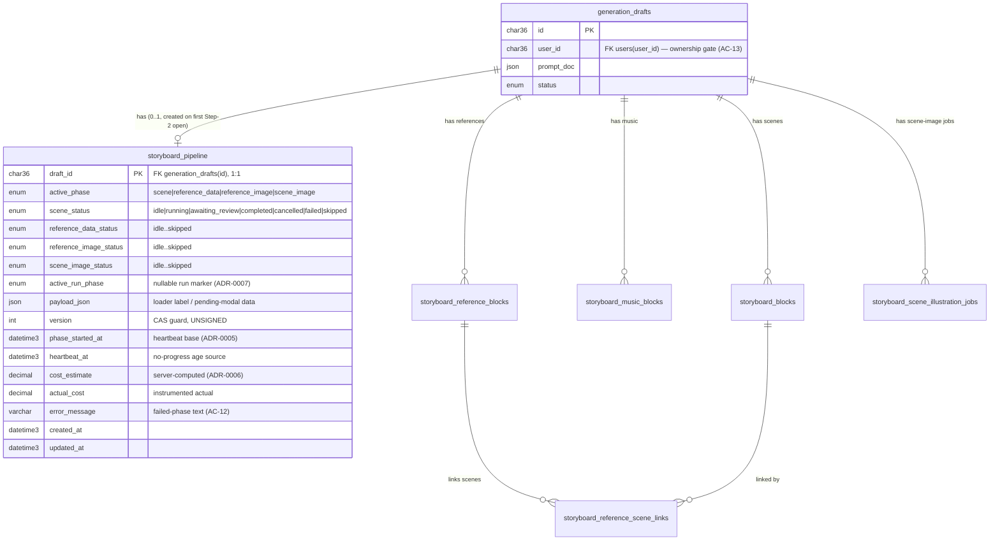

# Data model — storyboard-generation-pipeline

> **Brownfield delta.** This feature adds **one** new table — `storyboard_pipeline` — the
> single server-authoritative pipeline-state row per draft (ADR-0002). All per-unit progress
> already lives in existing tables (`storyboard_blocks`, `storyboard_music_blocks`,
> `storyboard_reference_blocks` + `window_status`, `storyboard_reference_scene_links`,
> `storyboard_reference_stars`, `storyboard_scene_illustration_jobs`); the pipeline row
> **coordinates** them by `draft_id` but does not FK into them (loose coupling, ADR-0002).
> No existing table is altered — see §"No-change findings" for why ADR-0008's "small extension"
> to the scene-illustration table is **not** needed. Migration is **staged**, not live (§Audit).

## ER diagram

> Existing tables are shown for context only; only `storyboard_pipeline` is created by this
> feature. `storyboard_reference_blocks.window_status` (`pending`/`running`/`done`/`failed`)
> and `storyboard_scene_illustration_jobs.status` (`queued`/`running`/`ready`/`failed`) are the
> per-unit terminal-states that drive incremental re-trigger (ADR-0008) — unchanged.

## Entities

### `storyboard_pipeline`

The single denormalized pipeline-state row per draft. One PK lookup answers "what should the
Creator see right now" (resume read, §6 NFR p95 ≤ 300 ms). Conventions match the storyboard
job/block tables: `CHAR(36)` ids, `DATETIME(3)` audit columns, `ENUM` sub-states, `JSON`
payload, `INT UNSIGNED version` CAS — all detected from migrations 037–055, no new style.

| Column | Type | Constraints | Notes |
|---|---|---|---|
| `draft_id` | CHAR(36) | **PK**, FK → `generation_drafts(id)` ON DELETE CASCADE | One row per draft (ADR-0002, SAD §7). PK alone enforces a single active run per draft. |
| `active_phase` | ENUM(`scene`,`reference_data`,`reference_image`,`scene_image`) | NOT NULL DEFAULT `scene` | Which phase the UI foregrounds. Fresh row auto-starts scene generation (AC-01). |
| `scene_status` | ENUM(7) | NOT NULL DEFAULT `idle` | Sub-state of scene generation. `skipped`≠`idle` (AC-07). |
| `reference_data_status` | ENUM(7) | NOT NULL DEFAULT `idle` | Sub-state of reference-data (cast proposal) generation. `awaiting_review` = Review-cast modal pending. |
| `reference_image_status` | ENUM(7) | NOT NULL DEFAULT `idle` | Sub-state of reference-image generation. |
| `scene_image_status` | ENUM(7) | NOT NULL DEFAULT `idle` | Sub-state of scene-image generation. `awaiting_review` = scene-image offer modal pending. |
| `active_run_phase` | ENUM(`scene`,`reference_data`,`reference_image`,`scene_image`) | NULL DEFAULT NULL | Active-run marker (ADR-0007). NULL = no run in flight; a trigger claims a run only when NULL (CAS) → AC-14 idempotency. |
| `payload_json` | JSON | NULL | Loader label, or pending-modal data (cast proposal + reference-image cost estimate / scene-image offer). |
| `version` | INT UNSIGNED | NOT NULL DEFAULT 1 | CAS guard; every transition increments (ADR-0007). Mirrors `storyboard_reference_blocks.version`. |
| `phase_started_at` | DATETIME(3) | NULL | Stuck-release base (ADR-0005). |
| `heartbeat_at` | DATETIME(3) | NULL | No-progress age source; tracks real per-unit progress (§11 false-positive risk). |
| `cost_estimate` | DECIMAL(10,4) | NULL | Server-computed estimate for the current expensive-phase run (ADR-0006). Matches `aggregate_estimate_credits`. |
| `actual_cost` | DECIMAL(10,4) | NULL | Instrumented actual cost; estimate-vs-actual delta emitted to telemetry (§7), not kept as SQL history. |
| `error_message` | VARCHAR(512) | NULL | Plain-language failed-phase text (AC-12), per job-table convention. |
| `created_at` | DATETIME(3) | NOT NULL DEFAULT CURRENT_TIMESTAMP(3) | Audit, per convention. |
| `updated_at` | DATETIME(3) | NOT NULL DEFAULT CURRENT_TIMESTAMP(3) ON UPDATE CURRENT_TIMESTAMP(3) | Audit, per convention. |

> ENUM(7) = `idle`,`running`,`awaiting_review`,`completed`,`cancelled`,`failed`,`skipped`
> (the lifecycle from CONTEXT.md / SAD §12; glossary's hyphenated `awaiting-review` is written
> `awaiting_review` in SQL to match the repo's snake_case enum-value style, e.g. `generate_on_step3`).

**Aggregate root:** `storyboard_pipeline` is the root of pipeline state, satellite of the
`generation_drafts` root (1:1, lazily created). Per-unit aggregates (reference blocks, scene
blocks, illustration jobs) are **separate roots** owned by the draft, coordinated by — not
nested under — the pipeline row (ADR-0002 keeps them decoupled so transitions update one row).

**Access patterns:**
- Resume read (every Step-2 open; AC-05) → PK lookup on `draft_id` (≤ 300 ms). Served by the PK.
- Reaper sweep + lazy-on-read stuck-release (AC-12, ADR-0005) → `WHERE active_run_phase IS NOT NULL AND heartbeat_at < NOW(3) - INTERVAL 10 MINUTE` → index `idx_storyboard_pipeline_active_heartbeat`.
- Ownership gate (AC-13) → `assertDraftOwner` joins `generation_drafts.user_id`; evaluated before any prerequisite/ordering check (no pipeline-table index needed — the gate hits `generation_drafts`).

**Constraints:** PK on `draft_id`; FK `draft_id` → `generation_drafts(id)` ON DELETE CASCADE
(pipeline state dies with its draft). Single-active-run is enforced by **PK(draft_id) + the
`version` CAS + the `active_run_phase IS NULL` check** — no partial-unique index is added
because the row is already unique per draft (see §Convention deviations).

## Indexes

| Index | Columns | Query it serves |
|---|---|---|
| `PRIMARY` | `draft_id` | Resume read on every Step-2 open (AC-05, Flow 1/2) — single-row PK lookup, p95 ≤ 300 ms; also the FK index (leftmost column). |
| `idx_storyboard_pipeline_active_heartbeat` | `active_run_phase, heartbeat_at` | Reaper sweep / lazy-on-read for stuck phases (AC-12, ADR-0005, Flow 2): rows with a run in flight whose heartbeat is past the 10-min bound. |

> No "just-in-case" indexes. The table is always accessed by `draft_id` (PK) except for the
> reaper's age scan; every other read joins through `generation_drafts`.

## No-change findings (existing tables this feature relies on, unaltered)

- **Incremental re-trigger (ADR-0008)** needs per-unit terminal-state. It already exists:
  `storyboard_reference_blocks.window_status` (`pending`/`running`/`done`/`failed`, migration 053)
  and `storyboard_scene_illustration_jobs.status` (`queued`/`running`/`ready`/`failed`, +
  `active_lock`, migrations 038/039). Cancel keeps `done`/`ready` units; re-trigger re-enqueues
  only non-terminal ones. **No schema change** — ADR-0008's "small extension … to
  `storyboard_scene_illustration_jobs`" is satisfied by the existing `status` column; the
  extension is application-level (the pipeline reads these statuses), not DDL.
- **Reference-below-music ordering (AC-09)** reuses `storyboard_reference_blocks.sort_order` +
  `storyboard_music_blocks.sort_order` (both `INT NOT NULL DEFAULT 0`). The service inserts
  reference blocks at `> MAX(music.sort_order)` at creation time (a snapshot, SAD §11 debt).
  Both tables already index `(draft_id, sort_order)`. **No schema change.**
- **References-feed / text-only fallback (AC-10/AC-11)** read `storyboard_reference_scene_links`
  (054) joined to `storyboard_reference_stars` (055, the selected/primary output) and
  `window_status = 'done'` ("Ready"). **No schema change.**

## Test fixtures

> The repo seeds test data **inline** in each integration test (raw `mysql2` INSERTs with
> `node:crypto` `randomUUID()`, suite-unique prefixes), hitting real MySQL — there is no shared
> factory module. Fixtures below follow that pattern; **not** placed in `migrations/`. PII guard:
> any user fixture uses `*@example.test`.

- `insertPipelineRow(conn, { draftId, activePhase?, sceneStatus?, … })` — INSERT one
  `storyboard_pipeline` row for an existing draft; defaults mirror the column DEFAULTs
  (`active_phase='scene'`, all `*_status='idle'`, `version=1`, `active_run_phase=NULL`).
- `insertRunningPhase(conn, { draftId, phase, startedAt, heartbeatAt })` — a row with
  `<phase>_status='running'`, `active_run_phase=<phase>`, set heartbeat for stuck-release tests.
- `insertStuckPhase(conn, { draftId, phase, ageMinutes })` — a `running` row whose
  `heartbeat_at = NOW(3) - INTERVAL ageMinutes MINUTE` to exercise the reaper / lazy-on-read.
- `insertAwaitingReview(conn, { draftId, phase, payloadJson, costEstimate })` — an
  `awaiting_review` row for resume-to-modal tests (AC-05) and cost-estimate re-validation.
- Reuses the existing draft/user/scene/music/reference inline inserters already present in
  `storyboardReference.repository.test.ts` for the coordinated-table assertions (AC-09/10/11).
