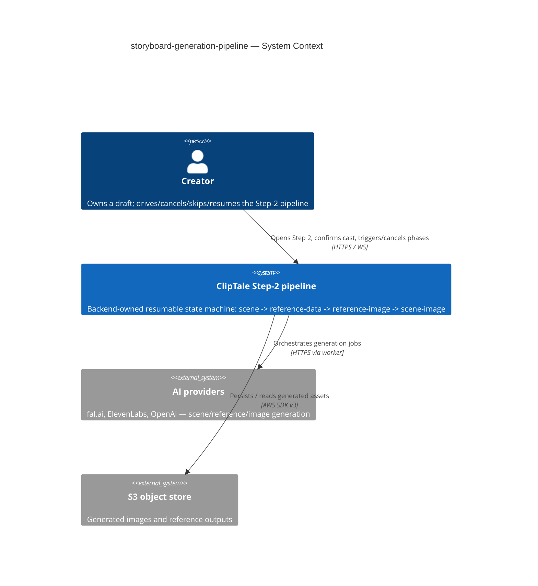
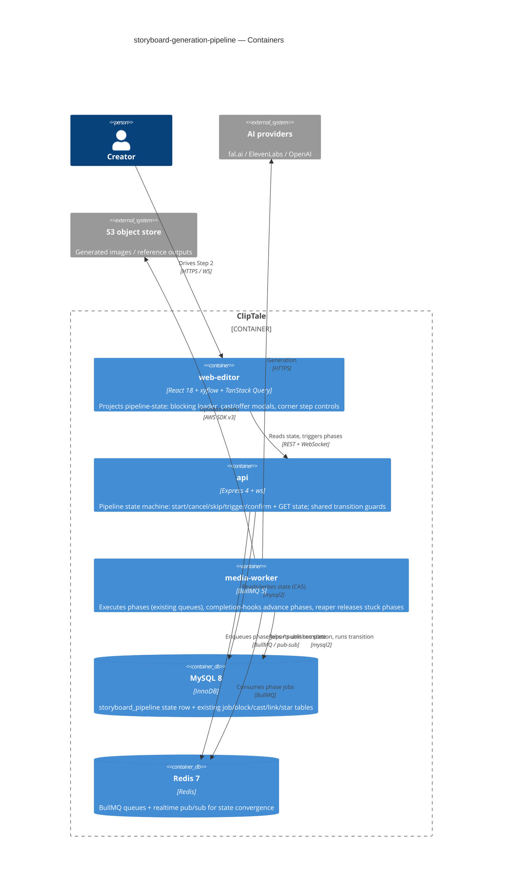

# Software Architecture Document — <slug>

<!-- 12 Arc42 sections. Empty section → <!-- N/A: <one-line reason> -->. -->
<!-- C4 Context (L1) lives inline in §3. C4 Container (L2) lives inline in §5. -->
<!-- Numbers in §10 come VERBATIM from spec.md §6 NFR — no inventing, no rounding. -->

## 1. Introduction and goals

<!-- 🎯 Why: durable memory of «what + the three dominant qualities + who cares». A year from
     now nobody recalls which three qualities were critical for this system.
     📋 Write: 1 ¶ intent + 3 lines of top-3 quality goals + a stakeholders table.
     ¶4 is the override slot — critic `Override` resolutions emit «Decision override: <headline>
     — rationale: <reason>» bullets here so downstream skills see the deliberate choice. -->

**Intent.** Replace the broken frontend-driven Step-2 ("Video Road Map") orchestration with a single **backend-owned, resumable, sequential pipeline state machine** that walks a Creator's draft through four ordered phases — scene generation → reference-data (cast proposal) generation → reference-image generation → scene-image generation — each behind a full-screen blocking loader or a review modal, where every transition, cancel, skip and re-trigger is decided and persisted server-side. The frontend renders whatever the pipeline reports; it never owns generation state. This retires the *Scene planning* and *Illustration status* statuses and relaxes the inherited reference-done gate (a scene with no Ready linked reference generates text-only instead of dead-ending the batch).

**Top-3 quality goals (1-liners; full scenarios in §10):**

1. **Resumability** — the pipeline state survives page close, reload and browser switch, reconstructed entirely from the backend on every Step-2 open (this is the core "open Step 2 and it just doesn't work" failure being fixed).
2. **Interruption-safety** — a Creator is never permanently trapped behind a wedged loader and never loses already-produced results: stuck phases self-release, cancel keeps partial results, re-trigger is incremental.
3. **Cost-integrity** — every expensive phase commits with its price shown up front, the amount actually charged stays within a bounded tolerance, and re-triggers/double-confirms never create duplicate work or duplicate spend.

**Stakeholders.**

| Role | Interest | Sign-off owner? |
|---|---|---|
| Creator | Drives, cancels, skips, re-triggers and resumes the Step-2 pipeline; owns the draft | No |
| Tech Lead | SAD approval; owns the orchestration rework and the charge-path decision (OQ-1) | Yes |
| Security Lead | New authz surface across pipeline ops + a spend/charge path (§6.1 review required) | Yes |
| PM | Consulted on §10 quality goals and §11 risk severities; owns KPI targets | No |

<!-- Decision overrides (¶4) — populated by the critic resolution loop, empty otherwise. -->

## 2. Constraints

<!-- 🎯 Why: §4 strategy only works when §2 has fixed WHAT IS ALREADY FIXED — stack, versions,
     deadline, regulatory. This is an input, not an output.
     📋 Write: four blocks — Technical / Organisational / Conventions / Regulatory.
     📌 Pin versions («<datastore> 18», not «<datastore>»); «Q3 deadline — hard», not «ideally».
     Never N/A — every feature inherits at least Conventions + Technical. -->

**Technical.**
- TypeScript 5.4+ (strict, ESM), Node ≥ 20; Turborepo + npm workspaces monorepo.
- **api:** Express 4 + Helmet + CORS + express-rate-limit + Zod; `ws` for WebSocket realtime.
- **workers:** BullMQ 5 on Redis 7 (`media-worker` runs the AI generation jobs; existing queues `storyboard-plan`, `ai-generate` (rolling window ≤ 4), `storyboard-openai-image`).
- **DB:** MySQL 8 / InnoDB via `mysql2` raw parameterized SQL — **no ORM**; in-process migration runner (`apps/api/src/db/migrations/NNN_*.sql`, currently ≥ 055).
- **web-editor:** React 18 + Vite + React-Router v7 + TanStack Query + a custom external store + `useSyncExternalStore` (no Redux/Zustand); storyboard canvas on `@xyflow/react`; inline `CSSProperties` in `*.styles.ts`.
- **Layering convention:** `routes → controllers → services → repositories`; module singletons (`pool`, `redis`, `s3`, `config`) imported directly — **no DI container**.

**Organisational.**
- Single-developer, high-iteration cadence (the cast/reference pipeline took 13 post-ship fixes in one day — re-owning the orchestration once is the response).
- No hard external deadline; this is a stabilisation rework of a production-broken seam, prioritised over new Step-2 capability.
- This pipeline **subsumes and retires** four inherited features' glue (generate-ai-flow, storyboard-reference-flows, scene-generation-reference-gate, reference-generation-autostart).

**Conventions.**
- `docs/architecture-rules.md` + `docs/architecture-map.md` (current map at commit `9f943df`; this design also relies on the post-map cast/reference migrations 052–055).
- IDs: **UUID v4** via `randomUUID()`, stored `CHAR(36)`, validated `z.string().uuid()`.
- Errors: typed classes in `apps/api/src/lib/errors.ts` (`ValidationError` 400, `UnauthorizedError` 401, `ForbiddenError` 403, `NotFoundError` 404, `ConflictError`/`OptimisticLockError` 409, `UnprocessableEntityError` 422, `GoneError` 410); central Express handler maps `err.statusCode`.
- OpenAPI is hand-maintained (`packages/api-contracts/src/openapi.ts`) — spec + impl updated in the **same commit**.
- `process.env` read only in `apps/*/src/config.ts`, vars prefixed `APP_*`, Zod-validated.
- Tests: Vitest co-located `*.test.ts`; API integration tests hit a **real MySQL** (`singleFork: true`), never mock the DB.

**Regulatory / external.**
- Data classification: internal — Creator-owned storyboard creative content; no public exposure, no new personal data.
- A new **spend/charge path** is exercised (image generation behind a cost estimate) → **security review required** (§6.1).
- No external compliance regime (GDPR-class personal data not newly touched); soft-delete + ownership scoping inherited from the platform.

## 3. Context and scope

<!-- 🎯 Why: draws the SYSTEM BOUNDARY — who talks to it from outside, where the trust zone ends.
     Without §3, §5 and §8 (authorization) blur — unclear what's «inside» vs «outside».
     📋 Write: 2–3 sentences of business context + an external-systems table + a C4Context block.
     📌 «External: none (deliberate, no third-party in v1)» is itself a decision worth stating.
     Trust boundary — the line past which you don't trust data without checking it.
     Never N/A — greenfield still draws the planned actors + external systems. -->

The Step-2 pipeline drives a single Creator's draft from an empty Video Road Map to fully illustrated scenes. It is a **backend-owned state machine**: the api holds the authoritative pipeline state per draft, the media-worker executes each phase's generation against external AI providers, and the web-editor is a pure projection that reconstructs the screen (running loader or pending modal) from the backend state on every Step-2 open. The **trust boundary** is the api authorization gate: every pipeline operation — reading state, starting/cancelling/skipping/triggering a phase, confirming a cast — is gated on the caller **owning the draft**, evaluated *before* any prerequisite/ordering check so a non-owner cannot probe a draft's existence (AC-13).

<!-- brownfield: extends the existing Step-2 storyboard subsystem — replaces the frontend-owned orchestration (useStoryboardPlanGeneration / useStoryboardIllustrations hooks, the StoryboardAutomationPhase client enum) with a server-authoritative pipeline; reuses the BullMQ queues (storyboard-plan, ai-generate rolling-window, storyboard-openai-image), the Redis pub/sub + ws realtime (publishStoryboardStatusUpdated), and the cast/reference tables (migrations 052–055). No backend pipeline-state table exists yet. -->

**External systems (in / out):**

| Actor or system | Type | Interaction |
|---|---|---|
| Creator | Person | Owns a draft; drives/cancels/skips/resumes the pipeline, confirms the cast, accepts scene-image spend |
| AI providers (fal.ai, ElevenLabs, OpenAI) | System (external) | Scene planning, cast extraction, reference-image and scene-image generation — invoked only by the worker |
| S3 / object store | System (external) | Stores generated reference outputs and scene images (presigned read/write) |
| MySQL 8 | System (internal) | Authoritative pipeline-state + block/cast/link/star persistence |
| Redis 7 | System (internal) | BullMQ queues (phase execution) + realtime pub/sub (state convergence to observer tabs) |

**C4 Context (L1):**



## 4. Solution strategy

<!-- 🎯 Why: the 3–4 STRATEGIC PILLARS every ADR grows from. Without §4 each ADR looks random —
     there's no umbrella. ⭐ The densest section — the blast-radius gate fires almost always here
     (decisions are irreversible + multi-module).
     📋 Write: 3–4 choices; each a heading + 2–3 sentences of rationale.
     📌 «Store content as a table of typed blocks» is a pillar — ADR-0001 grows from it. -->

**Target surfaces (the §4 first decision).** `target_surfaces = [backend-service, worker, web-frontend]` (frontmatter). The rework spans three surfaces because orchestration authority moves server-side: the **api** (backend-service) holds the authoritative state machine and exposes the pipeline operations; the **media-worker** (worker) executes each phase against the AI providers and reports unit completion back; the **web-editor** (web-frontend) becomes a pure projection of the backend state. Single-surface alternatives are non-viable — frontend-only is the broken status quo, backend-only renders nothing. → **ADR-0001**.

**UI-architecture (web-frontend).** No new SPA architecture: the existing React-18 + custom-external-store + TanStack-Query + `@xyflow/react` storyboard surface is kept. The pipeline UI (blocking loader, Review-cast-proposal modal, scene-image-offer modal, corner step controls) is reconstructed on every Step-2 open from a single backend pipeline-state read and converges via the existing Redis-pub/sub realtime — **no client-owned orchestration state** (the `StoryboardAutomationPhase` client enum and the `useStoryboard*Generation` orchestration hooks are retired). This is a direct consequence of ADR-0001, not an independent fork, so it stays an inline note rather than its own ADR.

**Top strategic choices (the seeds for ADRs):**

1. **Backend-owned orchestration authority** — the Step-2 flow becomes a server-authoritative state machine; the frontend renders what it reports and never owns generation state. Directly serves QG-1 *Resumability* (state is reconstructed from the backend, not client memory) and is the root fix for the production failure. → **ADR-0001**.
2. **A single denormalized pipeline-state row per draft** — one `storyboard_pipeline` row carries `active_phase` + per-phase sub-state + the UI payload (loader label / pending-modal data), read on every open in ≤ 300 ms (§6 NFR); per-unit detail stays in the existing job/block tables. Chosen over derive-on-read (no place to store `skipped`≠`idle` or single-active-run) and event-sourcing (overkill for a synchronous single-draft machine, off-convention vs raw-SQL). → **ADR-0002**.
3. **Phases advance via worker completion-hooks into a backend transition service** — the worker reports unit completion (reusing the `onReferenceBlockJobComplete` pattern) and the api owns all transitions and guards, keeping the state-machine invariants in one place. Serves QG-2 *Interruption-safety* (transitions, including stuck-release, are decided server-side). → **ADR-0003**.
4. **Resume-by-read with observer tabs** — every Step-2 open reads the single pipeline-state; other tabs are observers that converge via realtime within ≤ 2 s (§6), with no hard draft lock (resolves OQ-4). Combined with idempotency this makes a second tab harmless. → **ADR-0004**, **ADR-0007**.
5. **Interruption-safety mechanisms** — stuck phases self-release via hybrid lazy-on-read + a reaper sweep at a 10-min heartbeat bound (resolves OQ-3 → **ADR-0005**); cancel keeps partial results and re-trigger is incremental over per-unit terminal-state, never re-spending on completed units (AC-06 → **ADR-0008**).
6. **Cost transparency without a billing build-out** — the cost estimate is computed and re-validated **server-side** and the actual cost is instrumented per run (estimate-vs-actual delta from day 1), but real credit *deduction* is deferred since no credits substrate exists in the repo (OQ-1 → **ADR-0006**; deduction ownership → §11 OQ row).

Each tactical decision in later sections traces to one of these seeds. Tactical decisions that *contradict* a strategic choice are red flags — surfaced in §11.

## 5. Building block view

<!-- 🎯 Why: INTERNAL DECOMPOSITION — modules, containers, datastores. The static topology: who
     may talk to whom. Without §5, §6 (the flows) has no vocabulary of participants.
     📋 Write: 1 ¶ on the style (layered / hexagonal / clean / event-driven) + a folder tree + a
     C4Container block.
     📌 Draw ONE Container per declared `target_surface` (frontmatter): a fullstack
     [backend-service, web-frontend] = a backend-API container + a web/SPA container; a
     [backend-service, mobile-app] = the API + the mobile app. The Container(web, …) line below is
     just one surface's container — swap/add per what was declared in §4. → _shared/surfaces.md
     📌 e.g. «web app, content API, media worker, datastore, object store, CDN». -->

**Layered (`routes → controllers → services → repositories`, module singletons, no DI) plus event-driven worker orchestration.** A new `storyboardPipeline` module in the api owns the state machine. The transition logic + guards + version-CAS live in a **shared transition module imported by both the api and the media-worker** (no internal network hop): the api invokes it on Creator actions (start/cancel/skip/trigger/confirm), the worker invokes it from its job completion-hooks (ADR-0003). The web-editor is a projection surface (ADR-0001): one `usePipelineState` hook reads the state and subscribes to realtime; the loader/modals/corner-controls are stateless renders of the payload.

**Internal decomposition:**

```
shared transition module (importable by api + worker) — ADR-0003
└── storyboardPipeline.transition.ts            # transition table, phase-order/single-active-run guards, version-CAS

apps/api/src/
├── routes/storyboardPipeline.routes.ts          # GET state · start / cancel / skip / trigger / confirm-cast
├── controllers/storyboardPipeline.controller.ts # Zod-validate · ownership-before-prerequisite (AC-13) · error-map
├── services/storyboardPipeline.service.ts       # use cases + cost-estimate compute / server-side re-validate
├── repositories/storyboardPipeline.repository.ts# storyboard_pipeline row · active-run marker · CAS
└── db/migrations/056_storyboard_pipeline.sql    # state row: active_phase, per-phase sub-state, payload_json,
                                                 #   version, active_run marker, phase_started_at + heartbeat,
                                                 #   cost_estimate / actual_cost
apps/media-worker/src/jobs/
├── *.job.ts (existing)                           # on unit completion → call shared transition module
└── storyboardPipelineReaper.job.ts             # BullMQ repeatable: release phases past the 10-min bound (ADR-0005)
apps/web-editor/src/features/storyboard/
├── hooks/usePipelineState.ts                    # single GET state + realtime; retires useStoryboard*Generation
├── components/{BlockingLoader,ReviewCastProposalModal,SceneImageOfferModal,StepCorners}.tsx
└── api.ts                                        # pipeline endpoints
```

**C4 Container (L2):** <!-- one container per declared target_surface: web-frontend, backend-service (api), worker (media-worker) -->



## 6. Runtime view

<!-- 🎯 Why: the RUNTIME FLOW of 1–2 critical scenarios — who talks to whom, when, in what order.
     Without §6, §5 is just boxes with no life.
     📋 Write: a Mermaid sequenceDiagram. Participants are names from §5 (don't invent new ones).
     Messages are semantic («saves a draft»), NO HTTP verbs / paths / status codes — endpoint-level
     sequences arrive at the `api` stage.
     📌 e.g. «author → web: composes draft → web → content API: save». Seed the primary flow(s) here;
     the `sequences` stage then covers every §5 AC (no cap). Never N/A for M+; XS/S keeps ≥1 happy-path flow. -->

**Critical flow 1: <flow name>**

```mermaid
sequenceDiagram
    actor Actor
    participant Web
    participant Service
    participant Store
    Actor->>Web: <action>
    Web->>Service: <call>
    Service->>Store: <write>
    Store-->>Service: ok
    Service-->>Web: result
    Web-->>Actor: confirmation
```

**Critical flow 2: <e.g. async event propagation>** — <if applicable, otherwise N/A>.

## 7. Deployment view

<!-- 🎯 Why: the TOPOLOGY DevOps must know without reading the deploy charts — how many replicas,
     where the background worker lives, AT WHAT NUMBERS we scale.
     📋 Write: 2–3 sentences on topology + monitoring + concrete threshold numbers.
     📌 e.g. «500 authors → partition by quarter» (not «we'll think about scale later»).
     🎯 N/A allowed for XS/S that reuses an existing deployment unit with no change.
     Deployment-diagram scaffold → templates/deployment.md. -->

<Topology in 2–3 sentences. Where it runs, replicas, scaling thresholds.>

**Monitoring:**
- <Metrics — e.g. `<metric_name>`>
- <Alerts — e.g. «worker lag > 10 min → page on-call»>
- <Tracing — e.g. spans on the request boundary>

**Scaling thresholds:**
- <e.g. comfortable in one table up to N rows/year>
- <e.g. partition by quarter above N rows/year>

<!-- For XS/S with no deployment change: <!-- N/A: reuses existing deployment unit, no infra change --> -->

## 8. Crosscutting concepts

<!-- 🎯 Why: CROSS-CUTTING PATTERNS spanning several modules: logging, errors, authorization, ID
     strategy, events, caching. ⭐ The second-densest section. A pattern inside one module is NOT
     here; a project-wide convention belongs in the convention file.
     📋 Write: a table — concept / convention / where defined. One row per concept.
     📌 e.g. «sortable time-based IDs generated in the app layer» as a default from the convention file. -->

| Concept | Convention | Where defined |
|---|---|---|
| Logging | <e.g. structured, fields `module=<name>`> | <convention file §X or here> |
| Authentication | <e.g. token-based via middleware> | <convention file §X> |
| Error handling | <e.g. domain sentinel → ports error mapping → JSON> | <convention file §X> |
| ID strategy | <e.g. sortable time-based ID in the app layer> | <convention file §X> |
| Internationalisation | <e.g. N/A, single language> | — |
| Observability | <e.g. tracing on the request boundary> | — |
| Events | <module-specific patterns, if any> | <here> |

## 9. Architecture decisions

<!-- 🎯 Why: the REVERSE INDEX onto the adr/ folder. `ls adr/` gives the files; §9 gives the
     semantics — why they exist, which SAD section they attach to, what status.
     📋 Write: a 4-column table, one row per ADR. Mixed status is fine.
     📌 e.g. «0001 | Store content as a table of typed blocks | Accepted | §4». -->

| # | Title | Status | Section |
|---|---|---|---|
| <NNNN> | <imperative — e.g. "Use a sliding-window counter for rate limiting"> | Accepted | §<N> |
| <NNNN> | <imperative — e.g. "Co-locate the worker in the API process"> | Accepted | §<N> |

ADR files live under `docs/features/<slug>/adr/NNNN-<title>.md`.

## 10. Quality requirements

<!-- 🎯 Why: the QUALITY TREE — take a goal from §1 and break it into concrete leaves: tests,
     metrics, configs, drills. ⭐ Without §10, §1 is a manifesto. With §10 each declaration maps
     to something PROVABLE.
     📋 Write: per §1 goal — When / Then / How-verify. Numbers from spec §6 NFR VERBATIM (don't
     round ≤250ms to ≤300ms — that's a critic F6 hit).
     📌 e.g. «p95 ≤ 500 ms on a block update, verified by a 100 req/s load test». -->

Each top-3 goal from §1 expanded into a full scenario:

**QG-1. <quality attribute>**
- **When:** <trigger condition>
- **Then:** <expected behaviour with numbers from spec §6 NFR>
- **How verify:** <test / chaos drill / load test / metric>

**QG-2. <quality attribute>**
- **When:** <trigger>
- **Then:** <expected>
- **How verify:** <how>

**QG-3. <quality attribute>**
- **When:** <trigger>
- **Then:** <expected>
- **How verify:** <how>

## 11. Risks and technical debt

<!-- 🎯 Why: ⭐ collects EVERYTHING that can break — not only the technical. Without §11 risks get
     discussed at standups and lost; debt lives only in the head of whoever accepted it.
     📋 Write: a risk/debt table — severity — mitigation — owner. Accepted debt in its own block.
     📌 The first risk is often a product risk, not a technical one. That's normal. -->

<!-- Severity literals: Low / Medium / High for regular risks; "Open question" for rows created by
     a Save-as-OQ resolution during the Socratic walk (see references/socratic.md). -->

| Risk / debt | Severity | Mitigation | Owner |
|---|---|---|---|
| <e.g. Worker lag may reach hours during a downstream outage> | Medium | <alert >10 min, on-call playbook, retry backoff> | <DevOps> |
| <e.g. No event-schema versioning in v1> | Medium | <ADR-NNNN planned for v2, tolerate unknown fields> | <Backend> |
| Open architectural decision: <decision-headline> | Open question | Resolve before <stage trigger or YYYY-MM-DD>; <inline rationale from the Save-as-OQ> | <owner> |

**Accepted debt (acceptable in v1, plan to fix later):**
- <e.g. the entity is immutable / unversioned — OK for v1, may need audit versioning in v2>

## 12. Glossary

<!-- 🎯 Why: ⭐ the DOMAIN GLOSSARY that ends arguments a year later («checkpoint — weekly or
     biweekly? quarter — calendar or fiscal?»).
     📋 Write: a term / meaning table. Business + technical terms mixed.
     📌 e.g. «Lesson | a unit inside a course made of blocks (text, video)». -->

| Term | Meaning |
|---|---|
| <e.g. domain object A> | <its meaning in this domain> |
| <e.g. domain object B> | <its meaning> |
| <e.g. domain invariant name> | <the rule, in plain language> |
