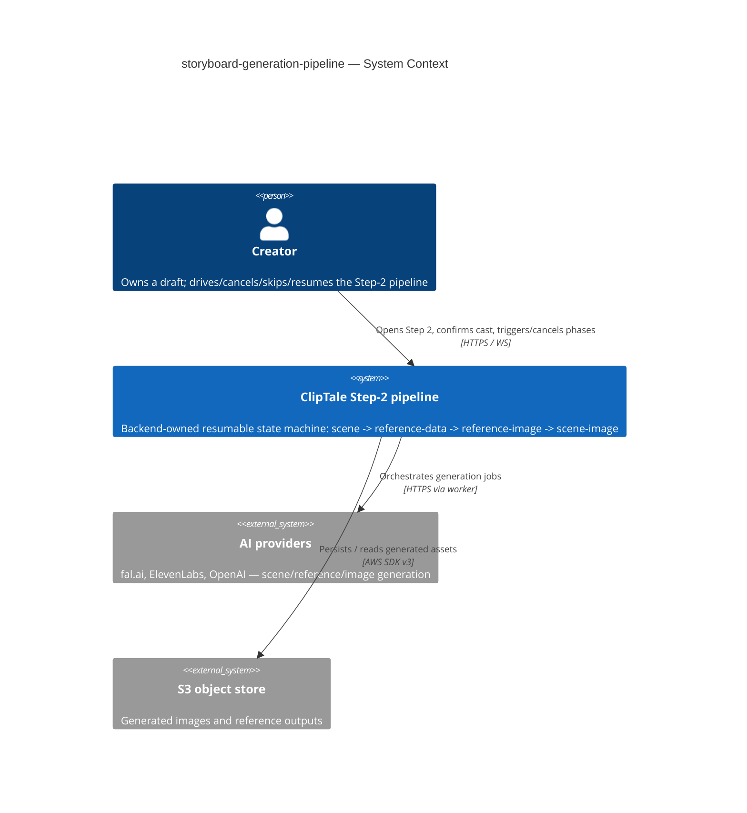
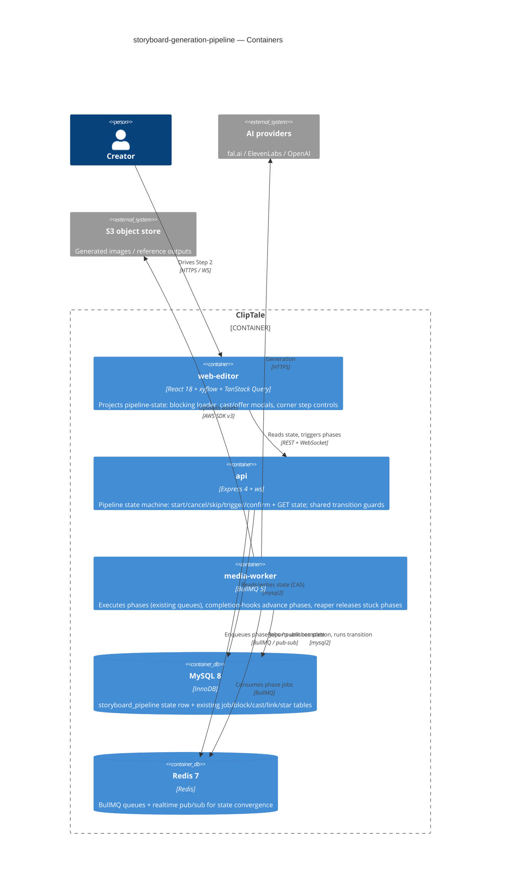

# Software Architecture Document — <slug>

<!-- 12 Arc42 sections. Empty section → <!-- N/A: <one-line reason> -->. -->
<!-- C4 Context (L1) lives inline in §3. C4 Container (L2) lives inline in §5. -->
<!-- Numbers in §10 come VERBATIM from spec.md §6 NFR — no inventing, no rounding. -->

## 1. Introduction and goals

<!-- 🎯 Why: durable memory of «what + the three dominant qualities + who cares». A year from
     now nobody recalls which three qualities were critical for this system.
     📋 Write: 1 ¶ intent + 3 lines of top-3 quality goals + a stakeholders table.
     ¶4 is the override slot — critic `Override` resolutions emit «Decision override: <headline>
     — rationale: <reason>» bullets here so downstream skills see the deliberate choice. -->

**Intent.** Replace the broken frontend-driven Step-2 ("Video Road Map") orchestration with a single **backend-owned, resumable, sequential pipeline state machine** that walks a Creator's draft through four ordered phases — scene generation → reference-data (cast proposal) generation → reference-image generation → scene-image generation — each behind a full-screen blocking loader or a review modal, where every transition, cancel, skip and re-trigger is decided and persisted server-side. The frontend renders whatever the pipeline reports; it never owns generation state. This retires the *Scene planning* and *Illustration status* statuses and relaxes the inherited reference-done gate (a scene with no Ready linked reference generates text-only instead of dead-ending the batch).

**Top-3 quality goals (1-liners; full scenarios in §10):**

1. **Resumability** — the pipeline state survives page close, reload and browser switch, reconstructed entirely from the backend on every Step-2 open (this is the core "open Step 2 and it just doesn't work" failure being fixed).
2. **Interruption-safety** — a Creator is never permanently trapped behind a wedged loader and never loses already-produced results: stuck phases self-release, cancel keeps partial results, re-trigger is incremental.
3. **Cost-integrity** — every expensive phase commits with its price shown up front, the amount actually charged stays within a bounded tolerance, and re-triggers/double-confirms never create duplicate work or duplicate spend.

**Stakeholders.**

| Role | Interest | Sign-off owner? |
|---|---|---|
| Creator | Drives, cancels, skips, re-triggers and resumes the Step-2 pipeline; owns the draft | No |
| Tech Lead | SAD approval; owns the orchestration rework and the charge-path decision (OQ-1) | Yes |
| Security Lead | New authz surface across pipeline ops + a spend/charge path (§6.1 review required) | Yes |
| PM | Consulted on §10 quality goals and §11 risk severities; owns KPI targets | No |

<!-- Decision overrides (¶4) — populated by the critic resolution loop, empty otherwise. -->
- **Decision override: OQ-1 deliberately split** — rationale: spec §8 OQ-1 (due "before sdd:design") is resolved in two halves. The *cost-estimate + instrumentation* half is decided now (ADR-0006, instrument-only — satisfies the "before sdd:design" gate); the *credit-deduction ownership* half is deferred to a §11 OQ row due **after the KPI window (~2026-07-12)**, since no credits substrate exists and deduction should land on real estimate-vs-actual data.

## 2. Constraints

<!-- 🎯 Why: §4 strategy only works when §2 has fixed WHAT IS ALREADY FIXED — stack, versions,
     deadline, regulatory. This is an input, not an output.
     📋 Write: four blocks — Technical / Organisational / Conventions / Regulatory.
     📌 Pin versions («<datastore> 18», not «<datastore>»); «Q3 deadline — hard», not «ideally».
     Never N/A — every feature inherits at least Conventions + Technical. -->

**Technical.**
- TypeScript 5.4+ (strict, ESM), Node ≥ 20; Turborepo + npm workspaces monorepo.
- **api:** Express 4 + Helmet + CORS + express-rate-limit + Zod; `ws` for WebSocket realtime.
- **workers:** BullMQ 5 on Redis 7 (`media-worker` runs the AI generation jobs; existing queues `storyboard-plan`, `ai-generate` (rolling window ≤ 4), `storyboard-openai-image`).
- **DB:** MySQL 8 / InnoDB via `mysql2` raw parameterized SQL — **no ORM**; in-process migration runner (`apps/api/src/db/migrations/NNN_*.sql`, currently ≥ 055).
- **web-editor:** React 18 + Vite + React-Router v7 + TanStack Query + a custom external store + `useSyncExternalStore` (no Redux/Zustand); storyboard canvas on `@xyflow/react`; inline `CSSProperties` in `*.styles.ts`.
- **Layering convention:** `routes → controllers → services → repositories`; module singletons (`pool`, `redis`, `s3`, `config`) imported directly — **no DI container**.

**Organisational.**
- Single-developer, high-iteration cadence (the cast/reference pipeline took 13 post-ship fixes in one day — re-owning the orchestration once is the response).
- No hard external deadline; this is a stabilisation rework of a production-broken seam, prioritised over new Step-2 capability.
- This pipeline **subsumes and retires** four inherited features' glue (generate-ai-flow, storyboard-reference-flows, scene-generation-reference-gate, reference-generation-autostart).

**Conventions.**
- `docs/architecture-rules.md` + `docs/architecture-map.md` (current map at commit `9f943df`; this design also relies on the post-map cast/reference migrations 052–055).
- IDs: **UUID v4** via `randomUUID()`, stored `CHAR(36)`, validated `z.string().uuid()`.
- Errors: typed classes in `apps/api/src/lib/errors.ts` (`ValidationError` 400, `UnauthorizedError` 401, `ForbiddenError` 403, `NotFoundError` 404, `ConflictError`/`OptimisticLockError` 409, `UnprocessableEntityError` 422, `GoneError` 410); central Express handler maps `err.statusCode`.
- OpenAPI is hand-maintained (`packages/api-contracts/src/openapi.ts`) — spec + impl updated in the **same commit**.
- `process.env` read only in `apps/*/src/config.ts`, vars prefixed `APP_*`, Zod-validated.
- Tests: Vitest co-located `*.test.ts`; API integration tests hit a **real MySQL** (`singleFork: true`), never mock the DB.

**Regulatory / external.**
- Data classification: internal — Creator-owned storyboard creative content; no public exposure, no new personal data.
- A new **spend/charge path** is exercised (image generation behind a cost estimate) → **security review required** (§6.1).
- No external compliance regime (GDPR-class personal data not newly touched); soft-delete + ownership scoping inherited from the platform.

## 3. Context and scope

<!-- 🎯 Why: draws the SYSTEM BOUNDARY — who talks to it from outside, where the trust zone ends.
     Without §3, §5 and §8 (authorization) blur — unclear what's «inside» vs «outside».
     📋 Write: 2–3 sentences of business context + an external-systems table + a C4Context block.
     📌 «External: none (deliberate, no third-party in v1)» is itself a decision worth stating.
     Trust boundary — the line past which you don't trust data without checking it.
     Never N/A — greenfield still draws the planned actors + external systems. -->

The Step-2 pipeline drives a single Creator's draft from an empty Video Road Map to fully illustrated scenes. It is a **backend-owned state machine**: the api holds the authoritative pipeline state per draft, the media-worker executes each phase's generation against external AI providers, and the web-editor is a pure projection that reconstructs the screen (running loader or pending modal) from the backend state on every Step-2 open. The **trust boundary** is the api authorization gate: every pipeline operation — reading state, starting/cancelling/skipping/triggering a phase, confirming a cast — is gated on the caller **owning the draft**, evaluated *before* any prerequisite/ordering check so a non-owner cannot probe a draft's existence (AC-13).

<!-- brownfield: extends the existing Step-2 storyboard subsystem — replaces the frontend-owned orchestration (useStoryboardPlanGeneration / useStoryboardIllustrations hooks, the StoryboardAutomationPhase client enum) with a server-authoritative pipeline; reuses the BullMQ queues (storyboard-plan, ai-generate rolling-window, storyboard-openai-image), the Redis pub/sub + ws realtime (publishStoryboardStatusUpdated), and the cast/reference tables (migrations 052–055). No backend pipeline-state table exists yet. -->

**External systems (in / out):**

| Actor or system | Type | Interaction |
|---|---|---|
| Creator | Person | Owns a draft; drives/cancels/skips/resumes the pipeline, confirms the cast, accepts scene-image spend |
| AI providers (fal.ai, ElevenLabs, OpenAI) | System (external) | Scene planning, cast extraction, reference-image and scene-image generation — invoked only by the worker |
| S3 / object store | System (external) | Stores generated reference outputs and scene images (presigned read/write) |
| MySQL 8 | System (internal) | Authoritative pipeline-state + block/cast/link/star persistence |
| Redis 7 | System (internal) | BullMQ queues (phase execution) + realtime pub/sub (state convergence to observer tabs) |

**C4 Context (L1):**



## 4. Solution strategy

<!-- 🎯 Why: the 3–4 STRATEGIC PILLARS every ADR grows from. Without §4 each ADR looks random —
     there's no umbrella. ⭐ The densest section — the blast-radius gate fires almost always here
     (decisions are irreversible + multi-module).
     📋 Write: 3–4 choices; each a heading + 2–3 sentences of rationale.
     📌 «Store content as a table of typed blocks» is a pillar — ADR-0001 grows from it. -->

**Target surfaces (the §4 first decision).** `target_surfaces = [backend-service, worker, web-frontend]` (frontmatter). The rework spans three surfaces because orchestration authority moves server-side: the **api** (backend-service) holds the authoritative state machine and exposes the pipeline operations; the **media-worker** (worker) executes each phase against the AI providers and reports unit completion back; the **web-editor** (web-frontend) becomes a pure projection of the backend state. Single-surface alternatives are non-viable — frontend-only is the broken status quo, backend-only renders nothing. → **ADR-0001**.

**UI-architecture (web-frontend).** No new SPA architecture: the existing React-18 + custom-external-store + TanStack-Query + `@xyflow/react` storyboard surface is kept. The pipeline UI (blocking loader, Review-cast-proposal modal, scene-image-offer modal, corner step controls) is reconstructed on every Step-2 open from a single backend pipeline-state read and converges via the existing Redis-pub/sub realtime — **no client-owned orchestration state** (the `StoryboardAutomationPhase` client enum and the `useStoryboard*Generation` orchestration hooks are retired). This is a direct consequence of ADR-0001, not an independent fork, so it stays an inline note rather than its own ADR.

**Top strategic choices (the seeds for ADRs):**

1. **Backend-owned orchestration authority** — the Step-2 flow becomes a server-authoritative state machine; the frontend renders what it reports and never owns generation state. Directly serves QG-1 *Resumability* (state is reconstructed from the backend, not client memory) and is the root fix for the production failure. → **ADR-0001**.
2. **A single denormalized pipeline-state row per draft** — one `storyboard_pipeline` row carries `active_phase` + per-phase sub-state + the UI payload (loader label / pending-modal data), read on every open in ≤ 300 ms (§6 NFR); per-unit detail stays in the existing job/block tables. Chosen over derive-on-read (no place to store `skipped`≠`idle` or single-active-run) and event-sourcing (overkill for a synchronous single-draft machine, off-convention vs raw-SQL). → **ADR-0002**.
3. **Phases advance via worker completion-hooks into a backend transition service** — the worker reports unit completion (reusing the `onReferenceBlockJobComplete` pattern) and the api owns all transitions and guards, keeping the state-machine invariants in one place. Serves QG-2 *Interruption-safety* (transitions, including stuck-release, are decided server-side). → **ADR-0003**.
4. **Resume-by-read with observer tabs** — every Step-2 open reads the single pipeline-state; other tabs are observers that converge via realtime within ≤ 2 s (§6), with no hard draft lock (resolves OQ-4). Combined with idempotency this makes a second tab harmless. → **ADR-0004**, **ADR-0007**.
5. **Interruption-safety mechanisms** — stuck phases self-release via hybrid lazy-on-read + a reaper sweep at a 10-min heartbeat bound (resolves OQ-3 → **ADR-0005**); cancel keeps partial results and re-trigger is incremental over per-unit terminal-state, never re-spending on completed units (AC-06 → **ADR-0008**).
6. **Cost transparency without a billing build-out** — the cost estimate is computed and re-validated **server-side** and the actual cost is instrumented per run (estimate-vs-actual delta from day 1), but real credit *deduction* is deferred since no credits substrate exists in the repo (OQ-1 → **ADR-0006**; deduction ownership → §11 OQ row).

Each tactical decision in later sections traces to one of these seeds. Tactical decisions that *contradict* a strategic choice are red flags — surfaced in §11.

## 5. Building block view

<!-- 🎯 Why: INTERNAL DECOMPOSITION — modules, containers, datastores. The static topology: who
     may talk to whom. Without §5, §6 (the flows) has no vocabulary of participants.
     📋 Write: 1 ¶ on the style (layered / hexagonal / clean / event-driven) + a folder tree + a
     C4Container block.
     📌 Draw ONE Container per declared `target_surface` (frontmatter): a fullstack
     [backend-service, web-frontend] = a backend-API container + a web/SPA container; a
     [backend-service, mobile-app] = the API + the mobile app. The Container(web, …) line below is
     just one surface's container — swap/add per what was declared in §4. → _shared/surfaces.md
     📌 e.g. «web app, content API, media worker, datastore, object store, CDN». -->

**Layered (`routes → controllers → services → repositories`, module singletons, no DI) plus event-driven worker orchestration.** A new `storyboardPipeline` module in the api owns the state machine. The transition logic + guards + version-CAS live in a **shared transition module imported by both the api and the media-worker** (no internal network hop): the api invokes it on Creator actions (start/cancel/skip/trigger/confirm), the worker invokes it from its job completion-hooks (ADR-0003). The web-editor is a projection surface (ADR-0001): one `usePipelineState` hook reads the state and subscribes to realtime; the loader/modals/corner-controls are stateless renders of the payload.

**Internal decomposition:**

```
shared transition module (importable by api + worker) — ADR-0003
└── storyboardPipeline.transition.ts            # transition table, phase-order/single-active-run guards, version-CAS

apps/api/src/
├── routes/storyboardPipeline.routes.ts          # GET state · start / cancel / skip / trigger / confirm-cast
├── controllers/storyboardPipeline.controller.ts # Zod-validate · ownership-before-prerequisite (AC-13) · error-map
├── services/storyboardPipeline.service.ts       # use cases + cost-estimate compute / server-side re-validate
├── repositories/storyboardPipeline.repository.ts# storyboard_pipeline row · active-run marker · CAS
└── db/migrations/056_storyboard_pipeline.sql    # state row: active_phase, per-phase sub-state, payload_json,
                                                 #   version, active_run marker, phase_started_at + heartbeat,
                                                 #   cost_estimate / actual_cost
apps/media-worker/src/jobs/
├── *.job.ts (existing)                           # on unit completion → call shared transition module
└── storyboardPipelineReaper.job.ts             # BullMQ repeatable: release phases past the 10-min bound (ADR-0005)
apps/web-editor/src/features/storyboard/
├── hooks/usePipelineState.ts                    # single GET state + realtime; retires useStoryboard*Generation
├── components/{BlockingLoader,ReviewCastProposalModal,SceneImageOfferModal,StepCorners}.tsx
└── api.ts                                        # pipeline endpoints
```

**C4 Container (L2):** <!-- one container per declared target_surface: web-frontend, backend-service (api), worker (media-worker) -->



## 6. Runtime view

<!-- 🎯 Why: the RUNTIME FLOW of 1–2 critical scenarios — who talks to whom, when, in what order.
     Without §6, §5 is just boxes with no life.
     📋 Write: a Mermaid sequenceDiagram. Participants are names from §5 (don't invent new ones).
     Messages are semantic («saves a draft»), NO HTTP verbs / paths / status codes — endpoint-level
     sequences arrive at the `api` stage.
     📌 e.g. «author → web: composes draft → web → content API: save». Seed the primary flow(s) here;
     the `sequences` stage then covers every §5 AC (no cap). Never N/A for M+; XS/S keeps ≥1 happy-path flow. -->

> Two seed flows (1–2) plus the `sequences`-stage flows (3–8) below cover every §5 AC: happy-path AC-01→04 (Flow 1); resume/observer/stuck AC-05/AC-12 (Flow 2); cancel + incremental re-trigger AC-06 (Flow 3); skip AC-07 (Flow 4); phase-order guard AC-08/AC-15 (Flow 5); reference-below-music + idempotent re-confirm AC-09/AC-14 (Flow 6); references-feed/text-only AC-10/AC-11 (Flow 7); authorization deny-and-hide AC-13 (Cross-cutting). Participants are the §5 containers (`Web` = web-editor, `Api` = api, `Worker` = media-worker, `Store` = MySQL; `User`/`Creator` are the actor); messages are semantic (endpoint-level detail arrives at the `api` stage).

**Critical flow 1: full happy-path pipeline (AC-01 → AC-04, AC-10/AC-11)**

```mermaid
sequenceDiagram
    actor Creator
    participant Web
    participant Api
    participant Store
    participant Worker
    Creator->>Web: opens Step 2 on an unplanned draft
    Web->>Api: read pipeline state
    Api->>Store: load state row (none yet) — create it, claim active-run, start scene generation
    Api->>Worker: enqueue scene generation
    Api-->>Web: state = scene generation running
    Web-->>Creator: full-screen loader (scene generation)
    Worker->>Store: record scene blocks, run transition (advance to reference-data)
    Worker->>Api: publish state
    Api-->>Web: state via realtime (reference-data running)
    Worker->>Store: record cast proposal + reference-image estimate, transition to awaiting-review
    Worker->>Api: publish state
    Api-->>Web: state = awaiting-review (cast proposal + cost estimate)
    Web-->>Creator: Review cast proposal modal
    Creator->>Web: confirms cast
    Web->>Api: confirm cast
    Api->>Store: re-validate estimate, create reference blocks below music, transition
    Api->>Worker: enqueue reference-image generation (rolling window <=4)
    Api-->>Web: state = reference-image running
    Worker->>Store: per-reference terminal result (window_status); on all terminal, transition
    Worker->>Api: publish state (scene-image offer + estimate)
    Api-->>Web: state = awaiting-review (scene-image offer)
    Web-->>Creator: scene-image offer modal
    Creator->>Web: accepts scene-image generation
    Web->>Api: accept
    Api->>Worker: enqueue scene-image (Ready refs feed linked scenes; text-only fallback otherwise)
    Worker->>Store: per-scene terminal result; on all terminal, phase completed
    Worker->>Api: publish state
    Api-->>Web: state = completed
    Web-->>Creator: illustrated scenes
```

**Critical flow 2: resume + observer-tab convergence + stuck-release (AC-05, AC-12)**

```mermaid
sequenceDiagram
    actor Creator
    participant Web
    participant Api
    participant Store
    participant Worker
    Note over Worker: a phase is running; the Creator closed the tab
    Worker->>Store: work continues, heartbeats the phase
    Creator->>Web: reopens Step 2 (possibly a new tab)
    Web->>Api: read pipeline state
    Api->>Store: load the one state row
    Api-->>Web: state = same running loader / same pending modal
    Web-->>Creator: screen reconstructed from backend (<=2s)
    Note over Web,Api: a second tab is an observer — no lock; it converges via realtime
    Worker->>Store: transition on completion
    Worker->>Api: publish state
    Api-->>Web: realtime push — modal opens/closes in every tab
    Note over Api,Worker: stuck case — no progress past 10 min
    Api->>Store: lazy-on-read (or the reaper) marks the phase failed, releases the loader
    Api-->>Web: state = failed, retry offered
    Web-->>Creator: loader released, failure explained
```

### Flow 3: cancel a running phase + incremental re-trigger (AC-06)

```mermaid
sequenceDiagram
    actor Creator
    participant Web
    participant Api
    participant Store
    participant Worker
    Note over Worker: Precondition: a phase is running; some units already finished
    Creator->>Web: cancels from under the loader
    Web->>Api: cancel running phase
    Api->>Store: assert owner; mark phase cancelled; clear active-run; bump version
    Note over Api,Store: persists phase sub-state = cancelled; per-unit terminal results KEPT
    Api->>Worker: signal cancel — enqueue no further units
    Api-->>Web: state = phase idle (partial results kept)
    Web-->>Creator: loader released; finished results remain
    Note over Worker: an in-flight unit may finish; no NEW unit is enqueued (<=5s)
    Creator->>Web: re-triggers the phase
    Web->>Api: trigger phase
    Api->>Store: read per-unit terminal-state; claim active-run; bump version
    Note over Api,Store: persists active-run marker; re-spend skipped for done units
    alt some units still unfinished
        Api->>Worker: enqueue only the unfinished units (incremental)
        Api-->>Web: state = phase running (incremental)
        Web-->>Creator: loader for the remaining units
    else every unit already done
        Api-->>Web: state = completed (nothing to regenerate)
        Web-->>Creator: phase shown complete
    end
    Note over Creator,Web: Postcondition: already-produced units never re-generated, never re-charged
```

### Flow 4: skip a pending review modal (AC-07)

```mermaid
sequenceDiagram
    actor Creator
    participant Web
    participant Api
    participant Store
    Note over Creator,Web: Precondition: a review modal is pending (cast proposal or scene-image offer)
    Creator->>Web: dismisses the modal (skip)
    Web->>Api: skip the awaiting-review phase
    Api->>Store: assert owner; set phase sub-state = skipped; bump version
    Note over Api,Store: persists sub-state = skipped (distinct from idle — intentional decline, not never-run)
    Api-->>Web: state = phase skipped; step still triggerable from corner controls
    Web-->>Creator: modal closed; corner control offers a later re-trigger
    Note over Creator,Web: Postcondition: a prerequisite check can tell an intentional skip from never-run
```

### Flow 5: manual trigger blocked by phase order (AC-08, AC-15)

```mermaid
sequenceDiagram
    actor Creator
    participant Web
    participant Api
    participant Store
    Note over Creator,Web: Precondition: an earlier phase has not completed (e.g. scenes not yet generated)
    Creator->>Web: triggers a later phase from the corner controls
    Web->>Api: trigger phase
    Api->>Store: assert owner (passes); read prerequisite phase sub-state
    Store-->>Api: prerequisite not completed/skipped
    alt later phase triggered before its prerequisite completes (AC-08)
        Api-->>Web: blocked — earlier phase must complete first
        Web-->>Creator: plain-language message: phases run in strict order
    else manual scene-image trigger with zero generated scenes (AC-15)
        Api-->>Web: blocked — scenes must be generated first
        Web-->>Creator: plain-language message: generate scenes first
    end
    Note over Api,Store: guard rejected before any enqueue — no state mutation, no spend
```

### Flow 6: confirm cast — reference-below-music ordering + idempotent re-confirm (AC-09, AC-14)

```mermaid
sequenceDiagram
    actor Creator
    participant Web
    participant Api
    participant Store
    participant Worker
    Note over Creator,Web: Precondition: Review cast proposal modal pending with a server-side estimate
    Creator->>Web: confirms the cast
    Web->>Api: confirm cast
    Api->>Store: assert owner; check active-run marker + version (CAS)
    alt no active run yet (first confirm)
        Api->>Store: re-validate estimate server-side; create reference blocks below all music; claim active-run; bump version
        Note over Api,Store: persists reference blocks ordered below max music sort_order (creation-time snapshot, AC-09) + active-run marker
        Api->>Worker: enqueue reference-image generation (rolling window <=4)
        Api-->>Web: state = reference-image running
        Web-->>Creator: loader (reference image generation)
    else run already exists (double-confirm / second tab — AC-14)
        Api-->>Web: state = the existing run (no duplicate blocks, no re-spend)
        Web-->>Creator: converges to the in-progress run
    end
    Note over Creator,Web: Postcondition: exactly one reference-block set; below-music ordering is canonical
```

### Flow 7: scene-image generation — references feed scenes, text-only fallback (AC-10, AC-11)

```mermaid
sequenceDiagram
    actor Creator
    participant Web
    participant Api
    participant Store
    participant Worker
    Note over Creator,Web: Precondition: scene-image offer accepted; scenes have varying reference links
    Creator->>Web: accepts scene-image generation
    Web->>Api: accept scene-image generation
    Api->>Store: assert owner; claim active-run; read each scene's linked references + selected outputs
    Api->>Worker: enqueue scene-image generation
    loop each scene (per-unit terminal-state)
        alt scene has >=1 Ready linked reference (AC-10)
            Worker->>Store: read selected reference outputs of Ready refs + any attached image
            Worker->>Worker: generate from scene text + selected reference outputs
        else no Ready linked reference — none, or only failed/cancelled/skipped (AC-11)
            Worker->>Worker: generate from scene text prompt alone (+ attached image) — batch not blocked
        end
        Worker->>Store: record per-scene terminal result
        Note over Worker,Store: persists scene-block image on success; a failed scene is left re-triggerable
    end
    Worker->>Api: on all scenes terminal, phase completed
    Api-->>Web: state = completed (failed scenes left without an image)
    Web-->>Creator: illustrated scenes (text-only where no Ready reference)
```

### Cross-cutting: authorization deny-and-hide (AC-13)

```mermaid
sequenceDiagram
    actor User
    participant Web
    participant Api
    participant Store
    Note over User,Web: Precondition: a signed-in user who is NOT the draft owner
    User->>Web: attempts read-state / start / cancel / skip / trigger / confirm
    Web->>Api: pipeline operation on a non-owned draft
    Api->>Store: ownership filter (assertDraftOwner) — evaluated BEFORE any prerequisite/ordering check
    Store-->>Api: caller does not own the draft
    Api-->>Web: deny-and-hide — the same opaque not-found for every operation
    Web-->>User: draft existence and pipeline state are not revealed
    Note over Api,Store: no prerequisite-specific message (would leak existence); no state mutation
```

> **Flags for `design`/`data-model` (sequences stage):**
> - The cross-cutting authz flow uses a generic `User` actor (a signed-in **non-owner**) — not a new building block, a generic actor distinct from the owning `Creator`; no §5 change needed.
> - No new participant beyond §5 (`Web`/`Api`/`Store`/`Worker`) and no ADR-worthy decision surfaced — every decision these flows exercise already has an Accepted ADR (0001–0008).
> - Persist notes for `data-model` indexing: per-unit terminal-state (Flow 3, Flow 7), `skipped` sub-state distinct from `idle` (Flow 4), reference-block `sort_order` below max music + active-run marker + `version` CAS (Flow 6), scene-block image on success / failed-and-re-triggerable (Flow 7).

## 7. Deployment view

<!-- 🎯 Why: the TOPOLOGY DevOps must know without reading the deploy charts — how many replicas,
     where the background worker lives, AT WHAT NUMBERS we scale.
     📋 Write: 2–3 sentences on topology + monitoring + concrete threshold numbers.
     📌 e.g. «500 authors → partition by quarter» (not «we'll think about scale later»).
     🎯 N/A allowed for XS/S that reuses an existing deployment unit with no change.
     Deployment-diagram scaffold → templates/deployment.md. -->

No new deployment unit. The pipeline adds endpoints + the `storyboardPipeline` module to the **existing api** (Express, behind the existing replicas), a new BullMQ **repeatable reaper job** + completion-hook calls to the **existing media-worker**, and **one new MySQL table** (`056_storyboard_pipeline`) applied by the in-process migration runner on boot (`APP_MIGRATE_ON_BOOT`). The render-worker is untouched. Redis is unchanged — the pipeline reuses the existing queues (`storyboard-plan`, `ai-generate`, `storyboard-openai-image`) and the realtime pub/sub channel; reference-image fan-out stays capped at the existing rolling window (≤ 4 parallel). A **deploy-time migration of in-flight drafts** (drain/seed old-flow jobs into the new state row) is required at cut-over (→ §11 OQ-2).

**Monitoring:**
- Metrics: `pipeline_state_read_ms` (p95), `resume_freshness_ms`, `phase_age_seconds` (per running phase), `cancel_to_no_enqueue_ms`, `cost_estimate_actual_delta_pct`, `duplicate_reference_block_sets`, `reaper_sweep_lag_ms`.
- Alerts: a `running` phase with `phase_age_seconds` > 10 min that the reaper has not released → page on-call (the stuck-release SLO is breaching); pipeline-state read p95 > 300 ms; estimate-vs-actual delta outside ±10% on > 5% of runs.
- Tracing: spans on the pipeline-state read and on each transition (start/advance/cancel/skip/confirm), tagged `draft_id`, `phase`.

**Scaling thresholds:**
- One `storyboard_pipeline` row per draft (PK `draft_id`) — the resume read is a single-row PK lookup; comfortable to millions of drafts in one table, no partitioning planned.
- The real ceiling is worker AI concurrency, not the state store — the rolling window (≤ 4 references) already bounds fan-out; scale by adding media-worker replicas, not by changing the state model.

<!-- For XS/S with no deployment change: <!-- N/A: reuses existing deployment unit, no infra change --> -->

## 8. Crosscutting concepts

<!-- 🎯 Why: CROSS-CUTTING PATTERNS spanning several modules: logging, errors, authorization, ID
     strategy, events, caching. ⭐ The second-densest section. A pattern inside one module is NOT
     here; a project-wide convention belongs in the convention file.
     📋 Write: a table — concept / convention / where defined. One row per concept.
     📌 e.g. «sortable time-based IDs generated in the app layer» as a default from the convention file. -->

| Concept | Convention | Where defined |
|---|---|---|
| Authentication | Bearer-token `authMiddleware` attaches `req.user`; `aclMiddleware('editor')` role gate | `apps/api/src/middleware/auth.middleware.ts` |
| Authorization | Owner-of-draft, enforced in the service layer (`assertDraftOwner` → `NotFoundError`), **evaluated before any prerequisite/ordering check** so a non-owner cannot probe existence (AC-13) | here + `architecture-rules.md` |
| Error handling | Typed sentinels in `lib/errors.ts` → central Express handler maps `statusCode` → JSON; phase-order/prereq violations are `ConflictError`/`UnprocessableEntityError` with plain-language messages (AC-08, AC-15) | `apps/api/src/lib/errors.ts` |
| State transitions | One shared transition module (api + worker) holds the transition table + phase-order/single-active-run guards; every transition is a `version` CAS (ADR-0002, ADR-0003, ADR-0007) | here |
| Idempotency | Active-run marker + `version` CAS on the state row; double-confirm/double-trigger collapse to the existing run (AC-14, ADR-0007) | here |
| ID strategy | UUID v4 via `randomUUID()`, `CHAR(36)`, Zod `z.string().uuid()` | `architecture-map.md` |
| Realtime / events | Redis pub/sub + ws (`publishStoryboardStatusUpdated`); the pipeline publishes the full state on every transition so observer tabs converge ≤ 2 s (ADR-0004) | `apps/api/src/lib/realtime.ts`, `realtimePublisher.ts` |
| Concurrency | Reference-image fan-out via the existing rolling window (`window_status`, ≤ 4); incremental re-trigger skips `done` units (ADR-0008) | `media-worker/.../ai-generate.referenceWindow.ts` |
| Cost estimate | Computed and **re-validated server-side** at confirm/charge time, never trusted from the client; estimate + actual persisted per run (ADR-0006, §6.1) | here |
| Liveness / stuck-release | `phase_started_at` + heartbeat on the state row; lazy-on-read + reaper release past the 10-min bound (ADR-0005) | here |
| Config | `process.env` only in `config.ts`, `APP_*` Zod-validated (e.g. the stuck-phase bound) | `apps/*/src/config.ts` |
| Internationalisation | N/A — single language | — |

## 9. Architecture decisions

<!-- 🎯 Why: the REVERSE INDEX onto the adr/ folder. `ls adr/` gives the files; §9 gives the
     semantics — why they exist, which SAD section they attach to, what status.
     📋 Write: a 4-column table, one row per ADR. Mixed status is fine.
     📌 e.g. «0001 | Store content as a table of typed blocks | Accepted | §4». -->

| # | Title | Status | Section |
|---|---|---|---|
| 0001 | Own Step-2 orchestration in a backend pipeline state machine | Accepted | §4 |
| 0002 | Represent pipeline state as a single denormalized row per draft | Accepted | §4, §5 |
| 0003 | Advance phases via worker completion-hooks into a backend transition service | Accepted | §5, §6 |
| 0004 | Resume by a single-state read with observer tabs and no hard draft lock | Accepted | §4, §6 |
| 0005 | Release stuck phases via lazy-on-read plus a reaper sweep at a 10-minute bound | Accepted | §4, §8 |
| 0006 | Compute & re-validate the cost estimate server-side, instrument the actual, defer deduction | Accepted | §4, §8 |
| 0007 | Guarantee single-active-run via an active-run marker plus a version CAS | Accepted | §8 |
| 0008 | Make cancel and re-trigger incremental via per-unit terminal-state | Accepted | §4, §8 |

ADR files live under `docs/features/storyboard-generation-pipeline/adr/NNNN-<title>.md`.

## 10. Quality requirements

<!-- 🎯 Why: the QUALITY TREE — take a goal from §1 and break it into concrete leaves: tests,
     metrics, configs, drills. ⭐ Without §10, §1 is a manifesto. With §10 each declaration maps
     to something PROVABLE.
     📋 Write: per §1 goal — When / Then / How-verify. Numbers from spec §6 NFR VERBATIM (don't
     round ≤250ms to ≤300ms — that's a critic F6 hit).
     📌 e.g. «p95 ≤ 500 ms on a block update, verified by a 100 req/s load test». -->

Each top-3 goal from §1 expanded into a full scenario (numbers verbatim from spec §6 NFR):

**QG-1. Resumability**
- **When:** a Creator's draft has a phase running or a review modal pending, and the Creator closed/reloaded the page or opens a second tab.
- **Then:** reopening Step 2 reconstructs the exact screen from the backend pipeline state — pipeline-state read **p95 ≤ 300 ms**, and the reopened client reflects true backend state **≤ 2 s after open** (observer tabs converge within the same bound); availability of the pipeline-state read **99.9%** (monthly SLO).
- **How verify:** API metric on the Step-2 state read (p95); a realtime/poll convergence metric for resume freshness; a reopen integration test (close mid-phase → reopen → same loader/modal); the 99.9% monthly SLO window.

**QG-2. Interruption-safety**
- **When:** a phase is running behind the blocking loader and the Creator cancels, or the phase makes no progress.
- **Then:** a `running` phase with no progress for **≤ 10 min** is marked failed and the loader released; **cancel takes effect (no new work enqueued) ≤ 5 s** (target 0 jobs enqueued after cancel); on re-trigger only the unfinished units regenerate.
- **How verify:** worker heartbeat / phase-age monitor (stuck-release bound); an enqueue-after-cancel audit (target 0 jobs); an incremental-re-trigger test asserting `done` units are not re-enqueued.

**QG-3. Cost-integrity**
- **When:** an expensive phase (reference-image / scene-image) is committed via its confirm modal, or a step is re-triggered / double-confirmed.
- **Then:** the actual charge stays **within ±10% of the shown estimate for ≥ 95% of runs** (instrumented from day 1 per ADR-0006), reference-image concurrency stays **≤ 4 in parallel**, and **0 duplicate reference-block sets** are created.
- **How verify:** billing telemetry on the estimate-vs-actual delta; the worker concurrency metric; a drafts-with-duplicate-blocks audit (target 0).

## 11. Risks and technical debt

<!-- 🎯 Why: ⭐ collects EVERYTHING that can break — not only the technical. Without §11 risks get
     discussed at standups and lost; debt lives only in the head of whoever accepted it.
     📋 Write: a risk/debt table — severity — mitigation — owner. Accepted debt in its own block.
     📌 The first risk is often a product risk, not a technical one. That's normal. -->

<!-- Severity literals: Low / Medium / High for regular risks; "Open question" for rows created by
     a Save-as-OQ resolution during the Socratic walk (see references/socratic.md). -->

| Risk / debt | Severity | Mitigation | Owner |
|---|---|---|---|
| **Product:** charge deduction deferred (ADR-0006) — the ±10% cost NFR is *observed* (delta logged) but not *enforced* by a real charge until deduction ships, so over/under-charge cannot be prevented yet | Medium | Instrument estimate + actual from day 1; server-side re-validation blocks client tampering now; deduction tracked as the OQ below | Tech Lead |
| Stuck-release false-positive — a healthy but slow phase past 10 min is marked failed and its loader released (AC-12 vs a legitimately long generation) | Medium | Heartbeat on real per-unit progress (not wall-clock alone); 10-min bound configurable via `APP_*`; alert before auto-release | Backend |
| Realtime convergence lag / missed event — an observer tab does not converge within ≤ 2 s (ADR-0004) | Medium | Read-on-open heals state; a poll fallback backs up the pub/sub; the resume read is authoritative | Backend |
| Shared transition module writes the state row from two processes (api + worker, ADR-0003) — a transition/CAS bug could double-write | Medium | Single transition module is the only writer of transitions; `version` CAS rejects lost updates; integration tests against real MySQL | Backend |
| Open architectural decision: **credit-deduction ownership** — who implements the real per-run credit deduction once a credits substrate exists (residual of OQ-1; estimate/instrumentation resolved by ADR-0006) | Open question | Resolve **after the KPI window (~2026-07-12)**, when the estimate-vs-actual baseline exists so deduction lands on real data | Tech Lead |
| Open architectural decision: **in-flight draft migration at deploy** — how drafts mid-old-flow (queued/running *Scene planning* / *Illustration status* jobs) are drained or one-time-migrated into the new pipeline state at cut-over (OQ-2) | Open question | Resolve **before sdd:tasks**; default — drain or one-time-migrate old jobs into the new state row before cut-over | Tech Lead |

**Accepted debt (acceptable in v1, plan to fix later):**
- **Reference-below-music ordering is a creation-time snapshot** (AC-09): references are placed below the current max music `sort_order` at creation and are *not* reactively re-ordered if a music block is added later — consistent with the §3 non-goal (the pipeline does not own music). Acceptable in v1.
- **No transition history / audit log** on the state row (ADR-0002): the row holds only the current state, not a trail. Acceptable in v1; an append-only side table can be added without changing the resume read path if an audit is later required.

## 12. Glossary

<!-- 🎯 Why: ⭐ the DOMAIN GLOSSARY that ends arguments a year later («checkpoint — weekly or
     biweekly? quarter — calendar or fiscal?»).
     📋 Write: a term / meaning table. Business + technical terms mixed.
     📌 e.g. «Lesson | a unit inside a course made of blocks (text, video)». -->

> Domain roles/terms are canonical in [CONTEXT.md](./CONTEXT.md) (Creator, Pipeline phase, Blocking loader, Reference data, Review cast proposal modal, Scene-image offer modal, Cost estimate, Skip, Cancel, Reference-done gate (relaxed), Stuck phase). Below are the architecture-level terms this SAD introduces.

| Term | Meaning |
|---|---|
| Pipeline state (row) | The single `storyboard_pipeline` row per draft — `active_phase` + per-phase sub-state + the UI payload (loader label / pending-modal data) + `version` + active-run marker + heartbeat. The server-authoritative answer to "what should the Creator see right now" (ADR-0002). |
| Sub-state | A phase's lifecycle: `idle` / `running` / `awaiting-review` / `completed` / `cancelled` / `failed` / `skipped`. `skipped` is **distinct from `idle`** (an intentional decline vs never-run). |
| Transition module | The one shared module (imported by api + worker) that holds the transition table, the phase-order + single-active-run guards, and performs the `version` CAS (ADR-0003). |
| Completion-hook | The worker call, on a generation unit finishing, into the transition module to advance the phase — reuses the existing `onReferenceBlockJobComplete` pattern. |
| Reaper | The BullMQ repeatable job that releases phases past the 10-min no-progress bound, as the backstop for closed tabs (ADR-0005). |
| Lazy-on-read | Releasing a stuck phase the moment a client reads the state (instant release when watched); paired with the reaper (ADR-0005). |
| Active-run marker | The partial-unique marker on the state row guaranteeing one active run per draft+phase; double-confirm/double-trigger collapse to it (AC-14, ADR-0007). |
| Version CAS | Compare-and-set on the state row's `version` column; every transition increments it, and a lost race returns the existing run rather than duplicating (ADR-0007). |
| Observer tab | A second tab on the same draft — not a driver; it reads-on-open and converges to the one backend state via realtime, with no lock (ADR-0004). |
| Incremental re-trigger | Re-running a phase regenerates only non-`done` units (per-unit terminal-state), never re-spending on completed units (AC-06, ADR-0008). |
| Cost estimate (server-side) | The credit price computed and re-validated **on the server**, shown in the confirm modals and persisted with the actual cost per run; never trusted from the client (ADR-0006). |
| Reference-below-music (snapshot) | The invariant that created reference blocks sort below every music block at creation time — a snapshot, not reactively maintained (AC-09). |
