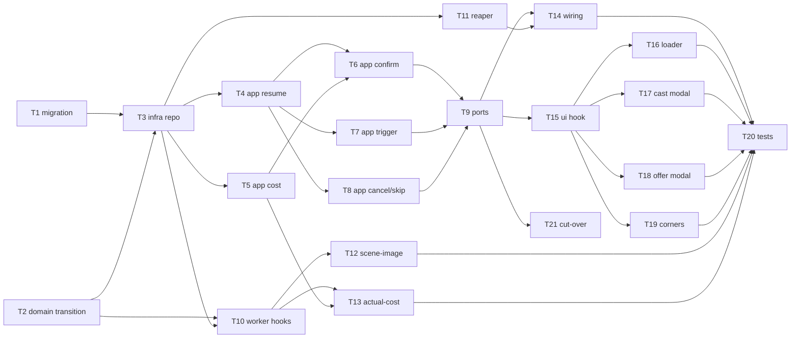

# Epic — storyboard-generation-pipeline

> **Spec:** [spec.md](../spec.md) · **Design:** [sad.md](../sad.md) · **Data model:** [data-model.md](../data-model.md) · **API:** [openapi.yaml](../contracts/openapi.yaml) · **Events:** [events.md](../contracts/events.md) · **ADRs:** [adr/](../adr/)

## Goal

Replace the broken frontend-driven Step-2 ("Video Road Map") orchestration with a single backend-owned, resumable, sequential pipeline state machine (spec §2). A Creator can take any draft from empty to fully illustrated scenes through four ordered phases — scene → reference-data → reference-image → scene-image — whose progress survives page close, reload and browser switch; no phase ever traps the Creator; every expensive phase commits with its price shown first.

## Scope

- **In:** a new `storyboard_pipeline` state row + repository (api), a shared transition module (api + worker), the pipeline service use-cases (resume/auto-start, confirm-cast, trigger, cancel, skip, cost), the routes/controller, worker completion-hooks + reaper + scene-image wiring + cost instrumentation, the web-editor projection (loader, two modals, corner controls, `usePipelineState`), and the deploy cut-over of in-flight drafts.
- **Out (spec §3):** music-generation flow, AI-model / prompt / quality tuning, a cross-draft jobs dashboard, editing-while-generating, and real credit *deduction* (deferred — ADR-0006, §11 OQ).

## Task map

**Parallel branches:** T1 ∥ T2 at the root; after T3, the app lane (T4/T5) runs alongside the worker lane (T10/T11); the four UI surfaces (T16–T19) parallelize after T15.

## Tasks

See [tracker.md](./tracker.md) for status. Machine contract: [tasks.json](../tasks.json).

| # | Task | Layer | Blocked by | DoD (short) |
|---|---|---|---|---|
| T1 | Create the storyboard_pipeline state table (staged migration) | migration | — | Staged 01 promotes to live 057, applies + reverts; full column/index set |
| T2 | Build the shared pipeline transition module (pure) | domain | — | Transition table + order/active-run guards; unit-tested, no DB |
| T3 | storyboard_pipeline repository (row + CAS + stuck query) | infra | T1, T2 | Row R/W, active-run CAS, version bump, heartbeat, age query |
| T4 | Resume read: auto-start + lazy stuck-release | app | T3 | getState auto-starts scene gen, lazy-releases over-bound phase |
| T5 | Server-side cost estimate compute + re-validate | app | T3 | Estimate computed + re-validated server-side, persisted |
| T6 | Confirm-cast: references below music, idempotent | app | T4, T5 | Refs at > MAX(music.sort_order); repeat confirm = no dupes |
| T7 | Trigger phase: guards + incremental re-trigger | app | T4 | Order/scenes guards; re-enqueue only non-terminal units |
| T8 | Cancel + skip use cases | app | T4 | Cancel keeps partials → idle; skip records skipped≠idle |
| T9 | Pipeline routes + controller (authz-first, error codes) | ports | T6, T7, T8 | Ownership before prereq; opaque 404; pipeline.* 422 codes |
| T10 | Worker completion-hooks advance phases | infra | T2, T3 | Per-unit terminal → all-terminal → transition + publish |
| T11 | Reaper repeatable: release stuck phases | infra | T3 | Sweep over-bound running phases → failed + publish |
| T12 | Scene-image: refs feed scenes + text-only fallback | infra | T10 | AC-10/AC-11 branches; phase completes despite failures |
| T13 | Instrument actual cost + estimate-vs-actual delta | infra | T10, T5 | actual_cost persisted; delta metric emitted |
| T14 | Wire realtime publish + mount routes + register reaper | wiring | T9, T11 | Version-stamped publish; routes mounted; reaper registered |
| T15 | usePipelineState hook + retire client orchestration | ui | T9 | GET + realtime, version-ignore; old hooks/enum removed |
| T16 | BlockingLoader component | ui | T15 | Full-screen label + cancel; released on failed/idle |
| T17 | ReviewCastProposalModal (reuse CastConfirmModal) | ui | T15 | Proposed refs + selected scenes + estimate; confirm/skip |
| T18 | SceneImageOfferModal | ui | T15 | Estimate shown; accept/skip |
| T19 | StepCorners corner controls + guard messages | ui | T15 | Trigger any phase; plain-language order/scenes messages |
| T20 | End-to-end + resume/authz regression coverage | tests | T14, T16–T19, T12, T13 | Happy path + resume + cancel + authz green on real MySQL |
| T21 | Deploy cut-over: migrate in-flight old-flow drafts (OQ-2) | docs | T9 | In-flight drafts seeded into a valid pipeline row; dry-run clean |

## Risks / Hard rules

- **Authorization before prerequisite (AC-13, sad §8):** a non-owner always gets the opaque 404 — no prerequisite-specific message. Enforced in T9; T20 verifies.
- **Single transition writer (ADR-0003, §11):** the shared transition module (T2) is the **only** writer of phase transitions, from both api and worker; every transition is a `version` CAS (T3). No job writes the pipeline row directly.
- **Reference-below-music is a creation-time snapshot (AC-09, §11 debt):** T6 places refs at `> MAX(music.sort_order)` once; it does **not** reactively re-order.
- **Cost = instrument-only (ADR-0006):** T5/T13 compute, re-validate and record estimate-vs-actual — they do **not** deduct credits (no substrate; deferred to the §11 OQ).
- **Migration numbering:** live `056` is taken; the staged `01_*` promotes to **`057`** (T1 note).
- **Stuck bound 10 min, configurable via `APP_*` (ADR-0005):** T11/T4 must read it from config, not hard-code.
