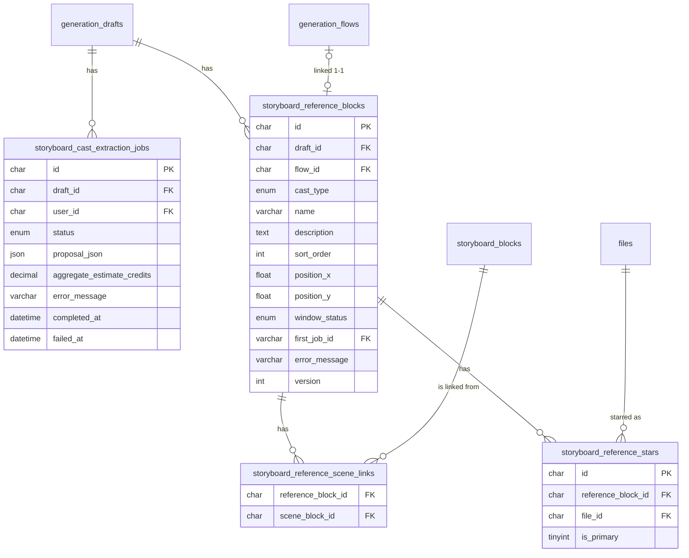

# Data model — storyboard-reference-flows

## ER diagram

## Entities

### Aggregate: Cast Extraction (job tracking)

#### `storyboard_cast_extraction_jobs`

Tracks the async cast-extract job lifecycle (ADR-0002: new job type on the `storyboard-plan` queue) and stores the AI-proposed cast JSON after completion. The Creator reads `proposal_json` to review and correct the cast before confirming. Multiple rows per draft are allowed (retry on failure); `implement` checks for existing `storyboard_reference_blocks` rows to block re-extraction (AC-01b) — not a unique constraint here.

| Column | Type | Constraints | Notes |
|---|---|---|---|
| `id` | CHAR(36) | PK, app-generated UUID v4 | |
| `draft_id` | CHAR(36) | NOT NULL, FK → `generation_drafts(id)` ON DELETE CASCADE | indexed below |
| `user_id` | CHAR(36) | NOT NULL, FK → `users(user_id)` ON DELETE CASCADE | indexed below (FK coverage) |
| `status` | ENUM('queued','running','completed','failed') | NOT NULL DEFAULT 'queued' | |
| `proposal_json` | JSON | NULL | populated on 'completed'; array of {type, name, description, image_file_ids[], scene_block_ids[], per_run_estimate} |
| `aggregate_estimate_credits` | DECIMAL(10,4) | NULL | sum of per-run estimates shown in the cast confirmation modal (spec §1 ¶3) |
| `error_message` | VARCHAR(512) | NULL | plain-language reason on 'failed' |
| `completed_at` | DATETIME(3) | NULL | |
| `failed_at` | DATETIME(3) | NULL | |
| `created_at` | DATETIME(3) | NOT NULL DEFAULT CURRENT_TIMESTAMP(3) | |
| `updated_at` | DATETIME(3) | NOT NULL DEFAULT CURRENT_TIMESTAMP(3) ON UPDATE CURRENT_TIMESTAMP(3) | |

**Aggregate root:** root (job entity; no parent curation table).
**Access patterns:** latest extraction job for draft → `idx_storyboard_cast_extraction_draft_created (draft_id, created_at DESC)`.

---

### Aggregate: Reference Block (root + its curation data)

#### `storyboard_reference_blocks`

One row per confirmed cast entry (character or environment) per draft. This is the aggregate root for all curation data. Canvas XY-position lives here rather than in the draft's canvas JSON (ADR-0005). The rolling-window state for the first auto-started generation is tracked via `window_status` + `first_job_id` (ADR-0003); manually added blocks (AC-11) have `window_status = NULL`. Scene-link saves use compare-and-set on `version` (Override SAD §1 ¶4, critic F1).

| Column | Type | Constraints | Notes |
|---|---|---|---|
| `id` | CHAR(36) | PK, app-generated UUID v4 | |
| `draft_id` | CHAR(36) | NOT NULL, FK → `generation_drafts(id)` ON DELETE CASCADE | indexed below |
| `flow_id` | CHAR(36) | NULL, FK → `generation_flows(flow_id)` ON DELETE SET NULL | NULL = no-flow state (ADR-0006); UNIQUE enforces 1:1 link |
| `cast_type` | ENUM('character','environment') | NOT NULL | |
| `name` | VARCHAR(255) | NOT NULL | cast entry name (editable in cast confirmation) |
| `description` | TEXT | NULL | AI-proposed or Creator-edited description sent to the flow |
| `sort_order` | INT | NOT NULL DEFAULT 0 | cast order → rolling-window dispatch order (ADR-0003) |
| `position_x` | FLOAT | NOT NULL DEFAULT 0 | canvas XY per ADR-0005; authoritative over canvas JSON on divergence |
| `position_y` | FLOAT | NOT NULL DEFAULT 0 | |
| `window_status` | ENUM('pending','running','done','failed') | NULL DEFAULT NULL | NULL = manually added block (no auto-dispatch, AC-11) |
| `first_job_id` | VARCHAR(64) | NULL, FK → `ai_generation_jobs(job_id)` ON DELETE SET NULL | tracks the first-generation job for retry (AC-04) |
| `error_message` | VARCHAR(512) | NULL | plain-language reason when `window_status = 'failed'` (AC-04 retry action) |
| `version` | INT UNSIGNED | NOT NULL DEFAULT 1 | compare-and-set guard for scene-link saves; incremented on each successful link update |
| `created_at` | DATETIME(3) | NOT NULL DEFAULT CURRENT_TIMESTAMP(3) | |
| `updated_at` | DATETIME(3) | NOT NULL DEFAULT CURRENT_TIMESTAMP(3) ON UPDATE CURRENT_TIMESTAMP(3) | |

**Aggregate root:** root.
**Access patterns:**
- Canvas load + star gate (AC-08) + reference boundary (AC-09): all blocks for draft in cast order → `idx_storyboard_reference_blocks_draft_sort (draft_id, sort_order)`.
- Rolling-window atomic claim: next pending block per draft → `idx_storyboard_reference_blocks_draft_window (draft_id, window_status)` (ADR-0003).
- Draft badge / delete-flow warning (AC-12, ADR-0010): which block links to a given flow → `uq_storyboard_reference_blocks_flow (flow_id)` (UNIQUE; also enforces 1:1).
- FK coverage for first_job_id → `idx_storyboard_reference_blocks_first_job (first_job_id)`.

**Constraints:** UNIQUE on `flow_id` (NULL-safe: multiple NULL values allowed by MySQL UNIQUE — enforces at most one block per non-NULL flow).

---

#### `storyboard_reference_scene_links`

Pivot table: individual block ↔ scene associations (NOT a range — individual scenes per spec §3). Scene deletion cascades to this table via FK, eliminating dangling links (AC-10b, quality goal 3). Creator edits go through the versioned scene-link save on the block (compare-and-set on `storyboard_reference_blocks.version`). Composite PK is `(reference_block_id, scene_block_id)`.

| Column | Type | Constraints | Notes |
|---|---|---|---|
| `reference_block_id` | CHAR(36) | PK (composite), FK → `storyboard_reference_blocks(id)` ON DELETE CASCADE | leading PK column covers FK index |
| `scene_block_id` | CHAR(36) | PK (composite), FK → `storyboard_blocks(id)` ON DELETE CASCADE | indexed separately below |
| `created_at` | DATETIME(3) | NOT NULL DEFAULT CURRENT_TIMESTAMP(3) | preserves AI-proposed link ordering |

**Aggregate root:** `storyboard_reference_blocks`.
**Access patterns:**
- All blocks linked to scene X (star gate scope AC-08b, reference boundary AC-09, cascade AC-10b) → `idx_storyboard_reference_scene_links_scene (scene_block_id)`.

---

#### `storyboard_reference_stars`

Curation rows: one row per starred result file per reference block (ADR-0009). Stars are versionless atomic toggles (commutative — no compare-and-set; Override SAD §1 ¶4, critic F1). Primary star is tracked via `is_primary = 1`; MySQL UNIQUE ignores NULL values, so only one `is_primary = 1` row per block is possible while any number of non-primary stars (`is_primary = NULL`) co-exist. Deleting a result file cascades and removes its star rows (AC-07 sync).

| Column | Type | Constraints | Notes |
|---|---|---|---|
| `id` | CHAR(36) | PK, app-generated UUID v4 | |
| `reference_block_id` | CHAR(36) | NOT NULL, FK → `storyboard_reference_blocks(id)` ON DELETE CASCADE | leading column of UNIQUE block+file |
| `file_id` | CHAR(36) | NOT NULL, FK → `files(file_id)` ON DELETE CASCADE | the starred result asset |
| `is_primary` | TINYINT(1) | NULL DEFAULT NULL | 1 = primary star (block preview); NULL = non-primary; MySQL-NULL-unique pattern (same as music_blocks active_lock 045) |
| `created_at` | DATETIME(3) | NOT NULL DEFAULT CURRENT_TIMESTAMP(3) | earliest star = default primary candidate |

**Aggregate root:** `storyboard_reference_blocks`.
**Access patterns:**
- All starred files for a block (block preview, star gate, reference candidates — Flows 2/4) → `uq_storyboard_reference_stars_block_file (reference_block_id, file_id)` (leading column covers block lookup).
- Single primary per block (AC-06/AC-07) → `uq_storyboard_reference_stars_primary (reference_block_id, is_primary)`.
- Blocks starring a given file (sync on result/file deletion — ADR-0009 consequence, AC-07) → `idx_storyboard_reference_stars_file (file_id)`.

**Constraints:** UNIQUE on `(reference_block_id, file_id)` (idempotent toggle: re-starring the same file is a no-op); UNIQUE on `(reference_block_id, is_primary)` (at most one primary per block).

---

## Indexes

| Index | Table | Columns | Query it serves |
|---|---|---|---|
| `idx_storyboard_cast_extraction_draft_created` | `storyboard_cast_extraction_jobs` | `draft_id, created_at DESC` | API fetches latest completed extraction proposal for a draft (Flow 1 — Worker stores proposal, Creator reviews it) |
| `idx_storyboard_cast_extraction_user` | `storyboard_cast_extraction_jobs` | `user_id` | FK index requirement for `fk_storyboard_cast_extraction_user` |
| `idx_storyboard_reference_blocks_draft_sort` | `storyboard_reference_blocks` | `draft_id, sort_order` | Canvas load (≤50 blocks, NFR ≤1500 ms); star gate (AC-08); reference boundary per-scene lookup (AC-09); rolling-window dispatch order (ADR-0003) |
| `idx_storyboard_reference_blocks_draft_window` | `storyboard_reference_blocks` | `draft_id, window_status` | Worker atomic claim: `WHERE draft_id=? AND window_status='pending' ORDER BY sort_order LIMIT 1` (ADR-0003 completion-hook) |
| `uq_storyboard_reference_blocks_flow` | `storyboard_reference_blocks` | `flow_id` | Enforce 1:1 block↔flow link; draft-badge / delete-flow warning check: "which block links to this flow?" (AC-12, ADR-0010); FK index coverage |
| `idx_storyboard_reference_blocks_first_job` | `storyboard_reference_blocks` | `first_job_id` | FK index requirement for `fk_storyboard_reference_blocks_first_job` |
| `idx_storyboard_reference_scene_links_scene` | `storyboard_reference_scene_links` | `scene_block_id` | "All blocks linked to scene X" (scoped star gate AC-08b; reference boundary AC-09; cascade on scene delete AC-10b Flow 6); FK index coverage |
| `uq_storyboard_reference_stars_block_file` | `storyboard_reference_stars` | `reference_block_id, file_id` | Idempotent star toggle (no duplicate stars per block+file); "all starred files for a block" (block preview, star gate, reference candidates — Flows 2/4) |
| `uq_storyboard_reference_stars_primary` | `storyboard_reference_stars` | `reference_block_id, is_primary` | Enforce at most one primary star per block (AC-06 happy path, AC-07 fallback) |
| `idx_storyboard_reference_stars_file` | `storyboard_reference_stars` | `file_id` | "All blocks starring a given file" — sync cleanup when a result/file is deleted (ADR-0009 consequence, AC-07); FK index coverage |

## Test fixtures

The repo uses Vitest + co-located `*.test.ts`; integration tests hit a real MySQL (no mocking — architecture-map.md §Conventions). Fixtures are TypeScript helper functions in `apps/api/src/test/helpers/` (co-located with the domain or in a shared test helper), not in migrations.

- `createCastExtractionJob(pool, overrides?)` — inserts a `storyboard_cast_extraction_jobs` row for a given `draft_id`; defaults to `status='completed'` with a minimal `proposal_json` ([{type:'character', name:'Test Character', scene_block_ids:[]}]). PII guard: `name` values use `'Test Character'`, `'Test Environment'` — never real names.
- `createReferenceBlock(pool, draftId, overrides?)` — inserts a `storyboard_reference_blocks` row; defaults: `cast_type='character'`, `window_status=null` (manual block), `version=1`. Returns the inserted `id`.
- `createReferenceSceneLink(pool, referenceBlockId, sceneBlockId)` — inserts a `storyboard_reference_scene_links` pivot row.
- `createReferenceStar(pool, referenceBlockId, fileId, isPrimary?)` — inserts a `storyboard_reference_stars` row; `isPrimary=true` sets `is_primary=1`, otherwise `NULL`.
