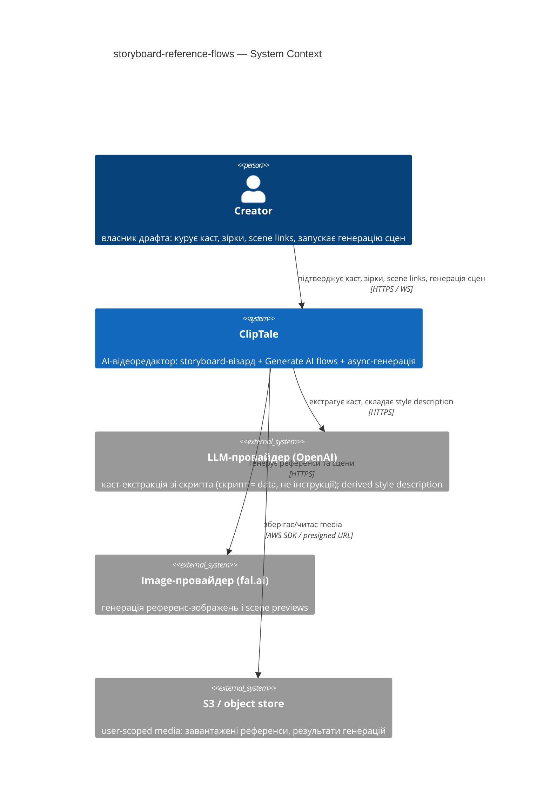
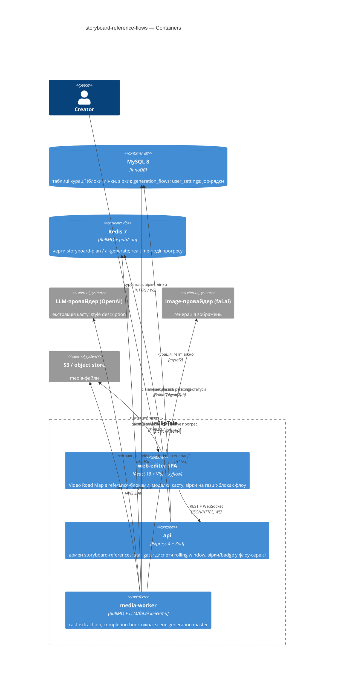

# Software Architecture Document — storyboard-reference-flows

<!-- 12 Arc42 sections. Empty section → <!-- N/A: <one-line reason> -->. -->
<!-- C4 Context (L1) lives inline in §3. C4 Container (L2) lives inline in §5. -->
<!-- Numbers in §10 come VERBATIM from spec.md §6 NFR — no inventing, no rounding. -->

## 1. Introduction and goals

<!-- 🎯 Why: durable memory of «what + the three dominant qualities + who cares». A year from
     now nobody recalls which three qualities were critical for this system.
     📋 Write: 1 ¶ intent + 3 lines of top-3 quality goals + a stakeholders table.
     ¶4 is the override slot — critic `Override` resolutions emit «Decision override: <headline>
     — rationale: <reason>» bullets here so downstream skills see the deliberate choice. -->

**Intent.** Замінити одно-зображенний principal-image крок сторіборда на куровані референс-потоки: каст-екстракція пропонує персонажів та оточення скрипта, Creator підтверджує каст одним колективним кост-підтвердженням, кожен запис касту стає reference-блоком на Video Road Map canvas зі своїм повноцінним generation flow (1:1); зірки Creator-а визначають референс-кандидатів блока, а star gate гарантує, що дорога генерація повного набору сцен стартує лише з затвердженими референсами — і scene generation master використовує їх строго в межах reference boundary. Мета (spec §2): консистентні персонажі/оточення в усіх сценах драфта, менше змарнованих платних генерацій, автоматизований дефолтний шлях із глибиною ітерації «в один клік».

**Top-3 quality goals (1-liners; full scenarios in §10):**

1. **Кост-безпека колективного підтвердження** — агрегатна оцінка в межах ±10% факту; витрати обмежені cast size limit + rolling window; підтвердження покриває тільки перші запуски.
2. **Швидкість циклу курації** — каст-екстракція p95 ≤ 60 с; відкриття Video Road Map canvas з reference-блоками ≤ 1500 мс (до 50 блоків); перші генерації підхоплені воркером ≤ 5 хв після підтвердження.
3. **Цілісність даних курації під конкурентністю** — зірки та scene links ніколи не губляться мовчки; конфліктні конкурентні збереження відхиляються з reload-prompt; видалення сцени не лишає dangling links.

**Stakeholders.**

| Role | Interest | Sign-off owner? |
|---|---|---|
| Creator | курує каст, ітерує в reference flows, ставить зірки, отримує консистентні сцени | No |
| PM (Oleksii) | KPI-воронка spec §7 (регенерації −30%, funnel ≥ baseline), кост-метрики; консультується на §10/§11 | No |
| Tech Lead | затвердження SAD, технічні OQ spec §8 | Yes |
| Security Lead | новий крос-фічевий authz-периметр (storyboard ↔ flows), security review обовʼязковий (spec §6.1) | Yes |

<!-- Decision overrides (¶4) — populated by the critic resolution loop, empty otherwise. -->

## 2. Constraints

<!-- 🎯 Why: §4 strategy only works when §2 has fixed WHAT IS ALREADY FIXED — stack, versions,
     deadline, regulatory. This is an input, not an output.
     📋 Write: four blocks — Technical / Organisational / Conventions / Regulatory.
     📌 Pin versions («<datastore> 18», not «<datastore>»); «Q3 deadline — hard», not «ideally».
     Never N/A — every feature inherits at least Conventions + Technical. -->

**Technical.**
- TypeScript 5.4+ (strict, ESM), Node ≥ 20; монорепо Turborepo + npm workspaces (`apps/*`, `packages/*`).
- Backend: Express 4 + Zod-валідація; realtime через `ws` + Redis pub/sub; черги BullMQ 5 на Redis 7.
- Frontend: React 18 + Vite 5 (SPA), TanStack Query 5, канваси на `@xyflow/react`; стилі — інлайн `CSSProperties` у co-located `*.styles.ts`.
- DB: MySQL 8 / InnoDB через `mysql2` raw SQL (без ORM); міграції `NNN_*.sql` з in-process runner (станом на зараз останній номер — 051); IDs — UUID v4 `CHAR(36)`.
- AI-генерація виконується тільки в media-worker через існуючу чергу `ai-generate` (fal.ai та ін.); канвас generation flow — opaque JSON-документ з optimistic lock `version` (ADR-0002 generate-ai-flow).
- **Нуль інфраструктурних оверрайдів**: жодної нової БД, черги чи зовнішнього сервісу. Рішення §4–§8, що суперечить цьому, потребує явної Override-нотатки з посиланням на §11.

**Organisational.**
- Бюджет зусиль ~6 person-weeks (spec §1 ¶3, RICE Effort).
- Соло-розробка (owner = Tech Lead/Oleksii); дедлайн не зафіксовано у спеці.

**Conventions.**
- `docs/architecture-map.md` + `docs/architecture-rules.md`: routes → controllers → services → repositories; типізовані error-класи (`apps/api/src/lib/errors.ts`); `config.ts` — єдине місце читання `process.env` (`APP_*`); OpenAPI (`packages/api-contracts/src/openapi.ts`) оновлюється в тому самому коміті.
- Прецеденти, яких фіча тримається: off-chain блоки → music blocks (migration `045_storyboard_music_blocks.sql`); cost confirmation + per-Creator rate limit → generate-ai-flow (`flow-pricing.ts`, `flow-rate-limit.ts`); user-налаштування → `user_settings` (migration 050, JSON `settings_json`); async-джоба з прогресом → storyboard-plan job.

**Regulatory / external.**
- Spec §6.1: confidential user-media — завантажені референс-зображення та згенеровані персонажі можуть містити обличчя реальних людей; зберігання за існуючими user-scoped media-правилами (presigned URLs, приватні бакети).
- Жодних нових ролей; усі нові можливості owner-scoped. Security review обовʼязковий (feature size L + новий крос-фічевий authz-периметр storyboard ↔ flows).

## 3. Context and scope

<!-- 🎯 Why: draws the SYSTEM BOUNDARY — who talks to it from outside, where the trust zone ends.
     Without §3, §5 and §8 (authorization) blur — unclear what's «inside» vs «outside».
     📋 Write: 2–3 sentences of business context + an external-systems table + a C4Context block.
     📌 «External: none (deliberate, no third-party in v1)» is itself a decision worth stating.
     Trust boundary — the line past which you don't trust data without checking it.
     Never N/A — greenfield still draws the planned actors + external systems. -->

Creator у storyboard-візарді ClipTale готує мультисценові наративні відео. Фіча додає в Step 2 (Video Road Map) фазу курації референсів: ClipTale екстрагує каст зі скрипта, створює референс-блоки з 1:1-привʼязаними generation flows, Creator зірками затверджує найкращі результати, і лише тоді scene generation master генерує сцени, використовуючи затверджені зображення строго в межах reference boundary. Межа довіри: текст скрипта і завантажені зображення — недовірені користувацькі дані; у каст-екстракцію вони входять як data, а не інструкції (spec §6.1).

<!-- brownfield: generate-ai-flow (flows/canvas/cost-confirm/rate-limit, migrations 046–049), music blocks (045), user_settings (050), storyboard-plan async job + Redis pub/sub realtime — скан 2026-06-06; architecture-map.md застаріла (reflects 9f943df), рекомендовано re-run survey -->

**External systems (in / out):**

| Actor or system | Type | Interaction |
|---|---|---|
| Creator | Person | курує каст, ітерує в reference flows, ставить зірки, запускає генерацію сцен |
| LLM-провайдер (OpenAI) | System (external) | каст-екстракція зі скрипта; derived style description; вибір кандидатів scene generation master-ом |
| Image-провайдер (fal.ai) | System (external) | генерація референс-зображень у flows та scene previews |
| S3 / object store | System (external) | зберігання завантажених референс-зображень і згенерованих результатів (presigned URLs) |

**C4 Context (L1):** <!-- syntax → references/c4-mermaid-syntax.md. Real names, no <placeholder> stubs. -->



## 4. Solution strategy

<!-- 🎯 Why: the 3–4 STRATEGIC PILLARS every ADR grows from. Without §4 each ADR looks random —
     there's no umbrella. ⭐ The densest section — the blast-radius gate fires almost always here
     (decisions are irreversible + multi-module).
     📋 Write: 3–4 choices; each a heading + 2–3 sentences of rationale.
     📌 «Store content as a table of typed blocks» is a pillar — ADR-0001 grows from it. -->

**Target surfaces:** `[backend-service, web-frontend, worker]` (ADR-0001) — нові REST-ендпоінти в `apps/api`, розширення React SPA (канвас, модалка касту, зірки, scene-селектор) та новий тип async-джоби + completion-hook у `apps/media-worker`. **UI-архітектура web-поверхні (інлайн, без ADR):** існуюча React SPA; нові екрани компонуються з наявних примітивів (`shared/components/`, інлайн `*.styles.ts`); прецеденти — generate-ai-flow canvas (`@xyflow/react`, CostConfirmModal, ResultNode) і storyboard canvas. Альтернатив немає — репо вже SPA, дублювати стилістичну систему заборонено конвенціями.

**Top strategic choices (the seeds for ADRs):**

1. **Каст-екстракція — async-джоба на існуючій черзі `storyboard-plan`** (ADR-0002). NFR p95 ≤ 60 с не живе в синхронному HTTP-запиті; той самий патерн, LLM-провайдер і канал телеметрії, що в storyboard planning job; результат переживає розрив зʼєднання; нуль нової інфри (тримає §2).
2. **Rolling window: стан касту в БД + worker completion-hook** (ADR-0003). Перші запуски записуються рядками pending → running → done/failed у cast-порядку; API ставить у чергу перші N (N — налаштування Creator-а в `user_settings`, default 4); по завершенні джоби воркер атомарно claim-ить наступний pending того ж драфта. БД = джерело правди → вікно переживає рестарти api/worker (quality goal 2: повний каст підхоплений ≤ 5 хв).
3. **Колективне підтвердження зі списанням пер-ран при старті** (ADR-0004). Confirm фіксує згоду + агрегатну оцінку (сума пер-флоу оцінок через існуючий `flow-pricing`); гроші списуються пер-ран у момент реального старту — повторне використання білінгу generate-ai-flow, без нової refund-механіки; failed first run = існуючий per-run retry з новим списанням (закриває OQ-2 spec §8). Свідоме scoped-відхилення від per-generate правила (spec §1 ¶4), покриває лише перші запуски.
4. **Дані курації у виділених SQL-таблицях, не в canvas JSON** (ADR-0005). Reference-блоки, scene links і зірки читає бекенд без фронтенда (star gate, reference boundary, draft badge, dispatch вікна) → власні таблиці з FK за прецедентом music blocks (045); canvas JSON драфта тримає лише XY-позицію блока. Видалення сцени чистить лінки одним FK-каскадом/DELETE (quality goal 3: жодних dangling links).
5. **Лайфцикл-семантики дублювання/чекпоїнтів: unlink при копіюванні, re-validate при відновленні** (ADR-0006). Копія драфта не дублює і не шерить флоу — скопійовані блоки входять у no-flow state; відновлення чекпоїнта ре-валідує block↔flow лінки й маркує відсутні флоу як no-flow (закриває OQ-3 spec §8).
6. **Правила scene generation master у межах reference boundary** (ADR-0007, ADR-0008). Derived style description для нелінкованих сцен — одна драфт-глобальна, будується зі starred results у момент генерації сцен, fallback — скрипт (OQ-4). Вибір кандидатів сцени X: primary star кожного лінкованого блока + добір решти зірок до reference-місткості моделі (OQ-5).

**Інлайн-рішення без ADR:** cast size limit = **12** (персонажі + оточення разом; конфіг-значення, обмежує лише пропозицію екстракції — закриває OQ-1 spec §8); per-Creator rate limits успадковуються з generate-ai-flow без змін.

Each tactical decision in later sections should trace to one of these seeds. Tactical decisions that *contradict* a strategic choice are red flags — surface them in §11.

## 5. Building block view

<!-- 🎯 Why: INTERNAL DECOMPOSITION — modules, containers, datastores. The static topology: who
     may talk to whom. Without §5, §6 (the flows) has no vocabulary of participants.
     📋 Write: 1 ¶ on the style (layered / hexagonal / clean / event-driven) + a folder tree + a
     C4Container block.
     📌 Draw ONE Container per declared `target_surface` (frontmatter): a fullstack
     [backend-service, web-frontend] = a backend-API container + a web/SPA container; a
     [backend-service, mobile-app] = the API + the mobile app. The Container(web, …) line below is
     just one surface's container — swap/add per what was declared in §4. → _shared/surfaces.md
     📌 e.g. «web app, content API, media worker, datastore, object store, CDN». -->

Розширення існуючої layered-архітектури — жодного нового деплой-юніта: новий backend-домен `storyboard-references` за конвенцією routes → controllers → services → repositories; новий тип джоби + completion-hook у media-worker; розширення двох існуючих feature-дір SPA. По одному C4-контейнеру на кожну заявлену поверхню (`backend-service` → api, `web-frontend` → web-editor, `worker` → media-worker).

**Internal decomposition:**

```
apps/api/src/
├── routes/storyboard-references.routes.ts        ← новий домен: extract / confirm / blocks / links
├── controllers/storyboardReference.controller.ts
├── services/storyboardReference.service.ts       ← валідація касту, диспетч rolling window, лайфцикл блоків
├── repositories/storyboardReference.repository.ts ← таблиці курації (ADR-0005)
├── services/generation-flow.service.ts           ← розширення: зірки (ADR-0009), badge/warning (ADR-0010)
└── services/storyboardIllustration.service.ts    ← розширення: star gate (ADR-0011), reference boundary
apps/media-worker/src/jobs/
├── cast-extract.job.ts                           ← новий тип джоби на черзі storyboard-plan (ADR-0002)
├── ai-generate.job.ts                            ← + completion-hook rolling window (ADR-0003)
└── scene generation master                       ← + style description (ADR-0007), вибір кандидатів (ADR-0008)
apps/web-editor/src/features/
├── storyboard/        ← reference-блоки на Video Road Map, модалка касту, scene-селектор, gate-повідомлення
└── generate-ai-flow/  ← зірка на ResultNode, draft badge у списку, delete-warning, back-to-storyboard
```

Інлайн-рішення (D5.1, без ADR): уся нова логіка концентрується в домені `storyboard-references`; у чужих сервісах — лише мінімальні точки дотику; у `shared/` ніщо не мігрує, поки компонент не отримає другого споживача (правило репо).

**C4 Container (L2):** <!-- syntax → references/c4-mermaid-syntax.md. ONE Container per declared target_surface. -->



## 6. Runtime view

<!-- 🎯 Why: the RUNTIME FLOW of 1–2 critical scenarios — who talks to whom, when, in what order.
     Without §6, §5 is just boxes with no life.
     📋 Write: a Mermaid sequenceDiagram. Participants are names from §5 (don't invent new ones).
     Messages are semantic («saves a draft»), NO HTTP verbs / paths / status codes — endpoint-level
     sequences arrive at the `api` stage.
     📌 e.g. «author → web: composes draft → web → content API: save». Seed the primary flow(s) here;
     the `sequences` stage then covers every §5 AC (no cap). Never N/A for M+; XS/S keeps ≥1 happy-path flow. -->

**Critical flow 1: <flow name>**

```mermaid
sequenceDiagram
    actor Actor
    participant Web
    participant Service
    participant Store
    Actor->>Web: <action>
    Web->>Service: <call>
    Service->>Store: <write>
    Store-->>Service: ok
    Service-->>Web: result
    Web-->>Actor: confirmation
```

**Critical flow 2: <e.g. async event propagation>** — <if applicable, otherwise N/A>.

## 7. Deployment view

<!-- 🎯 Why: the TOPOLOGY DevOps must know without reading the deploy charts — how many replicas,
     where the background worker lives, AT WHAT NUMBERS we scale.
     📋 Write: 2–3 sentences on topology + monitoring + concrete threshold numbers.
     📌 e.g. «500 authors → partition by quarter» (not «we'll think about scale later»).
     🎯 N/A allowed for XS/S that reuses an existing deployment unit with no change.
     Deployment-diagram scaffold → templates/deployment.md. -->

<Topology in 2–3 sentences. Where it runs, replicas, scaling thresholds.>

**Monitoring:**
- <Metrics — e.g. `<metric_name>`>
- <Alerts — e.g. «worker lag > 10 min → page on-call»>
- <Tracing — e.g. spans on the request boundary>

**Scaling thresholds:**
- <e.g. comfortable in one table up to N rows/year>
- <e.g. partition by quarter above N rows/year>

<!-- For XS/S with no deployment change: <!-- N/A: reuses existing deployment unit, no infra change --> -->

## 8. Crosscutting concepts

<!-- 🎯 Why: CROSS-CUTTING PATTERNS spanning several modules: logging, errors, authorization, ID
     strategy, events, caching. ⭐ The second-densest section. A pattern inside one module is NOT
     here; a project-wide convention belongs in the convention file.
     📋 Write: a table — concept / convention / where defined. One row per concept.
     📌 e.g. «sortable time-based IDs generated in the app layer» as a default from the convention file. -->

| Concept | Convention | Where defined |
|---|---|---|
| Logging | <e.g. structured, fields `module=<name>`> | <convention file §X or here> |
| Authentication | <e.g. token-based via middleware> | <convention file §X> |
| Error handling | <e.g. domain sentinel → ports error mapping → JSON> | <convention file §X> |
| ID strategy | <e.g. sortable time-based ID in the app layer> | <convention file §X> |
| Internationalisation | <e.g. N/A, single language> | — |
| Observability | <e.g. tracing on the request boundary> | — |
| Events | <module-specific patterns, if any> | <here> |

## 9. Architecture decisions

<!-- 🎯 Why: the REVERSE INDEX onto the adr/ folder. `ls adr/` gives the files; §9 gives the
     semantics — why they exist, which SAD section they attach to, what status.
     📋 Write: a 4-column table, one row per ADR. Mixed status is fine.
     📌 e.g. «0001 | Store content as a table of typed blocks | Accepted | §4». -->

| # | Title | Status | Section |
|---|---|---|---|
| <NNNN> | <imperative — e.g. "Use a sliding-window counter for rate limiting"> | Accepted | §<N> |
| <NNNN> | <imperative — e.g. "Co-locate the worker in the API process"> | Accepted | §<N> |

ADR files live under `docs/features/<slug>/adr/NNNN-<title>.md`.

## 10. Quality requirements

<!-- 🎯 Why: the QUALITY TREE — take a goal from §1 and break it into concrete leaves: tests,
     metrics, configs, drills. ⭐ Without §10, §1 is a manifesto. With §10 each declaration maps
     to something PROVABLE.
     📋 Write: per §1 goal — When / Then / How-verify. Numbers from spec §6 NFR VERBATIM (don't
     round ≤250ms to ≤300ms — that's a critic F6 hit).
     📌 e.g. «p95 ≤ 500 ms on a block update, verified by a 100 req/s load test». -->

Each top-3 goal from §1 expanded into a full scenario:

**QG-1. <quality attribute>**
- **When:** <trigger condition>
- **Then:** <expected behaviour with numbers from spec §6 NFR>
- **How verify:** <test / chaos drill / load test / metric>

**QG-2. <quality attribute>**
- **When:** <trigger>
- **Then:** <expected>
- **How verify:** <how>

**QG-3. <quality attribute>**
- **When:** <trigger>
- **Then:** <expected>
- **How verify:** <how>

## 11. Risks and technical debt

<!-- 🎯 Why: ⭐ collects EVERYTHING that can break — not only the technical. Without §11 risks get
     discussed at standups and lost; debt lives only in the head of whoever accepted it.
     📋 Write: a risk/debt table — severity — mitigation — owner. Accepted debt in its own block.
     📌 The first risk is often a product risk, not a technical one. That's normal. -->

<!-- Severity literals: Low / Medium / High for regular risks; "Open question" for rows created by
     a Save-as-OQ resolution during the Socratic walk (see references/socratic.md). -->

| Risk / debt | Severity | Mitigation | Owner |
|---|---|---|---|
| <e.g. Worker lag may reach hours during a downstream outage> | Medium | <alert >10 min, on-call playbook, retry backoff> | <DevOps> |
| <e.g. No event-schema versioning in v1> | Medium | <ADR-NNNN planned for v2, tolerate unknown fields> | <Backend> |
| Open architectural decision: <decision-headline> | Open question | Resolve before <stage trigger or YYYY-MM-DD>; <inline rationale from the Save-as-OQ> | <owner> |

**Accepted debt (acceptable in v1, plan to fix later):**
- <e.g. the entity is immutable / unversioned — OK for v1, may need audit versioning in v2>

## 12. Glossary

<!-- 🎯 Why: ⭐ the DOMAIN GLOSSARY that ends arguments a year later («checkpoint — weekly or
     biweekly? quarter — calendar or fiscal?»).
     📋 Write: a term / meaning table. Business + technical terms mixed.
     📌 e.g. «Lesson | a unit inside a course made of blocks (text, video)». -->

| Term | Meaning |
|---|---|
| <e.g. domain object A> | <its meaning in this domain> |
| <e.g. domain object B> | <its meaning> |
| <e.g. domain invariant name> | <the rule, in plain language> |
