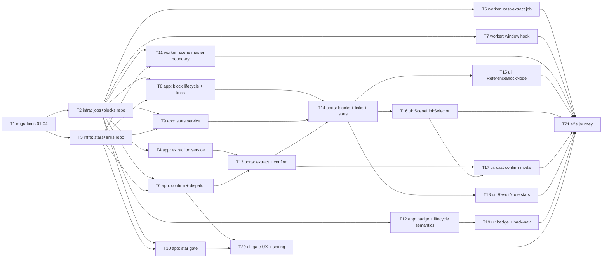

# Epic — storyboard-reference-flows

> **Spec:** [spec.md](../spec.md) · **Design:** [sad.md](../sad.md) · **Data model:** [data-model.md](../data-model.md) · **API:** [openapi.yaml](../contracts/openapi.yaml) · **Events:** [events.md](../contracts/events.md) · **ADRs:** [adr/](../adr/)

## Goal

Замінити одно-зображенний principal-image крок куро́ваними референс-потоками (spec §2): каст-екстракція пропонує персонажів/оточення, Creator підтверджує каст одним колективним кост-підтвердженням, кожен запис стає reference-блоком з власним 1:1 flow; зірки визначають референс-кандидатів, star gate захищає дорогу генерацію сцен, scene generation master працює строго в межах reference boundary. Результат: консистентні персонажі в усіх сценах і менше змарнованих платних генерацій.

## Scope

- **In:** 4 staged-міграції (промоушн), домен `storyboard-references` в `apps/api` (repositories → services → routes/controllers), новий cast-extract job + rolling-window hook + reference boundary у `apps/media-worker`, UI у `features/storyboard` та `features/generate-ai-flow`, e2e-журні.
- **Out** (spec §3): міграція існуючих драфтів, Flow Overview gallery, авто-зіркування, крос-драфт бібліотека персонажів, зміни music blocks, Seedance 2, новий upload-UI, авто-ре-екстракція після підтвердження.

## Task map

Той самий DAG, що в [tasks.json](../tasks.json).

Паралельні гілки: T2 ∥ T3; після них T4/T5/T6/T7/T8/T9/T10/T11/T12 — широка паралель (api-сервіси ∥ worker-джоби); UI-задачі T15/T16/T18 ∥, T19 ∥ T20. T13→T14 серіалізовані (спільні файли controller/routes).

## Tasks

Статуси — у [tracker.md](./tracker.md). Машинний контракт — [tasks.json](../tasks.json).

| # | Task | Layer | Blocked by | DoD (short) |
|---|---|---|---|---|
| T1 | Promote staged curation migrations 01–04 | migration | — | apply + revert чисто; constraints тримають |
| T2 | Extraction-job + reference-block repositories | infra | T1 | CRUD, атомарний claim, CAS version — інтеграційні тести |
| T3 | Stars + scene-links repositories | infra | T1 | idempotent toggle, один primary, cascade без dangling |
| T4 | Cast-extraction service (start/get, guard, authz) | app | T2 | start ставить джобу; повтор — відмова; не-власник denied |
| T5 | Worker cast-extract job (LLM, Zod, limit 12) | app | T2 | proposal ≤12 за scene-relevance; script = data |
| T6 | Confirm-cast service + rolling-window dispatch | app | T2, T3 | блоки+флоу+pending транзакційно; enqueue перших N |
| T7 | Rolling-window completion-hook | app | T2 | done/failed + атомарний claim наступного pending |
| T8 | Block lifecycle + versioned scene-link save | app | T2, T3 | manual add без charge; delete — флоу виживає; 409 на stale version |
| T9 | Star service (toggle, primary, fallback, cleanup) | app | T2, T3 | комутативні toggle; fallback превʼю; sync-чистка |
| T10 | Star gate в illustration service | app | T2, T3 | full-set/per-scene/zero-blocks; message називає блоки |
| T11 | Scene master: reference boundary + style description | app | T2, T3 | тільки зірки лінкованих блоків; style fallback скрипт |
| T12 | Badge + delete-warning + duplication/restore semantics | app | T2 | no-flow state; драфт-делішн не вбиває флоу |
| T13 | Ports: extraction + confirm endpoints | ports | T4, T6 | відповідність openapi.yaml; authz |
| T14 | Ports: blocks/retry/links/stars endpoints | ports | T8, T9, T13 | відповідність openapi.yaml; 409 на links |
| T15 | UI: ReferenceBlockNode на канвасі | ui | T14 | превʼю/статуси/retry/no-flow/відкриття флоу |
| T16 | UI: SceneLinkSelector + 409 reload prompt | ui | T14 | мульти-селект; видимий список; reload prompt |
| T17 | UI: cast confirmation modal + заміна principal-image | ui | T13, T16 | редагований proposal; естімейт; старий UI знятий |
| T18 | UI: зірки на ResultNode | ui | T14 | toggle + primary; sync превʼю блока |
| T19 | UI: draft badge + delete warning + back-nav | ui | T12 | badge у списку; warning; back-to-storyboard |
| T20 | UI: gate message + concurrency setting | ui | T6, T10 | message з діями-виходами; setting default 4 |
| T21 | E2E: повна журні extract→confirm→stars→gate→scenes | tests | T5, T7, T11, T15–T20 | Playwright-журні зелена; authz-відмова перевірена |

## Risks / Hard rules

Задача, що порушує будь-яке з цього, — не проходить рев'ю (spec §6/§6.1, sad §11, ADRs):

- **Жодного списання при confirm** — гроші тільки пер-ран у момент реального старту (ADR-0004); redelivery ніколи не списує двічі ([events.md](../contracts/events.md) Idempotency).
- **Зірки — безверсійні атомарні toggle; versioned CAS лише для scene links** (Override sad §1 ¶4, критик F1). Не додавати version-перевірку зіркам і не знімати її з лінків.
- **Скрипт = data, не інструкції**: вихід LLM-екстракції обмежений Zod-схемою касту (spec §6.1).
- **Owner-scoped усюди, відмова без розкриття існування** (AC-13, spec §6.1).
- **Cast size limit 12 обмежує лише пропозицію екстракції** — не ручні додавання (AC-11).
- **Не мігрувати legacy-драфти** principal-image (spec §3); видаляється лише UI кроку затвердження.
- **NFR-числа verbatim** (spec §6): екстракція p95 ≤ 60 s; канвас ≤ 1500 ms @ ≤ 50 блоків; full cast generating ≤ 5 min; естімейт ±10%.
- **Нова логіка концентрується в домені `storyboard-references`**; у чужих сервісах — мінімальні точки дотику (sad §5 D5.1); у `shared/` ніщо не мігрує без другого споживача.
