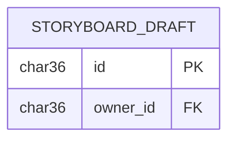

# Data model — storyboard-status-block-actions

> **No new persistence.** This feature introduces **no new entities, no schema change, and no migrations.**
> Spec: [spec.md](./spec.md) · SAD: [sad.md](./sad.md)

## Decision: N/A — frontend-only, no persistent state

This is a **frontend-only** change to existing storyboard Step-2 status blocks. Every authority for this stage agrees there is nothing to model:

- **spec §6.1** — "no new data is introduced by this feature"; "Personal data touched: none. No new fields; Hide state is session-only and not persisted."
- **spec §3 (non-goals)** — "Persisting the hidden state — Hide is session-only … (Persistence would add backend scope not justified now.)"
- **sad §1** — "frontend-only change to existing storyboard Step-2 controls — no new backend, no new data."
- **sad §2 (Technical constraints)** — "**No backend, no datastore, no migration.** Regenerate reuses the existing generation-start paths."
- **sad §6 (closing flag for `data-model`)** — "**No new persistence** — the only persist note (fresh illustration files, old files retained) is a property of the **existing** illustration-generation backend, owned server-side; this frontend-only feature introduces no new entity for `data-model` to index."

The behaviour the spec ACs describe is entirely client-side:

| Behaviour | Where it lives | Persistence |
|---|---|---|
| Status menu (Regenerate / Hide) on a completed block | React component (`StoryboardStatusMenu`) | none — render-time only |
| Owner gate (AC-09) | `useAuth()` user id vs draft owner, render-time | none — reads existing auth |
| Hide a block (AC-02) | session-only UI state in `StoryboardPageWorkspace` | **not persisted** — resets on reload / new generation cycle |
| Regenerate scenes / illustrations (AC-01, AC-03) | reuses existing generation-start paths | writes handled by the **existing** backend, unchanged |
| Fresh illustration files retained (AC-03) | existing media-worker + S3 | **existing** behaviour, not owned here |

## ER diagram

> No relationships or attributes are added. `STORYBOARD_DRAFT` is shown only to anchor the existing
> owner-id read used by the owner gate; it is **not modified** by this feature.

## Entities

None. No table is created, altered, or dropped.

## Indexes

None. No query introduced by this feature touches a new column, so no index is warranted.

## Migrations

**None staged.** Nothing is written under `docs/features/storyboard-status-block-actions/migrations/`, and nothing will be promoted into the live `apps/api/src/db/migrations/` tree by `implement`.

## Test fixtures

None required for persistence (no entities). Behavioural coverage is owned by the frontend/E2E
stages — keyboard/owner-gate/confirm-dialog assertions (sad §10, spec §6), not data fixtures.
Any user identity needed in a test uses the repo's existing factories with `*@example.test` emails (PII guard).

## If this assumption is ever wrong

If a future iteration decides to **persist** the hidden state or an action log (both currently
explicit non-goals), re-run `data-model` then. The repo conventions to follow at that point
(from `architecture-map.md`): MySQL 8 / InnoDB via `mysql2` raw SQL; **UUID v4 stored as `CHAR(36)`**
(not auto-increment); soft-deletes via `deleted_at`; numbered migration files `NNN_description.sql`
in `apps/api/src/db/migrations/` run by the in-process runner, DDL guarded with `IF NOT EXISTS`.
