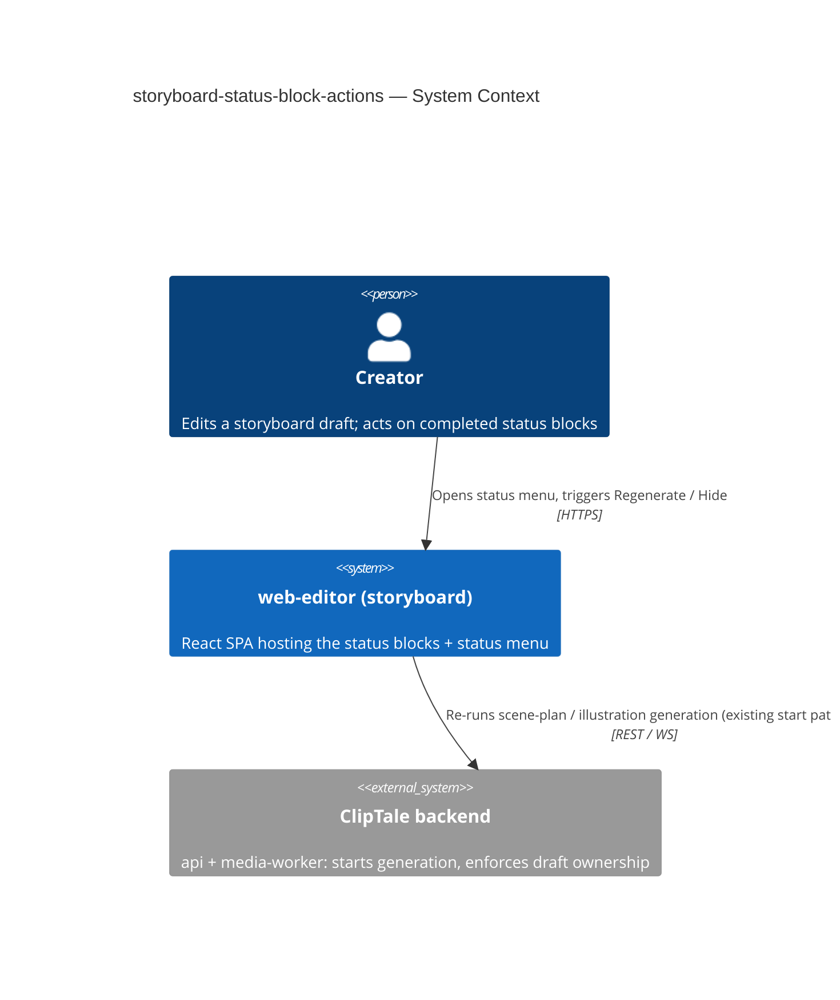
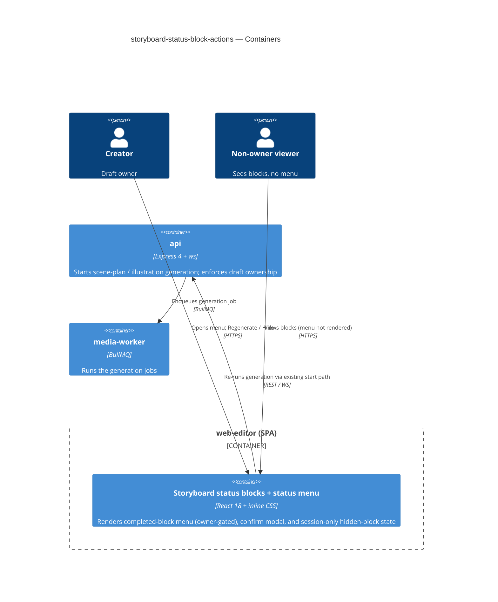
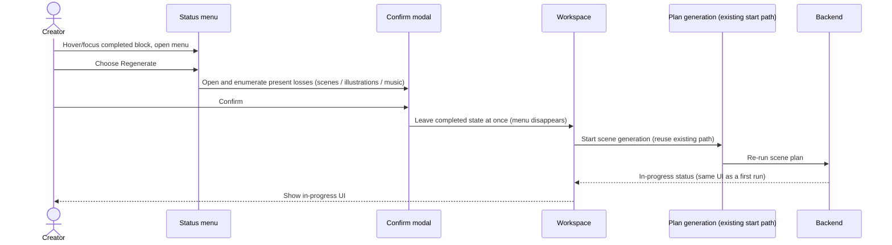
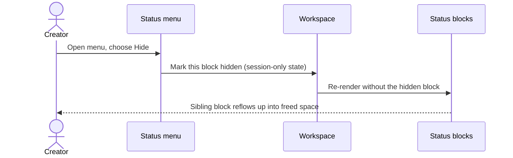
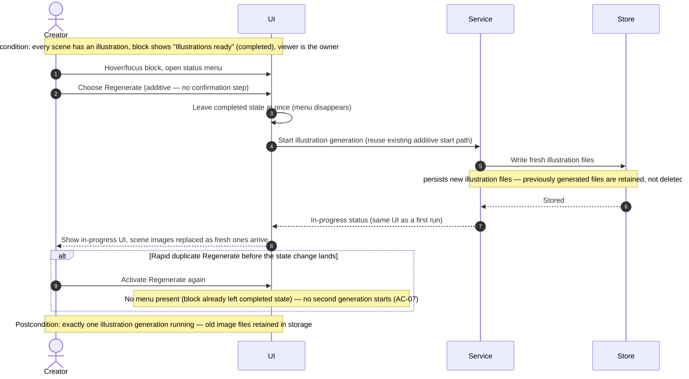
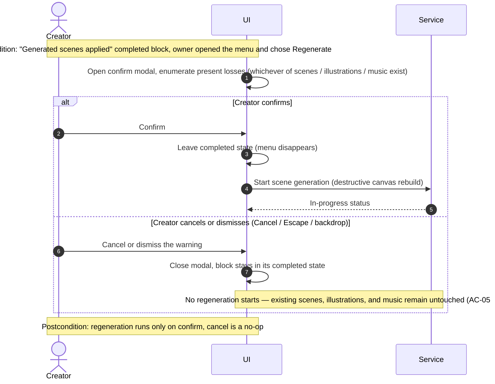
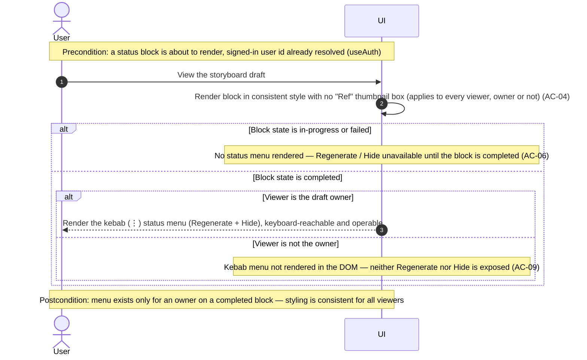
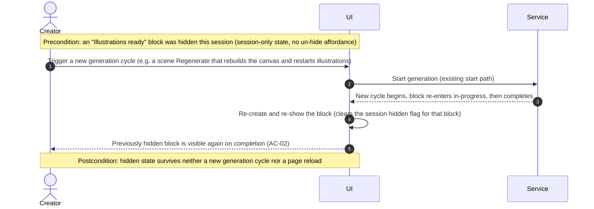

# Software Architecture Document — storyboard-status-block-actions

<!-- 12 Arc42 sections. Empty section → <!-- N/A: <one-line reason> -->. -->
<!-- C4 Context (L1) lives inline in §3. C4 Container (L2) lives inline in §5. -->
<!-- Numbers in §10 come VERBATIM from spec.md §6 NFR — no inventing, no rounding. -->

## 1. Introduction and goals

<!-- 🎯 Why: durable memory of «what + the three dominant qualities + who cares». A year from
     now nobody recalls which three qualities were critical for this system.
     📋 Write: 1 ¶ intent + 3 lines of top-3 quality goals + a stakeholders table.
     ¶4 is the override slot — critic `Override` resolutions emit «Decision override: <headline>
     — rationale: <reason>» bullets here so downstream skills see the deliberate choice. -->

**Intent.** Give each **completed** storyboard status block ("Generated scenes applied", "Illustrations ready") a kebab (⋮) **status menu** — revealed on hover/focus, kept in the tab order — exposing two in-place actions for the draft's **Creator**: **Regenerate** (re-runs the underlying generation) and **Hide** (removes the block for the current session). Scene Regenerate is destructive (overwrites the canvas) and is gated by a single confirmation that enumerates present losses; illustration Regenerate is additive (no confirmation). The "Illustrations ready" block drops its stray "Ref" preview so the two completed blocks read as one consistent control. This is a frontend-only change to existing storyboard Step-2 controls — no new backend, no new data.

**Top-3 quality goals (1-liners; full scenarios in §10):**

1. **Destructive-action safety** — 100% of scene-Regenerate triggers show the loss-enumerating warning before any overwrite (spec §6).
2. **Accessibility** — the status menu is keyboard-reachable and fully operable (focus → activate → Escape to close) (spec §6).
3. **Responsiveness** — status-menu open latency ≤ 100 ms from activation to visible menu content (spec §6, non-gating).

**Stakeholders.**

| Role | Interest | Sign-off owner? |
|---|---|---|
| Creator | Owns the draft; uses Regenerate / Hide on completed blocks | No |
| Non-owner viewer | Sees the consistent completed blocks but no status menu (AC-09) | No |
| Steven Hayes (PM) | Feature owner; usability outcome + KPIs | No |
| Tech Lead | SAD approval | Yes |
| Security Lead | Confirms no new authz boundary (reuses existing ownership) | No |

<!-- Decision overrides (¶4) — populated by the critic resolution loop, empty otherwise. -->

## 2. Constraints

<!-- 🎯 Why: §4 strategy only works when §2 has fixed WHAT IS ALREADY FIXED — stack, versions,
     deadline, regulatory. This is an input, not an output.
     📋 Write: four blocks — Technical / Organisational / Conventions / Regulatory.
     📌 Pin versions («<datastore> 18», not «<datastore>»); «Q3 deadline — hard», not «ideally».
     Never N/A — every feature inherits at least Conventions + Technical. -->

**Technical.**
- TypeScript 5.4+ (strict, ESM); Node ≥20 monorepo (Turborepo + npm workspaces).
- React 18 + Vite 5 SPA (`apps/web-editor`); React-Router v7; TanStack Query 5.
- Client state: custom external store + `useSyncExternalStore` + Immer (`store/project-store.ts`); ephemeral UI state in `store/ephemeral-store.ts`. **No Zustand/Redux.**
- Styling: plain inline `CSSProperties` in co-located `*.styles.ts` (no Tailwind / CSS-modules / styled-components).
- **No backend, no datastore, no migration.** Regenerate reuses the existing generation-start paths already in the storyboard hooks (`useStoryboardPlanGeneration.start`/`retry`, `useStoryboardIllustrations.start`).

**Organisational.**
- Effort budget: S (small, frontend-only — single component cluster under `features/storyboard/`).
- Deadline: none stated (usability improvement).
- Team: one frontend engineer; PM owner Steven Hayes; reviewers Tech Lead + Security Lead.

**Conventions.**
- Architecture map: [`docs/architecture-map.md`](../../architecture-map.md) (canonical for layering, conventions, datastores).
- Feature code under `apps/web-editor/src/features/storyboard/`; the two status blocks render in `StoryboardPlanControls.tsx`, wired in `StoryboardPageWorkspace.tsx`.
- Co-located `*.styles.ts` inline styles; design tokens are hardcoded `*.styles.ts` constants (palette/`docs/design-guide.md`).
- **Shared-migration rule:** a module gaining a 2nd consumer migrates to `shared/` in the same PR.
- Modal pattern: feature-local React modal with focus-trap + Escape (precedent: `PrincipalImageApprovalModal.tsx`).

**Regulatory / external.**
- N/A — no new data, no PII, no new external interface. Hide state is session-only client state and is not persisted. Authorization reuses the existing draft-ownership rule already enforced by the generation backend (spec §6.1).

## 3. Context and scope

<!-- 🎯 Why: draws the SYSTEM BOUNDARY — who talks to it from outside, where the trust zone ends.
     Without §3, §5 and §8 (authorization) blur — unclear what's «inside» vs «outside».
     📋 Write: 2–3 sentences of business context + an external-systems table + a C4Context block.
     📌 «External: none (deliberate, no third-party in v1)» is itself a decision worth stating.
     Trust boundary — the line past which you don't trust data without checking it.
     Never N/A — greenfield still draws the planned actors + external systems. -->

A Creator builds a storyboard draft in the web-editor (Step 2). The two top-left status blocks reflect generation state; today they are terminal once complete. This feature adds Creator-only in-place actions (Regenerate, Hide) to the completed state of those blocks. The change lives entirely inside the `web-editor` SPA; the generation backend (api + media-worker) is reused unchanged — Regenerate simply re-invokes the existing start path, and ownership is enforced exactly as it is today.

<!-- brownfield: existing `features/storyboard/` module — `StoryboardPlanControls.tsx` renders both completed blocks; wired in `StoryboardPageWorkspace.tsx`; generation via the plan/illustration hooks; current-user identity via `useAuth()`. -->

**External systems (in / out):**

| Actor or system | Type | Interaction |
|---|---|---|
| Creator | Person | Opens the status menu on a completed block; triggers Regenerate / Hide |
| Non-owner viewer | Person | Views the draft's completed blocks; the menu is not rendered for them |
| ClipTale backend (api + media-worker) | System (internal, reused) | Starts scene-plan / illustration generation; enforces draft ownership |
| Identity (AuthProvider / `GET /auth/me`) | System (internal, reused) | Supplies the signed-in user id used to owner-gate the menu |

**C4 Context (L1):** <!-- syntax → references/c4-mermaid-syntax.md. Real names, no <placeholder> stubs. -->



## 4. Solution strategy

<!-- 🎯 Why: the 3–4 STRATEGIC PILLARS every ADR grows from. Without §4 each ADR looks random —
     there's no umbrella. ⭐ The densest section — the blast-radius gate fires almost always here
     (decisions are irreversible + multi-module).
     📋 Write: 3–4 choices; each a heading + 2–3 sentences of rationale.
     📌 «Store content as a table of typed blocks» is a pillar — ADR-0001 grows from it. -->

**Target surface:** `web-frontend` (single) — the existing `apps/web-editor` React SPA. The generation backend (api + media-worker) is reused unchanged. Single-surface, reversible → inline note, no ADR. **UI architecture:** reuse the existing client-rendered SPA (React 18 + Vite, React-Router v7) — no SSR/hybrid change; this feature adds components to an existing screen, so no new UI-architecture decision is warranted (inline note, no ADR).

**Top strategic choices (the seeds for ADRs):**

1. **Reuse the existing generation-start path; gate Regenerate safety by action type** *(→ ADR-0001)* — Scene Regenerate calls the existing destructive plan-start (`planGeneration.start`/`retry`, which rebuilds the canvas) behind a mandatory loss-enumerating confirmation; illustration Regenerate calls the additive illustration-start (`illustrationGeneration.start`) with no confirmation. This honours the "no new generation-timing budget" constraint (spec §6) and the destructive-action-safety quality goal (§1 QG-1). The single-generation invariant (AC-07) is structural: choosing Regenerate immediately moves the block out of its completed state, removing the menu — so a rapid duplicate trigger has no menu to act on, backed by the existing start-guard in the plan hook.

2. **Owner-gate the status menu by not rendering it for non-owners** *(→ ADR-0002)* — The kebab (⋮) menu — the sole host of both actions — is not rendered when the signed-in user (`useAuth()`) is not the draft's Creator (AC-09). No new server boundary is introduced: generation ownership is already enforced server-side, and Hide is pure client session state. The "Ref"-removal and visual-consistency styling are independent of ownership and apply to **every** viewer.

3. **Hide is ephemeral, session-scoped client state — no persistence** — Hiding a completed block sets session-only UI state; it is not written to the server (spec §3 non-goal). A hidden block re-appears on reload or whenever that block re-enters a new generation cycle (including indirectly — a scene Regenerate that rebuilds the canvas and restarts illustrations re-shows a previously hidden "Illustrations ready" block). Where this state lives is a §5 building-block decision (reversible, single-module → no ADR).

4. **Extend the existing controls in place** — The status menu and the destructive-confirmation modal are added to the existing `StoryboardPlanControls.tsx` cluster following repo conventions (co-located inline `*.styles.ts`; feature-local modal with focus-trap + Escape, per `PrincipalImageApprovalModal.tsx`). No restructuring of the storyboard module; in-progress and failed block states are untouched (spec §3 non-goal).

Each tactical decision in later sections should trace to one of these seeds. Tactical decisions that *contradict* a strategic choice are red flags — surface them in §11.

## 5. Building block view

<!-- 🎯 Why: INTERNAL DECOMPOSITION — modules, containers, datastores. The static topology: who
     may talk to whom. Without §5, §6 (the flows) has no vocabulary of participants.
     📋 Write: 1 ¶ on the style (layered / hexagonal / clean / event-driven) + a folder tree + a
     C4Container block.
     📌 Draw ONE Container per declared `target_surface` (frontmatter): a fullstack
     [backend-service, web-frontend] = a backend-API container + a web/SPA container; a
     [backend-service, mobile-app] = the API + the mobile app. The Container(web, …) line below is
     just one surface's container — swap/add per what was declared in §4. → _shared/surfaces.md
     📌 e.g. «web app, content API, media worker, datastore, object store, CDN». -->

The single surface is the **web-editor SPA**, organized as feature-vertical slices (`features/` + cross-feature `shared/` + global `store/` + `lib/`). This feature is a thin presentational addition inside the existing `storyboard` feature slice: new presentational components (status menu, confirmation modal) plus state lifted into the storyboard workspace, all driving the **already-existing** generation hooks. No new layer, store, or backend interface is introduced; the building blocks are reused (generation hooks, `useAuth`) or feature-local (the new components and the session-only hidden-block state).

**Internal decomposition** (✚ new, ✎ modified; everything else reused unchanged):

```
apps/web-editor/src/features/storyboard/
├── components/
│   ├── StoryboardPlanControls.tsx            ✎ add status menu to the completed state of both blocks;
│   │                                            drop the "Ref" preview on the completed illustration block
│   ├── StoryboardPlanControls.styles.ts      ✎ menu + visual-consistency styles
│   ├── StoryboardStatusMenu.tsx              ✚ kebab (⋮) menu — Regenerate + Hide; owner-gated render,
│   │                                            hover/focus reveal, keyboard-operable (focus/activate/Escape)
│   ├── StoryboardStatusMenu.styles.ts        ✚ co-located inline styles
│   ├── StoryboardRegenerateConfirmModal.tsx  ✚ destructive scene-Regenerate confirm — focus-trap + Escape,
│   │                                            enumerates present losses (scenes / illustrations / music)
│   ├── StoryboardRegenerateConfirmModal.styles.ts ✚
│   └── StoryboardPageWorkspace.tsx           ✎ owns session-only hidden-block state; passes block visibility,
│                                                isOwner, and Regenerate/Hide handlers down to the controls
└── hooks/
    ├── useStoryboardPlanGeneration.ts        ↺ reused — start()/retry() is the destructive scene-Regenerate path
    └── useStoryboardIllustrations.ts         ↺ reused — start() is the additive illustration-Regenerate path
shared / store:
    features/auth/hooks/useAuth.ts            ↺ reused — signed-in user id for the owner gate
```

**C4 Container (L2):** <!-- one container per declared target_surface (web-frontend); backend containers shown as reused context -->



## 6. Runtime view

<!-- 🎯 Why: the RUNTIME FLOW of 1–2 critical scenarios — who talks to whom, when, in what order.
     Without §6, §5 is just boxes with no life.
     📋 Write: a Mermaid sequenceDiagram. Participants are names from §5 (don't invent new ones).
     Messages are semantic («saves a draft»), NO HTTP verbs / paths / status codes — endpoint-level
     sequences arrive at the `api` stage.
     📌 e.g. «author → web: composes draft → web → content API: save». Seed the primary flow(s) here;
     the `sequences` stage then covers every §5 AC (no cap). Never N/A for M+; XS/S keeps ≥1 happy-path flow. -->

**Critical flow 1: Regenerate applied scenes (destructive, confirmed)** — AC-01, AC-05, AC-07, AC-08.



**Critical flow 2: Hide a completed block (session-only)** — AC-02.



> The additive illustration Regenerate (AC-03) is flow 1 without the Confirm-modal step — Regenerate calls the illustration start path directly. The `sequences` stage expands the full set (cancel/dismiss AC-05, owner-gating AC-09, re-show-on-new-cycle AC-02) against the §5 building blocks.

<!-- sequences stage — additive flows below. Participants are the generic vocabulary
     (User=<user>, UI=<ui>, Service=<service>, Store=<data-store>); they read more abstract than the
     two design-stage seed flows above (which used named §5 blocks) — that style delta is intentional
     and flagged in the closing note. Flows 1–2 above are untouched. -->

### Regenerate illustrations (additive, no confirmation) — AC-03



### Cancel or dismiss the scene-Regenerate warning — AC-05



### Render a completed status block — owner gate, state gate, visual consistency — AC-04, AC-06, AC-09



### Re-show a hidden block on a new generation cycle — AC-02 (indirect re-show)



> **Coverage (sequences stage).** **Use-case pass (§4):** US-01→Flow 1; US-02→Flow 1 + Cancel-warning flow; US-03→Regenerate-illustrations flow; US-04→Flow 2 (Hide) + Re-show flow; US-05→Render flow; US-06→Render flow. **AC pass (§5):** AC-01→Flow 1; AC-02→Flow 2 + Re-show flow; AC-03→Regenerate-illustrations flow; AC-04→Render flow (the "Ref"-box removal + styling is render-time; its behavioural part — menu for owners only — is the `alt` in the Render flow); AC-05→Cancel-warning flow; AC-06→Render flow (state-gate `alt`); AC-07→Flow 1 + the rapid-duplicate `alt` in the Regenerate-illustrations flow (structural — leaving completed state removes the menu); AC-08→Flow 1 (loss enumeration); AC-09→Render flow (owner-gate `alt`). No §4 user story and no §5 AC is left uncovered.
>
> **Flags for `design` / `data-model`.** (1) The new flows use the **generic participant vocabulary** (`<user>`/`<ui>`/`<service>`/`<data-store>`) per the runtime-view convention; the two seed flows above use named §5 blocks — a deliberate style delta, not a conflict. (2) **No new persistence** — the only persist note (fresh illustration files, old files retained) is a property of the **existing** illustration-generation backend, owned server-side; this frontend-only feature introduces no new entity for `data-model` to index. (3) All flows are **sync**; the single-generation invariant (AC-07) is structural, so no idempotency-key / dead-letter modeling is needed.

## 7. Deployment view

<!-- 🎯 Why: the TOPOLOGY DevOps must know without reading the deploy charts — how many replicas,
     where the background worker lives, AT WHAT NUMBERS we scale.
     📋 Write: 2–3 sentences on topology + monitoring + concrete threshold numbers.
     📌 e.g. «500 authors → partition by quarter» (not «we'll think about scale later»).
     🎯 N/A allowed for XS/S that reuses an existing deployment unit with no change.
     Deployment-diagram scaffold → templates/deployment.md. -->

<!-- N/A: reuses the existing `web-editor` deployment unit; frontend-only, no new container, replica, queue, or scaling threshold. Regenerate re-uses existing api/media-worker capacity — no new generation-timing budget (spec §6). Product adoption is tracked via the spec §7 KPIs (client analytics), not infrastructure metrics. -->

## 8. Crosscutting concepts

<!-- 🎯 Why: CROSS-CUTTING PATTERNS spanning several modules: logging, errors, authorization, ID
     strategy, events, caching. ⭐ The second-densest section. A pattern inside one module is NOT
     here; a project-wide convention belongs in the convention file.
     📋 Write: a table — concept / convention / where defined. One row per concept.
     📌 e.g. «sortable time-based IDs generated in the app layer» as a default from the convention file. -->

| Concept | Convention | Where defined |
|---|---|---|
| Authorization | Owner-gate: render the kebab menu only when `useAuth()` user id === draft owner id; non-owners get no menu in the DOM. No new server boundary — generation ownership already enforced server-side. | ADR-0002, §4 |
| Regenerate safety | Action-type gate: destructive scene Regenerate behind a mandatory loss-enumerating confirm; additive illustration Regenerate runs directly. Single-generation invariant is structural (leaving completed state removes the menu) + existing start-guard. | ADR-0001, §4 |
| Error handling | A Regenerate that fails falls through to the block's **existing** failed state — legacy copy + Retry control, no status menu (spec §1 ¶3). Canvas integrity on mid-run failure follows unchanged existing generation behaviour. | spec §1, §3; existing hooks |
| State management | Hide is **session-only** ephemeral UI state owned by the storyboard workspace (not persisted, not in the global timeline `ephemeral-store`); re-shown on reload or a new generation cycle. | §4, §5 |
| Accessibility | Menu is keyboard-reachable (in tab order) and operable (focus → activate → Escape); confirm modal uses the feature-local focus-trap + Escape pattern (`PrincipalImageApprovalModal.tsx`). | spec §6; §1 QG-2 |
| Styling | Plain inline `CSSProperties` in co-located `*.styles.ts`; design tokens are hardcoded style constants (palette / `docs/design-guide.md`). | architecture-map §Conventions |
| Logging / Observability | No new server logging; client behaviour observed via the spec §7 KPIs (analytics). | spec §7 |
| Internationalisation | N/A — single-language UI strings, matching existing storyboard copy. | — |
| Events | N/A — no new domain events; reuses existing realtime generation-status events consumed by the hooks. | architecture-map |

## 9. Architecture decisions

<!-- 🎯 Why: the REVERSE INDEX onto the adr/ folder. `ls adr/` gives the files; §9 gives the
     semantics — why they exist, which SAD section they attach to, what status.
     📋 Write: a 4-column table, one row per ADR. Mixed status is fine.
     📌 e.g. «0001 | Store content as a table of typed blocks | Accepted | §4». -->

| # | Title | Status | Section |
|---|---|---|---|
| 0001 | Reuse the existing generation-start path and gate Regenerate safety by action type | Accepted | §4 |
| 0002 | Owner-gate the status menu by not rendering it for non-owners | Accepted | §4, §8 |

ADR files live under `docs/features/storyboard-status-block-actions/adr/NNNN-<title>.md`.

## 10. Quality requirements

<!-- 🎯 Why: the QUALITY TREE — take a goal from §1 and break it into concrete leaves: tests,
     metrics, configs, drills. ⭐ Without §10, §1 is a manifesto. With §10 each declaration maps
     to something PROVABLE.
     📋 Write: per §1 goal — When / Then / How-verify. Numbers from spec §6 NFR VERBATIM (don't
     round ≤250ms to ≤300ms — that's a critic F6 hit).
     📌 e.g. «p95 ≤ 500 ms on a block update, verified by a 100 req/s load test». -->

Each top-3 goal from §1 expanded into a full scenario. Numbers are verbatim from spec §6 NFR.

**QG-1. Destructive-action safety**
- **When:** a Creator triggers Regenerate on the "Generated scenes applied" block.
- **Then:** 100% of scene-Regenerate triggers show the warning before any overwrite — and the warning enumerates whichever of scenes / illustrations / music presently exist (AC-08).
- **How verify:** E2E test asserts the warning precedes regeneration (spec §6); cancel/dismiss leaves scenes, illustrations, and music untouched (AC-05).

**QG-2. Accessibility**
- **When:** a Creator navigates a completed status block by keyboard only.
- **Then:** the status menu is keyboard-reachable and operable — focus + activate + Escape to close.
- **How verify:** axe / keyboard-nav check in E2E (spec §6).

**QG-3. Responsiveness**
- **When:** a Creator activates the status menu.
- **Then:** menu content is visible ≤ 100 ms from activation (pure client render).
- **How verify:** manual UX check / interaction profiling — **non-gating** (not a CI pass/fail check), per spec §6.

## 11. Risks and technical debt

<!-- 🎯 Why: ⭐ collects EVERYTHING that can break — not only the technical. Without §11 risks get
     discussed at standups and lost; debt lives only in the head of whoever accepted it.
     📋 Write: a risk/debt table — severity — mitigation — owner. Accepted debt in its own block.
     📌 The first risk is often a product risk, not a technical one. That's normal. -->

<!-- Severity literals: Low / Medium / High for regular risks; "Open question" for rows created by
     a Save-as-OQ resolution during the Socratic walk (see references/socratic.md). -->

| Risk / debt | Severity | Mitigation | Owner |
|---|---|---|---|
| Accidental destructive scene Regenerate discards scenes / illustrations / music (product risk) | Medium | Mandatory loss-enumerating confirm (ADR-0001); KPI tracks recoveries ≤ 2% of events (spec §7) | Steven Hayes (PM) |
| Client render-gate is not a security boundary for Regenerate | Low | Generation backend independently enforces draft ownership; render-gate is UX-only (ADR-0002) | Security Lead |
| Illustration Regenerate may cause style drift / unexpected re-approval on scenes the Creator liked | Open question | Resolve before `sdd:tasks`; default now: re-run all scenes as chosen, surface re-approval as it works today (spec §8) | Steven Hayes (PM) |
| Superseded illustration files are retained indefinitely (no cleanup) | Open question | Resolve at follow-up after launch; default now: keep them, no cleanup (spec §8) | Tech Lead |

**Accepted debt (acceptable in v1, plan to fix later):**
- **Regenerate concurrency = last-write-wins.** A scene Regenerate that races a pending autosave or a second open tab keeps today's last-write-wins behaviour — Regenerate reuses the unchanged generation-start path and adds no new coordination (spec §8 OQ, resolved at design; ADR-0001 neutral consequence). Revisit if multi-tab editing becomes a supported scenario.

## 12. Glossary

<!-- 🎯 Why: ⭐ the DOMAIN GLOSSARY that ends arguments a year later («checkpoint — weekly or
     biweekly? quarter — calendar or fiscal?»).
     📋 Write: a term / meaning table. Business + technical terms mixed.
     📌 e.g. «Lesson | a unit inside a course made of blocks (text, video)». -->

| Term | Meaning |
|---|---|
| Creator | Signed-in owner of a storyboard draft; the only role that may use the status menu (CONTEXT glossary). |
| Completed status block | A status block in its success state ("Generated scenes applied" or "Illustrations ready") — the only state that gains the menu. |
| Status menu | The kebab (⋮) menu on a completed block exposing Regenerate and Hide; rendered only for the Creator. |
| Regenerate | Status-menu action that re-runs the underlying generation via the existing start path; destructive for scenes, additive for illustrations. |
| Hide | Status-menu action that removes a completed block from the canvas for the current session only (not persisted). |
| Destructive Regenerate | Scene-plan Regenerate — rebuilds the canvas, discarding present scenes / illustrations / music; gated by a mandatory confirmation. |
| Additive Regenerate | Illustration Regenerate — produces fresh images without deleting previously generated files; no confirmation. |
| Single-generation invariant | At most one generation runs per draft at a time; enforced structurally because choosing Regenerate removes the menu (AC-07). |
| Owner gate | The rule that the kebab menu is not rendered in the DOM for a non-owner (AC-09); styling consistency still applies to all viewers. |
| Ref box | The small reference-thumbnail preview on the illustration block; removed on the completed state for visual consistency (AC-04). |
