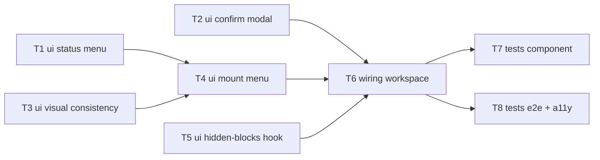

# Epic — storyboard-status-block-actions

> **Spec:** [spec.md](../spec.md) · **Design:** [sad.md](../sad.md) · **Data model:** [data-model.md](../data-model.md) · **ADRs:** [adr/](../adr/)

## Goal

Give each **completed** storyboard status block ("Generated scenes applied", "Illustrations ready") a kebab (⋮) status menu — revealed on hover/focus, kept in the tab order — exposing **Regenerate** and **Hide** for the draft's Creator (spec §2). Scene Regenerate is destructive and gated by a loss-enumerating confirm; illustration Regenerate is additive with no confirm. The "Illustrations ready" block drops its stray "Ref" box so both completed blocks read as one consistent control. Frontend-only — no backend, no data model.

## Scope

- **In:** `ui` (two new presentational components, the completed-block menu integration, the visual-consistency cleanup), a session-only hidden-block hook, the workspace `wiring`, and `tests` (component + E2E/a11y). All under `apps/web-editor/src/features/storyboard/`.
- **Out (spec §3):** persisting Hide state; changing in-progress/failed block states; per-scene illustration regeneration from the status block; cleaning up superseded illustration files. No new backend, datastore, or migration (data-model.md: N/A).

## Task map

## Tasks

See [tracker.md](./tracker.md) for status. Machine contract: [tasks.json](../tasks.json).

| # | Task | Layer | Blocked by | DoD (short) |
|---|---|---|---|---|
| T1 | Build StoryboardStatusMenu component | ui | — | Owner-gated kebab; Tab/Enter/Escape operable |
| T2 | Build StoryboardRegenerateConfirmModal | ui | — | Focus-trap; lists present losses; cancel is a no-op |
| T3 | Visual consistency + drop "Ref" box | ui | — | Completed illustration block matches scene block, no Ref |
| T4 | Mount menu on completed state of both blocks | ui | T1, T3 | Menu only on completed + only for owner |
| T5 | useStoryboardHiddenBlocks hook | ui | — | Hide one block, re-show on new cycle, session-only |
| T6 | Wire menu/modal/hide/owner gate + Regenerate dispatch | wiring | T2, T4, T5 | Destructive vs additive split; structural single-generation |
| T7 | Component + integration tests | tests | T6 | Green suite over AC-02/04/05/06/07/08/09 |
| T8 | E2E + accessibility checks | tests | T6 | Warning precedes regen; keyboard/axe; non-owner no kebab |

**Parallel start:** T1, T2, T3, T5 have no dependencies and can begin together.

## Risks / Hard rules

- **No new generation-timing budget** — Regenerate must reuse the existing start paths (`useStoryboardPlanGeneration.start`/`retry`, `useStoryboardIllustrations.start`); confirmed by code review (spec §6 NFR, ADR-0001).
- **Destructive-action safety** — 100% of scene-Regenerate triggers show the loss-enumerating warning before any overwrite (spec §6 QG-1; T2 + T6 + T8).
- **Owner gate is render-only, not a security boundary** — the kebab is *not rendered* for non-owners; the real authorization stays server-side in the existing generation start (ADR-0002, sad §11). Do not add a server authz boundary.
- **No persistence** — Hide is in-memory session state; never write it to the server (spec §3, data-model.md).
- **Don't touch in-progress/failed states** — only the completed state gains the menu (spec §3 non-goal).
