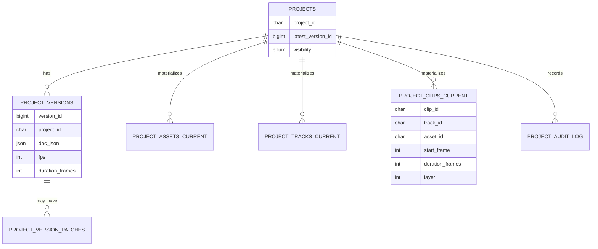

# Updated Architecture and Technology Research for a Remotion-Based AI Video Editor Web App

## Executive summary

This report updates the earlier architecture guidance to match the **explicit design decisions** you confirmed: a **monorepo** with `apps/` and `packages/`, **MySQL (not PostgreSQL)** as the primary database, and **project document versioning implemented as snapshot-per-update** (every persisted update creates a new full document snapshot). MySQL’s InnoDB engine provides ACID transactions (commit/rollback) and row-level locking for concurrency, which is important when persisting new versions and updating “latest pointers” safely. citeturn1search2turn1search19turn1search10

The core architectural stance remains: the browser edits a **typed project document** and drives a **Remotion Player preview**, while heavier operations (ingest, AI generation, final renders) run asynchronously in workers. Remotion’s official docs strongly distinguish **preview-time behavior** (React Player, browser constraints) from **render-time behavior** (SSR APIs / FFmpeg-backed video extraction via `<OffthreadVideo>`), so the design explicitly embraces a dual-mode rendering layer that switches media primitives depending on environment. citeturn5search6turn0search18turn0search1turn0search29

For undo/redo and collaboration readiness, this report recommends **TypeScript as required** and a global state architecture built around **`useSyncExternalStore`** (granular subscriptions for large editor UIs), using either a lightweight external store or Redux Toolkit. For undo/redo and incremental history, it recommends **Immer patches** (`produceWithPatches`, `applyPatches`) and shows how to store patches and inverse patches in MySQL alongside snapshots—giving you fast local undo/redo while still maintaining your authoritative snapshot-per-update persistence strategy. citeturn4search0turn2search0turn2search6turn8search2turn8search0

Finally, the report formalizes asset upload via **direct-to-object-storage signed/presigned URLs**, plus background processing via a job queue (BullMQ for Redis-backed queues, or Temporal when you need durable, long-running workflows with replayable event history). Security and sharing are grounded in OWASP cheat sheet guidance and practical presigned URL revocation/expiration semantics. citeturn6search15turn6search3turn6search4turn6search5turn7search4turn7search1turn7search6

## Architecture and monorepo layout

### High-level architecture

At a high level, the system splits into: (a) a browser-based editor optimized for interaction speed, (b) an API/BFF that owns permissions and persistence, and (c) asynchronous workers for ingest/AI/render.

Key design reasons to keep workers separate:

- Remotion server-side rendering is done via Node SSR APIs and typically involves bundling/selecting compositions and then rendering video/audio—work that should not block web requests. citeturn0search18turn0search6  
- Distributed rendering is optionally achievable via Remotion Lambda (AWS-based) once you need burst scale and faster exports; this is an operationally distinct path from the editor UI. citeturn0search30turn0search3turn0search7turn0search11

### Chosen monorepo structure

You selected a monorepo `apps/ + packages/` approach. This aligns well with Turborepo’s “internal packages” model: reusable libraries inside the workspace that multiple apps can consume without duplicating code. citeturn9search0

A layout that directly matches your decisions (and supports clean preview/render separation):

| Layer | Location | Purpose | Deployment unit |
|---|---|---|---|
| Web editor | `apps/web-editor/` | Timeline UI, inspector panels, Remotion Player preview, asset browser | Web app |
| API/BFF | `apps/api/` | Auth, ACLs, project CRUD, presigned URL issuance, job submission, webhooks | API service |
| Render worker | `apps/render-worker/` | Remotion SSR rendering via `@remotion/renderer`; produces final media | Worker service / container |
| Media worker | `apps/media-worker/` | Ingest jobs: metadata extraction, waveform/thumb/proxy generation | Worker service / container |
| Shared project schema | `packages/project-schema/` | TypeScript types + runtime schema validation + migrations | Library |
| Editor core | `packages/editor-core/` | Timeline engine, snapping, selection model, commands, patch generation | Library |
| Remotion compositions | `packages/remotion-comps/` | Compositions as pure render targets consuming typed input props | Library |
| API contracts | `packages/api-contracts/` | OpenAPI + generated TS types/clients | Library |
| UI components | `packages/ui/` | Reusable components (panels, controls) + Storybook | Library |

This structure is specifically designed so that the **same project document types** compile in the browser, API, and render workers (TypeScript), and so that Remotion versioning stays consistent across packages (important because Remotion warns to align versions across `remotion` and `@remotion/*` packages). citeturn4search0turn0search38

## MySQL persistence design with snapshot-per-update versioning

### Why MySQL still fits the “rollback / versioning” constraint

Your requirement is “explicit ability to roll back recent changes,” and you decided to implement this by **saving every intermediate project document snapshot on update** (snapshot-per-update). This is fundamentally an application-level history mechanism; it does **not** require switching databases.

MySQL’s InnoDB engine supports transactions (commit/rollback) and crash recovery as part of its ACID model, and uses row-level locking plus consistent reads for concurrency—helpful for atomically: inserting a new version snapshot, updating `projects.latest_version_id`, and writing audit logs. citeturn1search2turn1search10turn1search19

### JSON storage and indexing implications in MySQL

MySQL provides a native `JSON` data type. It validates JSON on insert and errors on invalid JSON input. citeturn8search27

However, **JSON columns are not indexed directly**; instead, you index extracted scalar values via generated columns or expression indexes. This is a major reason to combine snapshot storage with relational “lookup tables” for assets/clips/tracks. citeturn7search7turn1search1

MySQL also provides JSON operators like `->` and `->>` (equivalent to `JSON_EXTRACT()` and `JSON_UNQUOTE(JSON_EXTRACT())`) to access scalar values, which can be useful in generated columns or query expressions. citeturn8search1

### Schema patterns

You asked for: snapshot-per-update versioning, audit logs, and efficient timeline/asset lookup queries. The recommended pattern is:

- **Authoritative immutable snapshots** in `project_versions` (one row per persisted update).
- A **“latest pointer”** in `projects` for fast loads.
- **Materialized current-state tables** (`project_assets_current`, `project_tracks_current`, `project_clips_current`) updated transactionally at version write time for fast queries and indexing.
- **Audit log** table for security and operational tracing.

This hybrid gives you: robust history + fast read paths.

#### MySQL DDL example

```sql
-- PROJECTS: stable identity and "latest" pointer
CREATE TABLE projects (
  project_id        CHAR(26) PRIMARY KEY,             -- ULID or similar
  owner_user_id     CHAR(26) NOT NULL,
  latest_version_id BIGINT NULL,
  visibility        ENUM('private','unlisted','public') NOT NULL DEFAULT 'private',
  public_slug       VARCHAR(128) NULL,
  created_at        TIMESTAMP(6) NOT NULL DEFAULT CURRENT_TIMESTAMP(6),
  updated_at        TIMESTAMP(6) NOT NULL DEFAULT CURRENT_TIMESTAMP(6)
                       ON UPDATE CURRENT_TIMESTAMP(6),
  UNIQUE KEY uq_public_slug (public_slug),
  KEY idx_owner (owner_user_id),
  KEY idx_latest_version (latest_version_id)
);

-- IMMUTABLE SNAPSHOTS: snapshot-per-update
CREATE TABLE project_versions (
  version_id        BIGINT PRIMARY KEY AUTO_INCREMENT,
  project_id        CHAR(26) NOT NULL,
  parent_version_id BIGINT NULL,
  created_by_user_id CHAR(26) NOT NULL,
  created_at        TIMESTAMP(6) NOT NULL DEFAULT CURRENT_TIMESTAMP(6),

  -- full document snapshot
  doc_json          JSON NOT NULL,

  -- helpful metadata for filtering/validation without parsing entire JSON
  doc_schema_version INT NOT NULL,
  duration_frames   INT NOT NULL,
  fps               INT NOT NULL,
  width             INT NOT NULL,
  height            INT NOT NULL,

  KEY idx_project_created (project_id, created_at),
  KEY idx_project_parent (project_id, parent_version_id),
  CONSTRAINT fk_versions_project
    FOREIGN KEY (project_id) REFERENCES projects(project_id)
);

-- PATCHES: optional but recommended for fast undo/redo + diffs
CREATE TABLE project_version_patches (
  patches_id        BIGINT PRIMARY KEY AUTO_INCREMENT,
  project_id        CHAR(26) NOT NULL,
  version_id        BIGINT NOT NULL,
  parent_version_id BIGINT NOT NULL,

  -- Immer patch arrays as JSON
  forward_patches   JSON NOT NULL,
  inverse_patches   JSON NOT NULL,

  created_at        TIMESTAMP(6) NOT NULL DEFAULT CURRENT_TIMESTAMP(6),

  KEY idx_version (version_id),
  KEY idx_project_version (project_id, version_id),
  CONSTRAINT fk_patches_version
    FOREIGN KEY (version_id) REFERENCES project_versions(version_id)
);

-- MATERIALIZED "CURRENT" LOOKUP TABLES (for efficient UI queries)

CREATE TABLE project_assets_current (
  project_id        CHAR(26) NOT NULL,
  asset_id          CHAR(26) NOT NULL,
  asset_type        ENUM('image','video','audio','ai_image','ai_video','ai_audio') NOT NULL,
  uri               TEXT NOT NULL,                     -- object storage URL/key reference
  content_hash      CHAR(64) NULL,                     -- optional for dedupe
  duration_frames   INT NULL,                          -- for audio/video
  width             INT NULL,
  height            INT NULL,
  metadata_json     JSON NULL,
  PRIMARY KEY (project_id, asset_id),
  KEY idx_project_type (project_id, asset_type)
);

CREATE TABLE project_tracks_current (
  project_id        CHAR(26) NOT NULL,
  track_id          CHAR(26) NOT NULL,
  track_type        ENUM('video','audio','overlay','effects') NOT NULL,
  sort_order        INT NOT NULL,
  name              VARCHAR(128) NULL,
  is_muted          BOOLEAN NOT NULL DEFAULT FALSE,
  is_locked         BOOLEAN NOT NULL DEFAULT FALSE,
  metadata_json     JSON NULL,
  PRIMARY KEY (project_id, track_id),
  KEY idx_project_order (project_id, sort_order)
);

CREATE TABLE project_clips_current (
  project_id        CHAR(26) NOT NULL,
  clip_id           CHAR(26) NOT NULL,
  track_id          CHAR(26) NOT NULL,
  asset_id          CHAR(26) NOT NULL,

  start_frame       INT NOT NULL,
  duration_frames   INT NOT NULL,
  -- optional trim inside asset
  trim_in_frames    INT NOT NULL DEFAULT 0,
  trim_out_frames   INT NULL,                          -- null => to end of asset

  layer             INT NOT NULL DEFAULT 0,            -- explicit stacking when overlap is allowed
  clip_json         JSON NOT NULL,                     -- transforms, effects, keyframes

  PRIMARY KEY (project_id, clip_id),
  KEY idx_project_time (project_id, start_frame),
  KEY idx_project_track_time (project_id, track_id, start_frame),
  KEY idx_project_asset (project_id, asset_id)
);

-- AUDIT LOG: security + traceability
CREATE TABLE project_audit_log (
  audit_id          BIGINT PRIMARY KEY AUTO_INCREMENT,
  project_id        CHAR(26) NOT NULL,
  actor_user_id     CHAR(26) NULL,
  event_type        VARCHAR(64) NOT NULL,              -- e.g. "project.update", "render.request"
  event_json        JSON NOT NULL,
  created_at        TIMESTAMP(6) NOT NULL DEFAULT CURRENT_TIMESTAMP(6),
  KEY idx_project_time (project_id, created_at),
  KEY idx_event_type_time (event_type, created_at)
);
```

This schema intentionally stores the full project snapshot (JSON) while also maintaining relational rows for common queries. That’s consistent with MySQL’s guidance that JSON columns are validated and queryable, but not directly indexable—so indexing should happen via generated columns or by extracting key fields into normal columns/tables. citeturn8search27turn7search7turn1search1

### Efficient query patterns you will actually need

Common editor queries and how they map to schema:

- **Load project quickly**: one query to `projects.latest_version_id`, then fetch `project_versions.doc_json` (or load from `*_current` tables for partial hydration). This leverages the “latest pointer” pattern.
- **Render timeline viewport** (time window): query `project_clips_current` by `(project_id, start_frame)` with an index. This is why `idx_project_time` exists.
- **Asset browser**: `project_assets_current WHERE project_id=? ORDER BY asset_type`, indexed by `(project_id, asset_type)`.
- **Usage checks / cleanup**: `SELECT asset_id, COUNT(*) FROM project_clips_current WHERE project_id=? GROUP BY asset_id` uses `idx_project_asset`.

If you later decide to query inside `doc_json`, remember MySQL’s optimization rule: index JSON expressions via generated columns / compatible functional indexes rather than expecting direct JSON indexing. citeturn7search7turn1search1turn1search5

## Remotion integration, preview vs render, and render scaling path

### Where Remotion code lives

You chose to centralize Remotion compositions in `packages/remotion-comps/`. This is the correct place for:

- `Root.tsx` / composition registration
- composition components that accept typed `inputProps`
- clip renderers (VideoClip, ImageClip, AudioClip, TextOverlay) that take a “render-ready” model

Remotion defines “input props” as data passed to parametrize the render, and it can be passed both during rendering and through the Player. Input props must be JSON-serializable objects, which fits perfectly with your snapshot document approach (project snapshots are JSON). citeturn5search36turn0search36turn5search6

### Preview vs render differences you must design for

#### Player preview (browser)
Remotion’s `<Player>` is meant to run in a regular React application and can accept `inputProps` to parameterize the video. Remotion explicitly recommends memoizing props passed to Player to prevent excessive tree re-renders. citeturn5search6turn5search3

#### Final render (SSR / Lambda)
For high-fidelity rendering, Remotion provides SSR APIs (`@remotion/renderer`), describing a 3-step flow: bundle, select composition/metadata, then render. Rendering video/audio programmatically is done via `renderMedia()`. citeturn0search18turn0search6turn0search2

#### Media tag differences: `<OffthreadVideo>` vs Player-capable tags
`<OffthreadVideo>` renders video by extracting exact frames using FFmpeg outside the browser, and is explicitly **not supported in client-side rendering**. For web preview, Remotion docs recommend using `<Video>` from `@remotion/media` instead. citeturn0search1turn0search5

Remotion provides an explicit pattern (using `useRemotionEnvironment()`) to switch tags in preview vs rendering. citeturn0search29

##### Example “dual mode” video component

```tsx
import React from "react";
import {useRemotionEnvironment, OffthreadVideo} from "remotion";
import {Video} from "@remotion/media";

export const VideoLayer: React.FC<{ src: string }> = ({src}) => {
  const env = useRemotionEnvironment();

  // Browser / Player path
  if (!env.isRendering) {
    return <Video src={src} />;
  }

  // SSR/Lambda path (FFmpeg frame extraction)
  return <OffthreadVideo src={src} />;
};
```

This is not optional—if you try to use `<OffthreadVideo>` in a client-side environment, it is documented as unsupported. citeturn0search1turn0search5

### Render-worker first, then migrate to Remotion Lambda when needed

A pragmatic scale path:

- **Phase A: Render worker (containers/VMs)**  
  Use `@remotion/renderer` and `renderMedia()` inside `apps/render-worker/`. Remotion’s SSR docs describe the rendering steps and support for Node/Bun. citeturn0search18turn0search6

- **Phase B: Add distributed rendering for bursts**  
  Remotion’s “distributed rendering” documentation describes Remotion Lambda as the recommended solution to split renders into chunks across many functions. Concurrency is a first-class concept and can be controlled via `framesPerLambda` or `concurrency`, and progress can be queried via `getRenderProgress()`. citeturn0search30turn0search11turn0search35turn0search7turn0search3

- **Phase C: Hybrid routing**  
  Route smaller exports to the render-worker (faster cold-start, easier debug) and larger exports to Lambda (better burst throughput). This keeps operational cost/risk balanced while you scale.

Because Remotion Lambda runs in your own entity["company","Amazon Web Services","cloud provider"] account and is explicitly optimized for concurrency, it becomes your “scale valve” rather than your first dependency. citeturn0search14turn0search11turn0search3

## Document model: assets, tracks, clips

### Definitions

- **Asset**: a reusable media resource (uploaded video/audio/image or AI-generated media). Assets exist independently of the timeline.
- **Track**: a lane/grouping on the timeline. Tracks primarily organize clips and define defaults (muted/locked/type). Importantly, tracks are still useful even if you allow overlapping clips of the same type: they provide structure, UX grouping, and deterministic default ordering.
- **Clip**: a time-bounded placement of an asset on a track (with start/duration, trim, transforms, keyframes, and per-clip overrides). A single asset can be used in many clips.

### Concrete JSON example

Below is a concrete “project snapshot” document that matches your requirements (timeline per `video_id`, multiple media types, clips placed and time-bounded, shareable/renderable).

```json
{
  "schemaVersion": 1,
  "projectId": "01HV8WQK8F6KZ9T0S8J7N1Y2AB",
  "video": { "fps": 30, "width": 1920, "height": 1080, "durationFrames": 4500 },

  "assets": [
    {
      "assetId": "01HV8WR0C5Q6S6Y5V6J8A1B2C3",
      "type": "video",
      "uri": "s3://bucket/assets/u123/intro.mp4",
      "metadata": { "durationFrames": 900, "width": 1920, "height": 1080 }
    },
    {
      "assetId": "01HV8WR5M2E1S6Y7J8K9L0M1N2",
      "type": "audio",
      "uri": "s3://bucket/assets/u123/music.wav",
      "metadata": { "durationFrames": 4500 }
    }
  ],

  "tracks": [
    { "trackId": "t_video_1", "type": "video", "order": 0, "name": "Main video", "muted": false, "locked": false },
    { "trackId": "t_audio_1", "type": "audio", "order": 1, "name": "Music", "muted": false, "locked": false },
    { "trackId": "t_overlay_1", "type": "overlay", "order": 2, "name": "Text/Overlays", "muted": false, "locked": false }
  ],

  "clips": [
    {
      "clipId": "c1",
      "trackId": "t_video_1",
      "assetId": "01HV8WR0C5Q6S6Y5V6J8A1B2C3",
      "startFrame": 0,
      "durationFrames": 900,
      "trimInFrames": 0,
      "trimOutFrames": null,
      "layer": 0,
      "transform": { "x": 0, "y": 0, "scale": 1, "rotation": 0, "opacity": 1 }
    },
    {
      "clipId": "c2",
      "trackId": "t_audio_1",
      "assetId": "01HV8WR5M2E1S6Y7J8K9L0M1N2",
      "startFrame": 0,
      "durationFrames": 4500,
      "trimInFrames": 0,
      "trimOutFrames": null,
      "layer": 0,
      "audio": { "volume": 0.25, "fadeInFrames": 30, "fadeOutFrames": 60 }
    }
  ],

  "sharing": { "visibility": "unlisted", "publicSlug": "my-cool-video" }
}
```

### Tracks vs clips comparison table

The purpose of this table is to remove ambiguity in implementation so your schema, UI, and Remotion layer stay aligned.

| Dimension | Track | Clip |
|---|---|---|
| Identity | `trackId` | `clipId` |
| Primary role | Organize timeline lanes and default behaviors | Place a specific asset in time on a track |
| Time-bounded? | No (track spans full project duration) | Yes (`startFrame`, `durationFrames`) |
| Media reference | None | `assetId` (points to an asset) |
| Type | Track type (`video/audio/overlay/effects`) controls grouping | Clip inherits semantics from track + asset but may override behavior |
| Overlap semantics | Track may allow overlap | Clip must define overlap resolution (`layer` / z-order) |
| Typical fields | `order`, `name`, `muted`, `locked`, `metadata` | `startFrame`, `durationFrames`, trims, transforms, keyframes/effects |
| Persistence | Part of snapshot; also in `project_tracks_current` | Part of snapshot; also in `project_clips_current` |
| Query pattern | Order tracks for UI layout | Query clips by track + time window |

This is designed to support your explicit desire to allow multiple same-type media over the same time window—`layer` is the deterministic tie-breaker when overlaps occur within one track.

## Editor state split and persistence strategy

A timeline editor becomes dramatically easier to develop—and much less bug-prone—when you keep “what should be saved” separate from “what is only UI.” This also improves AI-agent contributions because state boundaries are explicit.

### The three layers

#### Persistent project document state
This is the authoritative, shareable “project.” It must be deterministic and renderable (via Remotion input props). It is stored as snapshot-per-update rows in MySQL.

Example fields:
- `video.fps/width/height/durationFrames`
- `assets[]` + `tracks[]` + `clips[]`
- `sharing.visibility/publicSlug`
- Optional: global color palette, typography, project-level settings

This maps to Remotion’s input props model: input props parameterize the video and must be JSON-serializable. citeturn5search36turn0search36

Recommended storage:
- MySQL `project_versions.doc_json` (immutable snapshots) + `projects.latest_version_id` pointer
- Materialized `*_current` tables for fast lookups (as described earlier)

MySQL supports validated JSON storage; invalid JSON inserts error out, which is valuable guardrail when the document is your core contract. citeturn8search27

#### Ephemeral UI state
This is editor-only state that should not be part of project sharing/export behavior. It changes very frequently and should live in an in-memory store.

Example fields:
- selection: `{selectedClipIds, selectedTrackIds}`
- pointer/hover states: `{hoveredClipId}`
- interaction modes: `{tool: "select"|"trim"|"split", isDragging, dragStart}`
- view state: `{timelineZoom, scrollLeftPx, scrollTopPx}`
- playback state: `{isPlaying, playheadFrame}` (note: playhead may be handled specially for performance)

Recommended storage:
- In-memory external store (subscribable) + React `useSyncExternalStore` for rendering subscriptions citeturn2search0  
- Optionally persist user preferences (not project state) in browser local storage (not part of this report’s DB design)

#### Derived/cached state
This is data you can compute from the project doc + UI state, but it’s expensive enough that you want to cache it.

Example fields:
- computed clip rectangles: `{clipId -> {xPx, wPx}}`
- snapping guides for current zoom and viewport
- waveform caches (client or server)
- image/video proxy URLs for preview
- Remotion “render-ready” flattened sequences

Recommended storage:
- In-memory memoized caches in `editor-core`
- Optional shared cache (Redis) for server-side derived artifacts (waveforms, proxy generation) when you have many projects/users

### Summary table: what goes where

| State layer | Examples | Update frequency | Storage | Why |
|---|---|---:|---|---|
| Persistent project doc | assets/tracks/clips, share settings, render settings | Medium (debounced saves) | MySQL snapshots + current tables | Authoritative, shareable, renderable |
| Ephemeral UI | selection, dragging, hover, panels, zoom/scroll | Very high | External in-memory store | Prevents DB churn; keeps saves meaningful |
| Derived/cached | clip geometry, snapping, waveforms, proxy mappings | High but computed | RAM + optional Redis | Avoid recompute and excessive React rerenders |

## State management, TypeScript, and undo/redo via patches

### TypeScript is required

TypeScript is “JavaScript with syntax for types” and is positioned as improving tooling at any scale—exactly what you want for a fast-evolving editor with many object variants (assets/clips/effects). citeturn4search0

### React + Remotion Player is the optimal preview stack

Remotion’s Player is a React component intended to run in a regular React app, and supports passing `inputProps` (typed to your component props). Remotion also documents that memoizing `inputProps` avoids bottlenecks from excessive re-rendering. citeturn5search6turn5search3

### Global app state: external store with `useSyncExternalStore`

React’s `useSyncExternalStore` requires a `subscribe` function and a `getSnapshot` function, and it specifies that snapshots should be immutable and stable if unchanged. This is a strong match for editors: each component can subscribe to only the slice it cares about, avoiding whole-tree rerenders during scrubbing or drag operations. citeturn2search0

### Store choice: lightweight external store vs Redux Toolkit

You asked for a recommendation that includes both.

- **Redux Toolkit** is explicitly the “official recommended approach” for writing Redux logic and includes best practices and simplifications. This is attractive when you want strong conventions, predictable debugging, and a larger team. citeturn2search6turn2search9  
- **Lightweight external store** (custom or Zustand-like) is attractive when you need extremely tight performance control and want to minimize framework overhead; `useSyncExternalStore` enables safe React subscription to such stores. citeturn2search0

A rigorous rule of thumb:
- Choose Redux Toolkit if you expect many contributors and want strong action discipline.
- Choose a lightweight store if your editor performance (scrubbing/dragging) becomes the primary constraint and you want extremely granular subscriptions.

### Undo/redo with Immer patches, stored in MySQL

Immer’s patches documentation explicitly lists “basis for undo/redo” and shows applying patches/inverse patches via `applyPatches()`. Immer’s API defines `produceWithPatches` as returning `[result, patches, inversePatches]`. citeturn8search0turn8search2

This fits your snapshot-per-update decision in a powerful way:

- **Every persisted update creates a new snapshot** in `project_versions`.
- At the same time, your editor can compute **patches + inverse patches** for each operation and store them in `project_version_patches`.

This gives you:
- Instant undo/redo in the session (apply inverse patches in memory).
- Server-side diffs/auditability without re-diffing large JSON blobs.
- Optional “replay history” features later.

#### Example: generating and applying patches

```ts
import {enablePatches, produceWithPatches, applyPatches} from "immer";
enablePatches();

type ProjectDoc = unknown; // replace with your typed schema

export function applyEditorOperation(
  doc: ProjectDoc,
  recipe: (draft: ProjectDoc) => void
) {
  const [nextDoc, patches, inversePatches] = produceWithPatches(doc, recipe);
  return {nextDoc, patches, inversePatches};
}

export function undo(doc: ProjectDoc, inversePatches: any[]) {
  return applyPatches(doc, inversePatches);
}
```

This is directly aligned with Immer’s documented patch semantics and helper functions. citeturn8search2turn8search0

#### How patches are stored and applied in DB

- When you persist an update:
  1) Read `projects.latest_version_id` (for parent pointer).  
  2) Insert a new `project_versions` row containing the full snapshot and metadata.  
  3) Insert `project_version_patches` row containing the forward/inverse patch arrays.  
  4) Update `projects.latest_version_id` to the new version.  
  5) Update materialized `*_current` tables in the same transaction.

Transactions and rollback semantics for InnoDB are part of MySQL’s ACID model and are precisely what keep this multi-step write consistent. citeturn1search2turn1search19

- To rollback to a previous version:
  - Set `projects.latest_version_id` to the target version.
  - Re-materialize `*_current` tables from that version’s snapshot (or rebuild by replaying patches from a known checkpoint, if you later add checkpoint optimizations).

Note: because you chose snapshot-per-update, rollback is conceptually as simple as “switch latest pointer,” but you must treat materialization rebuild as part of rollback to keep lookup tables consistent.

## Timeline UI performance strategies

Timeline editors are performance-sensitive because user interactions can drive 30–60 updates per second.

### Virtualization with react-window

`react-window` is designed to render large lists efficiently; web.dev documents virtualization using react-window and explains overscanning via `overscanCount` to reduce blank flashes during scrolling. citeturn3search4turn3search1

In your timeline, the most common virtualization points are:
- track rows (vertical list)
- clip rows inside each track (sometimes)
- asset browser grids/lists

#### Example configuration for virtualized tracks

```tsx
import React from "react";
import {FixedSizeList as List, ListChildComponentProps} from "react-window";

type TrackRowData = { trackIds: string[] };

const TrackRow = ({index, style, data}: ListChildComponentProps<TrackRowData>) => {
  const trackId = data.trackIds[index];
  return (
    <div style={style}>
      {/* Render track header + clip lane */}
      <div>{trackId}</div>
    </div>
  );
};

export function TracksVirtualList({trackIds}: {trackIds: string[]}) {
  return (
    <List
      height={600}
      width={"100%"}
      itemCount={trackIds.length}
      itemSize={56}       // fixed track height
      itemData={{trackIds}}
      overscanCount={5}   // tune based on profiling
    >
      {TrackRow}
    </List>
  );
}
```

This follows the virtualization approach described by web.dev and aligns with react-window’s overscan configuration. citeturn3search1turn3search9

### rAF-driven playhead and minimizing React work

`requestAnimationFrame()` schedules a callback before the next repaint and is designed for animation loops. MDN also notes it is more efficient than interval-based approaches for animation timing. citeturn2search2turn2search23

A typical editor strategy:
- Keep the playhead’s pixel position as a CSS transform updated inside an rAF loop (or a small subscribed component), rather than re-rendering hundreds of clip components on every frame.
- Only commit “authoritative” playhead frame to state occasionally (or on pause/seek end).

### Memoization and stable props to avoid cascaded re-renders

React’s docs describe `useMemo` as a performance optimization tool, and Remotion’s Player docs explicitly warn that failing to memoize `inputProps` can cause the whole tree to re-render too often and become a bottleneck. citeturn2search1turn5search3

That yields a concrete rule:
- Any props passed to the Remotion Player should be memoized (`useMemo`) and should reference immutable snapshots or stable derived objects.

### Diagrams: timeline data flow and relationships

#### Entity relationship diagram (ER)



This diagram reflects snapshot-per-update plus current-table materialization.

#### Timeline/edit/render flowchart

```mermaid
flowchart TD
  A[User edits timeline UI] --> B[External store updates UI + doc draft]
  B --> C[Immer produceWithPatches\n(nextDoc, patches, inversePatches)]
  C --> D{Autosave debounce\nor explicit Save}
  D -->|Yes| E[API: insert project_versions snapshot\ninsert patches\nupdate latest pointer]
  E --> F[Update *_current tables\n(in same DB transaction)]
  F --> G[UI shows "saved" version id]

  A --> H[Preview]
  H --> I[Remotion Player\ninputProps=project snapshot]
  I --> J[Browser preview frame output]

  A --> K[Render request]
  K --> L[Create render job]
  L --> M[Queue]
  M --> N[render-worker SSR renderMedia()]
  N --> O[Store output in object storage]
  O --> P[Share / download link]
```

This explicitly models your chosen persistence and the Remotion preview/render split. citeturn0search18turn0search6turn5search6turn8search2turn1search2

image_group{"layout":"carousel","aspect_ratio":"16:9","query":["web-based video editor timeline UI","React timeline editor UI example","Remotion Player preview UI","non-linear editor timeline tracks clips"],"num_per_query":1}

## Assets, storage, job queues, and monitoring

### Direct-to-object-storage uploads via signed/presigned URLs

The recommended pattern is:
1) Client requests an upload URL from API.
2) Client uploads directly to object storage using the signed URL.
3) Client notifies API to finalize/record the asset and enqueue ingest.

This is explicitly supported in major object storage systems:

- entity["company","Amazon Web Services","cloud provider"] S3 presigned URL uploads allow upload without giving the uploader AWS credentials; the presigned URL is bounded by the signer’s permissions. citeturn6search2turn6search15  
- entity["company","Google Cloud","cloud provider"] Cloud Storage signed URLs provide time-limited access to a specific resource, and anyone with the URL can use it while active. citeturn6search3  
- entity["company","Cloudflare","cloud provider"] R2 documents presigned URLs as an S3-compatible concept for temporary access without exposing API credentials. citeturn6search23  

For security and revocation behavior, AWS documents that in general a presigned URL stops working if the signing credentials are revoked/deleted/deactivated, even if the URL had a later expiration time. citeturn7search6

### Job queues for ingest, AI generation, and rendering

You asked for BullMQ and Temporal as options.

#### Option: BullMQ (Redis-backed queue)
BullMQ is documented as a Node.js library implementing a fast, robust queue system built on top of Redis. It’s a strong fit when your workloads are: short/medium jobs, high throughput, and you want familiar queue semantics (retries, rate limits, delayed jobs). citeturn6search4turn6search0turn6search21

#### Option: Temporal (durable workflows)
Temporal’s docs explain that workflows recover from crashes via a durable **Event History** and replay, enabling long-running resilient executions. This is especially compelling if you expect: long AI workflows, multi-step pipelines with human-in-the-loop approvals, and the need to query workflow state reliably. citeturn6search5turn6search14

A rational selection criterion:
- Choose BullMQ if you want the simplest operational setup and your pipelines are primarily “fire-and-forget with retries.”
- Choose Temporal if you need durable orchestration, long-lived workflows, and replay/debugging guarantees as a first-class primitive.

### Monitoring and progress reporting

- For Remotion Lambda, progress is queryable via `getRenderProgress()` and starting a render is done via `renderMediaOnLambda()`. citeturn0search3turn0search7  
- For Lambda concurrency controls, Remotion documents the relationship of `framesPerLambda` and `concurrency`, and CLI-level concurrency constraints (`framesPerLambda >= 4`, max concurrency 200). citeturn0search11turn0search35  

Even if you start with render-worker SSR, using the same “job table + progress polling” API shapes makes it easy to migrate render execution behind the same interface.

## Security, sharing, moderation notes, and CI/dev tooling for AI-agent friendliness

### Sharing model, ACLs, revocation, and logging

For sharing, your data model already includes `visibility` (private/unlisted/public) and `public_slug`. The operational rule should be:

- Treat **project visibility** and **asset visibility** independently.
- Use signed URLs for private assets/outputs; avoid making raw buckets public.

Presigned URL expiration and revocation semantics should be treated as part of your threat model. AWS explicitly notes that presigned URLs generally stop working when signing credentials are revoked/deleted/deactivated. citeturn7search6turn6search15

Security guidance should follow OWASP’s cheat sheets:
- Authentication and session management practices are covered in OWASP’s Authentication and Session Management cheat sheets. citeturn7search4turn7search0  
- For security logging, OWASP provides a Logging Cheat Sheet focused on building logging mechanisms especially related to security logging; OWASP also highlights logging/monitoring failures as a top risk area because breaches cannot be detected without logging and monitoring. citeturn7search1turn7search9  
This supports the architectural recommendation to keep an append-only `project_audit_log` and job event logs.

For the database vendor context: MySQL is historically associated with entity["company","Oracle","database vendor"], but the practical point here is InnoDB’s transactional guarantees and JSON validation/indexing constraints, not the vendor identity. citeturn1search2turn7search7turn8search27

### CI/dev tooling and AI-agent friendliness

You asked for best practices that make development easier and especially AI-agent friendly. The key is to maximize *explicit contracts* and *reproducible sandboxes*.

#### OpenAPI contracts
The OpenAPI Specification defines a standard, language-agnostic interface description for HTTP APIs so that humans and computers can understand service capabilities without reading source code. This is highly compatible with code generation and agent-driven tooling. citeturn4search3

#### Storybook for isolated UI development
Storybook is explicitly designed to build UI components in isolation and develop hard-to-reach states without running the whole app—ideal for complex editor panels and timeline row states. citeturn5search0turn5search4

#### Playwright for E2E coverage
Playwright positions itself as fast, reliable end-to-end testing for modern web apps and supports cross-browser engines (Chromium/WebKit/Firefox). This is important for an editor UI where behavior differences can appear across browsers. citeturn5search1turn5search37

#### ESLint + Prettier + TypeScript
- ESLint statically analyzes code to find problems and is commonly run in CI. citeturn4search1  
- Prettier is an opinionated code formatter that reprints code to a consistent style. citeturn4search2  
- TypeScript provides typed tooling “at any scale,” and its type checking is itself a form of static analysis. citeturn4search0turn4search30  

#### Store LLM system prompts and skills in-repo
Remotion publishes an official “System Prompt for LLMs” to teach models Remotion’s rules, and provides AI-related resources that include skills and templates. Keeping these prompts and your project-specific “agent rules” in-repo (e.g., `docs/ai/`) improves consistency and reduces churn when agents generate code. citeturn5search2turn5search8  

A practical way to operationalize this:
- `docs/ai/remotion-system-prompt.txt` (official prompt)
- `docs/ai/architecture-rules.md` (your invariants: document schema rules, where code goes, naming conventions)
- `docs/ai/api-openapi.md` (how to update OpenAPI + regenerate client)

This turns “AI agent friendliness” into a maintained artifact rather than ad-hoc prompts.

---

**Net result:** The updated design is consistent with your decisions: monorepo structure, MySQL snapshots-per-update, clear asset/track/clip document model, explicit separation of persistent vs UI vs derived state, Remotion code isolated in `packages/remotion-comps` with preview/render-specific implementations, and a scalable compute pipeline (SSR worker now, Remotion Lambda later) backed by signed URL uploads and queue-driven background jobs. citeturn0search18turn0search1turn6search15turn7search7turn2search0turn8search2